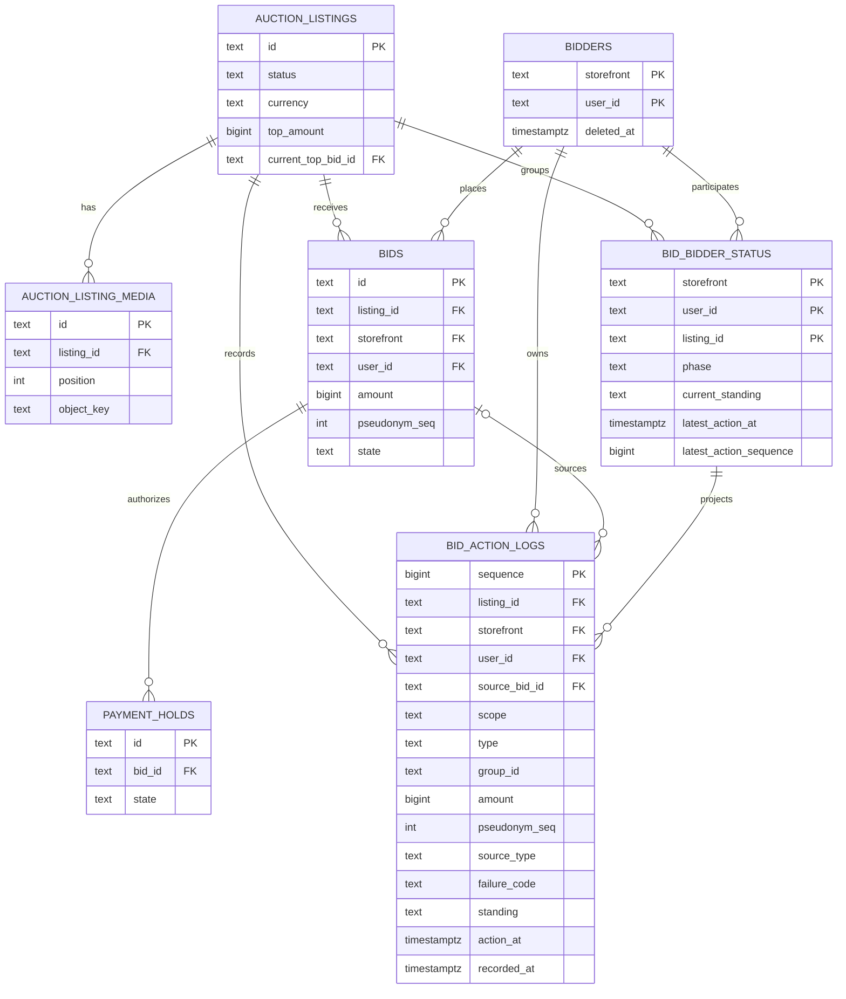
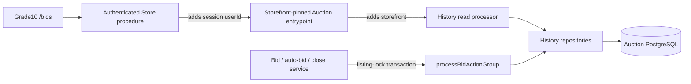

## Context

- See [proposal.md](proposal.md) for the collector problem and market
  references.
- See
  [`grade10-auction/bidding-history`](specs/grade10-auction/bidding-history/spec.md)
  for the observable contract.
- The shared Auction service owns bid ordering and accepted bid state.
- The current public listing read exposes only a recent bid window.
- The storefront-pinned RPC surface exposes `listMyBids` and `readMyBid` only
  after the Grade10 or ZZZ Store backend resolves its own session.
- Current reads do not retain rejected requests, private maximum changes, or a
  causally merged history.
- Automatic bidding is a prerequisite:
  - maximum configuration and raising already have an authority;
  - engine-placed bids already produce authoritative facts;
  - this change waits if those facts and stable action ids are unavailable;
  - this change does not implement automatic-bidding policy or storage.

## Goals / Non-Goals

**Goals:**

- Add an explainability read model beside authoritative auction state.
- Preserve the storefront-pinned identity boundary and anonymous public
  surface.
- Make all write and read services processors with fixed, discriminated input
  and output shapes.
- Keep multi-table writes atomic under the existing listing lock.
- Keep account and per-listing reads keyset-paged and index-backed.
- Fit the Grade10 screen into the existing auction feature, DI, session-route,
  localization, and design-system conventions.

**Non-Goals:**

- Make the action log authoritative for bid, maximum, hold, or close state.
- Replace `bids` with an event-sourced model.
- Add an event bus, queue, analytics pipeline, or external dependency.
- Rebuild the anonymous listing payload from the account-history read model.
- Add a shared visual block to `@grade10/ui` or a ZZZ page.

## Decisions

### Keep authority and explanation separate

- `bids`, automatic-bid state, `payment_holds`, and `auction_listings` remain
  authoritative.
- `bid_action_logs` records immutable explanations of authoritative actions.
- `bid_bidder_status` stores one rebuildable account/listing summary.
- History writes run synchronously in the same database transaction as the
  authoritative transition that made them true.
- A safe refusal commits an account-scoped log even when no accepted auction
  state changes.
- Rejected alternatives:
  - deriving everything from `bids` and `payment_holds` loses browser-visible
    explanations for validation refusals and private maximum changes;
  - replacing `bids` with logs requires event-sourcing every winner, payment,
    notification, and settlement read;
  - asynchronous log projection can delay or lose a money explanation;
  - raw provider errors plus read-time redaction allow sensitive data into the
    customer projection;
  - `audit_logs` has operator vocabulary and retention, not a customer
    contract.

### Group related facts without merging storage rows

- Every Auction action receives a stable `group_id` before evaluation.
- Log rows produced by one authoritative transition share that `group_id` and
  `action_at`.
- A manual request and its later provider result use different groups because
  they are separate transactions at separate authoritative times.
- The read processor folds compatible rows with the same `group_id` into one
  user-facing item.
- Examples:
  - a rival `accepted_price` and the collector's `standing_changed: outbid`
    become one “Bidder 2 outbid you” item;
  - an `automatic_bid_accepted` annotation and its public `accepted_price`
    become one automatic bid attributed to **You**.
- Rejected alternatives:
  - rendering every row independently produces contradictory duplicates;
  - using `source_bid_id` as the group fails for refused actions and maximum
    changes, which have no accepted bid;
  - reusing one group across request and provider-result transactions creates
    a group that can straddle history pages and cannot have one stable sort
    anchor.

### Use stable keyset order

- The account index orders descending by:
  `(latest_action_at, latest_action_sequence, listing_id)`.
- The combined listing history orders descending by:
  `(action_at, sequence)`.
- Cursors carry their sort name and filter so an Active cursor is refused on a
  Completed request.
- Rejected alternatives:
  - offset paging repeats or skips rows when new activity arrives;
  - an unbounded listing response grows without a useful ceiling;
  - a browser-side merge of two pages cannot create one stable cursor.

### Authorize and merge inside Auction

- Browser inputs never contain `storefront` or `user_id`.
- The authenticated Store procedure supplies `user_id` from the session.
- The named Auction entrypoint supplies its pinned `storefront`.
- Auction filters account rows by both identity values and unions only the
  listing's public-scoped rows.
- The anonymous listing schema remains unchanged.
- Rejected alternatives:
  - direct browser-to-Auction reads bypass storefront session ownership;
  - merging in Store duplicates Auction semantics in Grade10 and ZZZ;
  - hiding private fields in the UI is not an access boundary.

### Keep the frontend slice shallow and the page brand-owned

- `@grade10/auction-frontend` gains `features/bidding/history` with:
  - domain models and a repository interface;
  - an authenticated datasource that decodes shared contracts;
  - repository binding, DI tokens/module, and query hooks;
  - fixture-backed module and hook tests;
  - a published `/history` subpath joined to `auctionModules`.
- No use case is added because paging a server-owned read model adds no
  frontend invariant.
- The Grade10 app owns:
  - the `bids` session surface and `/bids` route;
  - `SessionDecided` gating;
  - filter and expanded-listing state;
  - page composition and listing navigation.
- `@grade10/i18n` gains the shared `auctionBiddingHistory` namespace in every
  supported language.
- Existing design-system primitives named in [ui.md](ui.md) are sufficient.
- Rejected alternatives:
  - a package-owned page would give ZZZ a screen it does not need;
  - page-owned data calls bypass contract decoding and DI;
  - a shared `@grade10/ui` block has only one consumer;
  - `/profile` is not the established bids route.

## Database Schema

### Storage rules

- All new tables live in the existing `auction` PostgreSQL schema.
- They follow the existing Drizzle conventions:
  - domain ids are `text`;
  - money is a positive `bigint` count of minor units;
  - timestamps use millisecond `timestamptz`;
  - foreign-key deletes are restrictive by default.
- The automatic-bidding prerequisite remains authoritative for the current
  private maximum.
- This change consumes the prerequisite's stable action ids and does not add a
  second maximum table.

### Existing tables

| Table | Role in this read model |
| --- | --- |
| `auction_listings` | Owns listing status, title, currency, current/final price, close time, and current top bid. |
| `auction_listing_media` | Supplies position-1 media for an account summary. |
| `bidders` | Owns `(storefront, user_id)` and remains as a tombstone after account erasure. |
| `bids` | Owns accepted/pending bid identity, amount, pseudonym sequence, and current bid state. |
| `payment_holds` | Supplies normalized provider outcomes to authoritative writers; customer reads never join it. |
| Automatic-bidding prerequisite | Owns the current maximum and emits maximum-change and engine-action facts. |

### `auction.bid_action_logs`

- Purpose: append-only facts used to explain bidding activity.
- Authority: none; auction outcomes never read this table to decide a winner.

| Column | Type | Null | Meaning |
| --- | --- | --- | --- |
| `sequence` | `bigint generated always as identity` | no | Primary key and immutable tie-breaker for equal event times. |
| `listing_id` | `text` | no | Foreign key to `auction_listings.id`. |
| `storefront` | `text` | no | First half of the actor's bidder identity. |
| `user_id` | `text` | no | Second half of the actor's bidder identity. |
| `scope` | `text` | no | `public` or `account`; public means shareable in an authorized participant's combined history, not a new anonymous endpoint. |
| `type` | `text` | no | Closed action-log type from the capability spec. |
| `group_id` | `text` | no | Stable action id shared by rows folded into one displayed step; not a foreign key. |
| `source_bid_id` | `text` | yes | Foreign key to `bids.id` when a pending or accepted bid row backs the log. |
| `amount` | `bigint` | yes | Type-specific minor-unit amount; currency comes from the listing. |
| `pseudonym_seq` | `integer` | yes | Listing-local number rendered as `Bidder N`. |
| `source_type` | `text` | yes | `manual` or `automatic`. |
| `failure_code` | `text` | yes | `window`, `minimum`, `account`, `payment`, `stale_price`, or `unavailable`. |
| `standing` | `text` | yes | `pending`, `leading`, `outbid`, `won`, `lost`, or `canceled`. |
| `action_at` | `timestamptz(3)` | no | Authoritative business time used by history order and display. |
| `recorded_at` | `timestamptz(3)` | no | Insert time, default `now()`, used only for operations. |

#### Checked action-log union

| Type | Scope | Amount | Source type | Pseudonym | Failure | Standing | Source bid |
| --- | --- | --- | --- | --- | --- | --- | --- |
| `manual_bid_requested` | account | required | manual | forbidden | forbidden | forbidden | optional |
| `manual_bid_accepted` | account | required | manual | forbidden | forbidden | forbidden | required |
| `manual_bid_refused` | account | required | manual | forbidden | required | forbidden | optional |
| `automatic_max_configured` | account | required | automatic | forbidden | forbidden | forbidden | forbidden |
| `automatic_max_raised` | account | required | automatic | forbidden | forbidden | forbidden | forbidden |
| `automatic_bid_accepted` | account | required | automatic | forbidden | forbidden | forbidden | required |
| `accepted_price` | public | required | required | required | forbidden | forbidden | required |
| `standing_changed` | account | forbidden | forbidden | forbidden | forbidden | required | optional |

- Database checks enforce the matrix.
- Amounts and pseudonym sequences must be positive.
- A public `accepted_price` cannot carry a maximum or failure.
- Maximum changes use the prerequisite action id as `group_id`.
- Backfill actions use deterministic ids such as `backfill:bid:bid_99`.

#### Action-log indexes

- Unique idempotency index:
  - `uq_bid_action_logs_group_actor_type`;
  - columns: `(group_id, scope, type, storefront, user_id)`.
- Public history page:
  - `idx_bid_action_logs_public_page`;
  - columns: `(listing_id, action_at DESC, sequence DESC)`;
  - predicate: `scope = 'public'`.
- Account history page:
  - `idx_bid_action_logs_account_page`;
  - columns:
    `(listing_id, storefront, user_id, action_at DESC, sequence DESC)`;
  - predicate: `scope = 'account'`.

### `auction.bid_bidder_status`

- Purpose: one account-index row per `(storefront, user_id, listing_id)`.
- Authority: none; it can be rebuilt from authoritative state and action logs.

| Column | Type | Null | Meaning |
| --- | --- | --- | --- |
| `storefront` | `text` | no | First identity key and composite foreign key to `bidders`. |
| `user_id` | `text` | no | Second identity key and composite foreign key to `bidders`. |
| `listing_id` | `text` | no | Foreign key to `auction_listings.id`. |
| `phase` | `text` | no | `active` or `completed`; the account-page filter discriminator. |
| `current_standing` | `text` | no | `pending`, `leading`, `outbid`, `won`, `lost`, `canceled`, or `failed_only`. |
| `latest_action_at` | `timestamptz(3)` | no | Greatest authoritative action time for this account/listing. |
| `latest_action_sequence` | `bigint` | no | `bid_action_logs.sequence` that wins the `(action_at, sequence)` order. |

- Primary key: `(storefront, user_id, listing_id)`.
- Page index:
  - `idx_bid_bidder_status_account_page`;
  - columns: `(storefront, user_id, phase, latest_action_at DESC,
    latest_action_sequence DESC, listing_id DESC)`.
- `current_standing` is recalculated from authoritative listing/bid state and
  accepted-action evidence:
  - no accepted action plus one or more refusals produces `failed_only`;
  - a current pending bid produces `pending`;
  - otherwise the authoritative bid/listing state produces the standing.
- No `has_accepted_bid` column is stored because it can disagree with
  `current_standing`.

### Entity relationships



- The final relationship is logical through
  `(storefront, user_id, listing_id)`.
- No action-log foreign key points back to the rebuildable status table.

## Service Interfaces

### Processing model

- Entrypoints adapt transport and identity.
- Service functions accept one fixed input shape and return one fixed outcome
  shape.
- Services own transaction boundaries spanning multiple tables.
- Table-oriented repositories own SQL and accept the service's transaction.
- Write integration has no new public RPC:
  - existing manual-bid, automatic-bid, provider-result, close, and cancel
    services remain authoritative;
  - each calls `processBidActionGroup` inside its listing transaction;
  - the processor never changes bid, payment, maximum, or close policy.
- Unexpected database or invariant failures throw and roll back the whole
  authoritative transaction.
- Expected read refusals return values.

| Processor | Reads | Writes |
| --- | --- | --- |
| `processBidActionGroup` | `auction_listings`, `bids`, existing `bid_action_logs`, and prerequisite auto-bid state when applicable | `bid_action_logs`, `bid_bidder_status` |
| `listBidderBidStatuses` | `bid_bidder_status`, `auction_listings`, position-1 `auction_listing_media` | none |
| `listCombinedBidHistory` | access row in `bid_bidder_status`, visible rows in `bid_action_logs`, listing currency | none |



### Shared processor types

```ts
type BidderRef = {
  storefront: string;
  userId: string;
};

type FailureCode =
  | "window"
  | "minimum"
  | "account"
  | "payment"
  | "stale_price"
  | "unavailable";

type CurrentStanding =
  | "pending"
  | "leading"
  | "outbid"
  | "won"
  | "lost"
  | "canceled"
  | "failed_only";

type BidActionInput =
  | { type: "manual_bid_requested"; bidder: BidderRef; bidId?: string; amountMinor: number }
  | { type: "manual_bid_accepted"; bidder: BidderRef; bidId: string; amountMinor: number }
  | { type: "manual_bid_refused"; bidder: BidderRef; bidId?: string; amountMinor: number; failureCode: FailureCode }
  | { type: "automatic_max_configured"; bidder: BidderRef; maximumMinor: number }
  | { type: "automatic_max_raised"; bidder: BidderRef; maximumMinor: number }
  | { type: "automatic_bid_accepted"; bidder: BidderRef; bidId: string; amountMinor: number }
  | { type: "accepted_price"; bidder: BidderRef; bidId: string; amountMinor: number; pseudonymSeq: number; sourceType: "manual" | "automatic" }
  | { type: "standing_changed"; bidder: BidderRef; standing: Exclude<CurrentStanding, "failed_only">; bidId?: string };

type ProcessBidActionGroupInput = {
  groupId: string;
  listingId: string;
  actionAt: Date;
  actions: readonly [BidActionInput, ...BidActionInput[]];
};

type ProcessBidActionGroupOutput = {
  logs: Array<{
    type: BidActionInput["type"];
    scope: "public" | "account";
    bidder: BidderRef;
    sequence: number;
    write: "inserted" | "replayed";
  }>;
  statuses: Array<{
    bidder: BidderRef;
    listingId: string;
    phase: "active" | "completed";
    currentStanding: CurrentStanding;
    latestActionAt: Date;
    latestActionSequence: number;
  }>;
};
```

- `scope` is derived from `type`; callers cannot choose it.
- `source_type` is derived except for `accepted_price`, whose input declares
  whether the authoritative bid was manual or automatic.
- `amount` receives `amountMinor` or `maximumMinor` according to `type`.
- Every action in one call receives the input's single `actionAt` value.
- Replaying a complete group with identical values returns `write: replayed`.
- Replaying any key in the group with different values throws
  `BID_ACTION_GROUP_CONFLICT` and rolls back.

### `processBidActionGroup`

```ts
function processBidActionGroup(
  tx: AuctionTransaction,
  input: ProcessBidActionGroupInput,
): Promise<ProcessBidActionGroupOutput>;
```

Mutation steps:

1. Require the caller's transaction to hold the `listing_id` row lock.
2. Validate every action against the closed discriminated union.
3. Read every existing row for `group_id`:
   - no rows means this is a new group;
   - an exact input match returns the stored rows as a replay;
   - a partial or different match throws `BID_ACTION_GROUP_CONFLICT`.
4. Insert the complete new group under the group uniqueness key.
5. Collect every bidder named by the action group.
6. Read the after-state from `auction_listings`, `bids`, accepted action logs,
   and the prerequisite automatic-bid authority when applicable.
7. Derive `phase` and `current_standing` for each affected bidder.
8. Upsert `bid_bidder_status` only when the incoming
   `(action_at, sequence)` is newer.
9. Return the persisted log sequences and complete status rows.

The processor never:

- opens its own transaction;
- calls Stripe or another Worker;
- accepts raw provider errors;
- changes a bid, hold, maximum, listing clock, or listing status;
- publishes a message or notification.

### Mutation example: manual bid request

Authoritative service input:

```json
{
  "listingId": "listing_42",
  "storefront": "grade10",
  "userId": "user_17",
  "amountMinor": 12000,
  "currency": "HKD"
}
```

Within the listing-lock transaction:

- `bids` inserts `bid_99` with `state = 'pending'` and `amount = 12000`.
- `payment_holds` inserts `hold_12` with `state = 'creating'`.
- `auction_listings.ends_at` changes only when extension rules require it.
- The authoritative service calls:

```json
{
  "groupId": "bid_request_7",
  "listingId": "listing_42",
  "actionAt": "2026-08-28T10:00:00.000Z",
  "actions": [
    {
      "type": "manual_bid_requested",
      "bidder": { "storefront": "grade10", "userId": "user_17" },
      "bidId": "bid_99",
      "amountMinor": 12000
    },
    {
      "type": "standing_changed",
      "bidder": { "storefront": "grade10", "userId": "user_17" },
      "standing": "pending",
      "bidId": "bid_99"
    }
  ]
}
```

Processor output:

```json
{
  "logs": [
    {
      "type": "manual_bid_requested",
      "scope": "account",
      "bidder": { "storefront": "grade10", "userId": "user_17" },
      "sequence": 417,
      "write": "inserted"
    },
    {
      "type": "standing_changed",
      "scope": "account",
      "bidder": { "storefront": "grade10", "userId": "user_17" },
      "sequence": 418,
      "write": "inserted"
    }
  ],
  "statuses": [
    {
      "bidder": { "storefront": "grade10", "userId": "user_17" },
      "listingId": "listing_42",
      "phase": "active",
      "currentStanding": "pending",
      "latestActionAt": "2026-08-28T10:00:00.000Z",
      "latestActionSequence": 418
    }
  ]
}
```

### Mutation example: accepted bid outbids the previous leader

After payment authorization succeeds, the authoritative service opens a new
listing-lock transaction with `groupId = 'bid_accept_7'`.

- `payment_holds.hold_12.state` becomes `held`.
- `bids.bid_99.state` becomes `top`.
- `bids.bid_88.state` becomes `outbid`.
- `auction_listings.listing_42` becomes:
  - `current_top_bid_id = 'bid_99'`;
  - `top_amount = 12000`.
- The processor receives:

```json
{
  "groupId": "bid_accept_7",
  "listingId": "listing_42",
  "actionAt": "2026-08-28T10:00:02.000Z",
  "actions": [
    {
      "type": "manual_bid_accepted",
      "bidder": { "storefront": "grade10", "userId": "user_17" },
      "bidId": "bid_99",
      "amountMinor": 12000
    },
    {
      "type": "accepted_price",
      "bidder": { "storefront": "grade10", "userId": "user_17" },
      "bidId": "bid_99",
      "amountMinor": 12000,
      "pseudonymSeq": 3,
      "sourceType": "manual"
    },
    {
      "type": "standing_changed",
      "bidder": { "storefront": "grade10", "userId": "user_17" },
      "standing": "leading",
      "bidId": "bid_99"
    },
    {
      "type": "standing_changed",
      "bidder": { "storefront": "grade10", "userId": "user_09" },
      "standing": "outbid",
      "bidId": "bid_88"
    }
  ]
}
```

Expected processor result:

- log sequences `419..422` are inserted;
- `user_17` status becomes `active / leading / sequence 421`;
- `user_09` status becomes `active / outbid / sequence 422`;
- an identical retry returns the same sequences with `write = 'replayed'`;
- any mismatch under the same group/type/actor rolls back all table changes.

### Mutation example: payment refusal

After payment authorization fails, the authoritative service opens a new
listing-lock transaction with `groupId = 'bid_refusal_7'`.

- `payment_holds.hold_12.state` becomes `failed`.
- `bids.bid_99` moves to the existing non-accepted terminal state.
- `auction_listings` and rival bids do not change.
- The processor receives:

```json
{
  "groupId": "bid_refusal_7",
  "listingId": "listing_42",
  "actionAt": "2026-08-28T10:00:02.000Z",
  "actions": [
    {
      "type": "manual_bid_refused",
      "bidder": { "storefront": "grade10", "userId": "user_17" },
      "bidId": "bid_99",
      "amountMinor": 12000,
      "failureCode": "payment"
    }
  ]
}
```

Expected processor result:

- one account-scoped refusal log is inserted;
- no provider message or payment identifier is copied;
- if `user_17` has no earlier accepted action on `listing_42`, status becomes
  `active / failed_only`;
- if an earlier accepted action exists, standing is recomputed from that
  authoritative bid instead of becoming `failed_only`.

### Mutation example: automatic maximum raised

The prerequisite automatic-bid service owns the maximum update.

- Its authoritative maximum changes from `15000` to `20000` minor units.
- It calls the processor in the same transaction:

```json
{
  "groupId": "auto_action_31",
  "listingId": "listing_42",
  "actionAt": "2026-08-28T10:05:00.000Z",
  "actions": [
    {
      "type": "automatic_max_raised",
      "bidder": { "storefront": "grade10", "userId": "user_17" },
      "maximumMinor": 20000
    }
  ]
}
```

Expected processor result:

- one account-scoped log stores `amount = 20000` and
  `source_type = 'automatic'`;
- no `accepted_price` log is added unless the engine moves the public price;
- `current_standing` remains authoritative, for example `leading`;
- `latest_action_at` and `latest_action_sequence` advance.

### Mutation example: listing close

The existing close service owns the final auction transition.

- `auction_listings.listing_42.status` becomes `closed`.
- `bids.bid_99.state` becomes `won`.
- Other retained bids move to `lost` where required by existing policy.
- It calls one group with a `standing_changed` action for each affected bidder:

```json
{
  "groupId": "close_listing_42",
  "listingId": "listing_42",
  "actionAt": "2026-08-28T11:00:00.000Z",
  "actions": [
    {
      "type": "standing_changed",
      "bidder": { "storefront": "grade10", "userId": "user_17" },
      "standing": "won",
      "bidId": "bid_99"
    },
    {
      "type": "standing_changed",
      "bidder": { "storefront": "grade10", "userId": "user_09" },
      "standing": "lost",
      "bidId": "bid_88"
    }
  ]
}
```

Expected processor result:

- one account-scoped log is inserted per affected bidder;
- every affected status row becomes `phase = 'completed'`;
- `current_standing` becomes `won` or `lost` from authoritative bid state;
- cancel follows the same shape with `standing = 'canceled'`.

### `listBidderBidStatuses`

```ts
type ListBidderBidStatusesInput = {
  storefront: string;
  userId: string;
  phase: "active" | "completed";
  cursor: string | null;
  limit: number;
};

type BidderBidStatusSummary = {
  listingId: string;
  title: string;
  image: { url: string; alt: string } | null;
  price: { amountMinor: number; currency: string };
  latestActionAt: Date;
  phase: "active" | "completed";
  currentStanding: CurrentStanding;
  canBidAgain: boolean;
};

type HistoryPageOutcome<
  T,
  E extends "INVALID_CURSOR" | "NOT_FOUND",
> =
  | { success: true; data: { items: T[]; cursor: string | null } }
  | { success: false; error: string; errorCode: E };

function listBidderBidStatuses(
  db: AuctionDb,
  input: ListBidderBidStatusesInput,
): Promise<HistoryPageOutcome<BidderBidStatusSummary, "INVALID_CURSOR">>;
```

Processor behavior:

- The transport adapter defaults `limit` to `20` and refuses values outside
  `1..100` before calling the service.
- The service seeks `idx_bid_bidder_status_account_page`.
- It joins `auction_listings` and position-1 `auction_listing_media` only for
  the returned page.
- It returns an empty successful page when the account has no matching rows.
- It performs no writes.

### `listCombinedBidHistory`

```ts
type ListCombinedBidHistoryInput = {
  storefront: string;
  userId: string;
  listingId: string;
  cursor: string | null;
  limit: number;
};

type HistoryActor =
  | { type: "you" }
  | { type: "bidder"; label: string };

type CombinedBidHistoryItem =
  | {
      type: "bid_requested";
      groupId: string;
      actionAt: Date;
      amount: { amountMinor: number; currency: string };
    }
  | {
      type: "bid_refused";
      groupId: string;
      actionAt: Date;
      amount: { amountMinor: number; currency: string };
      failureCode: FailureCode;
    }
  | {
      type: "accepted_price";
      groupId: string;
      actionAt: Date;
      actor: HistoryActor;
      amount: { amountMinor: number; currency: string };
      sourceType: "manual" | "automatic";
      effectOnYou?: "outbid";
    }
  | {
      type: "automatic_maximum";
      groupId: string;
      actionAt: Date;
      change: "configured" | "raised";
      maximum: { amountMinor: number; currency: string };
    }
  | {
      type: "standing";
      groupId: string;
      actionAt: Date;
      standing: "won" | "lost" | "canceled";
    };

function listCombinedBidHistory(
  db: AuctionDb,
  input: ListCombinedBidHistoryInput,
): Promise<
  HistoryPageOutcome<
    CombinedBidHistoryItem,
    "INVALID_CURSOR" | "NOT_FOUND"
  >
>;
```

Processor behavior:

- First require a matching `bid_bidder_status` row.
- Return `NOT_FOUND` for either a missing listing or no participation so the
  result does not reveal which condition failed.
- Seek public rows by listing and account rows by
  `(listing_id, storefront, user_id)`.
- Perform a bounded server-side union ordered by `(action_at, sequence)`.
- Scan until it has `limit + 1` complete groups, then fold compatible rows in
  each `group_id`.
- Rely on the write invariant that one group:
  - is inserted in one listing-lock transaction;
  - has one `action_at`;
  - cannot interleave with another group for the same listing.
- Anchor the next cursor after the final returned group's lowest sequence so no
  rows from that group can repeat on the next page.
- Map the caller's public pseudonym to `{ type: "you" }`.
- Map every rival to a listing pseudonym such as
  `{ type: "bidder", label: "Bidder 2" }`.
- Never return `storefront`, `user_id`, another maximum, provider data, or raw
  database log rows.
- Perform no writes.

### Storefront RPC data flow

- Browser request for the account index:

```json
{ "phase": "active", "cursor": null, "limit": 20 }
```

- Grade10 Store authenticated procedure adds:

```json
{ "userId": "user_17", "phase": "active", "cursor": null, "limit": 20 }
```

- `Grade10AuctionService` adds its pinned storefront before calling the
  service:

```json
{
  "storefront": "grade10",
  "userId": "user_17",
  "phase": "active",
  "cursor": null,
  "limit": 20
}
```

- `ZzzAuctionService` uses the same contract but pins `storefront = 'zzz'`.
- The browser cannot override either identity value.

## Risks / Trade-offs

- **[Automatic-bidding prerequisite is absent]** → Stop before schema or
  contract work and land that capability first.
- **[Action logs or status drift from authoritative state]** → Write them in
  the listing transaction, reject conflicting replays, and test a deterministic
  status rebuild.
- **[A request and provider result occur at different times]** → Give each
  authoritative transition its own group and retain the shared `source_bid_id`
  when a bid row exists.
- **[History volume grows without bound]** → Keep logs narrow, use keyset pages
  and covering indexes, and fetch a listing history only when expanded.
- **[A failure leaks provider or rival information]** → Accept only the closed
  safe-code vocabulary and test every public contract for forbidden fields.
- **[A delayed fact has an older business time]** → Order by `action_at` plus
  immutable sequence and invalidate the affected account/listing query.
- **[Current `listMyBids` consumers diverge]** → Keep the method compatible
  during rollout and migrate consumers before any later deprecation.

## Migration Plan

1. Confirm automatic bidding exposes stable action ids and authoritative
   maximum/engine facts.
2. Land the shared `auctionBiddingHistory` catalog in grade10-spec and update
   grade10's `external/grade10-spec` pin.
3. Add `bid_action_logs`, `bid_bidder_status`, constraints, and indexes.
4. Backfill only retained authoritative bid and automatic-maximum facts:
   - use deterministic `group_id` values;
   - never invent historical refusals;
   - rebuild status rows from the resulting logs and authoritative state.
5. Dual-write from manual bid, automatic bid, provider result, close, and
   cancellation processors while reads remain unused.
6. Verify replay behavior and compare `current_standing` with authoritative
   bid state.
7. Add contracts, Auction read processors, named entrypoint methods, and both
   Store proxies.
8. Ship the Grade10 feature slice and `/bids` session surface.
9. Monitor refusal counts, query latency, conflicting replay faults, and status
   rebuild mismatches.

Rollback:

- Remove the Grade10 route and stop consumers first.
- Stop history writes second.
- Leave the additive tables inert for a later retry.
- Drop them only in a separate destructive migration after rollback is proven.
- Existing bid and automatic-bid authority never reads the history model, so
  rollback cannot change an auction outcome.
