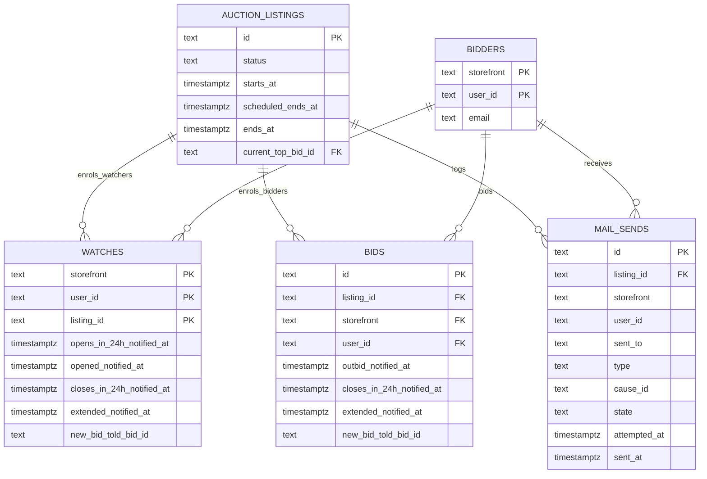
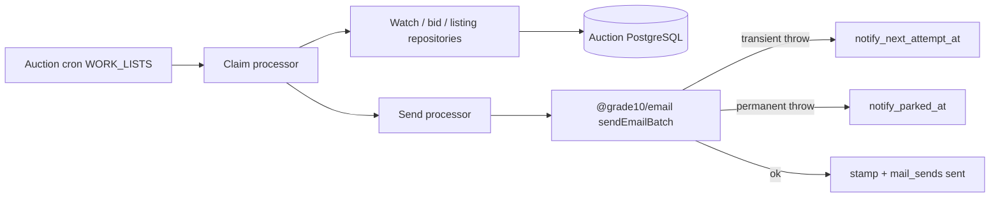

## Context

- See [proposal.md](proposal.md) for the collector problem.
- See
  [`grade10-site/auction/notifications`](specs/grade10-site/auction/notifications/spec.md)
  for the observable contract.
- Auction already mails eight kinds through one letter, one `EmailPort`,
  and a claim–send–stamp ladder: 30s doubling to an hour, eight
  attempts, then park for an operator retry. Ending-soon is a batched
  watcher fanout (50 recipients, one-hour lead on `scheduled_ends_at`).
  Outbid already ships. `@grade10/email` is a render-and-send library
  with no database.
- `watches` already exists, keyed `(storefront, user_id, listing_id)`.
  Watching and bidding must stay different rows so watcher mail and
  bidder mail do not double-enrol.
- Worker subrequest budget: a popular listing cannot cost one provider
  call per watcher. Workers must not sleep for Retry-After.
  Duplicate-beats-dropped remains: send, then stamp.
- Screens and Figma sources belong in [ui-design.md](ui-design.md).
- This change owns Auction delivery only — no store worker intake.

## Goals / Non-Goals

**Goals:**

- Emit the six new letters from Auction, render and deliver through
  `@grade10/email`, and log sends in Auction.
- Per-lot `email_alerts` plus account auction email alerts master;
  My Auctions mute UI and Account → Notifications master.
- Reuse the existing claim–send–stamp ladder, batch size 50, and
  one-hour ending-soon list.
- Classify provider errors so a permanent refusal parks immediately.
- Coalesce new-bid mail against `current_top_bid_id` so a snipe war
  is one letter about the current lead.
- Keep services as processors with fixed input and success/refusal
  output.
- English-only sends this change (catalog keys may exist; locale
  selection stays forced to English).

**Non-Goals:**

- Store worker / store DB ownership of inbox, prefs, or send log.
- In-app notification center, shell badge, in-app toggler, or global
  email/in-app channel toggles (remarked; in-app treated as always-on
  for a later center).
- Delivering device push for the new kinds. The names join
  `AuctionPushKind` so a follow-on does not rename them.
- Migrating the eight bid-state receipts onto this spine (remarked).
- Rewriting the one-hour ending-soon reminder.
- Marketing mail.
- Enabling account-locale rendering (remarked; scaffold only).
- ZZZ delivery (remarked).
- Moving the auction letter into `@grade10/email`. Presentation is
  product-owned.

## Decisions

### Auction emits; `@grade10/email` sends; Auction owns the log

- Auction names the type, the listing, and the recipient. The email
  library renders and delivers. The send log is `auction.mail_sends`.
- Alternatives rejected:
  - The auction worker talks to the mail provider — sending couples
    the worker to templates and the retry ladder.
  - The store service sends — Auction already must not grow a store
    binding.
  - A new email-service database for the log — one table would mint a
    Neon role and an admin path that then joins listings it does not
    own.
  - The sender works out recipients — it would duplicate watches and
    bids.

### Keep the existing auction letter; new kinds are copy branches

- Markup stays subject, preheader, heading, body, lot block (one primary
  image when available), listing button, footer, optional unsubscribe.
  The listing shape the letter renders grows `startsAt`,
  `scheduledEndsAt`, and optional `primaryImageUrl` beside the
  effective close.
- Templates are composed with [emailcn](https://www.emailcn.run/) on
  React Email via the shadcn registry (`@emailcn` in
  `apps/auction-emails/components.json`). Previewable sources live in
  [`apps/auction-emails`](../../../apps/auction-emails/): emailcn’s
  `createEmailTailwindConfig` plus Grade10 `grade10Theme`, shared
  pieces under `emails/_components/`, each kind a thin copy branch.
  Day-to-day preview: `pnpm email:dev` (React Email `email dev` on
  port 3333). Storybook is optional secondary;
  Litmus-class tools are pre-ship client QA.
- Copy drafts are in `ui-design.md`. English strings may live in
  `@grade10/i18n` for a later locale pass; **render always selects
  English** this change (account locale ignored at send).
- `canUnsubscribe` is true whenever the letter is owed with per-lot email
  alerts on (progress and bid-activity). The control points at signed-in
  **My Auctions** (`muteUrl`), where the collector flips that listing's
  Email alerts toggle — not unwatch, not the account master, not a
  one-click token.
- Alternatives rejected:
  - A template per kind — the eight kinds already share one file.
  - Move the letter into `@grade10/email` — login mail lives there
    because auth is brand-neutral; auction copy and listing links are
    not.
  - Restyle by importing design-system CSS — inboxes do not load that
    CSS; token values are copied into the email theme instead.
  - Storybook as the only preview — emailcn assumes React Email's
    preview; Storybook shows browser HTML, not inbox clients.

### Classify provider errors in `@grade10/email`; retry on the existing ladder

- `sendEmail` / `sendEmailBatch` keep throwing on a configured failure
  and returning `{ sent: false }` when unconfigured. They gain a typed
  error:
  - **Transient** — 429, 5xx, network, missing message id, partial
    batch: throw as today so the claim backoff retries.
  - **Permanent** — 4xx other than 429: throw a permanent error. The
    park path parks immediately when it sees that class, instead of
    waiting for attempt 8.
- No `sleep`. No SDK retry helper. Auction still throws on
  `{ sent: false }`, so a missing key never stamps notified.
- Alternatives rejected:
  - In-process retry with Retry-After — burns worker CPU, fights the
    cron, and still needs the ladder for process death.
  - Cloudflare Queues — a second durable retry next to columns every
    money and mail list already shares.
  - Leave 422 on the eight-attempt ladder — a bad address occupies
    the pass budget while good rows behind it wait.

Partial batches stay all-or-nothing at the stamp: if the provider
confirms 48 of 50, throw and the next pass may duplicate the 48. That
is the existing duplicate-beats-dropped trade.

Batch size stays 50. Fanout is `sendBatch` per `(storefront, listing)`
in chunks of 50, including the participant fallback grouped with the
watchers.

### New 24-hour stamps; leave the one-hour reminder in place

- Do not reuse `ending_soon_notified_at`. That column holds the
  shipped one-hour watcher reminder, a different message.
- Close-24h and extended are owed to watchers **or** participants with
  email alerts on. Unwatch deletes the watch row and turns alerts off on
  that watch; a bidder who unwatched but kept alerts on is still claimed
  via their bid row. Stamps for bid-only recipients live on the bidder's
  latest bid row. Watchers who also bid stamp the watch row only when
  alerts are on.
- Start letters stay watch-row only, and only where `email_alerts` is true
  (and the account master is on).
- Drop at send time if the statement is false (`stillBiddable` for
  close/extended; start-soon if `starts_at` has passed; has-started if
  `now < starts_at` or `now ≥ scheduled_ends_at`).
- Per-lot mute: additive `email_alerts boolean not null default true` on
  `watches`, and the same (or a shared listing mail-pref row) for bid-only
  recipients. Fanout filters `email_alerts = true`. Account master off
  suppresses all auction fanout for that collector.
- Alternatives rejected:
  - Deleting the watch row to mute — that removes list membership.
  - Convert the one-hour stamp into the 24-hour letter — two
    messages, one column.

### Once is a unique row on `mail_sends`, plus sweep stamps

- Progress uniqueness is `(listing_id, storefront, user_id, type)`.
  Activity uniqueness includes `cause_id` (the leading bid the
  collector was told about). Sweep stamps keep a pass from claiming
  the same row twice before the log write lands. The log stores no
  body.
- Alternatives rejected:
  - Derive once from enrolment at send time — a collector who
    unwatches and re-watches would receive the opening message twice.
  - Store the rendered body — templates go stale; the operator's
    question is which message went out.

Outbid-over-new-bid is chosen before emit, so the log never sees both
for one bid.

### New-bid coalesces against `current_top_bid_id`

- Column `new_bid_told_bid_id` on `watches`, and on the bid row for
  the participant fallback. Recipients are collectors with a bid who
  are not the current leader. Skip when the outbid list still owns
  them: live `outbid` / `lost` with `outbid_notified_at` null.
- Claim when `listing.current_top_bid_id` is set, is not theirs, and
  differs from `new_bid_told_bid_id` (null counts as differs). Send,
  then set `new_bid_told_bid_id = current_top_bid_id`.
- Sweep order: existing settlement lists, existing bid lists (outbid /
  now-top first), **then** new-bid, **then** the four progress
  fanouts, **then** ending-soon.
- `placeBid` does not walk every other bid to reset a stamp. The
  comparison to `current_top_bid_id` is the reset.
- Alternatives rejected:
  - One email per accepted bid — a 30-minute snipe war would mail
    every previous bidder on every increment.
  - Time-window debounce as the only rule — comparing the leading bid
    they were told about is deterministic across overlapping passes.

### Push kinds exist; push delivery does not

- Add the four progress kinds plus `listing_new_bid` to
  `AuctionPushKind` (and therefore `EmailKind`). `outbid` already
  exists. Push claiming stays on the current eight kinds.

## Database Schema

### Storage rules

- Schema `auction`. Timestamps are `timestamptz(3)`.
- Reuse existing stamp columns. Do not store a second copy of a
  message a stamp already holds.
- Spec fields read from another row at query time (listing title,
  current bid, close) are not copied onto `mail_sends`.

`mail_sends.type` slugs:

`opens_in_24h` · `opened` · `closes_in_24h` · `extended` · `new_bid` ·
`outbid`

### Existing tables this change touches

| Table | Role |
| --- | --- |
| `auction_listings` | `starts_at`, `scheduled_ends_at`, `ends_at`, `status`, `current_top_bid_id`. Called-off is `canceled`. No new columns. |
| `watches` | Watcher list membership, `email_alerts`, and progress / new-bid stamps. |
| `bids` | Bidder enrolment fallback stamps and per-bid `email_alerts` (or shared pref). `outbid_notified_at` already exists. |
| `bidders` | Registered email snapshot at send time. |

### `auction.watches` — additive stamp and alerts columns

| Column | Type | Null | Default | Meaning |
| --- | --- | --- | --- | --- |
| `email_alerts` | `boolean` | no | `true` | Per-lot email alerts; mute sets false without deleting the watch. |
| `opens_in_24h_notified_at` | `timestamptz(3)` | yes | `NULL` | Start-soon sent or dropped. |
| `opened_notified_at` | `timestamptz(3)` | yes | `NULL` | Has-opened sent or dropped. |
| `closes_in_24h_notified_at` | `timestamptz(3)` | yes | `NULL` | Close-soon sent or dropped. |
| `extended_notified_at` | `timestamptz(3)` | yes | `NULL` | Extended-bidding sent or dropped. |
| `new_bid_told_bid_id` | `text` | yes | `NULL` | Leading bid this watcher was last told about. |

Indexes, partial so stamped rows leave them (and muted rows leave due indexes):

| Index | On | Where |
| --- | --- | --- |
| `idx_watches_opens_in_24h_due` | `(listing_id, created_at)` | `opens_in_24h_notified_at IS NULL AND email_alerts` |
| `idx_watches_opened_due` | `(listing_id, created_at)` | `opened_notified_at IS NULL AND email_alerts` |
| `idx_watches_closes_in_24h_due` | `(listing_id, created_at)` | `closes_in_24h_notified_at IS NULL AND email_alerts` |
| `idx_watches_extended_due` | `(listing_id, created_at)` | `extended_notified_at IS NULL AND email_alerts` |
| `idx_watches_new_bid_due` | `(listing_id, created_at)` | `new_bid_told_bid_id IS NULL AND email_alerts` |

`idx_watches_listing_id_notified` and `ending_soon_notified_at` stay
the one-hour ending-soon claim.

### `auction.bids` — additive stamp columns for the participant fallback

| Column | Type | Null | Default | Meaning |
| --- | --- | --- | --- | --- |
| `closes_in_24h_notified_at` | `timestamptz(3)` | yes | `NULL` | Close-soon for a bidder with no watch. |
| `extended_notified_at` | `timestamptz(3)` | yes | `NULL` | Extended-bidding for a bidder with no watch. |
| `new_bid_told_bid_id` | `text` | yes | `NULL` | Leading bid this bidder was last told about. |

| Index | On | Where |
| --- | --- | --- |
| `idx_bids_closes_in_24h_due` | `(listing_id, created_at)` | `closes_in_24h_notified_at IS NULL` |
| `idx_bids_extended_due` | `(listing_id, created_at)` | `extended_notified_at IS NULL` |

`outbid_notified_at` is unchanged.

### `auction.mail_sends` — new table

Authoritative for "was this letter sent (or attempted) to this
address". Sweep stamps are the claim cursor; they are not the
operator log.

| Column | Type | Null | Default | Meaning |
| --- | --- | --- | --- | --- |
| `id` | `text` | no | — | PK. |
| `listing_id` | `text` | no | — | FK `auction_listings.id`. |
| `storefront` | `text` | no | — | Recipient brand. |
| `user_id` | `text` | no | — | Recipient user id. |
| `sent_to` | `text` | no | — | Registered address at send time. |
| `type` | `text` | no | — | One of the six slugs. |
| `cause_id` | `text` | yes | `NULL` | Leading bid for `new_bid` / `outbid`; null for progress. |
| `state` | `text` | no | `'attempted'` | `attempted` or `sent`. |
| `attempted_at` | `timestamptz(3)` | no | `now()` | First claim time. |
| `sent_at` | `timestamptz(3)` | yes | `NULL` | Confirmed send time. |

Checks:

- `ck_mail_sends_type`: `type` in the six slugs
- `ck_mail_sends_state`: `state IN ('attempted', 'sent')`
- `ck_mail_sends_sent_at`: `state = 'sent' AND sent_at IS NOT NULL` or
  `state = 'attempted' AND sent_at IS NULL`
- `ck_mail_sends_cause`: progress types have `cause_id IS NULL`;
  `new_bid` and `outbid` have `cause_id IS NOT NULL`

| Index | On | Where |
| --- | --- | --- |
| `uq_mail_sends_progress` | `(listing_id, storefront, user_id, type)` | `cause_id IS NULL` |
| `uq_mail_sends_activity` | `(listing_id, storefront, user_id, type, cause_id)` | `cause_id IS NOT NULL` |
| `idx_mail_sends_sent_to_attempted_at` | `(sent_to, attempted_at DESC)` | no |

Sweeps skip `auction_listings.status = 'canceled'`; they do not
delete log rows.

### Entity relationships



## Service Interfaces

### Processing model

- Cron entrypoints (`WORK_LISTS`) claim due rows and delegate to
  processors. They do not send mail themselves beyond calling the
  processor.
- Each letter processor: claim → render/send → stamp + log, in that
  order. A throw before stamp leaves the row due.
- `@grade10/email` owns provider error class. Auction owns park vs
  retry.
- Unexpected faults throw. A listing that is no longer biddable is an
  expected drop: stamp without sending, insert `mail_sends` only when
  a send was confirmed.

| Processor | Reads | Writes |
| --- | --- | --- |
| `classifySendError` | none (pure) | none |
| `claimProgressFanout` | due `watches` (+ bid fallback for close/extended), listing clock/status | claim locks |
| `sendProgressLetters` | claimed rows, listing, bidder email | stamps, `mail_sends` |
| `claimNewBidFanout` | bids/watches whose `new_bid_told_bid_id` differs from `current_top_bid_id`, skipping live outbid-owed | claim locks |
| `sendNewBidLetters` | claimed rows, listing | `new_bid_told_bid_id`, `mail_sends` |
| `listMailSends` | `mail_sends` by `sent_to` | none |
| `retryParkedLetter` | parked notify row | unpark ladder |

Existing `sendDueNotifications` (outbid / now-top / …) and
`remindEndingSoon` stay. This change inserts the new lists into
`WORK_LISTS` after existing bid lists and before ending-soon.



### Shared processor types

```ts
type MailType =
  | "opens_in_24h"
  | "opened"
  | "closes_in_24h"
  | "extended"
  | "new_bid"
  | "outbid";

type SendErrorClass = "transient" | "permanent";

type ProgressClaimInput = {
  type: Exclude<MailType, "new_bid" | "outbid">;
  now: Date;
  limit: number;
};

type FanoutRecipient = {
  storefront: string;
  userId: string;
  email: string;
  listingId: string;
  stampOn: "watch" | "bid";
  canUnsubscribe: boolean;
};

type SendBatchInput = {
  type: MailType;
  storefront: string;
  listingId: string;
  recipients: FanoutRecipient[];
  causeId: string | null;
  listing: {
    id: string;
    title: string;
    primaryImageUrl: string | null;
    startsAt: Date;
    scheduledEndsAt: Date;
    endsAt: Date;
    topAmountMinor: number;
    currency: string;
    stillBiddable: boolean;
    /** Outbid only: standing amount when they lost the lead. Never the maximum. */
    yourStandingBidMinor?: number;
  };
};

type SendBatchOutput =
  | { success: true; data: { sent: number; dropped: number } }
  | { success: false; error: string; errorClass: SendErrorClass };
```

### `classifySendError`

```ts
function classifySendError(error: unknown): SendErrorClass;
```

Lives in `@grade10/email`. Maps provider 429 / 5xx / network / missing
id / partial batch to `transient`. Maps other 4xx to `permanent`.
Auction does not re-parse status codes.

### `claimProgressFanout`

```ts
function claimProgressFanout(
  db: AuctionDb,
  input: ProgressClaimInput,
): Promise<FanoutRecipient[]>;
```

Claim predicates:

| Type | Listing predicate | Recipient |
| --- | --- | --- |
| `opens_in_24h` | published, `starts_at` in `(now, now+24h]`, stamp null | watch row |
| `opened` | published, `starts_at ≤ now < scheduled_ends_at`, stamp null | watch row |
| `closes_in_24h` | published, `scheduled_ends_at` in `(now, now+24h]`, still biddable | watch, else latest bid with no watch |
| `extended` | published, `ends_at > scheduled_ends_at`, still biddable | watch, else latest bid with no watch |

Skip `status = 'canceled'`. `FOR UPDATE SKIP LOCKED` on the stamp
row. Limit 50 recipients per `(storefront, listing)` chunk.

`canUnsubscribe` is true for every owed letter when per-lot email alerts
are on (and the account master is on). The link opens signed-in My
Auctions for that brand (`muteUrl`); optional deep-link to the listing
row is application-owned.

### `sendProgressLetters`

```ts
function sendProgressLetters(
  db: AuctionDb,
  clock: Clock,
  email: EmailPort,
  input: SendBatchInput,
): Promise<SendBatchOutput>;
```

Mutation steps, one transaction per chunk after the provider returns:

1. Re-read listing. If the statement is now false, stamp every claimed
   row and do not send. Do not insert `mail_sends`.
2. Deduplicate recipients by `(storefront, user_id)` so a watcher who
   also bids receives one copy.
3. Call `email.sendBatch`. On `{ sent: false }` (unconfigured), throw
   — never stamp, never log as sent.
4. On transient throw: increment attempts, set `notify_next_attempt_at`
   from the existing ladder, leave stamps null.
5. On permanent throw: park immediately with a named reason; leave
   stamps null so an operator retry can unpark.
6. On success: set the type's stamp to `now`, upsert `mail_sends` to
   `state = 'sent'` under the progress uniqueness key.

A crash after the provider confirms and before the stamp may send a
duplicate. Prefer that over dropping the letter.

### Mutation example: watcher added inside the 24-hour start window

Listing `listing_42`: `starts_at = 2026-08-29T10:00:00.000Z`, now is
six hours earlier. Collector `user_17` watches.

Claim input:

```json
{
  "type": "opens_in_24h",
  "now": "2026-08-29T04:00:00.000Z",
  "limit": 50
}
```

Recipient:

```json
{
  "storefront": "grade10",
  "userId": "user_17",
  "email": "a@example.com",
  "listingId": "listing_42",
  "stampOn": "watch",
  "canUnsubscribe": true
}
```

After a confirmed send:

- `watches.opens_in_24h_notified_at = 2026-08-29T04:00:01.000Z`
- `mail_sends` row: `type = 'opens_in_24h'`, `sent_to =
  'a@example.com'`, `state = 'sent'`, `cause_id` null
- Letter names the actual `starts_at`, not a stale 24-hour remainder

A second pass finds the stamp and claims nothing.

### Mutation example: close-soon after unwatch, bidder still enrolled

`user_17` watched and bid, then unwatched. Watch row is gone. Latest
bid row has `closes_in_24h_notified_at` null.

Claim for `closes_in_24h` returns that bid as `stampOn: 'bid'`,
`canUnsubscribe: true` when the bid (or shared pref) still has
`email_alerts`. Send stamps the bid row, not a watch.

### Mutation example: snipe-war coalescing

Listing `current_top_bid_id` moves `bid_88 → bid_99 → bid_101` before
the cron runs. Collector `user_09` has a bid, is not the leader, and
`new_bid_told_bid_id` is null. They are not on the live outbid list.

One `new_bid` letter goes out with `cause_id = 'bid_101'`. Then
`new_bid_told_bid_id = 'bid_101'`. Three accepted bids, one letter.

If `user_09` was just displaced and `outbid_notified_at` is still
null, new-bid skips them; the existing outbid list owns that pass.

### Mutation example: called-off listing

Operator sets `listing_42.status = 'canceled'`. Every new claim
predicate excludes it. A close-soon row already claimed but not yet
sent re-reads `status` and drops without mailing. Existing
`mail_sends` rows stay.

### Mutation example: permanent provider refusal

Provider returns 422. `classifySendError` → `permanent`. Auction parks
the notify row, does not stamp sent, does not burn the remaining
attempt budget. `retryParkedLetter` (existing admin retry) unparks
onto the ladder. Other recipients in the same pass are still
attempted because a permanent error is per address, not per chunk —
a chunk that mixed a 422 with successes follows the existing
all-or-nothing batch rule: throw, retry the chunk, unique
`mail_sends` prevents a second logical send to addresses that already
logged `sent`.

### `listMailSends`

```ts
type ListMailSendsInput = {
  sentTo: string;
  cursor: string | null;
  limit: number;
};

type MailSendRow = {
  id: string;
  type: MailType;
  listingId: string;
  sentTo: string;
  state: "attempted" | "sent";
  attemptedAt: Date;
  sentAt: Date | null;
};

function listMailSends(
  db: AuctionDb,
  input: ListMailSendsInput,
): Promise<{ items: MailSendRow[]; cursor: string | null }>;
```

Admin-only, `auction:operate` (same grant as today's notification
retry). Filter is exact `sent_to`. No body column. Page by
`attempted_at DESC`.

### Wire changes

Extend `AuctionPushKind` / `EmailKind` with
`listing_opens_in_24h`, `listing_opened`, `listing_closes_in_24h`,
`listing_extended`, and `listing_new_bid`. `outbid` already exists.
Existing `listing_ending_soon` stays the one-hour push slug; new
`mail_sends` rows use `closes_in_24h`.

The listing shape the letter renders gains `startsAt`,
`scheduledEndsAt`, and optional `primaryImageUrl`. Additive.

Admin gains the send-log read above. No public storefront contract
beyond the kinds.

## Deferred (remarked)

- **Locale enablement** — select catalog locale from the account; this
  change forces English at render.
- **Eight bid-state / ending-soon kinds** — migrate onto the same emit
  and letter spine; leave current lanes until then.
- **In-app center, shell badge, in-app toggler, global channel toggles** —
  in-app treated as always-on for a later center; no store intake.
- **ZZZ** — same six messages under ZZZ identity.
- **Account deletion / retention** for `mail_sends` and mute prefs.

## Risks / Trade-offs

- **[A send failure silently loses a message]** → `mail_sends.state`
  distinguishes `attempted` from `sent`. A missing provider key throws
  and never stamps.
- **[A popular listing exhausts the worker]** → Batch 50 per
  `(storefront, listing)`, same as ending-soon.
- **[A snipe war mails every increment]** → `new_bid_told_bid_id`
  compared to `current_top_bid_id`; outbid claims first.
- **[A refused address blocks the pass]** → Permanent provider error
  parks immediately.
- **[Duplicate on partial batch or crash between send and stamp]** →
  Existing duplicate-beats-dropped trade; the unique `mail_sends` row
  still records one logical send.
- **[24h close plus 1h reminder both fire]** → Separate stamps and
  separate copy: the 24h letter names the scheduled close.

## Migration Plan

1. Additive auction migration: the five watch stamps, the three bid
   fallback columns, `mail_sends` and its indexes and checks. No
   backfill. Existing `ending_soon_notified_at` values stand. Listings
   already in their window become due on the next pass.
2. Deploy after watching-with-alerts exists so progress mail and mute
   can be verified; new bids must not insert a watch that would
   double-enrol.
3. Collectors who already bid on an open listing begin receiving
   bid-activity mail at release; that is the intent, not a data
   backfill.
4. Rollback keeps the columns and `mail_sends`. Do not delete log
   rows.

`WORK_LISTS` gains the new lists before `endingSoonReminders`, after
the existing bid-notification lists. The order test pins it.

## Open Questions

Answerable later without changing the specs, the approach, or the
tasks.

- How long the send log is retained.
