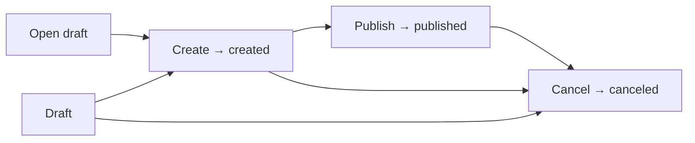
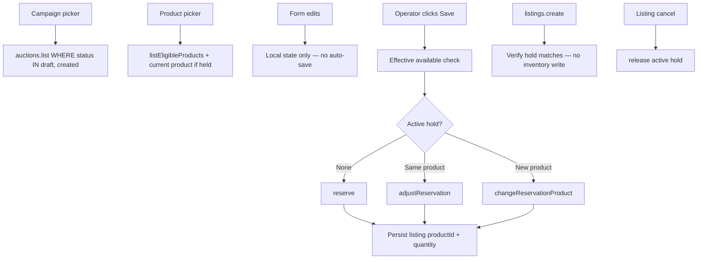

## Context

Auction **campaign** covers already persist as `auctions` rows and admin tRPC
`auctions.{list,get,create,update,publish,cancel}`. Listings optionally reference
a cover via `auctionId`. Today `auctions.status` is only
`draft | published | canceled`, and `OPEN_AUCTION_STATES = ["draft", "published"]`
gates listing attachment. The listing editor never exposes the campaign field,
and the admin client only wires `list` / `create` / `publish` — not
`get` / `update` / `cancel`. Operator chrome still says **Sales**, which
collides with store checkout and inventory “sold”.

Capability specs:
[`grade10-auction/admin-campaign`](specs/grade10-auction/admin-campaign/spec.md),
[`grade10-auction/admin-listing`](specs/grade10-auction/admin-listing/spec.md)
(delta).

Inventory eligibility and reservation sync for listing `productId` and
**quantity** are defined in
[`add-grade10-inventory`](../add-grade10-inventory/design.md) Contracts
(`AuctionEligibleProduct`, `listEligibleProducts`, `reserve`,
`adjustReservation`, `changeReservationProduct`). This change consumes those
holder APIs; it does not implement the ledger.

Screens: [ui.md](ui.md).

This design follows `docs/conventions/packages.md` and
`docs/conventions/backend.md` in the grade10 monorepo.

## Goals / Non-Goals

**Goals:**

- Operator chrome uses **Campaign** / **Campaigns**, not Sale / Sales.
- Full campaign editor (open / create / edit / publish / cancel) mirroring
  listing authoring.
- Listing editor campaign picker limited to **`draft` | `created`** campaigns.
- Listing editor **product** picker limited to inventory products with
  **`status = created`** and **available > 0**, plus the listing's current
  product when this listing already holds its last units.
- Listing editor **quantity** (1–500); defaults to **1** when a product is
  picked in the form.
- Explicit **Save** only — no auto-save; inventory reserve/adjust/product
  change run on Save when both product and quantity are set.
- **`listings.create`** verifies an active hold matches saved product +
  quantity; it does not write inventory.
- Product change confirmation when replacing a product that already has an
  active hold from a prior Save.
- Add campaign **`created`** status; align lifecycle with listings.

**Non-Goals:**

- Parallel campaign table; renaming `auctions` / `auctionId` / tRPC paths.
- Inventory intake or ledger implementation (holder RPCs live in inventory).
- Campaign clocks, money, hero media, or product selection on campaign covers.

## Decisions

### Operator language is Campaign; persistence stays `auctions`

Operator-visible copy says **Campaign** / **Campaigns**. Code that names the
catalogue-cover entity — admin contracts, admin feature modules, app panels, and
auction-service helpers for covers and their listings — SHALL use **campaign**
identifiers (`adminCampaign*`, `CampaignsPanel`, `campaignsModule`,
`publishedCampaignJoin`, `publicListingsOfCampaign`, etc.), not **sale**.

Wire persistence and paths that already use **auction** stay: `auctions` table,
`auctions.*` tRPC router, listing `auctionId`. Post-sale and inventory
sell/sold vocabulary are out of scope — they name different domains.

**Rejected:** A new `campaigns` table — would fork identity from every live
`auctionId` FK. **Rejected:** Keeping **Sales** / `adminSale*` / `SalesPanel` —
overlaps store checkout, inventory sold, and post-sale.

### Campaign status machine matches listing

Add **`created`**. **Open** persists `draft`. **Create** moves
`draft → created`. **Publish** moves `created → published` only. **Cancel**
moves `draft | created | published → canceled` and fans out listing cancel.
Edit title/copy while `draft | created | published`.

**Rejected:** `draft | published | canceled` only. **Rejected:** Publish
directly from `draft` — create is the ready gate, same as listings.

Existing listings under a published campaign keep their `auctionId`; operators
cannot attach **new** listings to that published campaign.

### Listing ↔ campaign attachment

A listing MAY attach a campaign only when that campaign is **`draft` or
`created`**. `published` and `canceled` are refused. Clearing the campaign
is always allowed on an editable listing. Publishing a listing does not require
a campaign.

Picker options come from `auctions.list` filtered to `draft` and `created`.
`OPEN_AUCTION_STATES` becomes `["draft", "created"]`. Wire paths: pass
`auctionId` on draft save and create; post-create edits call
`listings.setAuction`.

**Rejected:** Keeping published campaigns attachable.

### Listing `productId` and quantity use inventory eligibility and reservation sync

Replace free-text product id with a picker fed by inventory's Auction-facing
eligibility list: products whose **`status` is `created`** and **`available >
0`**, **plus** the listing's currently stored product when this listing's
active hold consumes the product's free pool (global available zero).

The editor exposes **quantity** (1–500). Selecting a product in the form
defaults quantity to **1** locally. Nothing persists until the operator
clicks **Save** — no auto-save, debounced save, or save-on-blur.

On **`listings.saveDraft`** when both **productId** and **quantity** are set:

```typescript
const svc = inventory.createAuctionInventoryService();
const hold = await svc.listOwnReservations({ holderReference: listingId })
  .find(r => r.status === 'active');

if (!hold) {
  await svc.reserve({ holderReference: listingId, productId, quantity });
} else if (hold.productId === productId) {
  await svc.adjustReservation(hold.id, quantity);
} else {
  await svc.changeReservationProduct({ reservationId: hold.id, newProductId: productId, newQuantity: quantity });
}
// then persist listing productId + quantity
```

**Effective available** for save validation:
`available + (hold.remaining when hold.productId === requested product, else 0)`.

Clearing product or quantity on Save releases the active hold first.

**`listings.create`** (verify only): when the listing stores product +
quantity, refuse create unless an active hold exists with the same product and
quantity. Create does **not** call inventory mutations.

Listing cancel (operator or campaign fan-out) calls `release` on any active
hold for the listing.

At runtime the auction worker resolves eligibility through its
`INVENTORY_SERVICE` binding. Until inventory ships, auction admin fixtures
stub holder methods and eligibility products.

When an operator changes product in the form and the listing already has an
active hold from a prior Save, the UI confirms before switching the form
value — confirming does not mutate inventory until Save.

**Rejected:** Free-text product ids without inventory checks.
**Rejected:** Auto-save on product or quantity change.
**Rejected:** Admin calling inventory holder RPC directly from the browser.
**Rejected:** Create calling reserve when hold is missing — operator must Save first.

### Admin UI mirrors listing authoring

Campaigns tab keeps a table; row open swaps to **CampaignEditorPage** beside
**ListingEditorPage** (back control, `Card`, `TextInput`, explicit **Save**,
create / publish / cancel actions). Native `<select>` for campaign and product
pickers until a design-system Select ships. Listing editor uses a confirmation
dialog when changing product on a listing that already has an active hold.

**Rejected:** Inline “New sale” title field as the only edit surface.
**Rejected:** Auto-save or save-on-blur for listing catalogue fields.

### Packages and ownership

All work under `@grade10/auction-*` and `apps/admin/grade10` auction pages.
Compose existing `@grade10/design-system` primitives only.

## Flows

### Campaign lifecycle



### Listing editor pickers and reservation sync



Only the `auctions` status check and a listing **quantity** column change in
this delivery.

## Database schema

Schema lives in `@grade10/auction-service` under PostgreSQL schema `auction`.

### `auctions` (existing table — status check extended)

A campaign catalogue cover; many listings may reference one row via
`auctionId`. Identity and copy only — no clocks or money on this row.

| Column | PostgreSQL type | Null | Default / constraint | Meaning |
| --- | --- | --- | --- | --- |
| `id` | `text` | No | PK | Campaign identity (wire: `auctionId` on listings) |
| `title` | `text` | No | Trimmed 1–200 | Cover title shown to operators and on the public catalogue |
| `copy` | `text` | No | `''`; max 4000 | Optional cover description; may be empty |
| `status` | `text` | No | `'draft'`; check below | Lifecycle: `draft` (editor only) → `created` (listings may attach) → `published` (public cover) \| `canceled` (read-only; fan-out listing cancel) |
| `created_at` | `timestamp(3) with time zone` | No | `now()` | When the campaign row was first persisted |
| `updated_at` | `timestamp(3) with time zone` | No | `now()` | Last successful title, copy, or status change |

**Check change:**

```sql
-- before: draft | published | canceled
-- after:  draft | created | published | canceled
ck_auctions_status: status IN ('draft', 'created', 'published', 'canceled')
```

No new columns. No row backfill — existing `draft`, `published`, and
`canceled` rows remain valid.

Application constant `OPEN_AUCTION_STATES` flips from
`["draft", "published"]` to `["draft", "created"]` for listing attach
validation in `listings/draft.ts`, `listings/details.ts`, and
`auctions/events.ts`.

### `auction_listings` (existing table — quantity column added)

| Column | PostgreSQL type | Null | Default / constraint | Meaning |
| --- | --- | --- | --- | --- |
| `quantity` | `integer` | Yes | `1 ≤ quantity ≤ 500` when set | Units this listing reserves in inventory; written on explicit Save with product |

Nullable while draft with no product. Create with product + quantity requires
a matching active inventory hold.

## Contracts

**Modified.** `@grade10/auction-contracts` admin subpath gains campaign
`created` status, listing **quantity**, reservation-sync refusals, and hold
mismatch on create. **Consumed.** `@grade10/inventory-contracts` holder APIs
(`AuctionEligibleProduct`, `listEligibleProducts`, `reserve`,
`adjustReservation`, `changeReservationProduct`).

### Campaign wire types

| Type | Change |
| --- | --- |
| `adminCampaignStatusSchema` | Rename from `adminSaleStatusSchema`; add literal `"created"` → `draft \| created \| published \| canceled` |
| `adminCampaignSchema` | Rename from `adminSaleSchema`; `status` may be `created` |
| `adminCampaignCancellationSchema` | Rename from `adminSaleCancellationSchema` — cancel fan-out answer shape |
| `adminListingSchema` / draft input | Add optional `quantity` (integer 1–500) |

Remove `adminSale*` exports and `AuctionAdminSale*` types — no alias layer.
Listing and campaign wire fields stay `auctionId` on listings; tRPC paths stay
`auctions.*`. Operator copy is Campaign.

### Admin tRPC (`auctions.*`, listing mutations)

Existing router paths; this change completes wiring and tightens validation.

| Procedure | Purpose |
| --- | --- |
| `auctions.open` | Persist new `draft` campaign (open scenarios) |
| `auctions.create` | `draft → created` transition |
| `auctions.get` | Single campaign for editor |
| `auctions.update` | Title / copy edit |
| `auctions.publish` | `created → published` only |
| `auctions.cancel` | Cancel campaign + listing fan-out |
| `auctions.list` | Campaign table + listing campaign picker (filter attachable statuses client-side or server-side) |
| `listings.saveDraft` | Explicit Save path: sync inventory when product + quantity set; release on clear; persist after inventory succeeds |
| `listings.create` | Verify active hold matches saved product + quantity; no inventory writes |
| `listings.setAuction` | Post-create campaign attach / clear |

Fixture client (`FixtureAuctionAdminProcedureClient`) gains the same shapes,
stub holder methods, and stub eligibility products for frontend work without
inventory or auction workers running.

### Listing product eligibility and reservation sync

| Source | Shape | Rule |
| --- | --- | --- |
| `@grade10/inventory-contracts` | `AuctionEligibleProduct` | `{ productId, name, available }` |
| Inventory holder API | `listEligibleProducts()` | `status = created` AND `available > 0` |
| Picker union | Listing editor | Eligibility list **plus** stored product when this listing's hold consumes last free units |
| Save validation | Auction worker | Effective available = global available + own remaining on same product |
| Product change | `changeReservationProduct` | One transaction; same reservation id; both inventories' `reserved` updated |

Listing explicit Save refuses when effective available is insufficient. Create
refuses when hold missing or mismatched. Cancel releases active hold.

Until `@grade10/inventory-contracts` lands, auction contracts duplicate only
the shapes needed for fixtures; inventory group 2 is the submodule boundary.

### Typed refusals (listing attach / product / hold)

Campaign attach: campaign not found, campaign not in `draft | created`,
unauthorized.

Product / quantity save: draft inventory product, insufficient effective
available, unknown product id, unauthorized.

Create: hold missing, hold product mismatch, hold quantity mismatch,
unauthorized.

Product change failure: insufficient stock, draft target product, or quantity
below settled floor — atomic refusal; listing and prior hold unchanged.

## Risks / Trade-offs

| Risk | Mitigation |
| --- | --- |
| Operators accustomed to publish draft → published | Spec + tasks: create then publish; migrate UI and tests |
| Published campaigns no longer accept new lots | Documented; existing attachments unchanged |
| Inventory not shipped | Fixtures stub holder methods + `AuctionEligibleProduct[]`; tasks name inventory dependency |
| Code still says `sale` for catalogue covers | Group 1 renames admin labels and code identifiers to campaign |
| Browser cannot call inventory holder RPC | Auction worker proxies sync on Save; fixtures stub until binding exists |
| Product change leaves transient unreconciled stock if RPC fails mid-flight | `changeReservationProduct` is one inventory transaction; spec refuses partial listing write |

## Migration Plan

1. Ship operator and code rename (Campaigns tab, `CampaignsPanel`, `campaigns`
   modules, `adminCampaign*` contracts, catalogue-cover backend helpers) —
   no schema.
2. Migration: extend `ck_auctions_status` with `created`; add `auction_listings.quantity`;
   deploy auction worker with create transition, reservation sync on Save, and
   `OPEN_AUCTION_STATES = ["draft", "created"]`.
3. Land auction contracts + procedure client + fixtures (group 2).
4. Ship admin SPA: campaign editor, listing explicit Save (no auto-save),
   product-change confirmation, quantity field, reservation-sync errors.
5. No row backfill for campaigns; listing `quantity` nullable for existing drafts.

## Open Questions

None that change the specs or task breakdown.
