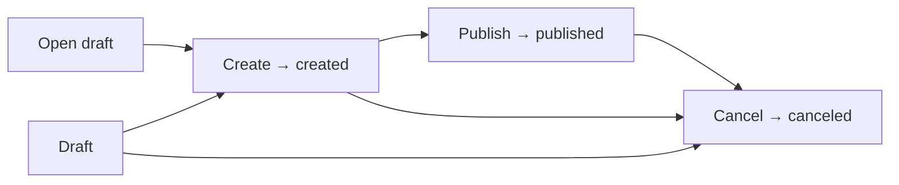
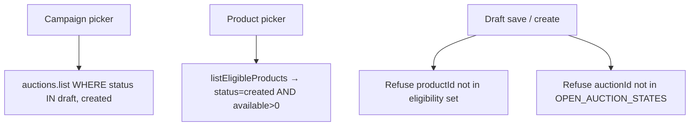

## Context

Auction **campaign** covers already persist as `auctions` rows and admin tRPC
`auctions.{list,get,create,update,publish,cancel}`. Listings optionally reference
a cover via `auctionId`. Today `auctions.status` is only
`draft | published | canceled`, and `OPEN_AUCTION_STATES = ["draft", "published"]`
gates listing attachment. The listing editor never exposes the campaign field,
and the admin client only wires `list` / `create` / `publish` — not
`get` / `update` / `cancel`. Operator chrome still says **Sales**, which
collides with store checkout and inventory “sold”.

Capability specs:
[`grade10-auction/admin-campaign`](specs/grade10-auction/admin-campaign/spec.md),
[`grade10-auction/admin-listing`](specs/grade10-auction/admin-listing/spec.md)
(delta).

Inventory eligibility for listing `productId` is defined in
[`add-grade10-inventory`](../add-grade10-inventory/design.md) Contracts
(`AuctionEligibleProduct`, `listEligibleProducts`). This change consumes that
read model; it does not implement the ledger.

Screens: [ui.md](ui.md).

This design follows `docs/conventions/packages.md` and
`docs/conventions/backend.md` in the grade10 monorepo.

## Goals / Non-Goals

**Goals:**

- Operator chrome uses **Campaign** / **Campaigns**, not Sale / Sales.
- Full campaign editor (open / create / edit / publish / cancel) mirroring
  listing authoring.
- Listing editor campaign picker limited to **`draft` | `created`** campaigns.
- Listing editor **product** picker limited to inventory products with
  **`status = created`** and **available > 0**.
- Add campaign **`created`** status; align lifecycle with listings.

**Non-Goals:**

- Parallel campaign table; renaming `auctions` / `auctionId` / tRPC paths.
- Inventory intake, reservations, or ledger mutations.
- Campaign clocks, money, hero media, or product selection on campaign covers.

## Decisions

### Operator language is Campaign; persistence stays `auctions`

Operator-visible copy says **Campaign** / **Campaigns**. Wire identifiers,
table name, and tRPC router path stay `auctions` / `auctionId`. Admin domain
may keep `saleId` as an alias until a later cleanup.

**Rejected:** A new `campaigns` table — would fork identity from every live
`auctionId` FK. **Rejected:** Keeping the **Sales** label — overlaps store
checkout and inventory sold.

### Campaign status machine matches listing

Add **`created`**. **Open** persists `draft`. **Create** moves
`draft → created`. **Publish** moves `created → published` only. **Cancel**
moves `draft | created | published → canceled` and fans out listing cancel.
Edit title/copy while `draft | created | published`.

**Rejected:** `draft | published | canceled` only. **Rejected:** Publish
directly from `draft` — create is the ready gate, same as listings.

Existing listings under a published campaign keep their `auctionId`; operators
cannot attach **new** listings to that published campaign.

### Listing ↔ campaign attachment

A listing MAY attach a campaign only when that campaign is **`draft` or
`created`**. `published` and `canceled` are refused. Clearing the campaign
is always allowed on an editable listing. Publishing a listing does not require
a campaign.

Picker options come from `auctions.list` filtered to `draft` and `created`.
`OPEN_AUCTION_STATES` becomes `["draft", "created"]`. Wire paths: pass
`auctionId` on draft save and create; post-create edits call
`listings.setAuction`.

**Rejected:** Keeping published campaigns attachable.

### Listing `productId` uses inventory eligibility

Replace free-text product id with a picker fed by inventory's Auction-facing
eligibility list: products whose **`status` is `created`** and **`available >
0`**. Draft and out-of-stock products are omitted; save/create refuse
ineligible ids.

At runtime the auction worker resolves eligibility through its
`INVENTORY_SERVICE` binding → `AuctionInventoryService.listEligibleProducts()`
(see inventory Contracts). Until inventory ships, auction admin fixtures stub
the same `AuctionEligibleProduct[]` shape from `@grade10/inventory-contracts`.

Campaign covers do not carry a product id.

**Rejected:** Free-text product ids without inventory checks.
**Rejected:** Admin calling inventory admin tRPC directly from the browser —
eligibility is a holder read on the inventory worker, proxied or stubbed at the
auction boundary.

### Admin UI mirrors listing authoring

Campaigns tab keeps a table; row open swaps to **CampaignEditorPage** beside
`ListingEditorPage` (back control, `Card`, `TextInput`, create / publish /
cancel actions). Native `<select>` for campaign and product pickers until a
design-system Select ships.

**Rejected:** Inline “New sale” title field as the only edit surface.

### Packages and ownership

All work under `@grade10/auction-*` and `apps/admin/grade10` auction pages.
Compose existing `@grade10/design-system` primitives only.

## Flows

### Campaign lifecycle



### Listing editor pickers



## Database schema

Schema lives in `@grade10/auction-service` under PostgreSQL schema `auction`.
Only the campaign status check changes in this delivery.

### `auctions` (existing table — status check extended)

A campaign catalogue cover; many listings may reference one row via
`auctionId`. Identity and copy only — no clocks or money on this row.

| Column | PostgreSQL type | Null | Default / constraint | Meaning |
| --- | --- | --- | --- | --- |
| `id` | `text` | No | PK | Campaign identity (wire: `auctionId` on listings) |
| `title` | `text` | No | Trimmed 1–200 | Cover title shown to operators and on the public catalogue |
| `copy` | `text` | No | `''`; max 4000 | Optional cover description; may be empty |
| `status` | `text` | No | `'draft'`; check below | Lifecycle: `draft` (editor only) → `created` (listings may attach) → `published` (public cover) \| `canceled` (read-only; fan-out listing cancel) |
| `created_at` | `timestamp(3) with time zone` | No | `now()` | When the campaign row was first persisted |
| `updated_at` | `timestamp(3) with time zone` | No | `now()` | Last successful title, copy, or status change |

**Check change:**

```sql
-- before: draft | published | canceled
-- after:  draft | created | published | canceled
ck_auctions_status: status IN ('draft', 'created', 'published', 'canceled')
```

No new columns. No row backfill — existing `draft`, `published`, and
`canceled` rows remain valid.

Application constant `OPEN_AUCTION_STATES` flips from
`["draft", "published"]` to `["draft", "created"]` for listing attach
validation in `listings/draft.ts`, `listings/details.ts`, and
`auctions/events.ts`.

## Contracts

**Modified.** `@grade10/auction-contracts` admin subpath gains campaign
`created` status and listing product eligibility refusals. **Consumed.**
`AuctionEligibleProduct` from `@grade10/inventory-contracts` (inventory
Contracts).

### Campaign wire types

| Type | Change |
| --- | --- |
| `adminSaleStatusSchema` | Add literal `"created"` → `draft \| created \| published \| canceled` |
| `adminSaleSchema` | Unchanged fields; `status` may be `created` |
| `adminSaleCancellationSchema` | Unchanged — cancel fan-out answer shape |

Wire names stay `adminSale*` / `auctions.*` until a later identifier cleanup;
operator copy is Campaign.

### Admin tRPC (`auctions.*`, listing mutations)

Existing router paths; this change completes wiring and tightens validation.

| Procedure | Purpose |
| --- | --- |
| `auctions.open` | Persist new `draft` campaign (open scenarios) |
| `auctions.create` | `draft → created` transition |
| `auctions.get` | Single campaign for editor |
| `auctions.update` | Title / copy edit |
| `auctions.publish` | `created → published` only |
| `auctions.cancel` | Cancel campaign + listing fan-out |
| `auctions.list` | Campaign table + listing campaign picker (filter attachable statuses client-side or server-side) |
| `listings.saveDraft` / `listings.create` | Accept `auctionId` under `OPEN_AUCTION_STATES`; validate `productId` against eligibility |
| `listings.setAuction` | Post-create campaign attach / clear |

Fixture client (`FixtureAuctionAdminProcedureClient`) gains the same shapes
and stub eligibility products for frontend work without inventory or auction
workers running.

### Listing product eligibility

| Source | Shape | Rule |
| --- | --- | --- |
| `@grade10/inventory-contracts` | `AuctionEligibleProduct` | `{ productId, name, available }` |
| Inventory holder API | `listEligibleProducts()` | `status = created` AND `available > 0` |

Auction worker (when inventory binding present):

```typescript
const products = await inventory.createAuctionInventoryService()
  .listEligibleProducts();
```

Listing save/create refuses `productId` not in that set with a typed refusal
(draft product, out of stock, unknown id). Spec scenarios:
`Product picker omits draft inventory products`, etc.

Until `@grade10/inventory-contracts` lands, auction contracts duplicate only
the eligibility row shape needed for fixtures; group 2 of
[`add-grade10-inventory`](../add-grade10-inventory/tasks.md) is the submodule
boundary.

### Typed refusals (listing attach / product)

Campaign attach: campaign not found, campaign not in `draft | created`,
unauthorized.

Product id: not eligible (draft inventory product, zero available, unknown),
unauthorized.

## Risks / Trade-offs

| Risk | Mitigation |
| --- | --- |
| Operators accustomed to publish draft → published | Spec + tasks: create then publish; migrate UI and tests |
| Published campaigns no longer accept new lots | Documented; existing attachments unchanged |
| Inventory not shipped | Fixtures stub `AuctionEligibleProduct[]`; tasks name inventory contract dependency |
| Code paths still say `sale` / `SalesPanel` | Group 1 requires operator-visible Campaigns labels |
| Browser cannot call inventory holder RPC | Auction worker proxies eligibility or fixtures stub until binding exists |

## Migration Plan

1. Ship operator rename (Campaigns tab, listing Campaign label) — no schema.
2. Migration: extend `ck_auctions_status` with `created`; deploy auction worker
   with create transition and `OPEN_AUCTION_STATES = ["draft", "created"]`.
3. Land auction contracts + procedure client + fixtures (group 2).
4. Ship admin SPA: campaign editor, listing campaign picker, inventory-backed
   product picker.
5. No row backfill.

## Open Questions

None that change the specs or task breakdown.
