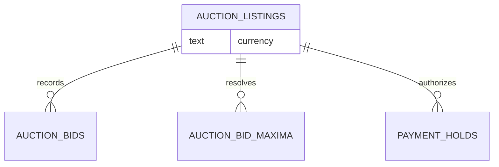

# Design

## Context

The auction service persists `min_increment` on each listing and derives both
the manual floor and proxy price from it. The approved policy replaces that
per-listing fact with three static Grade10 schedules. The requirements are in
[bid increments](specs/grade10-site/auction/bid-increments/spec.md),
[auto bidding](specs/grade10-site/auction/auto-bidding/spec.md), and
[admin listing](specs/grade10-admin/auction/listing/spec.md).

## Goals / Non-Goals

- Use one deterministic lookup for manual floors, proxy resolution, and quick
  bids.
- Make unsupported currencies impossible at the browser and service boundary.
- Preserve accepted test bids and card holds while future calculations move to
  the schedule.
- Do not build schedule administration, runtime policy updates, or schedule
  versions in this change.

## Decisions

### Keep schedules as a typed service policy

A pure, typed schedule module owns the three tables and exposes lookup by
currency and amount. Listing services, proxy resolution, frontend fixtures,
and quick-bid suggestions consume that one contract. This is developer-managed
policy, so a database policy table would add mutation, audit, and versioning
semantics outside the scope.

The alternative—persisting a schedule JSON snapshot on each listing—was
rejected because there is no operator editing or future-policy behavior to
preserve yet. A listing's currency selects the applicable static schedule.

### Use the amount being beaten

Manual bids derive their floor from the public price (or starting price before
the first accepted bid). Proxy resolution derives its public price from the
second-highest maximum. A tier begins at its stated boundary, so exactly
USD 100.00 uses the USD 5.00 increment. This makes the user-visible floor and
the proxy result use the same rule.

The alternative—using the bidder's submitted maximum—was rejected because a
bidder could not predict the next valid manual amount and equal competition
would produce a different public price.

### Remove, rather than deprecate, the flat increment

The migration drops `min_increment` after code stops reading it. Contracts,
admin writes, factories, fixtures, repository selections, and frontend models
remove the field in the same release. Leaving a dormant field would preserve a
second pricing source and invite accidental reuse.

Historical bid and authorization values are immutable records. The migration
does not recalculate them; the next floor or proxy resolution reads the
listing's currency and static schedule.

## Database Schema

`auction.auction_listings` is the only changed table.

| Column | Change | Type | Nullability | Default |
| --- | --- | --- | --- | --- |
| `min_increment` | Drop | `bigint` | n/a | n/a |
| `currency` | Retain; constrain at service boundary to USD/HKD/JPY | `text` | existing | existing |

No schedule table, foreign key, or index is added: schedules are authoritative
code policy and a listing's stored currency is the only selector. Existing bid
and hold tables remain unchanged.

## Service Interfaces

| Processor | Input | Success | Refusal / fault |
| --- | --- | --- | --- |
| Schedule lookup | ISO currency, non-negative amount | tier increment | unsupported currency fails before bid or listing mutation |
| Listing create/update/schedule | listing input containing currency | persisted supported currency | unsupported currency leaves the listing unchanged |
| Bid floor | listing currency, starting price, current public price, bid state | minimum next amount | existing bid-state and window refusals remain unchanged |
| Proxy resolution | listing currency and ranked maxima | one capped public price and optional bid record | existing authorization/transaction failure rolls back unchanged |

The existing listing row lock and transaction remain the atomic boundary for a
bid. Within it, the service reads the listing and maxima, resolves the schedule
increment, validates or records the bid, then writes the public price and bid
record. Example: an HKD listing at 800000 minor units resolves the 20000-minor-
unit tier increment; a 820000-minor-unit minimum is returned or recorded.

## Risks / Trade-offs

- Dropping a widely selected column can leave stale fixtures or UI models.
  The migration group searches the monorepo and the typecheck provides the
  completion control.
- A boundary calculation can drift between browser and worker. A shared pure
  schedule contract and boundary-focused tests prevent separate arithmetic.
- Existing test bids may not reflect a schedule-valid previous floor. They are
  retained as audit facts; only the next calculation changes, as required.

## Migration Plan

1. Land the shared schedule contract and spec-store package updates.
2. Generate and apply an expand/contract-safe migration dropping
   `auction_listings.min_increment`; preserve bid and hold rows.
3. Switch service, contract, fixture, and UI readers to schedule lookup in the
   same application release.
4. Run the migration and backend regression suite against test listings with
   existing bids and holds, then verify a subsequent manual and proxy bid.
