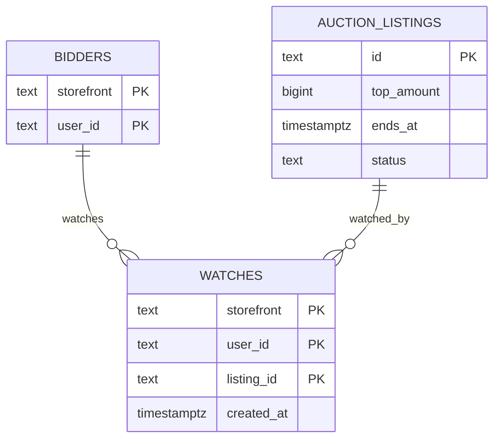
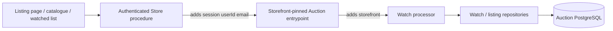

## Context

- See [proposal.md](proposal.md) for the collector problem.
- See
  [`grade10-site/auction/watchlist`](specs/grade10-site/auction/watchlist/spec.md)
  for the observable contract.
- **Listing** is the domain entity — tables, processors, contracts, and
  every function name in this design. **Lot** is only the collector-facing
  label for a listing (`listingLabel` on the wire, rendered through copy
  such as `lotLabel`). There is no separate lot entity and no `*Lot*`
  processor.
- Auction listings are shared across Grade10 and ZZZ. Bidder identity is
  `(storefront, user_id)`. Each storefront backend is the identity oracle;
  the named Auction entrypoint pins storefront.
- `watches` already exists in schema `auction`, keyed
  `(storefront, user_id, listing_id)`. `watchListing`, `unwatchListing`,
  `readWatch`, and `listMyWatches` already hang off those rows.
- `placeBid` currently inserts a watch in the same listing-lock
  transaction as the bid, so "watched it or bid on it" is one predicate
  for ending-soon mail.
- `ListingLotHeader` already ships watch and unwatch. This
  change fills those props; it does not add an export. The export name
  keeps "Lot" because that block shows the listing's label.
- Screens and Storybook sources belong in [ui-design.md](ui-design.md).

## Goals / Non-Goals

**Goals:**

- Keep one watch row per collector per listing, keyed like `bidders`.
- Stop coupling watching to bidding so unwatch can remove list membership
  (and clear that row's alerts) without ending bidder mail.
- Serve the watched list from `watches` joined to listing facts at read
  time, keyset-paged, newest first.
- Keep watch writes out of the money lock except where they already
  share a transaction today — they will not, after `placeBid` stops
  inserting.

**Non-Goals:**

- A second watch table per brand.
- Browser-local watches or sign-in migration of a local heart.
- Sorting, filtering, or searching beyond recency.
- Sending mail or mute fanout rules. `add-auction-notifications` owns
  `email_alerts` semantics and account master; this change sets alerts
  on at watch and deletes the row (alerts with it) on unwatch.
- A shared `@grade10/ui` catalogue-tile control.

## Decisions

### Reuse `watches`, keyed like `bidders`

- Primary key stays `(storefront, user_id, listing_id)`. Watched At is
  `created_at`. The same user id on two brands is two collectors.
- Alternatives rejected:
  - Key only by `(user_id, listing_id)` — user ids are per-brand;
    colliding strings would merge two people.
  - Store watches beside the collector in each brand's auth database —
    listings are shared, so an operator count would assemble across two
    systems.

### Repeat watch is `ON CONFLICT DO NOTHING`; unwatch is a delete

- A second insert does not change `created_at`. There is no `source`
  column.
- Alternatives rejected:
  - Refresh `created_at` on a repeat watch — it would reorder the list
    for an action the collector did not perceive as an action.
  - Soft-delete and revive — a revived row would need a new Watched At
    anyway, and unwatch is specified as removal.

### `placeBid` / `placeCommitment` stop writing `watches`

- List membership stays on `watches`. Bid standing stays on `bids`.
  Unwatch deletes the watch row (alerts go with it) and does not touch
  the bid; mute without unwatch is `email_alerts = false` owned by
  `add-auction-notifications`.
- Existing rows written by an earlier bid remain; new bids do not
  create one.
- Alternatives rejected:
  - Keep auto-watch on bid and add a `source` column — a second kind of
    watch is a second product.
  - Convert a bid into a watch at read time — unwatch could not delete
    a row that does not exist, and the watched list would include every
    bidder whether they meant to follow the listing.
  - Delete the watch row to mute mail — that removes Watching; mute is
    a preference flag, not unwatch.

### Current bid, close, and sale state are not stored on the watch

- `listMyWatches` joins `auction_listings` for `top_amount`, `ends_at`,
  and `status` at read time.
- Alternatives rejected:
  - Copying those columns onto `watches` duplicates listing facts and
    requires a write on every bid just to keep a list fresh.

### The catalogue control stays application-owned

- The listing page fills `ListingLotHeader`'s existing watch control. The
  catalogue tile's control is built in each application.
- Alternatives rejected:
  - Adding a watch control to the shared auction tile now — a second
    consumer is what justifies promoting it.

## Database Schema

### Storage rules

- Schema `auction`. Table `watches` already exists. No new table from
  this change.
- `email_alerts` and notify-ladder stamps on this row belong to
  `add-auction-notifications`. This change inserts with alerts on
  (column default `true`) and deletes the whole row on unwatch; it
  does not implement mute.

### Existing `auction.watches`

| Column | Type | Null | Default | Role in this change |
| --- | --- | --- | --- | --- |
| `storefront` | `text` | no | — | First identity key; PK; FK to `bidders`. |
| `user_id` | `text` | no | — | Second identity key; PK; FK to `bidders`. |
| `listing_id` | `text` | no | — | PK; FK to `auction_listings.id`. |
| `created_at` | `timestamptz(3)` | no | `now()` | Watched At. A repeat insert does not change it. |
| `ending_soon_notified_at` | `timestamptz(3)` | yes | `NULL` | One-hour reminder stamp; untouched here. |
| `push_notified_at` | `timestamptz(3)` | yes | `NULL` | Untouched here. |
| `notify_attempts` | `integer` | no | `0` | Untouched here. |
| `notify_next_attempt_at` | `timestamptz(3)` | no | `now()` | Untouched here. |
| `notify_parked_at` | `timestamptz(3)` | yes | `NULL` | Untouched here. |
| `notify_parked_reason` | `text` | yes | `NULL` | Untouched here. |

Primary key `(storefront, user_id, listing_id)`. Foreign key to
`bidders (storefront, user_id)`. Restrictive listing FK.

Authoritative: the row's existence is the watch. Derived at read:
current bid, close, sale state.

### Additive index

`listMyWatches` is newest-first by `created_at` with a listing-id
tiebreak. The primary key leads `(storefront, user_id)` but cannot
start that ordered scan.

| Index | On | Partial |
| --- | --- | --- |
| `idx_watches_storefront_user_id_created_at_listing_id` | `(storefront, user_id, created_at DESC, listing_id DESC)` | no |

### Entity relationships



## Service Interfaces

### Processing model

- Entrypoints adapt transport and identity. Watch writes do not take
  the listing money lock: a watch confers no standing.
- `watchListing` may upsert a bare `bidders` row (email snapshot) so
  the watch FK holds. That is the same path watching uses today.
- Repositories own SQL. Services own idempotency (`ON CONFLICT DO
  NOTHING`, delete-if-present).

| Processor | Reads | Writes |
| --- | --- | --- |
| `watchListing` | listing existence, bidder, existing watch | `bidders` upsert if needed; `watches` insert ignore |
| `unwatchListing` | none required | `watches` delete |
| `readWatch` | `watches` PK | none |
| `listMyWatches` | `watches` page + `auction_listings` (+ position-1 media if the surface already joins it) | none |
| `countListingWatches` | `watches` grouped by `listing_id` | none |



`placeCommitment` / `placeBid` is **not** on this diagram. After this
change it no longer calls the watch writer.

### Shared processor types

```ts
type BidderRef = {
  storefront: string;
  userId: string;
};

type WatchWriteInput = {
  bidder: BidderRef;
  listingId: string;
  email: string;
  name?: string;
};

type WatchWriteOutput =
  | {
      success: true;
      data: { watching: boolean; emailAlerts?: boolean };
    }
  | {
      success: false;
      error: string;
      errorCode: "LISTING_NOT_FOUND" | "BANNED" | "BIDDER_DELETED";
    };

type ListMyWatchesInput = {
  bidder: BidderRef;
  cursor: string | null;
  limit: number;
};

type MyWatch = {
  listingId: string;
  title: string;
  status: "draft" | "canceled" | "published" | "closed" | "settled";
  topAmountMinor: number;
  endsAt: Date;
  watchingSince: Date;
};

type WatchPageOutput =
  | { success: true; data: { items: MyWatch[]; cursor: string | null } }
  | { success: false; error: string; errorCode: "INVALID_CURSOR" };
```

- Transport defaults `limit` to `20` and refuses values outside `1..100`
  before calling the service, same as today's `AUCTION_PAGE_LIMIT_*`.
- `status` maps listing `published` to the open sale state the spec
  names; `closed` / `settled` as closed; `canceled` as called off.
- Currency for `topAmountMinor` is the listing's; the existing list
  payload already sits next to listing identity the client loaded.

### `watchListing`

```ts
function watchListing(
  db: AuctionDb,
  clock: Clock,
  input: WatchWriteInput,
): Promise<WatchWriteOutput>;
```

Mutation steps:

1. Load the listing. Refuse `LISTING_NOT_FOUND` when it is absent.
   Watching a closed or called-off listing is allowed.
2. Upsert `bidders` for `(storefront, user_id)` with the email
   snapshot when no row exists. Refuse `BANNED` / `BIDDER_DELETED`.
3. `INSERT … ON CONFLICT (storefront, user_id, listing_id) DO NOTHING`.
4. Return `{ watching: true, emailAlerts: true }` on insert. A conflict
   is success with the original `created_at` and the row's current
   `email_alerts`.

The processor never:

- takes the listing money lock;
- writes `bids` or `payment_holds`;
- changes `created_at` on conflict;
- sends mail;
- mutes without deleting — mute is `add-auction-notifications`.

### `unwatchListing`

```ts
function unwatchListing(
  db: AuctionDb,
  input: { bidder: BidderRef; listingId: string },
): Promise<{ success: true; data: { watching: false; emailAlerts: false } }>;
```

Delete the PK if present. Return `{ watching: false, emailAlerts: false }`
whether a row was deleted or not. Closed and called-off listings unwatch
the same way. Deleting the row clears alerts; do not leave a muted
orphan watch.

### `listMyWatches`

```ts
function listMyWatches(
  db: AuctionDb,
  input: ListMyWatchesInput,
): Promise<WatchPageOutput>;
```

- Seek `idx_watches_storefront_user_id_created_at_listing_id`.
- Join `auction_listings` only for the returned page.
- Order `(created_at DESC, listing_id DESC)`.
- Cursor carries that sort. A cursor from another account is
  `INVALID_CURSOR`.
- Empty result is a successful empty page, not an error.
- Performs no writes.

### `countListingWatches`

```ts
function countListingWatches(
  db: AuctionDb,
  listingId: string,
): Promise<{ listingId: string; watchCount: number }>;
```

`count(*)` on `watches` for that `listing_id` across both storefronts.
Admin-only. Not a public listing field.

### Storefront RPC data flow

Browser watch body:

```json
{ "listingId": "listing_42" }
```

Store adds session identity; `Grade10AuctionService` adds
`storefront = 'grade10'`:

```json
{
  "listingId": "listing_42",
  "storefront": "grade10",
  "userId": "user_17",
  "email": "a@example.com"
}
```

`ZzzAuctionService` pins `zzz`. The browser cannot override either
identity value.

### Wire changes

Watch write/read RPCs already exist. Public listing facts stay
watch-free.

`MyWatch` is missing the current bid the spec requires. Additive:

| Field | Type | Null |
| --- | --- | --- |
| `topAmountMinor` | `int` | no |

Same integer minor units as `publicListingSummary.topAmount`.

Authenticated listing facts already carry `watching` through
`readWatch`; this change does not add a public field.

Admin listing detail gains `watchCount: int` (across both
storefronts). Additive admin read.

## Risks / Trade-offs

- **[The control repeats the removed wishlist's mistake — a heart that
  saves nothing]** → Persistence, the list, and the control land in
  this one change.
- **[Stopping auto-watch on bid drops bidders from ending-soon mail]**
  → Progress mail with alerts on reads `watches`; bidder mail reads
  `bids` (`add-auction-notifications`). The shipped one-hour ending-soon
  list stays watch-row only; bidders who never watched stop receiving it.
  Mute without unwatch is the alerts flag, not watch delete.
- **[An unbounded watched list grows slow to read]** → The new index;
  the list is already keyset-paged.
- **[Watch writes race a deletion sweep]** → The bidder FK and
  `BIDDER_DELETED` refusal stay; a deleted collector cannot insert.

## Migration Plan

1. Additive migration: create
   `idx_watches_storefront_user_id_created_at_listing_id`. No backfill.
2. Deploy the worker that stops `placeBid` / `placeCommitment` from
   inserting a watch, together with the `MyWatch.topAmountMinor`
   contract and the admin `watchCount` read.
3. Existing watches, including those written by an earlier bid, stay.
4. Rollback keeps the index. Restoring auto-watch on bid would
   re-couple enrolment; do not do that from a rollback.

## Open Questions

Answerable later without changing the specs, the approach, or the
tasks.

- Whether the watched list is reachable from the header or only from
  the account area. Placement, not behaviour.
- How many entries a page of the watched list holds. Bounds already
  live on `AUCTION_PAGE_LIMIT_*`.
- Whether an operator's watch count appears on the listings table or
  only on a listing's own admin page.
