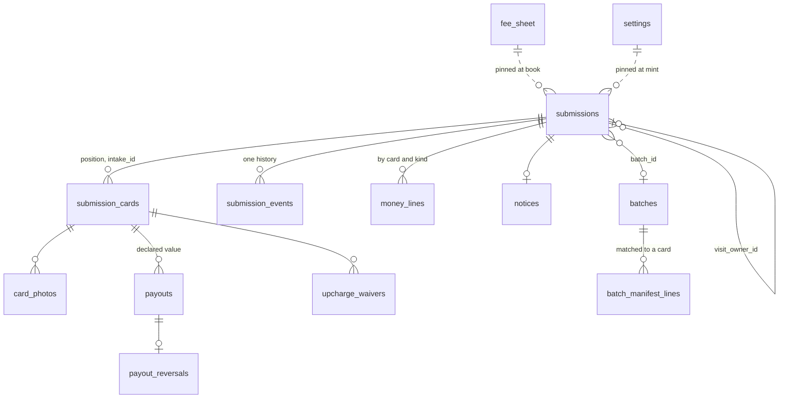

## Context

See [proposal.md](proposal.md#why) for the motivation and [decisions.md](decisions.md)
for what the interview settled; the journeys are beside each capability under
`specs/`. Every path below is the application repository's unless it says
`grade10-spec`. The seams were read off the vault, which this product mirrors
file for file where it has the concern.

- **Nothing exists** — no package, no worker, no route, no `grading` service
  id; a new product is four packages, one worker app and the registry edits
  § Migration Plan lists, and the packages are the easy part
- **The vault is the model** — `packages/vault/backend` on `createServiceApp`,
  `cases/transitions.ts` the only writer of a status, `lock.ts` the per-case
  `SELECT … FOR UPDATE`, `sweeps/pass.ts` over `@grade10/postgres/sweeps` on
  two crons with `claimRow` under every per-row list, `notifyQuietly` and
  `notification_retries`, `createAuditLogsTable` hash-chained, doc-sign's six
  tables from `createDocSignTables(vaultSchema)`, the booking cache and
  `booking/bind.ts` calling the diary outside every transaction,
  `erasure/eraseUser.ts` with named holds, a portable suite
- **The sibling change** — `complete-vault-collector-flow` lands first and
  creates what this change consumes as it wrote them: `BaseLayout` and
  `renderProductEmail` in `@grade10/email/render`, the dev outbox in
  `@grade10/worker` beside `devOnly`, and `packages/storybook`
  (`@grade10/storybook`). Two helpers it keeps in the vault's own files —
  `caseReference(random)` in `cases/reference.ts` and `printedValue` in
  `legal/printed.ts` — this change lifts into shared homes in one commit
  with the vault's call sites, no re-export left behind
- **The diary** — `APPOINTMENT_PRODUCTS = ["vault"]` in
  `packages/appointment/contracts/src/schemas.ts`. `0009_cloudy_killraven.sql`
  dropped `ck_bookings_product` and `ck_services_product`, so the entrypoint is
  the guard and `ck_services_product_bound` — a product-bound service is never
  customer-bookable — is the one CHECK left; the head is `0011_unusual_stick.sql`.
  `createAppointmentServiceEntrypoint(product)` mints the entrypoint; `book`,
  `reschedule`, `cancel`, `getBooking` and `markOutcome` key on
  `(product, caseRef)`, and `rescheduleInputSchema` is
  `{ caseRef, locationId, slotStart }`. Services are operator rows minted
  `svc_<uuid>` by `services.create` under `appointment:manage`
- **The till** — the store keeps a paid order's `orders.order_name`, a bare
  nullable `text` with no index; lines arrive from the provider as
  `PaymentOrderLine { ref, subtotalMinor, variantId, productType, … }`, the
  first three nullable and **no `quantity`**. `packages/app-env/src/store.ts`
  already lists `Grading Service` in `excludeProductTypes`. Money facts fan out
  from `order_events` to `OrderEventConsumer`s; the store exports no named
  entrypoint another product can read an order through
- **doc-sign** — `DocSignDeps.kyc` answering null makes `ceremony/refusals.ts`
  refuse `KYC_REQUIRED`. `TemplateLayout` is `{ id, pageCount, signatureFields }`,
  resolved in `ceremony/capture.ts` through `templateLayout(deps.templates,
  row.templateId)` before `deps.kyc.read`; `appendAudit` is the only host port
  inside the sealing transaction. The site's `di/container.ts` installs one
  `FetchCeremonyClient` at the vault's `/api/sign` through
  `createDocSignCoreModule({ ceremonyClient })`; `docSignModules` binds once,
  and `frontend-di` has one container with no nested provider
- **The card price reference** — `@grade10/inventory-contracts` mints one
  narrowing per consumer (`getVaultInventoryService`); the token and the cache
  stay in the inventory worker
- **Console blocks** live in `packages/frontend-console`; the store's
  `packages/ui` holds collector-facing blocks with stories the manual embeds
- **Retention** — `RETENTION_CLASSES = ["agreements", "identity", "photos"]`
  in `packages/app-env/src/retention.ts`, the kinds of personal data a product
  keeps past a case's end; `ERASURE_LANES = [...APPOINTMENT_PRODUCTS, "direct"]`
  and `check-erasure-consumers.mjs` reads a hand-written `ids` list

## Goals / Non-Goals

**Goals:**

- One writer of the status, ten statuses, a batch act moving every submission
  in the batch in one transaction
- Every exception a fact on a card row; every badge, running late, storage
  due, the batch's state and the safe's total derived at the read by pure
  functions in the contracts package that both SPAs and the worker call
- Every default a row in `settings` or `fee_sheet`, pinned onto the
  submission at booking and at signing as JSON; a missing setting stops the
  read loudly
- Money as integer HKD minor, one till line to one card, every write keyed so
  a repeat is a no-op, every payout and waiver a record whose second approver
  the database refuses to equal the recorder
- The ceremony instantiated into the grading database and hosted on the
  grading worker; the host contract gains an explicit no-identity option
- Every sweep row claimed under `claimRow`, its event the key a repeat reads

**Non-Goals:**

- Grading tables or a grading tier on the vault worker
- A POS extension panel, online payment, or a store-side write into grading
- A `late`, `held` or `upcharge` status; a `derived_status` column; a stored
  batch state
- Reading the grader's order status by API; disposal after the notice;
  CGC's and BGS's sheets; shipping slabs back
- A per-shop safe counter; one shop today, and § Risks names the seam

## Decisions

### Four packages, one worker, its own database

- `packages/grading/{contracts,backend,frontend,admin-frontend}` with the
  vault's exports maps: contracts `.`; backend `.`, `./schema`,
  `./router-type`, `./worker`, `./worker/secrets`, `./testing`; frontend one
  subpath per slice plus `./modules`, `./core`, `./core/testing`;
  admin-frontend the same plus `./testing`
- `apps/backend/grade10/grading` — `grade10-grading-service`, port 4450,
  inspector 9244, crons `*/15 * * * *` and `0 * * * *`, Hyperdrive to
  `grade10_grading`, buckets `ITEM_PHOTOS`, `DOCUMENTS`, `DOCUMENTS_ARCHIVE`,
  bindings `AUTH_SERVICE`, `APPOINTMENT_SERVICE` → `GradingAppointmentService`,
  `INVENTORY_SERVICE` → `GradingInventoryService`, `STORE_SERVICE` →
  `GradingStoreService`; no `KYC_SERVICE`. Its own Neon project,
  `stg-` and `prd-grade10-grading`, pg schema `grading`
- Alternatives rejected: sharing the vault's database — two products' holds
  and retention clocks in one schema, a vault migration lock over grading's
  counter; a `KYC_SERVICE` binding for the ID glance — it keeps nothing, so
  there is no record to bind

### The reference, the intake ids and the pickup code, drawn outside the transaction

This change lifts the vault's `caseReference(random)` to
`packages/utils/src/reference.ts` as `SHORT_REFERENCE_ALPHABET` and
`shortReference(random)`, moving the vault's call sites in the same commit;
both products call it.

- `submissions.reference text NOT NULL UNIQUE`, CHECK `^[2-9A-HJKMNP-Z]{6}$`,
  issued on the insert in `submissions/plan.ts` beside the `gs_` id; the
  canvas's `5TW8HN`
- **A unique violation never runs inside an open transaction.** The first
  `23505` aborts it and every later statement answers `25P02`, so
  `mintPosHandle`'s shape holds for every draw — an independent insert per
  attempt guarded by `isUniqueViolation`, thrown by name after eight. The
  reference row is inserted before `savePlan`'s transaction opens; the pickup
  code redrawn inside `finishReceiving` takes a nested `tx.transaction()` per
  attempt; `scanCard`'s `CERT_HELD_ELSEWHERE` is a read under the submission
  lock before the insert; the open batch is created
  `ON CONFLICT DO NOTHING … RETURNING` and re-read
- **Intake ids** `<reference>-<n>`, `n` the card's position, written to
  `submission_cards.intake_id` at hand-in, unique across the table: the
  grader's manifest names them, so they are never reissued
- **The pickup code** is four digits, unique among submissions currently
  `ready` through a partial unique index; ten thousand codes against a shop's
  dozens ready
- Alternative rejected: the code as the reference's last four — a collector
  who forwarded the ready mail holds both; a drawn code is in one mail only

### One writer, ten statuses, and a batch act is one transaction

`submissions/transitions.ts` is the table, as `cases/transitions.ts` is:
`UPDATE … WHERE status IN (from…) RETURNING`, the `submission_events` row in
the same transaction, zero rows a named `SUBMISSION_CONFLICT`.

| Move | From → to | Called by |
| --- | --- | --- |
| `book` | `planned → booked` | the collector's booking, after the diary answered |
| `cancel` | `planned, booked → cancelled` | the collector or the counter; the visit cancelled first |
| `expire` | `planned → expired` | the plan-expiry sweep |
| `expireBooked` | `booked → expired` | the booked-expiry sweep, `booked_expiry_days` after the visit |
| `handIn` | `planned, booked → checked_in` | the counter, guarded on a sealed agreement and paid fee lines |
| `markShipped` | `checked_in → sent` | the batch's ship act, every submission in it |
| `recordGrades` | `sent → graded` | `recordBatchStage` on the stage flagged as the move |
| `receive` | `graded → returned` | the batch's receive-at-shop act |
| `finishReceiving` | `returned → ready` | the batch's finish, every submission at once |
| `collect` | `ready → collected` | the counter, after the hand-back packet seals |

- `sent`, `graded` and `returned` are stored: the round refused deriving
  them, and a page reads one row. `batches/acts.ts` moves every submission
  in one transaction under `lockBatch`, then each submission's lock in id
  order, so two operators finishing one batch serialise
- **The walk-in has no booking to bind.** Every diary method keys on
  `(product, caseRef)` and a walk-in's customer-bookable visit carries
  `product: null`, so grading can never read it: the counter creates the
  submission at the desk through `admin.savePlan`, the same service as the
  collector's, and hands in from `planned`, `pinned_fee_sheet` pinned at
  `deskPlan` with the list
- **Grades in** — `admin.recordBatchStage({ batchId, stage })` over a closed
  `GraderStage` set, one member flagged as the move: under `lockBatch`,
  `grader_stage` set, `recordGrades` per submission in id order, one event
  each, the letters after commit. The same stage twice is a no-op because its
  event already names it, and a re-estimate to the same date the same way
- **Running late**, the queue badges, the chip and the rail are
  `submissionStanding(input, asOf, timeZone)` in
  `packages/grading/contracts/src/standing.ts` over a declared
  `SubmissionStandingInput` the list row also carries, tested as a table — as
  `caseStanding` is
- **Each hand-back closes on its own.** `collect` on a sealed receipt stamps
  every card the receipt printed, bar one still `held`, with its packet
  (`submission_cards.handed_back_packet_id`, `handed_back_at`) and writes
  `handed_back { packetId }`. It moves `ready → collected` only once no card
  is left unstamped, writing `collected { packetId }` instead. It accepts only
  the newest sealed hand-back receipt, and a retry on a packet its stamps
  already name answers what ran. The lock comes before every read, the
  retry's included
- Alternatives rejected: a status per exception — Q3's own rejection, the
  card's `outcome` is the closed set; deriving the three from the batch — a
  card withdrawn or held would need a rule per join, and the queue's cut
  a join on every row

### The diary: three catalogue entries, the vault's bind, one shared visit

- `grading` joins `APPOINTMENT_PRODUCTS`, which with
  `createAppointmentServiceEntrypoint("grading")` is the whole diary delta.
  **No appointment migration**: the two product-bound drop-off services (about
  20 minutes, and the Bulk variant at about 45) and the customer-bookable
  Grading visit are created by a readiness-list console act, `services.create`,
  their ids read back and never asserted; the e2e specs book a named fixture
- **Order and fallback** — the spec word lands first: `grading` joins the
  `Product` row of `shared/appointment/scheduling` in
  `add-multi-store-appointments`'s delta (Q19), and the code ships after it
  is on main. If that change archives first, this change carries the
  one-word delta on the then-durable capability
- `booking/bind.ts` is the vault's: `bookVisit`, `rescheduleVisit`,
  `cancelVisit` call `APPOINTMENT_SERVICE` outside every transaction, then
  `withSubmissionLock` writes the cache (`booking_ref`, `service_id`,
  `appointment_at`, `location_id`, all-or-none), then `tellCustomerFor`;
  `dropoffServiceFor(cards)` picks Bulk at 20 cards or more
- **One visit, resolved through one column** — `submissions.visit_owner_id`
  names the submission whose booking it is, and one resolver in
  `repositories/submissions.ts` reads the visit through it for every
  predicate, index and read, so no call site forks. A joiner holds no cache:
  the diary keys on `(product, caseRef)` and only the owner's ref names the
  booking, so a copy is a fact `getBooking`, the repair lists and `cancel`
  could never maintain
- **Upsizing at Bulk is one diary call** — `rescheduleInputSchema` gains an
  optional `serviceId`, additive, slot sizing staying the diary's; a join that
  takes the two lists past 20 reschedules the owner's visit to the Bulk
  service at the same slot. No cancel-then-book, which can leave a collector
  with no visit at all. The diary's own refusals reach the page —
  `SLOT_NOT_OFFERED`, `SLOT_FULL`, `RESOURCE_NOT_AVAILABLE`,
  `ALREADY_BOOKED` — and each offers a move
- **The owner's cancel or missed visit detaches every joiner** in the same
  commit, each with its own `dropoff_detached` event and letter, the joiner
  back to `booked` with no visit, which the page reads as book again
- **The missed visit is told, not read** — `BOOKING_STATUSES` holds no
  `absent` and an operator close of a product booking is refused
  `PRODUCT_BOOKING`, so `missedVisits` calls
  `markOutcome(caseRef, "no_show", bookingRef)` after the grace, as
  `sweepNoShows` does, and only then clears the cache and writes
  `dropoff_missed` in one commit; a refused telling leaves the row due
- The drop-off booked letter attaches `buildCalendarFile`'s file, served at
  `GET /api/submissions/:id/visit.ics` — as `complete-vault-collector-flow`
  decides
- Alternatives rejected: a second booking for the joiner — a case holds one
  live booking; the four cache columns copied onto the joiner — four facts
  nothing can keep true; a `visits` table — one column already names the owner

### The till: one line to one card, read back by the order's name

The spec governs which lines exist and that nothing is handed in unpaid;
this is how the paid order reaches the submission.

- The grading products are Shopify products of product type
  `Grading Service`: one per fee-sheet row plus cover, upcharge and storage;
  their variant ids are data, `fee_sheet.pos_variant_id` and the settings
  `pos_cover_variant`, `pos_upcharge_variant`, `pos_storage_variant`. The
  loyalty exclusion is the product type already listed; no new rule
- `GradingStoreServiceApi.orderByName(name)` — a new entrypoint on the store
  worker — answers `{ orderRef, orderName, paidAt, lines }` with the
  provider's lines verbatim (`ref`, `variantId`, `subtotalMinor`,
  `productType`, each as the provider states it), or refuses
  `ORDER_NOT_FOUND`, `ORDER_AMBIGUOUS` or `ORDER_NOT_PAID` by name;
  `orders.order_name` is nullable and unindexed today, so the entrypoint is
  minted with its index
- **One store line to one card, in `position` order** (Q16). `recordFeePaid`
  refuses `POS_LINES_MISMATCH` with the gap when the count of fee-variant
  lines is not the count of cards owing a fee, when a `subtotalMinor` is not
  the pinned fee, when it is a multiple of it — the till rang quantity 4 on
  one line — or when it is null; one cover line per covered card at the cover
  figure, the same way. `PaymentOrderLine` carries no `quantity`, so nothing
  is divided
- **The write is keyed on what the run owns.** `money_lines` is unique on
  `(submission_id, card_id, kind, pos_order_ref)` and written
  `ON CONFLICT DO NOTHING`, so a `recordFeePaid` retried after a timeout is a
  no-op and answers the lines already written. `pos_line_ref` is a recorded
  fact, nullable, never the key: Postgres treats nulls as distinct
- The upcharge, storage and refund lines are the same read; `recordRefund`
  names the card and the line it refunds. `handIn` is guarded on every card
  carrying a paid fee line
- **`recordSettlement`** takes what is due at `ready` the way
  `recordFeePaid` takes the fee. The order is read before the transaction
  and claimed in `pos_orders`, so a repeat writes nothing. Under the lock,
  its `pos_upcharge_variant` and `pos_storage_variant` lines are matched one
  to a card, in `position` order, against each card still owing that kind.
  A line above its card's due refuses `LINE_ABOVE_DUE`, so settled never
  passes accrued on a card. It writes a `paid` event and voids the open
  hand-back receipt
- Alternatives rejected: grading as an `OrderEventConsumer` of the store's
  queue — the queue carries no submission reference, so grading could only
  park unmatched lines for staff to match; a POS extension panel stamping the
  reference — store and extension work outside this change; recognising lines
  by SKU prefix — the store hands a variant id

### Documents: two templates, the no-identity option, the routed client

- `documents/templates/{submissionAgreement,handBackReceipt}.ts` as
  `GradingTemplate`s over `GradingTemplateId` in contracts, one packet per
  document; `intakeReceipt.ts` renders through the same page helpers into the
  documents area with its sha256, issued, never a packet. Every figure prints
  from `pinned_fee_sheet` and `pinned_terms`, never a live table
- **The option is on the template** (Q15) — `TemplateLayout` gains
  `identity: "required" | "not_required"`, no default, so every vault template
  says `required` and one that forgets fails to compile. The change to
  `ceremony/capture.ts` is one branch on the layout it already resolves before
  `deps.kyc.read`: a `not_required` packet skips the read, the refusal chain
  skips `KYC_REQUIRED` and the name rung, and the certificate prints its
  no-identity line. Grading's `DocSignDeps.kyc` throws by name if ever read
- **The custodian** — ❓ Legal, through the PM: grading's submission agreement
  prints the brand's one `LEGAL_IDENTITY.grade10.legalName`, the table being
  per brand and never per product, unless Legal has registered a second entity
  for grading. Recommended as stated; a per-product field is owed only if the
  answer names a different company
- The ceremony mounts at `${config.services.grading}/api/sign` through
  `registerSigningRoutes`; `routes/signing.ts`, `documents/deps.ts`,
  `storage/areas.ts` and the two guard migrations are the vault's files in
  the grading schema
- **The SPA's client routes by host** — `createDocSignCoreModule` takes
  `ceremonyClients: Record<Host, CeremonyClient>` and binds `CeremonyClient`
  to a `RoutedCeremonyClient`. The key is the service id the container already
  resolves `config.services.<id>` by, `"vault" | "grading"`, supplied by the
  caller and generic inside `@grade10/doc-sign-frontend`, which depends on no
  app-env. `CeremonyFlow` takes `host` once at mount and doc-sign's own React
  context carries it to the use cases, so no `CeremonyClient` method gains a
  parameter and the fixtures are unchanged. One container, one module list;
  `pages/grading/SignPage.tsx` is the vault's file with grading's
  `RefusalWords` over `grading.ceremony`
- **Nothing is printed unrendered** — an act renders its letter and its
  document before its transaction opens, and `printedValue` — the vault's
  `legal/printed.ts` lifted to `packages/app-env/src/printed.ts` by this
  change — throws by name, so no map of what each letter prints is kept in
  step by hand
- **The withdrawal receipt** — `withdrawalReceipt.ts`, issued, printing the
  card, the fee refunded and the day under clauses of its own. The
  withdrawal runs in `handInWithReceipt`'s shape: the entity, the refunds and
  the receipt are read, rendered and stored first, then one transaction
  locks the batch and the submission, writes the outcome with the receipt's
  key and digest, the refunds, the event and the letter, and refuses where
  the printed data it rebuilds differs. Its key is claimed by the documents
  area's sweep, and it is listed and answered by digest as `issued`
- **A copy is carried per document** — by the event of the letter that
  attached it: `checked_in` for the agreement and the intake receipt,
  `handed_back` or `collected` naming the receipt's packet, and
  `card_withdrawn` naming the card
- **A second receipt prints only its own cards** — the cards no receipt has
  stamped, the money recorded since the first hand-back's figure was fixed,
  and one line naming the first receipt by its day and fingerprint
- Alternatives rejected: the vault worker hosting grading's ceremony — the
  seal on the wrong chain; `kyc: null` as the option — a null port and a
  missing binding look the same; the option on `DocSignDeps` — a host-wide
  flag cannot express a no-identity packet beside identity-bearing ones; a
  client whose base URL is read off `window.location` — not deterministic

### The card price reference is a read over the inventory binding

- `GradingInventoryService` on the inventory worker, `GradingInventoryServiceApi`
  in `@grade10/inventory-contracts`: `matchCards(lines)` answering per line
  a product id with title and reference sales, or `unmatched`, or
  `unavailable`; `referenceSales(productIds)` for the card block
- `submissions.paste` calls it once outside any transaction. **A fault is
  never silence**: every line answers `unavailable`, distinct from
  `unmatched`, the count and the provider's error are logged by name and the
  degrade written as a `reference_unavailable` event, so a day of unmatched
  pastes is visible and a level chosen on the declared value alone is
  traceable. The product id lands on
  `submission_cards.reference_product_id`; sales are re-read, never stored
- Alternatives rejected: grading caching prices — the inventory's one cache
  row per reference is the authority; splitting the sales out of the match —
  a second remote call on a step kept to one

### Money: pinned at booking and signing, derived at the read, two people on a record

- `pinned_fee_sheet jsonb` is the grader's active `fee_sheet` rows, keyed by
  level, copied at `book` in one read; `pinned_terms jsonb` copies `storage_fee_per_card_month`, `storage_from_day`,
  `settlement_days`, `notice_day`, `reminder_days` and `id_glance_threshold`
  at the agreement's mint. A later change reaches only rows not yet booked,
  by construction
- `packages/grading/contracts/src/money.ts`: `coverLine(declaredMinor, coverBps)`
  half-up to the cent, `upchargeOf(sheet, from, to)`,
  `storageDue(readyAt, cardsHeld, asOf, terms)` counting months started since
  `storage_from_day` on `Asia/Hong_Kong` days, and `dueNow(input, asOf)` over
  a declared `DueNowInput`. **One settlement rule for every kind**: accrued
  less the settled `money_lines` rows of that kind less the waivers, upcharge
  and storage alike, so a storage fee rung at the till clears and `collect`
  can pass. The expected upcharge is `upchargeOf(pinned_fee_sheet, level,
  submission_cards.moved_to_level)` per card, stored nowhere
- **Currency is named beside every amount that is not HKD.**
  `invoice_total_minor` carries `invoice_currency` and `cover_figure_minor`
  carries `cover_currency`; `shipBatch` compares the declared total to the
  cover figure only inside one currency, refusing `OVER_COVER` above it and
  `CURRENCY_MISMATCH` otherwise. No rate is stored; the conversion stays
  Operations'
- **A payout** is `payouts` — declared value, the fee refund line beside it,
  `route` till or transfer, `recorded_by`, `approved_by`; a reversal is one
  `payout_reversals` row keyed `payout_id PK`, the vault's `money_adjustments`
  guard with one fewer nullable column; **a waiver** is `upcharge_waivers`
  with the same two approver columns. Both carry a plain index on `card_id`
  and never a unique, because whether a row is live is decided by another
  table no constraint here can see, so `PAYOUT_EXISTS` guards on the netted
  read under the submission lock. All append-only
- **The four-eyes rule is rendered once** — an inline drizzle helper in
  grading's schema module, naming each table's recorder column, armed on
  `payouts`, `payout_reversals`, `upcharge_waivers`, `settings` and
  `fee_sheet`, so no table carrying the two columns is left unguarded
- **The safe's total** is one query at the read: declared values of cards in
  `checked_in`, `returned` and `ready` submissions whose outcome is not an
  exception taking them out of the safe. The cap is one row, and every
  `handIn` takes `safe_declared_cap` `FOR UPDATE` before it counts: the batch
  lock is not the cap's scope, advisory locks are out over Hyperdrive, so the
  row is the serializer
- **Storage and the upcharge are per card.** Each card accrues storage from
  the storage day until its hand-back's figure was fixed, while the shop
  holds it or it waits to go into a vault case. Each card's line is settled
  against that card's own lines and waivers, and reports what was applied
  and a `creditMinor` apart, so accrued less settled less waived is its due
- **The mint fixes what is due** — `mintHandBack` writes
  `hand_back_prepared { packetId, cards }`, a submission event, and `collect`
  judges what is due as of that instant against the cards the receipt
  printed
- Alternatives rejected: storage accrued by a sweep as a line per month — a
  row per month per card for a figure one fold answers; live settings on a
  booked submission — Q43's rejection; freezing `dueNow` at the till — it
  contradicts deriving it

### Every default is a row, and a missing one stops the read

- `settings (key, value jsonb, updated_by, approved_by, updated_at)`;
  `fee_sheet` one row per grader and level, PSA's five rows present, CGC's and
  BGS's levels `active = false` with null figures. `settings/read.ts` parses
  every key through its schema and throws `SETTING_UNSET` naming the key —
  never a default in code
- **The seed writes no money.** `0003_seed_settings.sql` seeds the clocks and
  the non-money defaults only; every money key and every fee-sheet figure
  stays unset in every environment, so `SETTING_UNSET` holds until its owner
  writes it through `updateSetting` with a second approver, which is the
  record of who confirmed it (Q48). The isolated stack's example figures are
  seeded once at start by `POST /dev/settings`
- `admin.updateSetting` under `grading:approve`; a money key takes
  `approvedBy` who is not the caller; the audit subject is `settings`
- Alternative rejected: a `decisionTable` in `packages/app-env` — a deploy
  per confirmation, Q8's rejection; the diary services stay the diary's rows

### Sweeps: the vault's pass, every row claimed, every list budgeted

`sweeps/pass.ts` over `createSweepPass`, `WORK_LISTS` laned and ordered, the
order pinned by a test. Every row carries its own `kind` and an explicit
`limit` (`DEFAULT_LIMIT` where nothing narrower applies), because
`createSweepPass` fires `<product>.sweep.repair` only for `kind: "repair"`.

| List | Predicate | Writes | Kind · Lane |
| --- | --- | --- | --- |
| `retriedNotifications` | `notification_retries` due | the send, or the row leased for a further attempt | repair · fast |
| `dueLetters` | one registry row, one shared budget, over four rungs each paged through `readWorkList` under its own internal cursor key: the plan nudge (`created_at`, `NOT EXISTS plan_nudged`), the visit reminder (every submission the visit carries — the owner and each joiner, resolved through `visit_owner_id`, ordered by the visit's own `appointment_at`), the 30/60 collection pair (`ready_at`, no notice posted), storage started (`ready_at`, no notice, `NOT EXISTS storage_started`) | the event and the letter | routine · fast |
| `planExpiry` | `planned` or `booked` holding no visit, older than `plan_expiry_days` off the plan's own clock — which restarts from a missed visit's own day, never the day the plan was first kept | `expire` / `expireBooked` | routine · fast |
| `expiredBooked` | `booked`, `booked_expiry_days` past the visit's own slot (`bookedExpiresAt`) | `expireBooked`, cache cleared | routine · fast |
| `missedVisits` | `booked` on a visit resolved through `visit_owner_id`, grace passed, re-read from the diary before it is told — a cached slot is a candidate, never a fact | `markOutcome(…, "no_show", …)`, then the cache cleared and `dropoff_missed` | routine · fast |
| `repairedBookings`, `recoveredBookings` | the vault's two, over `visit_owner_id` | the cache repaired | repair · fast |
| `terminalBookingsClosed` | a terminal submission (cancelled, expired or collected) still caching a visit | the diary's booking closed — `cancel` for a future slot, `markOutcome` for a past one — and the cache cleared | repair · fast |
| `expiredPackets` | the vault's | `expirePacket` | routine · fast |
| `verifiedChainRows`, `archivedObjects`, `verifiedDigests`, `retentionReviews`, `fontAsset`, `orphanedObjects` | the vault's six | the vault's | routine · slow |

No `sealedDeliveries` list: SC-25's attached copy is the completing counter
act's own letter (`documents/papers.ts`'s `CARRYING_STEP`), drafted as that
act's last step inside its own transaction, so no sweep ever owes a sending
list for it. A gauge with no real predicate — every completed packet, capped
at `limit` — fires `grading.sweep.repair` on every pass forever instead of
answering the question it was for.

- **Every per-row list runs through `claimRow`**, and the claim itself is
  `FOR UPDATE SKIP LOCKED` on the submission, filtered to the statuses that
  rung still runs from — `lockForAct`'s blocking, throwing lock is for an act
  with a page behind it to refuse by name, never for a sweep's own claim,
  which has nobody to refuse and everything to lose waiting on a lock a
  rival pass might hold for a slow send. A row an overlapping pass already
  holds, or one that has moved past every status the rung offers, answers
  null rather than blocking or throwing, and each row's own failure is
  caught and reported (`rowError`) rather than aborting the rungs behind it.
  The once-per-submission kinds (`ONCE_PER_SUBMISSION_KINDS` in
  `grading-contracts`: `plan_nudged`, `storage_started`) carry a partial
  unique index as the backstop a claim's own re-check cannot cover on its
  own: event absence read in the page phase is a read-then-write race two
  overlapping passes both pass
- **The visit reminder is every submission the visit carries**, not the
  cache the owner alone holds: a joiner's own row never caches
  `appointment_at`/`booking_ref`, so the page reads the visit resolved
  through `visit_owner_id` (`withVisit`/`resolvedVisit`, the same resolver
  `visit_of` reads), and each submission on the visit is reminded under its
  own id, with its own fee — never the owner's letter naming every
  submission's total (decided here, per the audit's finding 16)
- **The claim asks the diary before it opens**, never after: the visit
  reminder's day-before judgment reads the diary's own `slot_start` at the
  claim, not the page's cached `appointment_at` — a visit the diary moved
  since the page was read is judged, and reminded, on the day it now falls
- **No letter goes out before the shop's morning** (`REMINDER_SEND_FROM_HOUR`,
  9, in `@grade10/utils/dates` — hoisted there, and the vault's
  `remindBorrowers` reads the same constant now): every rung still reads its
  candidates and reports its backlog every pass, so a stalled morning is
  still visible, but the claim, the event and the send wait for the hour
- **Notice due** and **running late** are no lists: the badge derives from
  `notice_day` and the send is the counter act `recordNoticePosted`; the
  late letter goes on `reestimateBatch`. `retentionReviews` dates a
  submission from its last terminal event over the classes it answers — one
  grouped query per terminal status (never per row), filtered to what has
  already run past the shortest set window and ordered oldest first, so a
  page of `limit` never returns undue rows at the cost of a genuinely
  overdue one; the event kind(s) each status dates from are derived off
  `SUBMISSION_MOVES` rather than restated by hand, `payout_recorded` the
  one addition a move never carries
- Alternative rejected: a `nudged_at` column per clock — the event row is
  the stamp; five day-count lists — they differ only in their settings

### Retention and erasure ride the vault's one table and one path

- `RETENTION_CLASSES` gains `case_records`, the case or submission record, so
  the class is named by the kind of data and the vault's own rows fall under
  it; grade10 `2555`, zzz null, the window staying in `RETENTION`, which is
  per brand and Legal's. The review answers `agreements` (the packets, the
  intake receipt), `photos` and `case_records` (the row, the cards, the
  messages), each from the terminal event
- `erasure/eraseUser.ts`: the subject is `{userId, email}`, the address
  resolved from the directory when the console sends none, refused by name
  when the directory has no row for the id — never erased by id alone.
  Holds `live_submission` (`booked` through `ready`), `money_due` (an
  upcharge, storage, or both, at `ready`) and `ready_uncollected`; a
  `collected` submission with a sealed packet keeps the packets and the
  photographs under `signed_documents` and purges contact, address, the
  named collector and the actor ids; one that never signed and past a
  purgeable status (`planned`, `cancelled`, `expired`) is purged whole,
  `eraseCeremonyPersonalData` included; any other unsealed submission is
  held under `custody_closed` instead, never purged. `email` is nullable,
  guarded by `ck_grading_submissions_email_erased` (null only once
  `erased_at` is set); the access link is revoked in the same write
  (`accessHash: erased:<id>`). `erasure.erase` and `erasure.holds` are the
  vault's router shape; `appointment:grading` joins the appointment row's
  `ids` in `check-erasure-consumers.mjs`, the console's checklist and its
  `ERASURE_PRODUCTS`, and the pin in
  `packages/appointment/contracts/test/schemas.test.ts` moves with them
- **The append-only guards name what erasure may touch.** `appendOnlySql`
  refuses every UPDATE unless the columns are listed, so
  `0001_append_only.sql` carries `redactable` and `erasable` per table —
  `submission_events` `redactable: ["actor"]`, `sign_events`
  `erasable: ["ip","user_agent"]`, the notes columns likewise — pinned by a
  schema spec. `src/testing/suites/erasure.ts` joins the portable suite: the
  three holds by name, the `collected` packet-keeping arm and the
  never-signed whole purge, against the committed migrations
- The self-filed ask stays the vault's `cases.requestErasure`; Your data
  (`complete-vault-collector-flow`) also reads `grading.erasure.holds` and
  shows them in words; the request that reaches the console runs per
  product, and grading refuses by name there
- Alternative rejected: the vault asking grading's holds over a new binding
  before filing — a product-to-product binding for a courtesy the run
  already enforces

### Frontends: the vault's slices, the store's blocks, the console's blocks

- `packages/grading/frontend/src/features/{home,plan,dropoff,submission,sign}`
  behind `gradingModules.ts`; `core/api/GradingApi.ts` over the site's
  `gradingTrpcClient`, a fixture transport beside it; the views compose
  `@grade10/ui`'s `grading-submission` blocks and the `appointment-booking`
  exports, every word from the `grading` namespace
- **The emailed link is doc-sign's token, one size down.** `newBearerSecret(32)`
  from `@grade10/utils/crypto` is minted at `savePlan`, `sha256Hex(token)`
  stored in `submissions.access_hash`, and the raw value travels only in the
  link's fragment (`/grading/submissions/:id#t=…`); `GradingApi` lifts it out
  and sends it as a header, and one `submissionAccess` resolver on the worker
  verifies it by digest beside the session arm, where a signed-in caller's
  email must equal `submissions.email`. No TTL — the grant lives from
  `plan_saved` to `collected` — and revocation is a re-mint the `handed_in`
  and `ready` letters carry
- Site surfaces: `grading` (`/grading`, session, `ask`), `gradingSubmission`
  (`/grading/submissions/:submissionId`, `open`), `gradingSign`
  (`/grading/sign`, `open`), each on a new `grading` gate at
  `deployEnv !== "production"`, as the vault's
- **What the gate does, and what it does not.** `gatesFor` is read at build
  time by `src/routes.ts`, `react-router.config.ts` and the serving worker, so
  the site carries no grading address off production; the console declares no
  environment gate and its grading section is grant-gated only, on
  `ADMIN_PERMISSIONS["admin.queue"]`; the gateway routes `/grading/*` and
  `/api/sign` whatever the gate says, which is correct — the pages are
  unreachable and the API refuses nothing it should not. Flipping the gate is
  an edit, a build and a redeploy, never a rollback. **The removal is named**:
  the launch change opens the gate and deletes its row from `Gate` and
  `gatesFor`, once Q48's readiness list is complete
- `packages/grading/admin-frontend/src/features/{queue,handin,batches,receiving,handback,submission,settings,notice}`
  composing `@grade10/frontend-console`; admin surfaces `grading`,
  `gradingSubmission`, `gradingBatches`, `gradingBatch`, `gradingSettings`
- **Which events a collector sees** is derived at the read, never stored:
  `STAFF_ONLY_EVENT_KINDS` and `isCustomerEvent` in
  `packages/grading/contracts`, as the vault's `vocabulary.ts` holds them
- Stories: the blocks' in the store's `packages/ui` workbench; the console
  views' in `packages/storybook`, whose glob over
  `packages/*/admin-frontend/src/**` the sibling change already writes
- RBAC: `grading: ["read", "operate", "approve"]` in
  `packages/grade10-auth/contracts/src/schemas.ts`, `staff` and `admin`
  holding all three; `generate:rbac-docs` rerun. `contracts/src/permissions.ts`
  maps every admin procedure to its grant, pinned both ways by a test
- i18n: `messages/shared/{en,zh-Hant,zh-Hans,ko}/grading.json` in the store
  and the nav key in `chrome`; letters are English in the worker
- Alternative rejected: console blocks in the store's `packages/ui` — it
  carries none, and the seams place them in `packages/frontend-console`

### Letters are one exhaustive catalogue on the shared shell

- `email/letters/index.ts` is `LETTERS: Record<NotifyKind, Letter>` over
  every kind `ui-design.md`'s letters table names (`plan_saved`,
  `plan_nudged`, `plan_expired`, the five `dropoff_*` kinds and
  `dropoff_detached`, `checked_in`, `batch_shipped`, `batch_reestimated`,
  `grades_posted`, `card_not_back`, `ready`,
  `uncollected_reminder`, `storage_started`, `notice_posted`, `collected`,
  `card_withdrawn`), the store's `apps/emails/emails/grading/fixtures.ts`
  exporting the same `NotifyKind`; `NOTIFY_FOR_EVENT`
  exhaustive over every `SubmissionEventKind`, `null` written for the
  silences. A booked submission that expires sends `plan_expired`
- The shell is `BaseLayout` from `@grade10/email/render` with the generic
  blocks `complete-vault-collector-flow` hoists beside it; grading's
  `email/letters/GradingLetter.tsx` composes them as the vault's
  `VaultLetter.tsx` does and adds `CardSchedule`, `PickupCard` and
  `UncollectedLadder`. Previews in the store's
  `apps/emails/emails/grading/<kind>.tsx` from `letters/fixtures.ts`
- Alternative rejected: copying the shell — two shells drift on the first
  footer change

### Tests per seam, the e2e stack, and the dev routes

- **Backend** (`packages/grading/backend/test/`): service tests
  `submissions/transitions.test.ts` (every move and conflict),
  `batches/acts.test.ts` (one transaction, lock order, the repeated stage),
  `money/{cover,storage,dueNow}.test.ts` as tables, `settings/read.test.ts`
  (unset throws by key), `pos/match.test.ts` (the count, the multiple, the
  null subtotal, the retry as a no-op), `documents/identity.test.ts`,
  `routes/access.test.ts` (right token, stale token after a re-mint, no
  token, session owner, session non-owner), `email/letters/render.test.tsx`;
  query-shape tests `repositories/{queue,safeTotal,sweeps}.drizzle.test.ts`;
  repository tests `repositories/{reference,pickupCode,payouts,cert}.repo.test.ts`
  on a forced collision. The portable suite `src/testing/` — scenarios and
  `suites/erasure.ts` — runs in the app's `test/db/scenarios.spec.ts` against
  the committed migrations; `test/worker/` proves the three bindings resolve
  their named entrypoints through stub workers
- **Providers**: doc-sign's `templates/identity.test.ts` and the ceremony
  suite's `KYC_REQUIRED` case per arm; the store's `rpc/gradingEntrypoint.test.ts`;
  the inventory's `rpc/gradingMatch.test.ts`; the RBAC docs drift.
  **Contracts**: `standing.test.ts` over `SubmissionStandingInput`,
  `money.test.ts` over `DueNowInput`, `batchState.test.ts`
- **SPA and console** (colocated `*.test.tsx`, `getByRole`): the wizard's
  steps, the paste sheet's result per line — `submissions.paste` answers
  `matched | kept_as_typed | without_value | above_ceiling | skipped |
  unavailable` — the level picker's closed reasons, the page per status, the
  pickup card, naming a collector; the queue's cuts and badges, both
  runbooks' refusals, the receive table's counters, the settings table's
  second person. A render snapshot per drawn letter state, not per kind
- **E2E** — `apps/frontend/grade10/e2e/tests/grading/{plan,dropoff,handin,batch,handback,uncollected}.spec.ts`
  over `packages/grading/backend/src/routes/dev.ts` under `devOnly()`.
  `POST /dev/submissions/seed` replays `submissions/transitions.ts` to the
  named status — no second writer of a status — and injects beside it what no
  transition writes: the booking cache, the fee and cover lines, a dev-sealed
  agreement packet, the batch row and its manifest lines, and the anchors
  (`created_at`, `appointment_at`, `ready_at`) in the past, so no spec moves a
  clock under another; a repeat answers the same submission.
  `POST /dev/settings` seeds the unset money keys and the fee sheet once at
  stack start, called by the global setup and never by a spec.
  `POST /dev/sweep { lane }` runs a pass now. `GET /dev/outbox` is the shared
  dev outbox in `@grade10/worker`; a grading entry carries the kind, the
  attachment names and the collector's access link. `start-isolated.sh` gains
  `appointment-service` and `grading-service`, and `STACK_READY_URLS` both
  health probes

## Database Schema

Schema `grading`. Money is `bigint` minor, HKD unless a currency column beside
it says otherwise; instants `timestamptz(3)` through `msTimestamp`; ids text
with a prefix; every `_by` an operator id.

Every CHECK naming a closed vocabulary — a status, a grader, a card's
outcome, a grader's own stage — is rendered from `SUBMISSION_STATUSES`,
`GRADERS`, `CARD_OUTCOMES`, `GRADER_STAGES` and `SUBMISSION_EVENT_KINDS` in
`@grade10/grading-contracts`' `vocabulary.ts`, through a shared `sqlInList`
helper next to the schema, rather than typed a second time in the migration.
`batches.grader_stage` is a pair CHECK generated from `GRADER_STAGES`, so a
stage read off PSA's order page can never sit on a CGC or BGS batch.

### `submissions`

| Column | Definition | Meaning |
| --- | --- | --- |
| `id` | `text PK` | `gs_<uuid>` |
| `reference` | `text NOT NULL UNIQUE CHECK` | six characters of the alphabet |
| `status` | `text NOT NULL CHECK` | the ten, rendered from `SUBMISSION_STATUSES` |
| `user_id`, `email`, `full_name`, `phone` | `text`, email `NOT NULL` | the plan lives under the email |
| `access_hash` | `text NOT NULL` | sha256 of the link's token; re-minted on revocation |
| `grader`, `level` | `text CHECK` | `psa, cgc, bgs`; the sheet's levels |
| `pinned_fee_sheet` | `jsonb` | the grader's active `fee_sheet` rows, keyed by level, at `book`, or at `deskPlan` for a walk-in |
| `pinned_terms` | `jsonb` | the six terms at the agreement's mint |
| `booking_ref`, `service_id`, `appointment_at`, `location_id` | cache, all-or-none CHECK | the owner's only |
| `visit_owner_id` | `text FK submissions` | set on a joiner; the one resolver reads the visit through it |
| `batch_id` | `text FK batches` | set at `handIn` |
| `intake_receipt_key` | `text UNIQUE` | where the intake receipt's bytes are in the documents area; set at `handIn` |
| `intake_receipt_sha256` | `text UNIQUE` | their digest; CHECK set together with `intake_receipt_key` or neither |
| `pickup_code` | `text CHECK ^\d{4}$` | partial `UNIQUE WHERE status = 'ready'` |
| `named_collector`, `postal_address` | `text` | one full name; one line taken at signing |
| `ready_at` | `timestamptz(3)` | the three ready clocks' anchor |
| `legal_hold`, `erased_at` | `text CHECK`; `timestamptz(3)` | `signed_documents`; CHECK `legal_hold IS NULL OR erased_at IS NOT NULL` |
| `created_at`, `updated_at` | `timestamptz(3) NOT NULL` | |

Indexes `(status, updated_at)`, `(user_id, status)`, `(email)`,
`(booking_ref)`, `(appointment_at)`, `(batch_id)`, `(status, ready_at)`,
`(visit_owner_id)`. Booked since and in the safe since read the events
index, not a stamp column.

### `submission_cards`

| Column | Definition | Meaning |
| --- | --- | --- |
| `id`, `submission_id`, `position` | `text PK`; `FK NOT NULL`; `integer NOT NULL` | `gc_<uuid>`; position unique with the submission |
| `intake_id` | `text UNIQUE` | `<reference>-<n>`, from `handIn` |
| `grader` | `text CHECK` | written from the submission at `handIn`; FK `(submission_id, grader)` |
| `name`, `set_name`, `card_number` | `text` | as typed or matched |
| `reference_product_id` | `text` | the inventory product; null kept-as-typed or unavailable |
| `declared_minor` | `bigint NOT NULL CHECK > 0` | |
| `minimum_grade` | `text` | |
| `outcome` | `text CHECK` | the exceptions only: `refused, withdrawn, held, not_returned, damaged, vaulted, minimum_not_met, ungraded, moved_up`; null is no exception |
| `grade`, `cert` | `text`; partial unique `(grader, cert)` | position is derived from the submission's status and these |
| `grader_code`, `outcome_note`, `condition_note` | `text` | the grader's; the one note both `refuseCard` and `recordException` write; intake condition |
| `moved_to_level`, `held_until` | `text`; `date` | with `moved_up`; with `held` |
| `vault_case_reference` | `text`, CHECK the reference's shape | with `vaulted`; the case's six characters as typed. Grading holds no vault binding, so nothing confirms the case exists |
| `handed_back_packet_id`, `handed_back_at` | `text`; `timestamptz`; both or neither | the receipt that closed the card, and the instant its figure was fixed |
| `withdrawal_receipt_key`, `withdrawal_receipt_sha256` | `text`; unique digest; both or neither | the withdrawal receipt, only on `withdrawn` |

`card_photos`: `id`, `card_id FK`, `kind CHECK (intake_front, intake_back,
handback, damaged)`, `object_key UNIQUE`, `taken_by`, `at`; the
`ITEM_PHOTOS` area's `referenced` answers these keys.

### `batches`

| Column | Definition | Meaning |
| --- | --- | --- |
| `id` | `text PK` | `bt_<uuid>`; the human label is derived at the read from the shop, the pair and the cut-off date |
| `location_id`, `grader`, `level` | `text NOT NULL`, `grader` CHECK | the shop and the pair; unique with `cutoff_at` |
| `cutoff_at` | `timestamptz(3) NOT NULL` | derived by `openBatchFor(location, grader, level, now)` from `settings.batch_cutoff` on `Asia/Hong_Kong` |
| `ship_date`, `courier`, `tracking`, `order_number` | `date`; `text` | the ship date never in the future |
| `insured_minor`, `cover_figure_minor`, `cover_currency` | `bigint`; `bigint`, `text` | the figure declared to the courier at ship; the courier's written cover and its currency |
| `estimate_at`, `grader_stage` | `date`; `text`, pair CHECK with `grader` | the level's weeks from the ship day, moved by a re-estimate; the last `GraderStage` recorded, from that row's own grader's set |
| `invoice_ref`, `invoice_total_minor`, `invoice_currency` | `text`, `bigint`, `text` | entered before the first scan |
| `manifest_entered_at`, `received_at`, `finished_at` | `timestamptz(3)` | |

No `state` column: `batchState(batch, asOf)` in contracts, beside
`submissionStanding`, derives `open`, `closed`, `shipped`, `returned` and
`received` from `cutoff_at`, `ship_date`, `received_at` and `finished_at`, and
every act guards on it under `lockBatch`, refusing `BATCH_CONFLICT` by name.
Unique `(location_id, grader, level, cutoff_at)`, with the cut-off derived from
the hand-in's instant, so one open batch stands per `(location_id, grader,
level)` while a closed one waits to ship; the row is
created on first use by `handIn`, `ON CONFLICT DO NOTHING … RETURNING`.

`batch_manifest_lines`: `batch_id FK`, `line_no`, `intake_id`, `cert`,
`grade`, `grader_code`, `note`, `level_charged`, `card_id FK` (null
unmatched), `resolved_by`, `resolved_at`; PK `(batch_id, line_no)`; an
unmatched line holds `finishReceiving`.

### Settings, money, records

| Table | Columns | Guard |
| --- | --- | --- |
| `fee_sheet` | `grader` CHECK, `level` (PK); `ceiling_minor`, `fee_minor`, `cover_bps`, `estimate_weeks`, `cards_min`, `cards_max`, `pos_variant_id`, `active`, `updated_by`, `approved_by`, `updated_at` | the four-eyes CHECK |
| `settings` | `key` (PK); `value jsonb NOT NULL`; `updated_by`, `approved_by`, `updated_at` | the four-eyes CHECK; the console's keys plus the three variants, `batch_cutoff { weekday, time }` and `booked_expiry_days` |
| `money_lines` | `id`, `submission_id FK NOT NULL`, `card_id FK NOT NULL`, `kind CHECK (fee, cover, upcharge, storage, refund)`, `amount_minor > 0`, `pos_order_ref NOT NULL`, `pos_order_name`, `pos_line_ref` (nullable, recorded), `refund_of_line_id FK`, `paid_at`, `recorded_by`, `recorded_at` | append-only; unique `(submission_id, card_id, kind, pos_order_ref)`, written `ON CONFLICT DO NOTHING` |
| `payouts` | `id`, `submission_id`, `card_id`, `amount_minor`, `fee_refund_line_id`, `route CHECK (till, transfer)`, `bank_ref`, `recorded_by`, `approved_by`, `recorded_at`, `received_at` | append-only; the four-eyes CHECK; plain index on `card_id` |
| `payout_reversals` | `payout_id PK FK`, `reason`, `recorded_by`, `approved_by`, `at` | append-only; the same CHECK |
| `upcharge_waivers` | `id`, `submission_id`, `card_id`, `amount_minor`, `reason`, `recorded_by`, `approved_by`, `at` | append-only; the same CHECK; plain index on `card_id` |
| `notices` | `submission_id PK FK`, `posted_on date`, `tracking NOT NULL`, `recorded_by`, `at` | one per submission, which is the replay guard a double-click needs |

### History, mail, evidence

| Table | Shape |
| --- | --- |
| `submission_events` | the vault's `case_events`; `kind`, `from_status`, `to_status` CHECK against the same contract lists as `submissions.status`; `details` references and figures only; indexes `(submission_id, id)`, `(submission_id, to_status, at)`, `(submission_id, kind)` for every sweep's key. Who sees an event is `isCustomerEvent`, derived |
| `notification_retries` | the vault's, keyed `submission_id`, `packet_id` for the sealed copies |
| `sign_packets`, `sign_documents`, `sign_signers`, `sign_tokens`, `sign_signatures`, `sign_events` | `createDocSignTables(gradingSchema)` |
| `audit_logs`, `audit_verify_cursors`, `sealed_archive`, `storage_cursors` | the vault's four |

Authoritative: the status, the card's exception, the pinned JSON, the lines,
the records, the events. Derived, never stored: the standing and badges,
running late, the batch's state, storage due, the expected upcharge, `dueNow`,
the safe's total, the tiles, and the batch's timeline (its submissions'
events, distinct by kind and instant).

## Service Interfaces

| Function | Input | Answers or refuses | Boundary |
| --- | --- | --- | --- |
| `savePlan(db, args)` | cards, declared values, grader, level, contact | the submission and its access token | the reference row inserted first; `matchCards` before the transaction; one transaction after |
| `bookVisit(db, appointments, mail, args)` | submission, location, slot, service | the booking | remote call outside; then lock, `book`, pin the sheet, cache, event; mail after commit |
| `joinVisit(db, appointments, mail, args)` | joiner, owner | the shared booking | one `reschedule` carrying `serviceId` when the two lists pass 20; then one transaction writes `visit_owner_id` and the owner's cache |
| `detachJoiners(tx, args)` | the owner's submission | each joiner | in the owner's cancel or miss commit; one `dropoff_detached` event and letter each |
| `checkCard(tx, args)` / `refuseCard(tx, args)` | card, condition, photos / reason, words | the card | under the submission lock; refuses above the pinned ceiling; a paid line refunds through `recordRefund` |
| `mintAgreement(db, deps, args)` | submission | the packet and token | the document rendered first, so an unset printed value refuses before the transaction; refuses while any card is unchecked; pins the terms |
| `recordFeePaid(db, store, args)` | submission, order name | the lines, `ORDER_NOT_FOUND`, `ORDER_AMBIGUOUS`, `ORDER_NOT_PAID`, `POS_LINES_MISMATCH` | binding read outside; one transaction, `ON CONFLICT DO NOTHING`, so a repeat answers the lines already written |
| `handIn(db, args)` | submission | `checked_in` | `safe_declared_cap` row `FOR UPDATE`, then the open batch, then the submission; refuses `AGREEMENT_UNSEALED`, `FEE_UNPAID`, `SAFE_CAP`; intake ids, the grader onto each card, the receipt, one event |
| `shipBatch(db, mail, args)` | batch, courier, tracking, order number, insured, cover | `shipped` | refuses `OVER_COVER`, `CURRENCY_MISMATCH`, `BATCH_CONFLICT`; one transaction: the batch, `markShipped` per submission in id order, events; letters after |
| `recordBatchStage(db, mail, args)` | batch, stage | the batch, and `graded` on the move stage | under `lockBatch`; a repeat of the same stage is a no-op; letters after commit |
| `reestimateBatch(db, mail, args)` | batch, date, reason | the batch | one transaction, one event per submission; a repeat of the same date is a no-op; letters after |
| `receiveBatch(db, args)` | batch, manifest, invoice | `returned` | one transaction; `receive` per submission |
| `scanCard(tx, args)` | batch, cert, intake id | the card | `CERT_HELD_ELSEWHERE` read under the lock before the insert; sets the exception, grade, cert and `moved_to_level` |
| `finishReceiving(db, mail, args)` | batch | `ready` for every submission | refuses `MANIFEST_UNRESOLVED`; each code drawn in its own savepoint; one transaction; letters after |
| `recordPayout(db, args)` | card, route, reference, approver | the record | refuses `SAME_APPROVER`, `PAYOUT_EXISTS` on the netted read under the lock; the refund line beside it |
| `recordSettlement(db, store, args)` | submission, order name | the lines | at `ready`; the order read outside; one transaction, the order claimed first, a line above a card's due refused `LINE_ABOVE_DUE` |
| `tickItem(db, args)` | card, a photograph on a slab | the tick | under the lock; one photograph for a slab and none for a raw card; refuses `BALANCE_DUE`, `CARD_HELD`, `ITEM_NOT_TICKABLE`; writes the photograph, `item_ticked` and the audit row |
| `mintHandBack(db, deps, args)` | submission, the pickup code or the glance, the ID glance above the threshold | the packet | the code checked under the lock, a wrong one recorded in its own transaction; writes `hand_back_prepared`; refuses `WRONG_PICKUP_CODE`, `ID_GLANCE_REQUIRED`, `BALANCE_DUE` with the unticked positions, `ITEM_UNTICKED`, `PAYOUT_OWED` |
| `collect(db, args)` | the completed packet id | `handed_back`, or `collected` once no card is left | the lock first; the newest sealed hand-back receipt only; no open packet; nothing due as of the mint; the cards as the receipt printed them; idempotent on the packet id |
| `vaultCard(db, args)` | card, case reference, the pickup code or the glance | the card | a slab handed back and not yet stamped; refuses `BALANCE_DUE`; voids the open receipt |
| `withdrawCard(db, deps, args)` | card | the card, its refunds and its receipt | rendered first; one transaction, the batch then the submission locked |
| `recordNoticePosted(db, mail, args)` | submission, date, tracking | the notice | refuses before `notice_day`; letter after |
| `updateSetting(db, args)` | key, value, approver | the row | money keys refuse `SAME_APPROVER`; audit subject `settings` |
| `eraseUser(db, clock, subject, timeZone)` | `{userId, email}` | holds, or what was purged or held | each submission decided under its own lock; the vault's shape without the identity release |

Every guard reads under the submission's lock inside the transition's
transaction; a binding is called before any transaction opens, and its
refusal is a value the counter reads, never a fault that kills the till.

Example — a hand-in of four PSA Regular cards at a pinned fee of 15 000.
`recordFeePaid({ submissionId: "gs_1", orderName: "#48213" })` →
`STORE_SERVICE.orderByName("#48213")` → `{ orderRef: "gid://…/9001",
orderName: "#48213", paidAt, lines: [{ ref: "l1", variantId: "v_reg",
subtotalMinor: 15000, productType: "Grading Service" }, … "l4"] }` → four
fee-variant lines for four cards owing a fee, each at the pinned figure →
four `money_lines` rows, one per card in `position` order,
`{ kind: fee, amount_minor: 15000, pos_order_ref: "gid://…/9001",
pos_order_name: "#48213", pos_line_ref: "l1" … "l4" }`; the same call again
writes nothing and answers those four rows. Then `handIn("gs_1")` →
`safe_declared_cap` `FOR UPDATE` → the open batch for
`(loc_hkcwb, psa, regular)` → `gs_1`'s lock → safe total 18 400 000 +
3 400 000 < 30 000 000 → cards get `5TW8HN-1 … -4` and `grader: psa`,
`batch_id` set, `booked → checked_in`, event `handed_in { intakeIds,
posOrderName }`, the intake receipt stored → the `handed_in` letter with the
receipt, the sealed agreement and the re-minted access link.

## API Contracts

| Surface | Change |
| --- | --- |
| grading tRPC, session tier | `submissions.{plan,paste,update,book,reschedule,cancelVisit,join,cancel,detail,list,nameCollector,removeCollector}`, `quotes.{feeSheet,estimate}` (public), `erasure.holds` (authed) |
| admin tier, `elevatedProcedure` per grant | `admin.{savePlan,queue,queueCounts,tiles,detail,checkCard,addCard,refuseCard,mintAgreement,recordFeePaid,handIn,withdrawCard,recordRefund,shipBatch,recordBatchStage,reestimateBatch,enterManifest,enterInvoice,scanCard,recordException,finishReceiving,recordSettlement,tickItem,mintHandBack,collect,recordNoticePosted,recordPayout,reversePayout,waiveUpcharge,vaultCard,settings,updateSetting,feeSheet,updateFeeSheet,resendNotification,documents,signingLink}`, `erasure.erase`, `audit.*` |
| HTTP on the grading worker | `/api/sign/*`, `POST /api/submissions/:id/photos`, `GET /api/submissions/:id/photos/:photoId` (one photograph by its id, `no-store`, from `ITEM_PHOTOS`, on the collector's own access or `grading:read`), `GET /api/submissions/:id/documents/:documentId`, `GET /api/submissions/:id/visit.ics`, `GET /api/documents/verify/:sha256`, `/dev/*` |
| `@grade10/store-contracts` | new `GradingStoreServiceApi.orderByName` and `getGradingStoreService` on `.`, beside the inventory precedent; `GradingStoreService` on the store worker, with the `orders.order_name` index |
| `@grade10/inventory-contracts` | new `GradingInventoryServiceApi.{matchCards,referenceSales}`; `GradingInventoryService` |
| `@grade10/appointment-contracts` | `APPOINTMENT_PRODUCTS` gains `grading`; `rescheduleInputSchema` gains an optional `serviceId`; `GradingAppointmentService` |
| `@grade10/doc-sign-backend` | **BREAKING** `TemplateLayout.identity` required on every template; `TemplateLayout.pageCount` takes `"fitted"` and `SignatureFieldBox.page` takes `"last"`, resolved after the render; `renderIssuedDocument` over an `IssuedTemplate`, which `renderPacket` calls per document; `storedFontPort`; `./testing` gains `fixtureFace` |
| `@grade10/doc-sign-frontend` | **BREAKING** `createDocSignCoreModule({ ceremonyClients })`; `CeremonyFlow` takes `host` at mount |
| `@grade10/app-env` | `ServiceId` and `BRAND_SERVICES.grade10` gain `grading`; `RETENTION_CLASSES` gains `case_records`; `consentCopy(brand)`, the e-sign wording the vault and grading both serve, lifted from the vault |
| `@grade10/auth-contracts` | `grading:read`, `grading:operate`, `grading:approve` |

## Compatibility

| Broken | Consumers that adapt |
| --- | --- |
| `TemplateLayout.identity` | the vault's three templates add `identity: "required"` |
| `createDocSignCoreModule`'s argument | `apps/frontend/grade10/src/di/container.ts`; `pages/vault/SignPage.tsx` passes `host: "vault"` |
| `APPOINTMENT_PRODUCTS` | `ERASURE_LANES` widens with it, so `appointment:grading` joins `check-erasure-consumers.mjs`'s row and the console's checklist in the same step; the appointment console's product filter reads the list; the contracts pin moves |
| `RETENTION_CLASSES` renamed to `case_records` | the vault's `sweeps/retention.ts` and `cases.yourData` iterate it, and the vault's own case rows answer under it |

Nothing is aliased and nothing is re-exported: no consumer is live, every
worker and SPA deploys from one commit, and the shared modules the sibling
change creates are imported from their shared home by both products.

## Risks / Trade-offs

- **[Two operators finish one batch]** → `lockBatch` first, the derived state
  read under it, then each submission's lock in id order; the loser reads
  `BATCH_CONFLICT`
- **[Two hand-ins break the safe cap together]** → the `safe_declared_cap`
  row is taken `FOR UPDATE` before either counts, so the second reads the
  first's total
- **[The second shop opens]** → `location_id` is already in the batch key, so
  no live key migrates; a per-shop `safe_counters` row replacing the one cap
  row is the next change's seam
- **[The till took the money and the store's row is not yet paid]** →
  `ORDER_NOT_PAID` is a value; the counter retries after the reconcile pass
  lands it, and nothing is written until it does
- **[`recordFeePaid` is run twice]** → the key is the run's own
  `(submission_id, card_id, kind, pos_order_ref)` and the insert is
  `ON CONFLICT DO NOTHING`; the provider's nullable handle is recorded, never
  relied on
- **[A cert scans onto the wrong submission]** → the partial unique on
  `(grader, cert)`, read under the lock before the insert, and the intake-id
  match to this batch's manifest line
- **[A joiner's upsize fails]** → it is one `reschedule`, so the owner keeps
  the slot it had or holds the Bulk one; nothing local is written
- **[A pickup code repeats among ready submissions]** → the partial unique
  index and a savepoint per attempt; a collected submission frees its code
- **[A sweep sends a reminder twice]** → `claimRow` re-reads the predicate
  under the submission lock in the transaction that writes the event and the
  retry row, with a partial unique index behind the once-per-submission kinds
- **[An inventory outage is read as a catalogue miss]** → `unavailable` is its
  own answer, counted, logged and written as a `reference_unavailable` event
- **[A staging letter's brackets reach a real inbox]** → the act renders the
  letter and the document before its transaction opens, and `printedValue`
  throws by name in production
- **[The no-identity option leaks onto a vault template]** → the field is
  required with no default; the ceremony suite proves each arm
- **[A money setting changes under a booked submission]** → the pinned JSON
  is what every figure prints from; the live row is read at `book` and at
  the mint only
- **[A payout is approved and never paid]** → a queue cut and a badge on an
  approved payout with `received_at` null past the pinned `settlement_days`

## Migration Plan

1. **Provisioning, before any config lands** — the Neon projects in
   `ap-southeast-1`, the Hyperdrive configs with `--caching-disabled`, the
   three buckets, `RESEND_API_KEY` declared in
   `apps/backend/grade10/grading/src/secrets.ts`, and the Noto Sans TC upload
   into each environment's grading `DOCUMENTS` bucket, so `createFontPort`
   finds it and no placeholder ever owes `check-config.mjs`'s `AWAITING` map
   an entry
2. **The shared modules** — `complete-vault-collector-flow` lands first with
   `BaseLayout` and its hoisted blocks, the dev outbox and
   `packages/storybook`. This change lifts `caseReference` to
   `packages/utils/src/reference.ts` and `printedValue` to
   `packages/app-env/src/printed.ts`, moving the vault's call sites in the
   same commit, and adds its own: doc-sign's `identity` option and routed client, the RBAC row with
   `generate:rbac-docs`, and `docSignProtectionSql` gaining
   `alwaysOnSql("sign_signatures", ["sign_signatures_column_guard",
   "sign_signatures_no_truncate"], { schema })` in the generator, so every
   host inherits an armed guard; the vault's committed files do not move
3. **The store** — `packages/ui` blocks and stories, the `grading` i18n
   namespace, `apps/emails/emails/grading/`, the retention delta, the
   one-word `Product` delta in `add-multi-store-appointments`; then
   `pnpm run submodules:update external/grade10-spec`
4. **The three providers** — `APPOINTMENT_PRODUCTS`, the optional
   `serviceId` and `GradingAppointmentService`, with no appointment
   migration; `GradingInventoryService`; `GradingStoreService` with its
   `orders.order_name` index
5. **The grading worker** — the four packages and the app; migrations in
   `apps/backend/grade10/grading/src/db/migrations/`: `0000_grading_schema.sql`
   (generated, every table above), `0001_append_only.sql` (`sign_events`,
   `submission_events`, `money_lines`, `payouts`, `payout_reversals`,
   `upcharge_waivers`, `audit_logs`, each with its `redactable` and `erasable`
   lists, armed always), `0002_sign_lifecycle_guards.sql`
   (`docSignProtectionSql`), `0003_seed_settings.sql`. They create tables in
   their own file and touch no `DESTRUCTIVE` or `LOCKING` pattern, so none
   owes an annotation. The registries: `packages/app-env/src/services.ts`;
   the gateway's `wrangler.jsonc` and `routing.spec.ts`;
   `scripts/dev/services.mjs`; `scripts/deploy/components.mjs` (`grading`
   after `store`, before the gateway); `neondb/registry.sh`; the appointment,
   inventory and store entrypoints; the auth contracts; a `DEFAULT_CRON_LANES`
   twin naming both cron expressions; `packages/api-docs`;
   `check-erasure-consumers.mjs`; the site's and the console's surfaces,
   routes, pages, DI and clients; the i18n bump;
   `docs/architecture/handbook.html` and `docs/conventions/packages.md`;
   `docs/architecture/grading.md` written. What refuses while one is missing,
   and the step's own verification: `check:handbook`, `check:libs`,
   `check:migrations`, `scripts/checks/check-config.mjs`,
   `check-crons.mjs`, `check-erasure-consumers.mjs`, `check-lanes.mjs`, and
   the api-docs regeneration
6. **Three landable stages, one migration set, one gate** — `0000`–`0003`
   land whole with (a), because nothing is live and the gate hides
   production. (a) the shared modules consumed, the three provider
   entrypoints, and the registered worker answering its health probe;
   (b) plan → book → hand-in → ship, the money and the safe; (c) receiving →
   ready → hand-back, the uncollected ladder, payouts and waivers. Each e2e
   spec lands with the stage that reaches it, so `receiving`, `handback` and
   `uncollected` land with (c)
7. **Deploy** — migrations applied deliberately, staging then production,
   before the PR that needs them deploys; that PR carries `force-deploy`. The
   worker, both SPAs and the three providers ship from one commit.
   `start-isolated.sh` and `STACK_READY_URLS` gain `appointment-service` and
   `grading-service`
8. **Launch** — the change that opens the `grading` gate deletes its row from
   `Gate` and `gatesFor`, once Q48's readiness list is complete

## Open Questions

- ❓ **Every default on the console's table** — Operations, Commercial and
  Legal on the pages; each is a settings write through `updateSetting` with a
  second approver, touching no code
- ❓ **The custodian the submission agreement prints** — Legal, through the
  PM; grading prints the brand's one `LEGAL_IDENTITY.grade10.legalName` unless
  Legal has registered a second entity, which would be one field on the table
- ❓ **A queue view for `planned`** (Q36) — Product; one more cut on
  `admin.queue`
- ❓ **The certificate's no-identity line** — Legal's wording; the arm
  prints what `printedValue` answers for it
