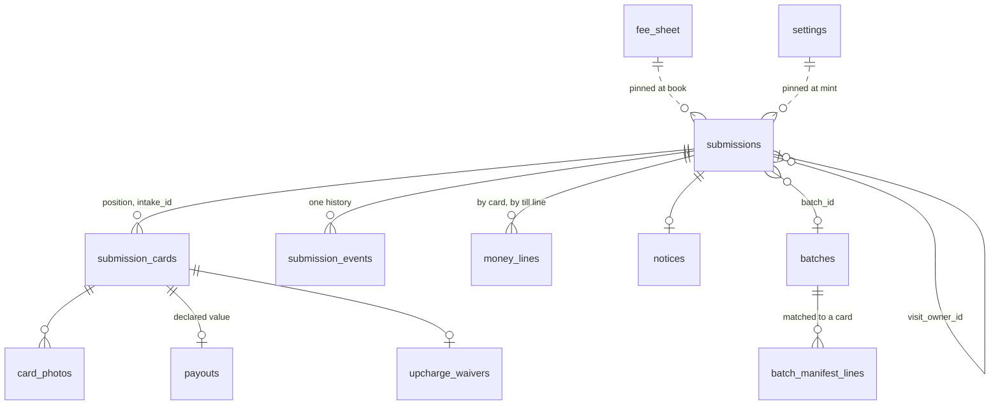

## Context

See [proposal.md](proposal.md#why) for the motivation and [decisions.md](decisions.md)
for what the interview settled; the journeys are beside each capability under
`specs/`. Every path below is the application repository's unless it says
`grade10-spec`. The seams were read off the vault, which this product mirrors
file for file where it has the concern.

- **Nothing exists** — no package, no worker, no route, no `grading` service
  id. A new product is four packages, one worker app and seventeen registry
  edits (§ Migration Plan); the packages are the easy part
- **The vault is the model** — `packages/vault/backend` on `createServiceApp`,
  `cases/transitions.ts` the only writer of a status, `lock.ts` the per-case
  `SELECT … FOR UPDATE`, `sweeps/pass.ts` over `@grade10/postgres/sweeps` on
  two crons, `notifyQuietly` and `notification_retries`, `createAuditLogsTable`
  hash-chained, doc-sign's six tables from `createDocSignTables(vaultSchema)`,
  the booking cache and `booking/bind.ts` calling the diary outside every
  transaction, `erasure/eraseUser.ts` with named holds, a portable suite
- **The sibling change** — `complete-vault-collector-flow` decides the
  six-character reference, the printed-value predicate, the letter catalogue
  and shell, the calendar file, the per-app Storybook and the `/dev/*` seed
  routes; this design reuses each and names the module it shares
- **The diary** — `APPOINTMENT_PRODUCTS = ["vault"]` in
  `packages/appointment/contracts/src/schemas.ts`; the appointment app's
  migration `0008` CHECK-constrains `services.product` and `bookings.product`
  to `vault, finance`, and `ck_services_product_bound` refuses a product-bound
  service that is customer-bookable. `createAppointmentServiceEntrypoint(product)`
  mints the entrypoint; `book`, `reschedule`, `cancel`, `getBooking` and
  `markOutcome` key on `(product, caseRef)`
- **The till** — the store keeps a paid order's `orders.order_name`; lines
  arrive from the provider as `PaymentOrderLine { ref, variantId, productType,
  subtotalMinor }`; `packages/app-env/src/store.ts` already lists
  `Grading Service` in `excludeProductTypes`. Money facts fan out from
  `order_events` to `OrderEventConsumer`s; the store exports no named
  entrypoint another product can read an order through
- **doc-sign** — `DocSignDeps.kyc` answering null makes `ceremony/refusals.ts`
  refuse `KYC_REQUIRED`, and the certificate prints the reference.
  `TemplateLayout` is `{ id, pageCount, signatureFields }`. The site's
  `di/container.ts` installs one `FetchCeremonyClient` at the vault's
  `/api/sign` through `createDocSignCoreModule`; `docSignModules` binds once
- **The card price reference** — `@grade10/inventory-contracts` mints one
  narrowing per consumer (`getVaultInventoryService`); the token and the cache
  stay in the inventory worker
- **Console blocks** live in `packages/frontend-console`; the store's
  `packages/ui` holds collector-facing blocks with stories the manual embeds
- **Retention** — `RETENTION_CLASSES = ["agreements", "identity", "photos"]`
  in `packages/app-env/src/retention.ts`; `check-erasure-consumers.mjs`
  requires every worker with an `erasure/` scope on the console's checklist

## Goals / Non-Goals

**Goals:**

- One writer of the status, ten statuses, a batch act moving every submission
  in the batch in one transaction
- Every exception a fact on a card row; every badge, running late, storage
  due and the safe's total derived at the read by pure functions in the
  contracts package that both SPAs and the worker call
- Every default a row in `settings` or `fee_sheet`, pinned onto the
  submission at booking and at signing as JSON; a missing setting stops the
  read loudly
- Money as integer HKD minor, every till line written back with the store's
  own line reference, every payout and waiver a record whose second approver
  the database refuses to equal the recorder
- The ceremony instantiated into the grading database and hosted on the
  grading worker; the host contract gains an explicit no-identity option
- Every sweep idempotent on an event row as its key

**Non-Goals:**

- Grading tables or a grading tier on the vault worker
- A POS extension panel, online payment, or a store-side write into grading
- A `late`, `held` or `upcharge` status; a `derived_status` column
- Reading the grader's order status by API; disposal after the notice;
  CGC's and BGS's sheets; shipping slabs back

## Decisions

### Four packages, one worker, its own database

- `packages/grading/{contracts,backend,frontend,admin-frontend}` with the
  vault's exports maps: contracts `.`; backend `.`, `./schema`,
  `./router-type`, `./worker`, `./worker/secrets`, `./testing`; frontend one
  subpath per slice plus `./modules`, `./core`, `./core/testing`;
  admin-frontend the same plus `./testing`
- `apps/backend/grade10/grading` — `grade10-grading-service`, port 4450,
  inspector 9244, crons `*/15 * * * *` and `0 * * * *`, Hyperdrive to
  `grade10_grading`, buckets `ITEM_PHOTOS`, `DOCUMENTS`, `DOCUMENTS_ARCHIVE`,
  bindings `AUTH_SERVICE`, `APPOINTMENT_SERVICE` → `GradingAppointmentService`,
  `INVENTORY_SERVICE` → `GradingInventoryService`, `STORE_SERVICE` →
  `GradingStoreService`; no `KYC_SERVICE`. Its own Neon project,
  `stg-` and `prd-grade10-grading`, pg schema `grading`
- Alternatives rejected: sharing the vault's database — two products' holds
  and retention clocks in one schema, a vault migration lock over grading's
  counter; a `KYC_SERVICE` binding for the ID glance — it keeps nothing, so
  there is no record to bind, and an unused binding still needs a stub

### The reference is the vault's alphabet and generator, from `@grade10/utils`

`complete-vault-collector-flow` decides the alphabet, the length and the
retry; the drawing function lifts to `packages/utils/src/reference.ts` as
`SHORT_REFERENCE_ALPHABET` and `shortReference(random)`, the vault's
`cases/reference.ts` a call to it. Whichever change lands first creates it.

- `submissions.reference text NOT NULL UNIQUE`, CHECK `^[2-9A-HJKMNP-Z]{6}$`,
  issued on the insert in `submissions/plan.ts` beside the `gs_` id, retrying
  `23505` eight times in the same transaction; the canvas's `5TW8HN`
- **Intake ids** `<reference>-<n>`, `n` the card's position, written to
  `submission_cards.intake_id` at hand-in, unique across the table: the
  grader's manifest names them, so they are never reissued
- **The pickup code** is four digits drawn at `finishReceiving`, unique among
  submissions currently `ready` through a partial unique index with the same
  retry; ten thousand codes against a shop's dozens ready
- Alternative rejected: the code as the reference's last four — a collector
  who forwarded the ready mail holds both; a drawn code is in one mail only

### One writer, ten statuses, and a batch act is one transaction

`submissions/transitions.ts` is the table, as `cases/transitions.ts` is:
`UPDATE … WHERE status IN (from…) RETURNING`, the `submission_events` row in
the same transaction, zero rows a named `SUBMISSION_CONFLICT`.

| Move | From → to | Called by |
| --- | --- | --- |
| `book` | `planned → booked` | the collector's booking, after the diary answered |
| `cancel` | `planned, booked → cancelled` | the collector or the counter; the visit cancelled first |
| `expire` | `planned → expired` | the plan-expiry sweep |
| `handIn` | `booked → checked_in` | the counter, guarded on a sealed agreement and paid fee lines |
| `markShipped` | `checked_in → sent` | the batch's ship act, every submission in it |
| `recordGrades` | `sent → graded` | the morning read typing the grades-posted stage |
| `receive` | `graded → returned` | the batch's receive-at-shop act |
| `finishReceiving` | `returned → ready` | the batch's finish, every submission at once |
| `collect` | `ready → collected` | the sealed hand-back receipt; refused while anything is due or unticked |

- `sent`, `graded` and `returned` are stored: the round refused deriving
  them, and a page reads one row. `batches/acts.ts` moves every submission
  in one transaction under `lockBatch`, then each submission's lock in id
  order, so two operators finishing one batch serialise
- **Running late**, the queue badges, the chip and the rail are
  `submissionStanding(row, asOf)` in `packages/grading/contracts/src/standing.ts`
  over the fields the detail bundle carries, tested as a table — as
  `caseStanding` is
- A second hand-back on a submission whose card was held keeps `ready` and
  seals a second receipt; `collect` runs when no card is still `held`
- Alternatives rejected: a status per exception — Q3's own rejection, the
  card's `outcome` is the closed set; deriving the three from `batches.state`
  — a card withdrawn or held would need a rule per join, and the queue's cut
  a join on every row

### The diary: three catalogue entries, the vault's bind, one shared visit

- `grading` joins `APPOINTMENT_PRODUCTS`; the appointment app's
  `0009_grading_product.sql` widens both CHECKs and seeds
  `svc_grading_dropoff` (20 min, bound) and `svc_grading_dropoff_bulk`
  (45 min, bound). The customer-bookable Grading visit the public flow lists
  stays; a walk-in's booking carries no product and the counter finds it by
  name and email at hand-in
- **Order and fallback** — the spec word lands first: `grading` joins the
  `Product` row of `shared/appointment/scheduling` in
  `add-multi-store-appointments`'s delta (Q19), and the code ships after it
  is on main. If that change archives first, this change carries the
  one-word delta on the then-durable capability
- `booking/bind.ts` is the vault's: `bookVisit`, `rescheduleVisit`,
  `cancelVisit` call `APPOINTMENT_SERVICE` outside every transaction, then
  `withSubmissionLock` writes the cache (`booking_ref`, `service_id`,
  `appointment_at`, `location_id`, all-or-none), then `tellCustomerFor`;
  `dropoffServiceFor(cards)` picks Bulk at 20 cards or more
- **A shared visit** — `submissions.visit_owner_id` names the submission
  whose booking it is; a joiner holds no cache and reads the owner's. Joining
  re-books the owner's visit at Bulk when the two lists pass 20: `cancel`
  then `book` at the same slot inside the remote step; a slot the diary no
  longer offers refuses `SLOT_TOO_SHORT` and the page offers a move
- **The missed visit** — `missedVisits` reads `getBooking` for every
  `booked` submission whose `appointment_at` plus one hour has passed;
  `absent` clears the cache, writes `visit_missed`, sends the letter; the
  submission stays `booked` with no cache, which the page reads as book
  again. The vault's repair and recovery lists ride unchanged
- The five drop-off letters attach `buildCalendarFile`'s file, served at
  `GET /api/submissions/:id/visit.ics` — as `complete-vault-collector-flow`
  decides
- Alternatives rejected: a delta on `shared/appointment/scheduling` now — in
  flight, whichever archived second would revert the first; a second booking
  for the joiner — a case holds one live booking

### The till: lines are read back by the order's name over a store entrypoint

The spec governs which lines exist and that nothing is handed in unpaid;
this is how the paid order reaches the submission.

- The grading products are Shopify products of product type
  `Grading Service`: one per fee-sheet row plus cover, upcharge and storage;
  their variant ids are data, `fee_sheet.pos_variant_id` and the settings
  `pos_cover_variant`, `pos_upcharge_variant`, `pos_storage_variant`. The
  loyalty exclusion is the product type already listed; no new rule
- The Take-the-fee step prints the lines to ring up; once the till took
  them staff enter the order's name (`#48213`). `admin.recordFeePaid`
  calls `STORE_SERVICE.orderByName(name)` — `GradingStoreService`, a new
  entrypoint on the store worker, surface `@grade10/store-contracts/grading`,
  answering `{ orderRef, orderName, paidAt, lines: [{ ref, variantId,
  subtotalMinor, quantity }] }` or `ORDER_NOT_PAID` — then matches one fee
  line per card at the pinned fee and one cover line per covered card,
  refusing `POS_LINES_MISMATCH` with the gap, then writes a `money_lines`
  row per card with the store's `ref` in one transaction. `handIn` is
  guarded on every card carrying a paid fee line
- The upcharge, storage and refund lines are the same read; `recordRefund`
  names the card and the line it refunds
- Alternatives rejected: grading as an `OrderEventConsumer` of the store's
  queue — the queue carries no submission reference because the till sets
  none, so grading could only park unmatched lines for staff to match, a
  second table for a fact the receipt prints by number; a POS extension
  panel stamping the reference — store and extension work outside this
  change; recognising lines by SKU prefix — the store hands a variant id

### Documents: two templates, the no-identity option, the routed client

- `documents/templates/{submissionAgreement,handBackReceipt}.ts` as
  `GradingTemplate`s over `GradingTemplateId` in contracts, one packet per
  document; `intakeReceipt.ts` renders through the same page helpers into the
  documents area with its sha256, issued, never a packet. Every figure prints
  from `pinned_fee_sheet` and `pinned_terms`, never a live table
- **The option is on the template** — `TemplateLayout` gains
  `identity: "required" | "not_required"`, no default, so every vault
  template says `required` and one that forgets fails to compile.
  `ceremony/capture.ts` skips `kyc.read` for a `not_required` packet, the
  refusal chain skips `KYC_REQUIRED` and the name rung, and the certificate
  prints `Identity: not required for this document`. Grading's
  `DocSignDeps.kyc` throws by name if ever read
- The ceremony mounts at `${config.services.grading}/api/sign` through
  `registerSigningRoutes` with the vault's `SIGN_TRANSPORT`; `routes/signing.ts`,
  `documents/deps.ts`, `storage/areas.ts` and the two guard migrations are
  the vault's files in the grading schema
- **The SPA's client routes by host** — `createDocSignCoreModule` takes
  `ceremonyClients: Record<CeremonyHost, CeremonyClient>` and binds
  `CeremonyClient` to a `RoutedCeremonyClient` picking by the `host` every
  call carries; `CeremonyFlow` gains `host`, the vault's `SignPage` passes
  `"vault"`. One container, one module list; `pages/grading/SignPage.tsx` is
  the vault's file with grading's `RefusalWords` over `grading.ceremony`
- `printedValue(ports, field)` lifts from the vault's `legal/printed.ts` to
  `packages/app-env/src/printed.ts` as the sibling change lands it;
  `assertPrintable` runs at every mint and every letter's act over
  `LETTER_PRINTS`, so production refuses a bracketed custodian before a
  packet exists
- Alternatives rejected: the vault worker hosting grading's ceremony — two
  products' packets in one database and the seal on the wrong chain;
  `kyc: null` as the option — a null port and a missing binding look the
  same; loading `docSignModules` twice — a container binds a token once

### The card price reference is a read over the inventory binding

- `GradingInventoryService` on the inventory worker, `GradingInventoryServiceApi`
  in `@grade10/inventory-contracts`: `matchCards(lines)` answering per line
  a product id with title and reference sales or `unmatched`;
  `referenceSales(productIds)` for the card block
- `submissions.paste` calls it once outside any transaction; a fault answers
  every line `kept_as_typed` with `reference: null`, the level still chosen
  on the declared value. The product id lands on
  `submission_cards.reference_product_id`; sales are re-read, never stored
- Alternative rejected: grading caching prices — the inventory's one cache
  row per reference is the authority

### Money: pinned at booking and signing, derived at the read, two people on a record

- `pinned_fee_sheet jsonb` is the `fee_sheet` row copied at `book`;
  `pinned_terms jsonb` copies `storage_fee_per_card_month`, `storage_from_day`,
  `settlement_days`, `notice_day`, `reminder_days` and `id_glance_threshold`
  at the agreement's mint. A later change reaches only rows not yet booked,
  by construction
- `packages/grading/contracts/src/money.ts`: `coverLine(declaredMinor, coverBps)`
  half-up to the cent, `upchargeOf(sheet, from, to)`,
  `storageDue(readyAt, cardsHeld, asOf, terms)` counting months started since
  day 90 on `Asia/Hong_Kong` days, `dueNow(bundle, asOf)` = unsettled
  upcharges less waivers plus storage; one fold every screen, guard and
  letter calls
- **A payout** is `payouts` — declared value, the fee refund line beside it,
  `route` till or transfer, `recorded_by`, `approved_by`, CHECK
  `approved_by <> recorded_by`; a reversal is a `payout_reversals` row naming
  it. **A waiver** is `upcharge_waivers` with the same two columns and
  check. All append-only; the ladder's `auditDetails` files each under the
  submission
- **The safe's total** is one query at the read: declared values of cards in
  `checked_in`, `returned` and `ready` submissions whose outcome is not
  `refused`, `withdrawn`, `not_returned`, `damaged`, `vaulted` or
  `collected`; `handIn` reads it under the batch lock and refuses `SAFE_CAP`
- Alternatives rejected: storage accrued by a sweep as a line per month — a
  row per month per card for a figure one fold answers; live settings on a
  booked submission — Q43's rejection

### Every default is a row, and a missing one stops the read

- `settings (key, value jsonb, updated_by, approved_by, updated_at)` seeded
  by `0003` from the console's table; `fee_sheet` one row per grader and
  level, PSA's five seeded, CGC's and BGS's levels `active = false` with
  null figures. `settings/read.ts` parses every key through its schema and
  throws `SETTING_UNSET` naming the key — never a default in code
- `admin.updateSetting` under `grading:approve`; a money key
  (`storage_fee_per_card_month`, `safe_declared_cap`, `id_glance_threshold`,
  any fee-sheet figure) takes `approvedBy` who is not the caller; the audit
  subject is `settings`
- Alternative rejected: a `decisionTable` in `packages/app-env` — a deploy
  per confirmation, Q8's rejection; the diary services stay the diary's rows

### Sweeps: the vault's pass, each list keyed on an event

`sweeps/pass.ts` over `createSweepPass`, `WORK_LISTS` laned and ordered, the
order pinned by a test.

| List | Predicate | Writes | Lane |
| --- | --- | --- | --- |
| `retriedNotifications` | `notification_retries` due | the send, or the parked row | fast |
| `planNudges` | `planned`, older than `plan_nudge_days`, no `plan_nudged` event | event and letter | fast |
| `planExpiry` | `planned`, older than `plan_expiry_days` | `expire` | fast |
| `visitReminders` | `booked`, visit tomorrow on the shop's day, no `visit_reminder_sent` | event and letter | fast |
| `missedVisits` | `booked` with cache, `appointment_at` + 1 h passed | `getBooking`; on `absent` the cache cleared, `visit_missed` | fast |
| `collectionReminders` | `ready`, day 30 or 60 since `ready_at`, no `reminder_sent` naming that day | event and letter | fast |
| `storageStarted` | `ready`, day `storage_from_day`, no `storage_started` | event and letter | fast |
| `expiredPackets`, `sealedDeliveries` | the vault's | `expirePacket`; the letter with the PDF | fast |
| `verifiedChainRows`, `archivedObjects`, `verifiedDigests`, `retentionReviews`, `fontAsset`, `orphanedObjects` | the vault's six | the vault's | slow |

- **Notice due** and **running late** are no lists: the badge derives from
  `notice_day` and the send is the counter act `recordNoticePosted`; the
  late letter goes on `reestimateBatch`, and the page reads the estimate
  against the clock
- `retentionReviews` dates a submission from its last terminal event over the
  four classes; grading's `identity` class is empty and never flagged unset
- Alternative rejected: a `nudged_at` column per clock — the event row is
  the stamp

### Retention and erasure ride the vault's one table and one path

- `RETENTION_CLASSES` gains `submissions`; grade10 `2555`, zzz null. The
  review answers `agreements` (the packets, the intake receipt), `photos` and
  `submissions` (the row, the cards, the messages), each from the terminal
  event
- `erasure/eraseUser.ts`: holds `live_submission` (`booked` through `ready`),
  `upcharge_unsettled` (`dueNow > 0` at `ready`) and `ready_uncollected`; a
  `collected` submission with a sealed packet keeps the packets and the
  photographs under `signed_documents` and purges contact, address, the
  named collector and the actor ids; one that never signed is purged whole,
  `eraseCeremonyPersonalData` included. `erasure.erase` and `erasure.holds`
  are the vault's router shape; the console's checklist and
  `check-erasure-consumers.mjs` gain `grading`
- The self-filed ask stays the vault's `cases.requestErasure`; Your data
  (`complete-vault-collector-flow`) also reads `grading.erasure.holds` and
  shows them in words; the request that reaches the console runs per
  product, and grading refuses by name there
- Alternative rejected: the vault asking grading's holds over a new binding
  before filing — a product-to-product binding for a courtesy the run
  already enforces

### Frontends: the vault's slices, the store's blocks, the console's blocks

- `packages/grading/frontend/src/features/{home,plan,dropoff,submission,sign}`
  behind `gradingModules.ts`; `core/api/GradingApi.ts` over the site's
  `gradingTrpcClient`, a fixture transport beside it; the views compose
  `@grade10/ui`'s `grading-submission` blocks and the `appointment-booking`
  exports, every word from the `grading` namespace
- Site surfaces: `grading` (`/grading`, session, `ask`), `gradingSubmission`
  (`/grading/submissions/:submissionId`, `open`), `gradingSign`
  (`/grading/sign`, `open`), on a `grading` gate open where
  `deployEnv !== "production"`, as the vault's. The emailed link carries an
  access token in the fragment, granted as the vault's `routes/access.ts`
  grants a collector page; signed in, the session's email must equal
  `submissions.email`
- `packages/grading/admin-frontend/src/features/{queue,handin,batches,receiving,handback,submission,settings,notice}`
  composing `@grade10/frontend-console`; admin surfaces `grading`,
  `gradingSubmission`, `gradingBatches`, `gradingBatch`, `gradingSettings`;
  `sections.ts` gates on `ADMIN_PERMISSIONS["admin.queue"]`
- Stories: the blocks' in the store's `packages/ui` workbench; the console
  views' colocated in the admin Storybook `complete-vault-collector-flow`
  stands up, globbing `packages/*/admin-frontend/src/**`
- RBAC: `grading: ["read", "operate", "approve"]` in
  `packages/grade10-auth/contracts/src/schemas.ts`, `staff` and `admin`
  holding all three; `generate:rbac-docs` rerun. `contracts/src/permissions.ts`
  maps every admin procedure to its grant, pinned both ways by a test
- i18n: `messages/shared/{en,zh-Hant,zh-Hans,ko}/grading.json` in the store
  and the nav key in `chrome`; letters are English in the worker
- Alternative rejected: console blocks in the store's `packages/ui` — it
  carries none, and the seams place them in `packages/frontend-console`

### Letters are one exhaustive catalogue on the vault's shell

- `email/letters/index.ts` is `LETTERS: Record<NotifyKind, Letter>` over
  eighteen kinds (`plan_saved`, `plan_nudge`, `plan_expired`, the five visit
  kinds, `handed_in`, `handback_receipt`, `batch_shipped`, `batch_reestimated`,
  `grades_posted`, `card_not_returned`, `ready`, `still_here`, `storage_fee`,
  `written_notice`); `NOTIFY_FOR_EVENT` exhaustive over every
  `SubmissionEventKind`, `null` written for the two silences
- The shell and its blocks lift from the vault's `letters/VaultLetter.tsx` to
  `@grade10/email/render` as `ProductLetter` when this change lands, the
  vault's file a re-export; grading adds `CardSchedule`, `PickupCard` and
  `UncollectedLadder`. Previews in the store's `apps/emails/emails/grading/<kind>.tsx`
  from `letters/fixtures.ts`, a render snapshot per kind
- Alternative rejected: copying the shell — two shells drift on the first
  footer change

### Tests per seam, the e2e stack, and the dev routes

- **Backend** (`packages/grading/backend/test/`): service tests
  `submissions/transitions.test.ts` (every move and conflict),
  `batches/acts.test.ts` (one transaction, lock order),
  `money/{cover,storage,dueNow}.test.ts` as tables, `settings/read.test.ts`
  (unset throws by key), `pos/match.test.ts`, `documents/identity.test.ts`
  (the no-identity packet seals, the certificate line),
  `email/letters/render.test.tsx`; query-shape tests
  `repositories/{queue,safeTotal,sweeps}.drizzle.test.ts`; repository tests
  `repositories/{reference,pickupCode,payouts,cert}.repo.test.ts`. The
  portable suite `src/testing/` runs in the app's `test/db/scenarios.spec.ts`
  against the committed migrations; `test/worker/` proves the three bindings
  resolve their named entrypoints through stub workers
- **Providers**: doc-sign's `templates/identity.test.ts` and the ceremony
  suite's `KYC_REQUIRED` case per arm; the store's `rpc/gradingEntrypoint.test.ts`;
  the inventory's `rpc/gradingMatch.test.ts`; the appointment migration spec;
  the RBAC docs drift. **Contracts**: `standing.test.ts`, `money.test.ts`
- **SPA and console** (colocated `*.test.tsx`, `getByRole`): the wizard's
  steps, the paste sheet's four results, the level picker's closed reasons,
  the page per status, the pickup card, naming a collector; the queue's cuts
  and badges, both runbooks' refusals, the receive table's counters, the
  settings table's second person
- **E2E** — `apps/frontend/grade10/e2e/tests/grading/{plan,dropoff,handin,batch,handback,uncollected}.spec.ts`
  over `packages/grading/backend/src/routes/dev.ts` under `devOnly()`:
  `POST /dev/submissions/seed` (a submission at a named status, replaying the
  transitions above from `planned` with its cards, batch, lines and events —
  never a second writer), `POST /dev/sweep` (one list, now),
  `POST /dev/settings` (a key, for a clock the test moves), `GET /dev/outbox`
  (letters sent, attachment names) — the auth outbox's shape.
  `start-isolated.sh` gains `grading-service` and its probe; `STACK_READY_URLS`
  the same

## Database Schema

Schema `grading`. Money is `bigint` HKD minor; instants `timestamptz(3)`
through `msTimestamp`; ids text with a prefix; every `_by` an operator id.

### `submissions`

| Column | Definition | Meaning |
| --- | --- | --- |
| `id` | `text PK` | `gs_<uuid>` |
| `reference` | `text NOT NULL UNIQUE CHECK` | six characters of the alphabet |
| `status` | `text NOT NULL CHECK` | the ten |
| `user_id`, `email`, `full_name`, `phone` | `text`, email `NOT NULL` | the plan lives under the email |
| `access_hash` | `text NOT NULL` | sha256 of the link's token |
| `grader`, `level` | `text CHECK` | `psa, cgc, bgs`; the sheet's levels |
| `pinned_fee_sheet` | `jsonb` | the `fee_sheet` row at `book`; null while `planned` |
| `pinned_terms` | `jsonb` | the six terms at the agreement's mint |
| `booking_ref`, `service_id`, `appointment_at`, `location_id` | cache, all-or-none CHECK | the vault's |
| `visit_owner_id` | `text FK submissions` | set on a joiner |
| `batch_id` | `text FK batches` | set at `handIn` |
| `pickup_code` | `text CHECK ^\d{4}$` | partial `UNIQUE WHERE status = 'ready'` |
| `named_collector`, `postal_address` | `text` | one full name; one line taken at signing |
| `booked_at`, `checked_in_at`, `ready_at` | `timestamptz(3)` | the clocks' anchors |
| `legal_hold` | `text CHECK` | `signed_documents` |
| `created_at`, `updated_at` | `timestamptz(3) NOT NULL` | |

Indexes `(status, updated_at)`, `(user_id, status)`, `(email)`,
`(booking_ref)`, `(appointment_at)`, `(batch_id)`, `(status, ready_at)`.

### `submission_cards`

| Column | Definition | Meaning |
| --- | --- | --- |
| `id`, `submission_id`, `position` | `text PK`; `FK NOT NULL`; `integer NOT NULL` | `gc_<uuid>`; position unique with the submission |
| `intake_id` | `text UNIQUE` | `<reference>-<n>`, from `handIn` |
| `name`, `set_name`, `card_number` | `text` | as typed or matched |
| `reference_product_id` | `text` | the inventory product; null kept-as-typed |
| `declared_minor` | `bigint NOT NULL CHECK > 0` | |
| `minimum_grade` | `text` | |
| `outcome` | `text NOT NULL CHECK` | `listed, checked_in, refused, graded, ungraded, minimum_not_met, moved_up, withdrawn, held, not_returned, damaged, collected, vaulted` |
| `outcome_note`, `grader_code`, `grade`, `cert` | `text`; cert `UNIQUE WHERE NOT NULL` | the collector's words; the grader's |
| `moved_to_level`, `held_until` | `text`; `date` | with `moved_up`; with `held` |
| `condition_note`, `refused_reason`, `vault_case_id` | `text` | the three reasons CHECK-constrained |

`card_photos`: `id`, `card_id FK`, `kind CHECK (intake_front, intake_back,
handback, damaged)`, `object_key UNIQUE`, `taken_by`, `at`; the
`ITEM_PHOTOS` area's `referenced` answers these keys.

### `batches`

| Column | Definition | Meaning |
| --- | --- | --- |
| `id` | `text PK` | `B-<yyyy>-<ww>-<grader>-<level>`, e.g. `B-2026-44-PSA-REG`, derived from the cut-off week and the pair |
| `grader`, `level` | `text NOT NULL` | one each; unique with `cutoff_at` |
| `cutoff_at` | `timestamptz(3) NOT NULL` | Thursday 19:00 on the shop's day, as an instant |
| `state` | `text NOT NULL CHECK` | `open, closed, shipped, returned, received` |
| `ship_date`, `courier`, `tracking`, `order_number` | `date`; `text` | the ship date never in the future |
| `insured_minor`, `cover_figure_minor` | `bigint` | the declared total; the courier's written figure at ship |
| `estimate_at`, `grader_stage` | `date`; `text` | the level's weeks from the ship day, moved by a re-estimate; the morning read's words |
| `invoice_ref`, `invoice_total_minor`, `invoice_currency` | `text`, `bigint`, `text` | entered before the first scan |
| `manifest_entered_at`, `received_at`, `finished_at` | `timestamptz(3)` | |

`open` is the row for the next cut-off, created on first use by `handIn`.
`batch_manifest_lines`: `batch_id FK`, `line_no`, `intake_id`, `cert`,
`grade`, `grader_code`, `note`, `level_charged`, `card_id FK` (null
unmatched), `resolved_by`, `resolved_at`; PK `(batch_id, line_no)`; an
unmatched line holds `finishReceiving`.

### Settings, money, records

| Table | Columns | Guard |
| --- | --- | --- |
| `fee_sheet` | `grader`, `level` (PK); `ceiling_minor`, `fee_minor`, `cover_bps`, `estimate_weeks`, `cards_min`, `cards_max`, `pos_variant_id`, `active`, `updated_by`, `approved_by`, `updated_at` | |
| `settings` | `key` (PK); `value jsonb NOT NULL`; `updated_by`, `approved_by`, `updated_at` | the console's keys plus the three variants and `batch_cutoff { weekday, time }` |
| `money_lines` | `id`, `submission_id FK`, `card_id FK`, `kind CHECK (fee, cover, upcharge, storage, refund)`, `amount_minor > 0`, `pos_order_ref`, `pos_order_name`, `pos_line_ref`, `refund_of_line_id FK`, `paid_at`, `recorded_by`, `recorded_at` | append-only; unique `(pos_order_ref, pos_line_ref)` |
| `payouts` | `id`, `submission_id`, `card_id`, `amount_minor`, `fee_refund_line_id`, `route CHECK (till, transfer)`, `bank_ref`, `recorded_by`, `approved_by`, `recorded_at`, `received_at` | append-only; CHECK `approved_by <> recorded_by`; unique `(card_id)` |
| `payout_reversals` | `payout_id PK FK`, `reason`, `recorded_by`, `approved_by`, `at` | append-only; the same check |
| `upcharge_waivers` | `id`, `submission_id`, `card_id`, `amount_minor`, `reason`, `recorded_by`, `approved_by`, `at` | append-only; the same check; unique `(card_id)` |
| `notices` | `submission_id PK FK`, `posted_on date`, `tracking`, `recorded_by`, `at`, `emailed_at` | one per submission |

### History, mail, evidence

| Table | Shape |
| --- | --- |
| `submission_events` | the vault's `case_events` plus `staff_only boolean NOT NULL DEFAULT false`; `details` references and figures only; indexes `(submission_id, id)`, `(submission_id, to_status, at)`, `(submission_id, kind)` for every sweep's key |
| `notification_retries` | the vault's, keyed `submission_id`, `packet_id` for the sealed copies |
| `sign_packets`, `sign_documents`, `sign_signers`, `sign_tokens`, `sign_signatures`, `sign_events` | `createDocSignTables(gradingSchema)` |
| `audit_logs`, `audit_verify_cursors`, `sealed_archive`, `storage_cursors` | the vault's four |

Authoritative: the status, the outcome, the pinned JSON, the lines, the
records, the events. Derived, never stored: the standing and badges, running
late, storage due, `dueNow`, the safe's total, the tiles, and the batch's
timeline (its submissions' events, distinct by kind and instant).

## Service Interfaces

| Function | Input | Answers or refuses | Boundary |
| --- | --- | --- | --- |
| `savePlan(db, args)` | cards, declared values, grader, level, contact | the submission | one transaction; reference retry inside; `matchCards` before it |
| `bookVisit(db, appointments, mail, args)` | submission, location, slot, service | the booking | remote call outside; then lock, `book`, pin the sheet, cache, event; mail after commit |
| `joinVisit(db, appointments, mail, args)` | joiner, owner | the shared booking | remote cancel then book when the lists pass 20; one transaction writes `visit_owner_id` and the owner's cache |
| `checkCard(tx, args)` / `refuseCard(tx, args)` | card, condition, photos / reason, words | the card | under the submission lock; refuses above the pinned ceiling; a paid line refunds through `recordRefund` |
| `mintAgreement(db, deps, args)` | submission | the packet and token | `assertPrintable` first; refuses while any card is `listed`; pins the terms in the mint transaction |
| `recordFeePaid(db, store, args)` | submission, order name | the lines, `ORDER_NOT_PAID`, `POS_LINES_MISMATCH` | binding read outside; one transaction writes the lines |
| `handIn(db, args)` | submission | `checked_in` | lock batch then submission; refuses `AGREEMENT_UNSEALED`, `FEE_UNPAID`, `SAFE_CAP`; intake ids, the open batch, the receipt, one event |
| `shipBatch(db, mail, args)` | batch, courier, tracking, order number, insured | `shipped` | one transaction: the batch, `markShipped` per submission in id order, events; letters after |
| `reestimateBatch(db, mail, args)` | batch, date, reason | the batch | one transaction, one event per submission; letters after |
| `receiveBatch(db, args)` | batch, manifest, invoice | `returned` | one transaction; `receive` per submission |
| `scanCard(tx, args)` | batch, cert, intake id | the card | refuses `CERT_HELD_ELSEWHERE` on the unique index; sets outcome, grade, cert, `moved_up` and the upcharge expected |
| `finishReceiving(db, mail, args)` | batch | `ready` for every submission | refuses `MANIFEST_UNRESOLVED`; codes drawn with retry; one transaction; letters after |
| `recordPayout(db, args)` | card, route, reference, approver | the record | refuses `SAME_APPROVER`, `PAYOUT_EXISTS`; the refund line beside it |
| `collect(db, args)` | the sealed packet | `collected` | the doc-sign completion hook; `BALANCE_DUE` and `ITEM_UNTICKED` refused at the mint and again at the seal |
| `recordNoticePosted(db, mail, args)` | submission, date, tracking | the notice | refuses before `notice_day`; letter after |
| `updateSetting(db, args)` | key, value, approver | the row | money keys refuse `SAME_APPROVER`; audit subject `settings` |
| `eraseUser(db, deps, userId)` | account | holds, or what was purged | the vault's shape without the identity release |

Every guard reads under the submission's lock inside the transition's
transaction; a binding is called before any transaction opens, and its
refusal is a value the counter reads, never a fault that kills the till.

Example — a hand-in. `recordFeePaid({ submissionId: "gs_1", orderName: "#48213" })`
→ `STORE_SERVICE.orderByName("#48213")` → `{ orderRef: "gid://…/9001", paidAt,
lines: [{ ref: "l1", variantId: "v_reg", subtotalMinor: 60000, quantity: 4 }] }`
→ four `money_lines { kind: fee, amount_minor: 60000, pos_order_name: "#48213",
pos_line_ref: "l1" }`. `handIn("gs_1")` → locks `B-2026-44-PSA-REG` then
`gs_1` → safe total 18 400 000 + 3 400 000 < 30 000 000 → cards get
`5TW8HN-1 … -4`, `batch_id` set, `booked → checked_in`, event
`handed_in { intakeIds, posOrderName }`, the intake receipt stored → the
`handed_in` letter with the receipt and the sealed agreement attached.

## API Contracts

| Surface | Change |
| --- | --- |
| grading tRPC, session tier | `submissions.{plan,paste,update,book,reschedule,cancelVisit,join,cancel,detail,list,nameCollector,removeCollector}`, `quotes.{feeSheet,estimate}` (public), `erasure.holds` (authed) |
| admin tier, `elevatedProcedure` per grant | `admin.{queue,queueCounts,tiles,detail,checkCard,addCard,refuseCard,mintAgreement,recordFeePaid,handIn,withdrawCard,recordRefund,shipBatch,reestimateBatch,enterManifest,enterInvoice,scanCard,recordException,finishReceiving,mintHandBack,recordNoticePosted,recordPayout,reversePayout,waiveUpcharge,vaultCard,settings,updateSetting,feeSheet,updateFeeSheet,resendNotification,documents,signingLink}`, `erasure.erase`, `audit.*` |
| HTTP on the grading worker | `/api/sign/*`, `POST /api/submissions/:id/photos`, `GET /api/submissions/:id/documents/:documentId`, `GET /api/submissions/:id/visit.ics`, `GET /api/documents/verify/:sha256`, `/dev/*` |
| `@grade10/store-contracts/grading` | new `GradingStoreServiceApi.orderByName(name)`; `GradingStoreService` on the store worker |
| `@grade10/inventory-contracts` | new `GradingInventoryServiceApi.{matchCards,referenceSales}`; `GradingInventoryService` |
| `@grade10/appointment-contracts` | `APPOINTMENT_PRODUCTS` gains `grading`; `GradingAppointmentService` |
| `@grade10/doc-sign-backend` | **BREAKING** `TemplateLayout.identity` required on every template |
| `@grade10/doc-sign-frontend` | **BREAKING** `createDocSignCoreModule({ ceremonyClients })`; `CeremonyFlow` takes `host` |
| `@grade10/app-env` | `ServiceId` and `BRAND_SERVICES.grade10` gain `grading`; `RETENTION_CLASSES` gains `submissions`; `printedValue` lifts here |
| `@grade10/auth-contracts` | `grading:read`, `grading:operate`, `grading:approve` |
| `@grade10/utils`, `@grade10/email/render` | `reference.ts`; `ProductLetter` and its blocks |

## Compatibility

| Broken | Consumers that adapt |
| --- | --- |
| `TemplateLayout.identity` | the vault's three templates add `identity: "required"` |
| `createDocSignCoreModule`'s argument | `apps/frontend/grade10/src/di/container.ts`; `pages/vault/SignPage.tsx` passes `host` |
| `APPOINTMENT_PRODUCTS` | `ERASURE_LANES` widens with it; the appointment console's product filter reads the list |
| `RETENTION_CLASSES` | the vault's `sweeps/retention.ts` and `cases.yourData` iterate it; the new class answers zero for the vault |
| The vault's `cases/reference.ts`, `legal/printed.ts`, `letters/VaultLetter.tsx` | re-exports of the lifted modules |

Nothing is aliased: no consumer is live, and every worker and SPA deploys
from one commit.

## Risks / Trade-offs

- **[Two operators finish one batch]** → `lockBatch` first, then each
  submission's lock in id order; the loser reads `BATCH_CONFLICT`
- **[The till took the money and the store's row is not yet paid]** →
  `ORDER_NOT_PAID` is a value; the counter retries after the reconcile pass
  lands it, and nothing is written until it does
- **[A cert scans onto the wrong submission]** → the unique index on `cert`
  and the intake-id match to this batch's manifest line
- **[A joiner's re-book fails between cancel and book]** → the owner's cache
  is repaired by `repairedBookings` and the page offers a move; nothing
  local was written
- **[A pickup code repeats among ready submissions]** → the partial unique
  index and the retry; a collected submission frees its code
- **[A sweep sends a reminder twice]** → each list's predicate is the absence
  of its own event, and the event and the letter's retry row commit together
- **[A staging letter's brackets reach a real inbox]** → `assertPrintable` at
  the act and `printedValue` at the render, the sibling change's control
- **[The no-identity option leaks onto a vault template]** → the field is
  required with no default; the ceremony suite proves each arm
- **[A money setting changes under a booked submission]** → the pinned JSON
  is what every figure prints from; the live row is read at `book` and at
  the mint only

## Migration Plan

1. **Store** — `packages/ui` blocks and stories, the `grading` i18n
   namespace, `apps/emails/emails/grading/`, the retention delta; the
   one-word `Product` delta in `add-multi-store-appointments`; then
   `pnpm run submodules:update external/grade10-spec`
2. **Shared modules** — `packages/utils/src/reference.ts`,
   `packages/app-env/src/{services,retention,printed}.ts`, `ProductLetter`,
   doc-sign's `identity` option and routed client, the RBAC row with
   `generate:rbac-docs`
3. **The three providers** — the appointment app's `0009_grading_product.sql`
   and `GradingAppointmentService`; `GradingInventoryService`;
   `GradingStoreService` with `@grade10/store-contracts/grading`
4. **The grading worker** — the four packages and the app; migrations in
   `apps/backend/grade10/grading/src/db/migrations/`: `0000_grading_schema.sql`
   (generated, every table above), `0001_append_only.sql` (`sign_events`,
   `submission_events`, `money_lines`, `payouts`, `payout_reversals`,
   `upcharge_waivers`, `audit_logs`, armed always),
   `0002_sign_lifecycle_guards.sql` (`docSignProtectionSql`),
   `0003_seed_settings.sql` (the defaults and PSA's five rows, CGC's and
   BGS's inactive). The registries, in order: `packages/app-env/src/services.ts`;
   the gateway's `wrangler.jsonc` and `routing.spec.ts`;
   `scripts/dev/services.mjs`; `scripts/deploy/components.mjs` (`grading`
   after `store`, before the gateway); `neondb/registry.sh`; the
   appointment, inventory and store entrypoints; the auth contracts;
   `packages/api-docs`; `check-erasure-consumers.mjs`; the site's and the
   console's surfaces, routes, pages, DI and clients; the i18n bump;
   `docs/architecture/handbook.html` (four cards, the topology nodes) and
   `docs/conventions/packages.md`; `docs/architecture/grading.md` written
5. **Deploy** — Neon projects in `ap-southeast-1`, Hyperdrive with
   `--caching-disabled`, the three buckets, `RESEND_API_KEY`; migrations
   applied deliberately, staging then production; the worker, both SPAs and
   the three providers from one commit. The pages are carried off production
   by the `grading` gate, so the rollback is the gate
6. **E2E** — `start-isolated.sh`, `STACK_READY_URLS`, the six specs

## Open Questions

- ❓ **Every default on the console's table** — Operations, Commercial and
  Legal on the pages; each lands in `0003_seed_settings.sql` or a settings
  write, touching no code
- ❓ **How the manifest and the invoice enter** (Q50) — Operations; a file
  import is one parser in front of `enterManifest`
- ❓ **A batch above the courier's cover** (Q29) — Operations; `shipBatch`
  refuses `OVER_COVER` today and a split is a second batch row
- ❓ **A queue view for `planned`** (Q36) — Product; one more cut on
  `admin.queue`
- ❓ **The ceremony client's host key** — the service id (`vault`,
  `grading`) or the packet's own address; either is one record in
  `container.ts`
- ❓ **The certificate's no-identity line** — Legal's wording; the arm
  prints what `printedValue` answers for it
