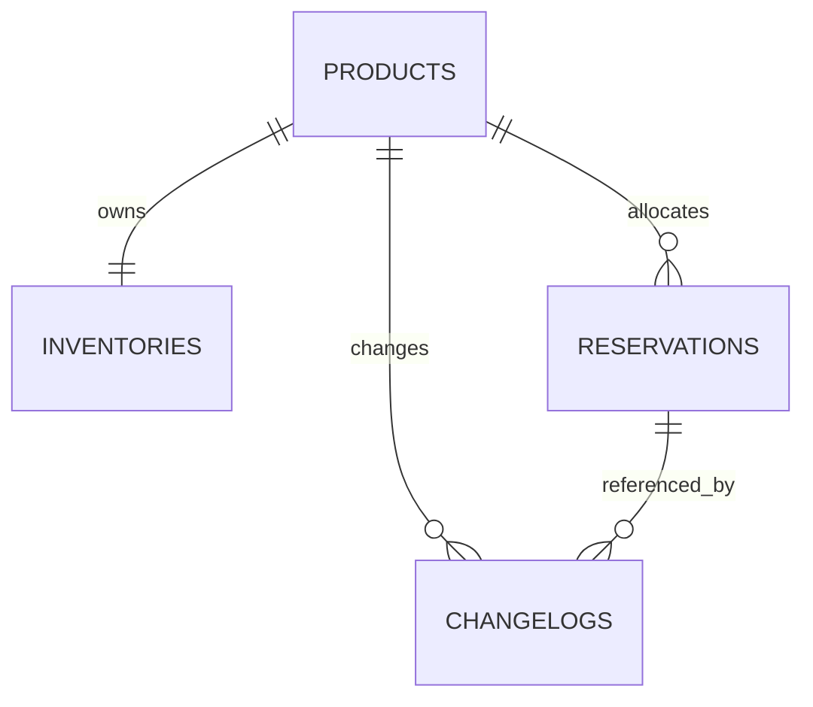

## Context

Grade10 has no aggregate house-stock owner. Auction has a thin product identity
and Shopify owns storefront quantities, but neither arbitrates stock shared by
Auction and Vault. See [proposal.md](proposal.md). Capability:
[`grade10-inventory/catalog`](specs/grade10-inventory/catalog/spec.md).
Screens: [ui.md](ui.md).

This design follows `docs/conventions/packages.md`,
`docs/conventions/backend.md`, `docs/architecture/cross-service.md`,
`docs/architecture/multi-product.md`, and
`docs/architecture/security.md` in the grade10 monorepo.

## Goals / Non-Goals

**Goals:**

- Ship one current inventory snapshot per Grade10 inventory product.
- Serialize every count transition on that snapshot.
- Reserve quantities for named applications without leaking other holders.
- Retain an append-only explanation of how the current counts were reached.
- Keep ledger count non-decreasing while stock moves to terminal counts.

**Non-Goals:**

- Identifying or tracking individual physical objects.
- Wiring Auction or Vault flows to inventory in this change.
- Shopify inventory sync, ZZZ inventory, warehouses, or transfers.
- New design-system or `@grade10/ui` components.

## Decisions

### Inventory is a standalone product boundary

Place the product under `packages/inventory/{contracts,backend,admin-frontend}`
publishing `@grade10/inventory-contracts`,
`@grade10/inventory-service`, and
`@grade10/inventory-admin-frontend`. The thin worker lives at
`apps/backend/grade10/inventory`. Register `inventory` in
`packages/app-env` for Grade10 only and bind `INVENTORY_SERVICE` on the API
gateway for admin HTTP routing.

**Rejected:** inventory inside Auction or Vault. Shared stock and its
reservation arbitration outlive either consumer. **Rejected:** Shopify as the
ledger. It owns retail locations, not all Grade10-managed stock.

### Product and inventory are one-to-one

`products` owns descriptive identity. `inventories` uses `product_id` as
its primary key and stores the latest aggregate snapshot. Product creation
inserts both rows in one transaction; every later intake updates the same
inventory row.

There is no inventory-unit table. This model promises quantity integrity, not
item identity. If Grade10 later tags physical objects, a separate serialized
asset capability can reference the product without changing the aggregate
reservation contract.

**Rejected:** one row per physical item. The current workflow does not provide
a barcode, certificate number, or other physical identity, so generated rows
would create artificial traceability. **Rejected:** multiple inventory
buckets per product. There is no warehouse/location dimension in scope, and
multiple rows would make current stock ambiguous.

### The snapshot stores the reconciliation partitions

`inventories` stores stock, reserved, sold, withdrawn, and ledger counts.
Available is derived as stock minus reserved rather than persisted. Keeping
sold and withdrawn partitions makes the ledger equation queryable without
replaying history:

```text
available = stock_count - reserved_count
stock_count + sold_count + withdrawn_count = ledger_count
```

Intake increments stock and ledger. Sale transfers stock to sold; withdrawal
transfers stock to withdrawn. Reserve/release changes reserved only. No
capability decrements sold, withdrawn, or ledger. A database trigger rejects a
new ledger count below the old value, while row checks enforce both equations
and non-negative counts.

Use PostgreSQL `bigint` for lifetime counts and total sale money. The request
boundary remains 1–500 so one operation stays bounded. Drizzle reads these
columns in number mode and contracts reject values outside JavaScript's safe
integer range. PostgreSQL `integer` tops out at 2,147,483,647; it is avoided
for cumulative counts so a long-lived ledger is not tied to that ceiling.

**Rejected:** compute the snapshot by replaying changelogs. Admin reads and
reservation decisions would grow with all historical activity. **Rejected:**
store available count. It is exactly derivable and would add a third value
that can drift from stock and reserved.

### Reservations hold quantities

`reservations` is an immutable-quantity allocation header: product, holder,
holder reference, purpose, quantity, state, and actor stamps. There are no
assignment or active-owner link tables. Active ownership is the reservation
row itself; current reserved count is the cached sum protected by the
inventory-row transaction.

`(holder, holder_reference)` is unique for idempotency. An exact retry returns
the existing reservation. A differing payload is refused. A released
reservation is never reactivated. Release is whole-reservation only; callers
create separate references for quantities with independent lifetimes.

**Rejected:** one reservation row per quantity unit. It recreates synthetic
unit identity without adding a physical discriminator. **Rejected:** only a
holder count on inventory. It cannot retain purpose, external reference,
idempotency, or released history.

### The inventory row serializes every count transition

Reserve quantity N in one database transaction:

1. Lock the product's inventory row.
2. Resolve the holder reference. Return an exact existing request, or refuse a
   conflicting one.
3. Re-read stock and reserved counts under the lock.
4. Refuse if `stock_count - reserved_count < N`.
5. Insert the active reservation with `ON CONFLICT (holder,
   holder_reference) DO NOTHING RETURNING id`. When another product won that
   key concurrently, read and compare the winning row in the next statement;
   return it if exact or refuse the conflict. Do not update counts on this
   path.
6. For a newly inserted row, increment reserved count, append one
   changelog, and commit.

Illustrative SQL:

```sql
SELECT stock_count, reserved_count, ledger_count
FROM inventory.inventories
WHERE product_id = $1
FOR UPDATE;

INSERT INTO inventory.reservations (
  id, product_id, holder, holder_reference, purpose, quantity,
  state, created_actor_kind, created_actor_id
) VALUES ($2, $1, $3, $4, $5, $6, 'active', $7, $8)
ON CONFLICT (holder, holder_reference) DO NOTHING
RETURNING id;

UPDATE inventory.inventories
SET reserved_count = reserved_count + $6,
    updated_at = now()
WHERE product_id = $1;
```

Release, intake, sale, and withdrawal take the same row lock before checking
and updating counts. The reservation insert, snapshot update, and changelog
append share the transaction.

Without the lock, two `READ COMMITTED` reserve transactions can both approve
the last available quantity:

| Step | Transaction A | Transaction B |
| --- | --- | --- |
| 1 | Reads stock 1, reserved 0 | Reads stock 1, reserved 0 |
| 2 | Inserts Auction reservation quantity 1 | Inserts Vault reservation quantity 1 |
| 3 | Increments reserved to 1 and commits | Attempts to increment reserved to 2 |
| 4 | Returns success | Hits the stock/reserved check constraint |

The check prevents committed oversubscription, but B receives SQLSTATE
`23514` instead of the typed insufficient-inventory refusal. If updates were
written from stale absolute values instead of increments, both reservations
could commit while reserved count incorrectly remained one. With
`SELECT ... FOR UPDATE`, B waits before reading; after A commits it sees zero
available and returns the domain refusal without attempting a violating write.

Concurrency tests use two real worker entrypoints. Application-only prechecks
are not acceptance evidence.

**Rejected:** a guarded atomic update without a row lock. It can protect the
count, but coordinating idempotency, the reservation row, before/after
snapshots, and a typed refusal is less explicit. **Rejected:** distributed
locks or a Durable Object. PostgreSQL already owns the snapshot being changed.

### Named service entrypoints are the holder grant

The worker exports `AuctionInventoryService` and
`VaultInventoryService`. Each closes over its holder id; holder is never RPC
input. The default entrypoint exposes no holder methods.

The holder surface supports:

| Method | Result |
| --- | --- |
| `getAvailability(productId)` | Unreserved stock count only |
| `reserve(productId, quantity, purpose, holderReference)` | Idempotent own reservation |
| `getReservation(id)` / `listReservations(productId?)` | Own reservations only |
| `release(reservationId)` | Release own active reservation; foreign ids answer not found |

Contracts publish binding narrowing and typed refusals. A binding is added to
Auction or Vault only when that caller's integration is planned. The admin API
may name holder because its operator grant is global. Holder RPC methods are
not routed through the public gateway.

**Rejected:** caller-supplied holder. A bound service could impersonate
another application. **Rejected:** global responses filtered in callers. That
crosses the privacy boundary before filtering.

### Read models are scoped before serialization

Admin queries return the full snapshot, active and released reservations,
active quantities grouped by holder, and changelogs. Holder queries return
available count and reservations filtered by the fixed entrypoint holder.
They never load another holder's rows into a holder response DTO.

The holder response omits stock, ledger, and aggregate reserved counts because
those values reveal another application's allocation by subtraction.

### Changelogs are the transition ledger

One business mutation writes one changelog. Product create/update snapshots the
product. Intake, sale, and withdrawal snapshot inventory before and after.
Reserve/release snapshots both inventory and the affected reservation so the
allocation transition is reconstructable without extra assignment rows.

Action-specific relational columns carry quantity, reservation id, sale money,
and withdrawal reason for filtering and validation. Canonical JSONB
before/after carries the full snapshots. Failed, refused, and idempotent no-op
requests append nothing.

Elevated admin mutations additionally use `elevatedProcedure` and the
worker's shared hash-chained `audit_logs`. Application entrypoints write only
domain history.

**Rejected:** changelog-only current state. Every availability read would
replay the event stream. **Rejected:** platform audit alone. It does not model
application actors or provide the product-scoped transition ledger.

### Admin composition and RBAC

Add `inventory:read` and `inventory:write` permissions. Only `admin`
receives them through `ALL_PERMISSIONS`. Brand pages under
`apps/admin/grade10/src/pages/inventory/` compose feature slices from
`@grade10/inventory-admin-frontend`.

The products table shows all snapshot counts. Product detail shows aggregate
counts, reservation allocation, and change history. Intake, sale, withdrawal,
reserve, and release use dialogs composed from existing primitives.

**Rejected:** staff read access. Global allocation reveals custody across
applications and remains admin-only in this capability.

### Database schema

Schema lives in `@grade10/inventory-service` under PostgreSQL schema
`inventory`; migrations live under the inventory worker. Application ids are
prefixed UUID strings in `text`. Timestamps use the shared
`msTimestamp()`: `timestamp(3) with time zone`.

#### Entity relationships



`changelogs.reservation_id` is nullable because product, intake, sale, and
withdrawal changes do not concern a reservation. Products and reservations are
not deleted, so history foreign keys remain valid.

#### `products`

| Column | PostgreSQL type | Null | Default / constraint |
| --- | --- | --- | --- |
| `id` | `text` | No | No database default; app-minted `prd_<uuid>`, primary key |
| `name` | `text` | No | No default; trimmed length 1–200 |
| `description` | `text` | No | `''` |
| `created_at` | `timestamp(3) with time zone` | No | `now()` |
| `updated_at` | `timestamp(3) with time zone` | No | `now()` |
| `created_by` | `text` | No | No default; operator user id |
| `remarks` | `text` | No | `''` |

#### `inventories`

| Column | PostgreSQL type | Null | Default / constraint |
| --- | --- | --- | --- |
| `product_id` | `text` | No | FK → `products.id`, primary key |
| `stock_count` | `bigint` | No | `0`; non-negative |
| `reserved_count` | `bigint` | No | `0`; between zero and stock count |
| `sold_count` | `bigint` | No | `0`; non-negative |
| `withdrawn_count` | `bigint` | No | `0`; non-negative |
| `ledger_count` | `bigint` | No | `0`; equals stock + sold + withdrawn |
| `created_at` | `timestamp(3) with time zone` | No | `now()` |
| `updated_at` | `timestamp(3) with time zone` | No | `now()` |

Install checks for non-negative counts, `reserved_count <= stock_count`, and
the ledger equation. A before-update trigger rejects
`NEW.ledger_count < OLD.ledger_count`,
`NEW.sold_count < OLD.sold_count`, or
`NEW.withdrawn_count < OLD.withdrawn_count`. Product creation owns the only
insert; all later changes update this row under lock.

#### `reservations`

| Column | PostgreSQL type | Null | Default / constraint |
| --- | --- | --- | --- |
| `id` | `text` | No | No database default; app-minted `res_<uuid>`, primary key |
| `product_id` | `text` | No | FK → `inventories.product_id` |
| `holder` | `text` | No | Check in `auction`, `vault` |
| `holder_reference` | `text` | No | Non-empty; unique with holder |
| `purpose` | `text` | No | Trimmed length 1–200 |
| `quantity` | `bigint` | No | No default; check from 1 through 500 |
| `state` | `text` | No | `'active'`; check in `active`, `released` |
| `created_at` | `timestamp(3) with time zone` | No | `now()` |
| `updated_at` | `timestamp(3) with time zone` | No | `now()` |
| `created_actor_kind` | `text` | No | Check in `operator`, `application`, `server` |
| `created_actor_id` | `text` | Yes | `NULL` only for server |
| `released_at` | `timestamp(3) with time zone` | Yes | `NULL`; required when released |
| `released_actor_kind` | `text` | Yes | `NULL`; required when released |
| `released_actor_id` | `text` | Yes | `NULL` for server release; otherwise required |

Add `UNIQUE (holder, holder_reference)` and index
`(product_id, state, holder)`. Checks keep active rows free of release stamps
and released rows fully stamped.

#### `changelogs`

| Column | PostgreSQL type | Null | Default / constraint |
| --- | --- | --- | --- |
| `id` | `text` | No | No database default; app-minted `chg_<uuid>`, primary key |
| `occurred_at` | `timestamp(3) with time zone` | No | `now()` |
| `product_id` | `text` | No | FK → `products.id` |
| `actor_kind` | `text` | No | Check in `operator`, `application`, `server` |
| `actor_id` | `text` | Yes | `NULL` only for server |
| `action` | `text` | No | Check in the spec action vocabulary |
| `quantity` | `bigint` | Yes | Positive for inventory actions; `NULL` for product actions |
| `reservation_id` | `text` | Yes | FK → `reservations.id`; required for reserve/release |
| `sold_total_price` | `bigint` | Yes | Positive only for sell |
| `sold_currency` | `text` | Yes | Three uppercase letters only for sell |
| `reason` | `text` | Yes | Required for withdraw; optional for intake; null otherwise |
| `before` | `jsonb` | Yes | `NULL` only for product-create |
| `after` | `jsonb` | No | No default; canonical complete snapshot |

Add indexes `(product_id, occurred_at DESC, id DESC)` and
`(reservation_id, occurred_at DESC, id DESC)`. Checks enforce actor-id rules
and the action-specific nullability matrix. The initial migration installs
append-only triggers rejecting `UPDATE`, `DELETE`, and `TRUNCATE`.

#### `audit_logs`

Instantiate shared `createAuditLogsTable(inventorySchema)` unchanged:
`seq bigint` primary key; non-null `at timestamp(3) with time zone`,
`actor_id text`, `actor_roles text`, `action text`, `ok boolean`, and
`hash text`; nullable `subject_type text`, `subject_id text`, `details
text`, and `prev_hash text`. Use its standard index, hash-chain append path,
append-only triggers, and genesis migration.

## Risks / Trade-offs

- **No physical identity** → reservations guarantee quantities only; introduce
  a separate serialized-asset model if a workflow gains real tags or serials.
- **Cached reserved count can drift from reservation rows** → all writers use
  the inventory lock and transaction; backend tests reconcile the cached count
  with the active reservation sum after every transition and race.
- **Monotonic ledger retains erroneous intake** → corrections move quantity to
  withdrawn with a reason instead of deleting history.
- **Whole-reservation release** → callers create one reference per
  independently releasable allocation.
- **Quantity cap 500** → protects transaction and operator mistakes; large
  intake or holds use multiple references.

## Migration Plan

Create a greenfield `grade10-inventory` Neon database with all tables,
constraints, triggers, and audit genesis in its initial migration. There is no
Auction backfill. Deploy the inventory worker after auth and before or with the
admin frontend. Named consumer entrypoints need no caller binding until
Auction or Vault integration work lands.

Rollback removes the unused admin route and worker deployment. Once inventory
activity exists, retain the database and restore the service rather than
dropping the snapshot or history.

## Open Questions

None that change the specs, approach, or task breakdown. Item-level identity is
explicitly deferred until a workflow supplies a real physical discriminator.
