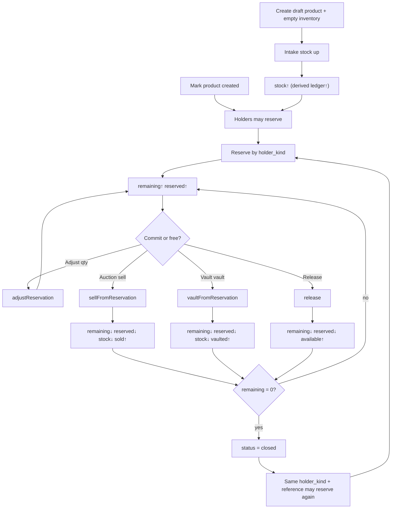
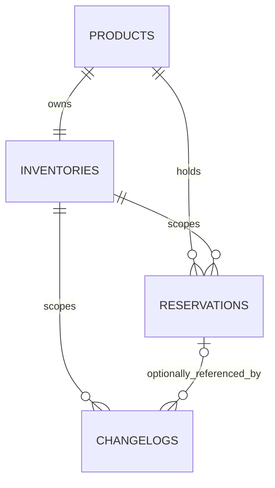

## Context

Grade10 has no aggregate house-stock owner. Auction has a thin product identity
and Shopify owns storefront quantities, but neither arbitrates stock shared by
Auction and Vault. Vault's real product story is custody (`vaulted` →
`released`), not sale. Capability:
[`grade10-inventory/catalog`](specs/grade10-inventory/catalog/spec.md).
Screens: [ui.md](ui.md).

This design follows `docs/conventions/packages.md`,
`docs/conventions/backend.md`, `docs/architecture/cross-service.md`,
`docs/architecture/multi-product.md`, and
`docs/architecture/security.md` in the grade10 monorepo.

## Goals / Non-Goals

**Goals:**

- Ship one inventory snapshot per product (`UNIQUE(product_id)`).
- Serialize every count transition on that snapshot under row lock.
- Reserve quantities for consumers classified by explicit `holder_kind`
  (`grade10-auction` | `grade10-vault`), with remaining / sold / vaulted / released tracking.
- Allow reservation quantity adjust and **product change** with inventory
  `reserved` sync and changelog.
- Support partial sell-from-reservation (Auction), partial
  vault-from-reservation (Vault), and partial release.
- Retain an append-only explanation of how the current counts were reached.

**Non-Goals:**

- `reservation_allocations`, multi-inventory rows, or inventory `status`.
- Identifying or tracking individual physical objects.
- Auction listing editor UI or auction-worker save/create orchestration (holder
  RPCs are defined here; wiring lives in `add-admin-auction-campaigns`).
- Shopify inventory sync, ZZZ inventory, warehouses, or transfers.
- New design-system or `@grade10/ui` components.

## Decisions

### Inventory is a standalone product boundary

Place the product under `packages/inventory/{contracts,backend,admin-frontend}`
publishing `@grade10/inventory-contracts`,
`@grade10/inventory-service`, and
`@grade10/inventory-admin-frontend`. The thin worker lives at
`apps/backend/grade10/inventory`. Register `inventory` in
`packages/app-env` for Grade10 only and bind `INVENTORY_SERVICE` on the API
gateway for admin HTTP routing.

**Rejected:** inventory inside Auction or Vault. **Rejected:** Shopify as the
ledger.

### Product and inventory are one-to-one

`products` owns descriptive identity and lifecycle `status` (`draft` |
`created`). `inventories` has its own immutable id and a **unique**
`product_id` foreign key — exactly one inventory row per product.

Product create inserts both rows in one transaction: product in `draft` with
one inventory at zero counts. Marking `created` is an explicit admin write.
Holder reserve and adjust-up require `status = 'created'`.

There is no inventory-unit table and no `reservation_allocations` table —
quantity integrity, not item identity.

**Rejected:** multiple inventory rows per product. **Rejected:** allocation
lines that pin quantity across buckets.

### The snapshot stores balances; ledger and available are derived

`inventories` stores `stock`, `reserved`, `sold`, `withdrawn`, and `vaulted`.
The service updates these counters in the same locked transaction as the
mutation. Tests reconcile `reserved` with the sum of active reservation
`remaining` after every transition.

```text
available = stock - reserved                    # derived, not a column
ledger    = stock + sold + withdrawn + vaulted  # derived, not a column
```

| Transition | stock | reserved | vaulted | sold | withdrawn | derived ledger |
| --- | --- | --- | --- | --- | --- | --- |
| Intake (stock up) | ↑ | — | — | — | — | ↑ |
| Free-pool sell / withdraw (stock down) | ↓ | — | — | ↑ / ↑ | ↑ / — | — |
| Reserve / adjust-up | — | ↑ | — | — | — | — |
| Release / adjust-down | — | ↓ | — | — | — | — |
| Sell-from-reservation | ↓ | ↓ | — | ↑ | — | — |
| Vault-from-reservation | ↓ | ↓ | ↑ | — | — | — |

Sold, withdrawn, and vaulted SHALL never decrease.

**Rejected:** store `ledger`. **Rejected:** Postgres triggers that sync
`reserved` from child rows — app writes under lock (option A).

### Reservations are product-level headers on the single inventory

`reservations` is the hold header: `product_id`, `inventory_id` (the product's
one row), `holder_kind`, `holder_reference`, `remarks`, `quantity`,
`remaining`, `sold`, `vaulted`, `released`, `status` (`active` | `closed`).

`quantity = remaining + sold + vaulted + released`. Inventory `reserved`
equals the sum of `remaining` on active reservations for that product.

Partial unique: `UNIQUE (holder_kind, holder_reference) WHERE status = 'active'`.
After close, the same kind + reference MAY reserve again (new row).

**Rejected:** `reservation_allocations`. **Rejected:** immutable reservation
quantity — adjust changes quantity under the same id.

### Reserve, adjust, release, and settle under one inventory lock

All mutations lock the product's inventory row (`FOR UPDATE`), then:

1. **Reserve** — refuse if product not `created` or available < qty; insert
   active reservation; `reserved += qty`.
2. **Adjust** — `floor = sold + vaulted + released`; new qty ≥ floor; delta =
   new remaining − old remaining; refuse adjust-up if available < delta;
   update reservation quantity/remaining; `reserved += delta`.
3. **Release** — decrease remaining and `released`; `reserved -= qty`; close
   when remaining = 0.
4. **Sell-from-reservation** — decrease remaining; increase reservation sold
   and inventory sold; decrease stock and reserved.
5. **Vault-from-reservation** — decrease remaining; increase reservation
   vaulted and inventory vaulted; decrease stock and reserved.

Each successful mutation appends one changelog in the same transaction.

Do **not** release the whole reservation and create a new one for listing qty
edits — use `adjustReservation(id, newQuantity)`. For listing **product**
changes, use `changeReservationProduct(id, newProductId, newQuantity)` under
one transaction locking both inventory rows — do not release-then-reserve from
Auction.

### Named service entrypoints are the holder grant

The worker exports `AuctionInventoryService` and `VaultInventoryService`.
Each closes over `holder_kind`; kind is never RPC input.

Holder surface includes reserve, adjust, changeReservationProduct, release,
sell-from-reservation (Auction only), vault-from-reservation (Vault only),
and scoped reads.

Auction eligibility list: products with `status = created` and available > 0.

### Read models are scoped before serialization

Admin queries return full snapshot, reservations grouped by `holder_kind`, and
changelogs. Holder queries return available and own reservations only.

### Changelogs are the transition ledger

One business mutation → one changelog. Actions include `adjust` and
`change-product`. Reserve, release, adjust, change-product,
sell-from-reservation, and vault-from-reservation snapshot
both inventory and the affected reservation. Intake and terminal transitions
snapshot inventory with the quantity delta.

Elevated admin mutations also use the platform audit chain.

### Admin composition and RBAC

Add `inventory:read` and `inventory:write`. Brand pages under
`apps/admin/grade10/src/pages/inventory/` compose
`@grade10/inventory-admin-frontend` (products list, product page).

## Flows

### Count and reservation lifecycle



## Database schema

Schema lives in `@grade10/inventory-service` under PostgreSQL schema
`inventory`. Timestamps: `timestamp(3) with time zone`.

### Entity relationships



### `products`

| Column | PostgreSQL type | Null | Default / constraint | Meaning |
| --- | --- | --- | --- | --- |
| `id` | `text` | No | App-minted `prd_<uuid>`, PK | Product identity |
| `name` | `text` | No | Trimmed length 1–200 | Display name |
| `description` | `text` | No | `''` | Long-form description; may be empty |
| `status` | `text` | No | `'draft'`; check in `draft`, `created` | Lifecycle: `draft` until marked `created`; holders may reserve only when `created` |
| `created_at` | `timestamp(3) with time zone` | No | `now()` | Create time |
| `updated_at` | `timestamp(3) with time zone` | No | `now()` | Last metadata or status change |
| `created_by` | `text` | No | Operator user id | Operator who created the product |
| `remarks` | `text` | No | `''` | Operator notes; editable |

`draft` → `created` is an explicit admin write; `created` → `draft` is refused.

### `inventories`

Each product owns exactly one inventory row (`UNIQUE product_id`), seeded at
product create with zero counts.

| Column | PostgreSQL type | Null | Default / constraint | Meaning |
| --- | --- | --- | --- | --- |
| `id` | `text` | No | App-minted `inv_<uuid>`, PK | The product's single inventory row identity |
| `product_id` | `text` | No | FK → `products.id`; **UNIQUE** | Owning product; one row per product |
| `stock` | `bigint` | No | `0`; non-negative | Units on hand (`available + reserved`); ↑ intake, ↓ sell / withdraw / settle-from-reservation |
| `reserved` | `bigint` | No | `0`; `0 ≤ reserved ≤ stock` | Units held by active reservations; app-written under lock = Σ active `remaining` |
| `sold` | `bigint` | No | `0`; non-negative | Lifetime units sold from this product's pool |
| `withdrawn` | `bigint` | No | `0`; non-negative | Lifetime units withdrawn from this product's pool |
| `vaulted` | `bigint` | No | `0`; non-negative | Lifetime units vaulted from this product's pool |
| `created_at` | `timestamp(3) with time zone` | No | `now()` | Row create time (seeded with product) |
| `updated_at` | `timestamp(3) with time zone` | No | `now()` | Last successful count transition on this row |

**No `ledger` column.** **No `status` column.** Readers derive `available` and
`ledger`.

Before-update trigger rejects decreases of `sold`, `withdrawn`, or `vaulted`.

### `reservations`

Product-level hold header on the product's single inventory row.

| Column | PostgreSQL type | Null | Default / constraint | Meaning |
| --- | --- | --- | --- | --- |
| `id` | `text` | No | App-minted `res_<uuid>`, PK | Reservation identity |
| `product_id` | `text` | No | FK → `products.id` | Product this hold is for |
| `inventory_id` | `text` | No | FK → `inventories.id` | The product's one inventory row this hold scopes |
| `holder_kind` | `text` | No | Check in `grade10-auction`, `grade10-vault` | Consumer classifier (explicit; not inferred from reference) |
| `holder_reference` | `text` | No | Non-empty business key | Holder's idempotency / business id (e.g. listingId, caseId) |
| `remarks` | `text` | No | `''` | Optional operator or application note on why the hold exists |
| `quantity` | `bigint` | No | 1–500; changes via adjust | Current hold size; `remaining + sold + vaulted + released` |
| `remaining` | `bigint` | No | ≤ quantity | Still reserved |
| `sold` | `bigint` | No | `0` | Sold from this hold (Auction) |
| `vaulted` | `bigint` | No | `0` | Vaulted from this hold (Vault) |
| `released` | `bigint` | No | `0` | Released back to available |
| `status` | `text` | No | `active` or `closed` | `active` while `remaining > 0`; `closed` when `remaining = 0` |
| `created_at` | `timestamp(3) with time zone` | No | `now()` | Reserve time |
| `updated_at` | `timestamp(3) with time zone` | No | `now()` | Last successful reservation mutation |
| `created_actor_kind` | `text` | No | `operator`, `application`, `server` | Who created the hold |
| `created_actor_id` | `text` | Yes | NULL for server | Actor id at create |
| `closed_at` | `timestamp(3) with time zone` | Yes | NULL while active | When remaining hit zero |
| `closed_actor_kind` | `text` | Yes | Required when closed | Who closed the hold |
| `closed_actor_id` | `text` | Yes | NULL for server close | Actor id at close |

Constraints:

- `quantity = remaining + sold + vaulted + released`
- Partial unique: `UNIQUE (holder_kind, holder_reference) WHERE status = 'active'`
- Index `(product_id, status, holder_kind)`

### `changelogs`

| Column | PostgreSQL type | Null | Default / constraint | Meaning |
| --- | --- | --- | --- | --- |
| `id` | `text` | No | App-minted `chg_<uuid>`, PK | Changelog row identity |
| `occurred_at` | `timestamp(3) with time zone` | No | `now()` | When the transition happened |
| `inventory_id` | `text` | No | FK → `inventories.id` | Inventory row whose counts changed |
| `subject_kind` | `text` | No | `product`, `inventory` | Whether the write was product metadata or a count transition |
| `actor_kind` | `text` | No | `operator`, `application`, `server` | Who performed the action |
| `actor_id` | `text` | Yes | NULL for server | Actor id |
| `action` | `text` | No | See constraint list below | Transition type |
| `quantity` | `bigint` | Yes | Transition qty; for adjust, new quantity | Delta or new quantity for the action |
| `reservation_id` | `text` | Yes | Required for reservation actions | Affected reservation, when applicable |
| `sold_total_price` | `bigint` | Yes | Sell actions | Sale proceeds in minor units |
| `sold_currency` | `text` | Yes | Sell actions | ISO 4217 currency for sale |
| `reason` | `text` | Yes | Withdraw; optional intake | Operator reason text |
| `before` | `jsonb` | Yes | NULL only for product-create | Snapshot before the transition |
| `after` | `jsonb` | No | Canonical snapshot | Snapshot after the transition |

`action` values: `product-create`, `product-update`, `intake`, `reserve`,
`adjust`, `change-product`, `release`, `sell-from-reservation`,
`vault-from-reservation`, `sell`, `withdraw`.

Append-only triggers on changelogs. Composite FK `(reservation_id,
inventory_id)` → `reservations` when reservation_id set.

### `audit_logs`

Instantiate shared `createAuditLogsTable(inventorySchema)` unchanged.

Index on `products (status)` supports the Auction eligibility list.

## Contracts

**New.** `@grade10/inventory-contracts` is the wire surface both ends compile
against: codecs, failure vocabulary, admin procedure shapes, holder service
APIs, and binding helpers. No drizzle, hono, or workers globals.

### Shared wire types

| Type | Stored / wire fields | Derived on read |
| --- | --- | --- |
| `Product` | `id`, `name`, `description`, `remarks`, **`status`** (`draft` \| `created`), `createdAt`, `updatedAt`, `createdBy` | — |
| `InventorySnapshot` | `id`, `productId`, `stock`, `reserved`, `sold`, `withdrawn`, `vaulted`, `createdAt`, `updatedAt` | `available`, `ledger` |
| `Reservation` | `id`, `productId`, `inventoryId`, `holderKind`, `holderReference`, `remarks`, `quantity`, `remaining`, `sold`, `vaulted`, `released`, **`status`** (`active` \| `closed`), actor stamps, `closedAt` | — |
| `Changelog` | `id`, `occurredAt`, `inventoryId`, `subjectKind`, `actorKind`, `actorId`, `action`, `quantity`, `reservationId`, sell money fields, `reason`, `before`, `after` | — |
| `AuctionEligibleProduct` | `productId`, `name`, `available` | — |

Products use **`status`** (`draft` \| `created`); reservations use **`status`**
(`active` \| `closed`). Inventory rows have no `status` column.

Quantity bounds: intake, reserve, adjust, release, sell, vault, and withdraw
quantities are integers **1–500** unless the scenario names a refusal.

Money on free-pool and sell-from-reservation actions uses minor units plus
ISO 4217 currency, same as store contracts.

### Admin tRPC (`inventory.*`)

Routed through the API gateway to the inventory worker. Requires
`inventory:read` or `inventory:write` as appropriate.

| Procedure | Purpose |
| --- | --- |
| `products.list` | Every product with status and snapshot counts (catalog-SC-13) |
| `products.get` | One product, its single inventory snapshot, reservations by `holderKind`, changelogs (catalog-SC-29) |
| `products.create` | Draft product + zeroed inventory (catalog-SC-01) |
| `products.update` | Name, description, remarks only (catalog-SC-57) |
| `products.markCreated` | One-way `draft` → `created` (catalog-SC-52, catalog-SC-54) |
| `inventory.intake` | Stock up (catalog-SC-05, catalog-SC-06) |
| `inventory.sell` | Free-pool sell (catalog-SC-10) |
| `inventory.withdraw` | Free-pool withdraw (catalog-SC-11) |
| `reservations.release` | Partial or full release; admin may act for any kind (catalog-SC-22, catalog-SC-35) |
| `reservations.adjust` | `adjustReservation(id, newQuantity)` (catalog-SC-47–catalog-SC-50) |
| `reservations.changeProduct` | `changeReservationProduct(id, newProductId, newQuantity)` (catalog-SC-51, catalog-SC-63–catalog-SC-65) |
| `reservations.sellFromReservation` | Auction holds only (catalog-SC-36, catalog-SC-37) |
| `reservations.vaultFromReservation` | Vault holds only (catalog-SC-38) |
| `changelogs.list` | Product-scoped history (catalog-SC-23–catalog-SC-28, catalog-SC-41–catalog-SC-44) |

Admin fixture client mirrors every procedure above for frontend work without a
running worker.

### Holder service bindings

Machine-only; not exposed on the public gateway. `holderKind` is fixed by the
bound entrypoint — never an RPC input.

| Entrypoint | Closed-over kind | Methods |
| --- | --- | --- |
| `AuctionInventoryService` | `grade10-auction` | `getAvailability`, `reserve`, `adjustReservation`, `changeReservationProduct`, `release`, `sellFromReservation`, `listOwnReservations`, `listEligibleProducts` |
| `VaultInventoryService` | `grade10-vault` | `getAvailability`, `reserve`, `adjustReservation`, `changeReservationProduct`, `release`, `vaultFromReservation`, `listOwnReservations` |

`listEligibleProducts` returns only products with **`status = created`** and
**available > 0** (catalog-SC-61, catalog-SC-62). Consumed by Auction and by
the admin listing editor via fixtures until inventory ships.

**Rejected:** caller-supplied `holderKind`. **Rejected:** Vault exposing
`sellFromReservation`. **Rejected:** Auction exposing `vaultFromReservation`.

Binding shape follows existing product workers:

```typescript
export type AuctionInventoryServiceApi = { /* methods above */ };
export type VaultInventoryServiceApi = { /* vault methods above */ };

export type AuctionInventoryServiceBinding = {
  createAuctionInventoryService():
    | AuctionInventoryServiceApi
    | Promise<AuctionInventoryServiceApi>;
};
export type VaultInventoryServiceBinding = {
  createVaultInventoryService():
    | VaultInventoryServiceApi
    | Promise<VaultInventoryServiceApi>;
};
```

Worker default export exposes both factories; Auction binds
`createAuctionInventoryService`, Vault binds `createVaultInventoryService`.

### Typed refusals

Contract failures name at least: unknown product, unknown reservation, invalid
quantity, insufficient available stock, product not `created`, reservation not
`active`, wrong holder kind, adjust below settled floor, product change to
same product (use adjust), unauthorized, and idempotent active reserve retry
(returns existing row, no history).

### Grade10 Auction listing integration

[`add-admin-auction-campaigns`](../add-admin-auction-campaigns/design.md)
consumes holder RPCs for listing draft Saves:

- **`reserve`** — first explicit Save with product + quantity (default qty 1).
- **`adjustReservation`** — quantity change on same product.
- **`changeReservationProduct`** — product change in one transaction.
- **`release`** — clear product/qty or listing cancel.

Auction **`listings.create`** verifies an active hold matches; it does not
call inventory. Listing editor uses explicit Save only (no auto-save).

## Risks / Trade-offs

- **No physical identity** → quantity integrity only.
- **Cached `reserved`** → app-written under lock; tests reconcile with Σ
  active `remaining`.
- **Monotonic vaulted / sold / withdrawn** → no unvault/unsell.
- **Quantity cap 500** → large holds use multiple references.
- **Draft products** → holders cannot reserve until marked `created`.

## Migration Plan

Greenfield `grade10-inventory` Neon database with products, inventories,
reservations (no allocation table), changelogs, constraints, triggers, and
audit genesis in the initial migration. Deploy worker after auth and before or
with the admin frontend.

## Open Questions

None that change the specs or task breakdown.
