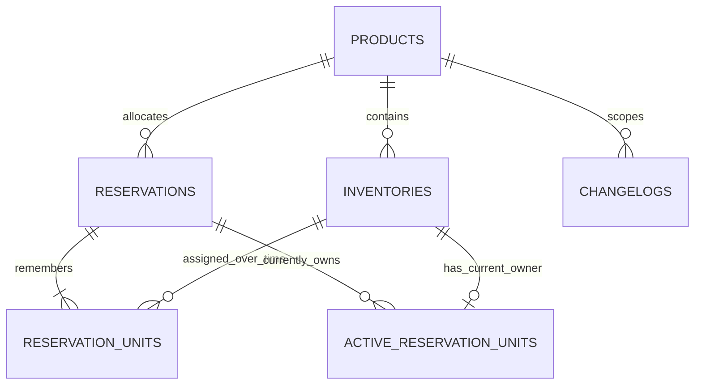

## Context

Grade10 has no house stock ledger. Auction has a thin product identity and
Shopify owns storefront quantities, but neither can arbitrate physical units
shared by Auction, Vault, and later Grade10 applications. See
[proposal.md](proposal.md). Capability:
[`grade10-inventory/catalog`](specs/grade10-inventory/catalog/spec.md).
Screens: [ui.md](ui.md).

This design follows `docs/conventions/packages.md`,
`docs/conventions/backend.md`, `docs/architecture/cross-service.md`,
`docs/architecture/multi-product.md`, and `docs/architecture/security.md` in
the grade10 monorepo.

## Goals / Non-Goals

**Goals:**

- Ship a Grade10-only inventory worker and admin console for products,
  serialized units, and application reservations.
- Make reservation ownership orthogonal to physical unit state so multiple
  applications can hold disjoint units of the same product.
- Enforce one active holder per unit atomically and make another holder's
  reserved units invisible across the service boundary.
- Record the holder, purpose, external reference, concrete unit ids, and actor
  for every reservation and release.
- Record every successful ledger mutation in domain history; elevated operator
  writes also use the platform audit chain.

**Non-Goals:**

- Changing Auction or Vault flows to call inventory in this change.
- Shopify inventory sync, ZZZ inventory, warehouses, transfers, or receiving.
- New design-system or `@grade10/ui` components.

## Decisions

### Inventory is a standalone product boundary

Place the product under `packages/inventory/{contracts,backend,admin-frontend}`
publishing `@grade10/inventory-contracts`, `@grade10/inventory-service`, and
`@grade10/inventory-admin-frontend`. The thin worker lives at
`apps/backend/grade10/inventory`. Register `inventory` in
`packages/app-env` for Grade10 only and bind `INVENTORY_SERVICE` on the API
gateway for admin HTTP routing.

**Rejected:** inventory inside Auction or Vault. Physical stock outlives any
one consumer and must arbitrate between them. **Rejected:** Shopify as the
ledger. It owns retail locations, not all Grade10-held stock.

### Serialized units remain the source of quantity

`inventories` stores one row per physical item. Adding quantity N inserts N
rows with distinct ids. There is no product or unit quantity column.

This makes the conservation rule structural: for a product, every unit row is
either linked to one active reservation or has no active reservation.

**Rejected:** quantity buckets per holder. They cannot prove which physical
item is held, cannot prevent the same item from appearing in two workflows,
and lose the per-unit trace needed by Auction and Vault.

### Unit state and reservation ownership are separate axes

Unit state is `in-stock` | `auction-sold` | `withdrawn`. Availability is
derived as `in-stock` with no active reservation. A held unit remains
`in-stock`; the reservation, not the state string, says who holds it and why.
Sold money is present only for `auction-sold`.

A held unit cannot change state. Its holder or an admin must release it first;
Auction settlement wiring can later compose release and sale under its own
idempotent workflow.

**Rejected:** `auction-listing` or `{app}-held` unit states. They conflate a
physical state with application ownership and require enum growth for every
new consumer. **Rejected:** a generic `reserved` state. It still cannot say
which application owns the hold or keep that holder opaque from peers.

### Count names distinguish current stock from ledger history

Use these terms in contracts, persistence queries, and UI copy:

- **stock count** — all units whose state is `in-stock`; partitions into
  available and actively reserved stock;
- **ledger count** — all retained unit rows; partitions into stock,
  `auction-sold`, and `withdrawn`.

The two equations are `available + active reserved = stock count` and `stock
count + auction-sold + withdrawn = ledger count`. Holder-scoped responses
receive available count only.

**Rejected:** using `total` for both values. It makes a correct count depend on
whether the reader silently includes historical states. **Rejected:**
`on-hand`; a withdrawn unit may still be physically present even though it is
outside reservable stock.

### Reservations are immutable-identity allocation headers plus unit links

Persistence adds:

- **reservations** — id, product_id, holder (`auction` | `vault`),
  holder_reference, purpose, state (`active` | `released`), created_at,
  updated_at, created_actor_kind, created_actor_id, released_at,
  released_actor_kind, released_actor_id.
- **reservation_units** — reservation_id, inventory_unit_id, assigned_at;
  immutable history retained after release, with product_id carried for
  composite foreign keys.
- **active_reservation_units** — inventory_unit_id primary key,
  reservation_id, product_id; current ownership only.

`(holder, holder_reference)` is unique for idempotency. A retry with the same
product, quantity, and purpose returns the existing reservation; a differing
payload is refused.

A partial release is deliberately absent. Releasing a reservation closes the
whole allocation. A consumer that needs independent lifetimes creates
separate reservation references.

**Rejected:** mutable `held_by` columns on units. They make batch intent,
purpose, idempotency, and released history implicit. **Rejected:** free-form
holder names. Named entrypoints and a finite contract vocabulary prevent an
unrecognized principal from becoming an allocation owner.

### Composite keys keep reservations inside one product

Add `UNIQUE (id, product_id)` to both `inventories` and `reservations`.
`reservation_units` and `active_reservation_units` each carry `product_id` and
have both composite foreign keys:

```sql
FOREIGN KEY (reservation_id, product_id)
  REFERENCES reservations (id, product_id),
FOREIGN KEY (inventory_unit_id, product_id)
  REFERENCES inventories (id, product_id)
```

`active_reservation_units.inventory_unit_id` remains its primary key. The
database therefore refuses both cross-product assignments and a second active
owner even if a service bug bypasses its checks.

**Rejected:** validating product equality in TypeScript only. The invariant is
part of custody integrity and must survive alternate write paths and future
refactors.

### A product-row lock makes reservation races deterministic

Reserve quantity N in one database transaction:

1. Validate integer quantity is from 1 through 500. PostgreSQL `integer` can
   represent up to 2,147,483,647, but the API never attempts that many
   serialized inserts in one transaction.
2. Lock the product row. Every reserve, release, unit-state change, and unit
   delete for that product takes this lock before reading allocation state.
3. Resolve or create the idempotency key `(holder, holder_reference)`. An
   existing exact request returns its current reservation; it never
   reactivates a released one. A differing payload is refused.
4. Select N eligible units in stable `(created_at, id)` order.
5. Refuse and roll back when fewer than N exist.
6. Insert history links, active-owner rows, and the changelog; commit once.

Illustrative SQL inside the repository transaction:

```sql
SELECT id
FROM products
WHERE id = $1
FOR UPDATE;

SELECT i.id, i.product_id
FROM inventories AS i
WHERE i.product_id = $1
  AND i.state = 'in-stock'
  AND NOT EXISTS (
    SELECT 1
    FROM active_reservation_units AS active
    WHERE active.inventory_unit_id = i.id
  )
ORDER BY i.created_at, i.id
LIMIT $2
FOR UPDATE OF i;
```

The service checks that the second query returned exactly `$2` rows before
inserting. A mismatch raises the typed insufficient-inventory refusal and the
transaction rolls back.

Without the product lock, two `READ COMMITTED` transactions can both evaluate
the `NOT EXISTS` predicate before either inserts an active-owner row:

| Step | Transaction A | Transaction B |
| --- | --- | --- |
| 1 | Selects unit U1 and locks it | Evaluates U1 as unreserved, then waits for U1 |
| 2 | Inserts active owner for U1 and commits | Acquires unchanged U1 after the wait |
| 3 | Returns success | Attempts active owner for U1 and hits unique violation `23505` |

The primary key prevents overlap, but B receives a storage fault instead of
the specified insufficient-inventory result. With the product lock, B waits
before evaluating availability; after A commits, B re-runs against current
state, sees no candidate, and returns the domain refusal.

`active_reservation_units.inventory_unit_id` is the primary key, so Postgres
enforces one current holder per unit. Concurrency tests with two real worker
entrypoints are the acceptance evidence; application checks alone are
insufficient.

Release marks the header released, deletes its active-owner rows, and appends
history in one transaction. Historical unit links stay intact.

**Rejected:** `FOR UPDATE SKIP LOCKED` without the product lock. It avoids the
unique fault but may report transient insufficiency when another reservation
later rolls back. **Rejected:** distributed locks or a Durable Object.
Postgres already owns the rows and can serialize only the affected product.

### Named service entrypoints are the holder grant

The worker exports `AuctionInventoryService` and `VaultInventoryService`.
Both implement one holder-scoped contract, but each adapter closes over its
holder id; holder is never accepted in RPC input. The default entrypoint does
not expose these methods.

The holder surface supports:

| Method | Result |
| --- | --- |
| `getAvailability(productId)` | Unreserved in-stock count only |
| `reserve(productId, quantity, purpose, holderReference)` | Idempotent own reservation + assigned unit ids |
| `getReservation(id)` / `listReservations(productId?)` | Own reservations only |
| `release(reservationId)` | Release own active reservation; foreign ids answer not found |

Contracts publish the binding narrowing and typed refusal values. A binding
is added to Auction or Vault only when that caller's integration is planned;
the entrypoints can ship unused first.

The admin API remains elevated HTTP/tRPC and may name `holder` because the
operator has a global inventory grant. The public API gateway routes admin
procedures but never holder RPC methods.

**Rejected:** a caller-supplied holder argument. Any bound service could
impersonate another app. **Rejected:** one shared secret per caller. Named
Cloudflare entrypoints make the deployment binding itself the capability and
match existing cross-service conventions.

### Read models are scoped before serialization

Repositories expose separate admin and holder queries. Admin queries join all
reservations and return stock count, ledger count, available count, active
count grouped by holder, sold/withdrawn breakdown, and reservation detail.
Holder queries filter to:

- unreserved in-stock availability; and
- reservations whose holder is fixed by the entrypoint.

They never load another holder's reservation rows into a response DTO. The
holder response omits total-unit and other-holder counts because those values
would reveal held quantities by subtraction.

**Rejected:** return the global model and filter in the caller or UI. That
crosses the trust boundary and makes an accidental field addition a data leak.

### Every ledger mutation has domain history

`changelogs` is append-only and records product, typed actor, subject,
subject-specific action, and canonical before/after JSON snapshots. Actor kind
separates a human operator from a holder application and an unowned server
path; actor id is the operator id, `auction` / `vault`, or null respectively.
Reservation snapshots include the allocation header and assigned unit ids, so
`reserve` is null → active allocation and `release` is active → released
allocation. The changelog write shares the domain transaction; refused and
idempotent no-op requests append nothing.

History cardinality follows domain subjects, not API calls or persistence
rows. Product create/update writes one product entry, unit create/update/delete
writes one entry per unit, and reserve/release writes one reservation entry.
`reservation_units` and `active_reservation_units` are representations of that
reservation and do not create extra history. Therefore one elevated quantity
add can create one platform audit entry and N domain changelog entries.

Elevated admin mutations additionally use `elevatedProcedure` and the
worker's hash-chained `audit_logs`. Application entrypoints are not operator
actions and write domain history only.

**Rejected:** audit alone. Platform audit has no subject-scoped inventory
read and does not represent machine holder actions. **Rejected:** optional
history on selected writes. It would leave gaps in physical custody.

### Admin composition and RBAC

Add `inventory:read` and `inventory:write` permissions. Only `admin` receives
them through `ALL_PERMISSIONS`. Brand pages under
`apps/admin/grade10/src/pages/inventory/` compose feature slices from
`@grade10/inventory-admin-frontend`; app code owns the table and dialogs.

The product table shows stock, ledger, available, and reserved counts. Product detail
shows unit state and active holder plus a reservation view with holder,
purpose, reference, state, and assigned unit ids. Operators can create and
release reservations on behalf of Auction or Vault through elevated writes.

**Rejected:** staff read access. Global allocation reveals custody across
applications and remains admin-only in this capability.

### Complete persistence model

Schema lives in `@grade10/inventory-service` under PostgreSQL schema
`inventory`; migrations live under the new inventory worker. Application ids
are prefixed UUID strings in `text`, matching Auction and Vault domain ids.
Every timestamp uses the shared `msTimestamp()` representation,
`timestamp(3) with time zone`, so JavaScript dates round-trip exactly.

#### Entity relationships



`reservation_units` is immutable allocation history; the active table is the
projection deleted on release. Its `inventory_unit_id` primary key supplies
the zero-or-one current-owner cardinality in the diagram. Changelog subject is
polymorphic and intentionally has no subject foreign key: a deleted unit must
remain named in history. `changelogs.product_id` remains a foreign key because
products are not deleted. `audit_logs` is a separate compliance chain for
operator requests, not a custody relationship.

#### `products`

| Column | PostgreSQL type | Null | Default / constraint |
| --- | --- | --- | --- |
| `id` | `text` | No | No database default; app-minted `prd_<uuid>`, primary key |
| `name` | `text` | No | No default; trimmed length 1–200 |
| `description` | `text` | No | `''` |
| `created_at` | `timestamp(3) with time zone` | No | `now()` |
| `updated_at` | `timestamp(3) with time zone` | No | `now()`; service advances it on update |
| `created_by` | `text` | No | No default; operator user id |
| `remarks` | `text` | No | `''` |

Index product names for the admin list only if the implemented query supports
name search; the first capability does not require that index.

#### `inventories`

| Column | PostgreSQL type | Null | Default / constraint |
| --- | --- | --- | --- |
| `id` | `text` | No | No database default; app-minted `inv_<uuid>`, primary key |
| `product_id` | `text` | No | No default; FK → `products.id` |
| `name` | `text` | No | No default; trimmed length 1–200 |
| `added_by` | `text` | No | No default; operator user id |
| `created_at` | `timestamp(3) with time zone` | No | `now()` |
| `updated_at` | `timestamp(3) with time zone` | No | `now()`; service advances it on update |
| `state` | `text` | No | `'in-stock'`; check in `in-stock`, `auction-sold`, `withdrawn` |
| `sold_price` | `integer` | Yes | `NULL`; greater than zero exactly when state is `auction-sold` |
| `sold_currency` | `text` | Yes | `NULL`; three uppercase letters exactly when state is `auction-sold` |
| `remarks` | `text` | No | `''` |

Add `UNIQUE (id, product_id)`, an index on
`(product_id, state, created_at, id)` for stable allocation and count reads,
and a sold-money check covering state, price, and currency together. PostgreSQL
`integer` tops out at 2,147,483,647; that is sufficient for one unit's minor
currency amount while the contract still requires a positive value.

#### `reservations`

| Column | PostgreSQL type | Null | Default / constraint |
| --- | --- | --- | --- |
| `id` | `text` | No | No database default; app-minted `res_<uuid>`, primary key |
| `product_id` | `text` | No | No default; FK → `products.id` |
| `holder` | `text` | No | No default; check in `auction`, `vault` |
| `holder_reference` | `text` | No | No default; non-empty holder-owned idempotency reference |
| `purpose` | `text` | No | No default; trimmed length 1–200 |
| `state` | `text` | No | `'active'`; check in `active`, `released` |
| `created_at` | `timestamp(3) with time zone` | No | `now()` |
| `updated_at` | `timestamp(3) with time zone` | No | `now()`; advances on release |
| `created_actor_kind` | `text` | No | No default; check in `operator`, `application`, `server` |
| `created_actor_id` | `text` | Yes | `NULL` only when actor kind is `server` |
| `released_at` | `timestamp(3) with time zone` | Yes | `NULL`; set exactly when state is `released` |
| `released_actor_kind` | `text` | Yes | `NULL`; set on release with the same actor-kind check |
| `released_actor_id` | `text` | Yes | `NULL`; null for server release, otherwise required when released |

Add `UNIQUE (id, product_id)`, `UNIQUE (holder, holder_reference)`, an index on
`(product_id, state, holder)`, and checks that active rows have no release
fields while released rows have `released_at` and `released_actor_kind`.
Actor-id checks require a non-empty id for operator/application and null for
server.

#### `reservation_units`

| Column | PostgreSQL type | Null | Default / constraint |
| --- | --- | --- | --- |
| `reservation_id` | `text` | No | No default |
| `inventory_unit_id` | `text` | No | No default |
| `product_id` | `text` | No | No default |
| `assigned_at` | `timestamp(3) with time zone` | No | `now()` |

The primary key is `(reservation_id, inventory_unit_id)`. Composite foreign
keys `(reservation_id, product_id)` → `reservations(id, product_id)` and
`(inventory_unit_id, product_id)` → `inventories(id, product_id)` enforce one
product without relying on application code. Index
`(inventory_unit_id, assigned_at)` for a unit's custody history. Rows are never
updated or deleted; install the same update/delete/truncate guard pattern used
for other append-only tables. A unit with any such row is therefore not
hard-delete eligible.

#### `active_reservation_units`

| Column | PostgreSQL type | Null | Default / constraint |
| --- | --- | --- | --- |
| `inventory_unit_id` | `text` | No | No default; primary key |
| `reservation_id` | `text` | No | No default |
| `product_id` | `text` | No | No default |

Use the same two composite foreign keys as `reservation_units`, plus an index
on `reservation_id` for release. Reserve inserts these rows; release deletes
them. No cascade is configured: an attempted unit or reservation deletion
cannot silently erase ownership.

#### `changelogs`

| Column | PostgreSQL type | Null | Default / constraint |
| --- | --- | --- | --- |
| `id` | `text` | No | No database default; app-minted `chg_<uuid>`, primary key |
| `occurred_at` | `timestamp(3) with time zone` | No | `now()` |
| `product_id` | `text` | No | No default; FK → `products.id` |
| `actor_kind` | `text` | No | No default; check in `operator`, `application`, `server` |
| `actor_id` | `text` | Yes | `NULL` only for `server`; otherwise required |
| `subject_kind` | `text` | No | No default; check in `product`, `inventory-unit`, `reservation` |
| `subject_id` | `text` | No | No default; intentionally no subject FK |
| `action` | `text` | No | No default; subject/action pair checked against the spec vocabulary |
| `before` | `jsonb` | Yes | `NULL`; required except for `create` and `reserve` |
| `after` | `jsonb` | Yes | `NULL`; required except for inventory-unit `delete` |

Add `(product_id, occurred_at DESC, id DESC)` and
`(subject_kind, subject_id, occurred_at DESC, id DESC)` indexes. A check
enforces valid subject/action pairs and the before/after nullability matrix.
The initial migration installs the shared append-only triggers to reject
`UPDATE`, `DELETE`, and `TRUNCATE`; application code also exposes no mutation
repository for history rows.

#### `audit_logs`

Instantiate the shared `createAuditLogsTable(inventorySchema)` unchanged. It
adds `seq bigint` primary key; `at timestamp(3) with time zone`, `actor_id
text`, `actor_roles text`, `action text`, `ok boolean`, and `hash text` as
non-null columns without defaults; and nullable `subject_type text`,
`subject_id text`, `details text`, and `prev_hash text`, all defaulting to
`NULL`. Add its standard `at` index, hash-chain append path, append-only
triggers, and genesis migration. Changelog JSON is domain state; audit
`details` remains canonical text because its exact stored bytes are hashed.

An unreserved `in-stock` or `withdrawn` unit that has never appeared in
`reservation_units` may be hard-deleted after its changelog is written.
Active, sold, and previously reserved units cannot be deleted, preserving both
current custody and immutable reservation history.

## Risks / Trade-offs

- **Named entrypoints ship before consumers** → contract and auxiliary-worker
  tests prove the boundary; caller bindings land with each later integration.
- **Whole-reservation release** → callers use one reference per independently
  releasable allocation; add partial release only with a concrete workflow.
- **Two history stores** → admin custody views use domain history; the Audit
  section remains the operator compliance view.
- **Hard unit delete** → only unreserved non-sold units are eligible; add
  tombstones later if operational retention requires them.
- **Quantity cap 500** → protects transaction size; large intake or holds use
  multiple requests.

## Migration Plan

Create a greenfield `grade10-inventory` Neon database with all constraints in
its initial migration; there is no Auction backfill. Deploy the inventory
worker after auth and before or with the admin frontend. The API gateway
binding is required for admin calls. Named consumer entrypoints need no caller
binding until Auction or Vault integration work lands.

Rollback removes the unused admin route and worker deployment. Once real
reservations exist, retain the database and restore the service rather than
dropping custody history.

## Open Questions

None that change the specs, approach, or task breakdown. Auction and Vault are
the initial holder vocabulary. Other Grade10 applications get a named
entrypoint only when their physical-stock workflow is specified.
