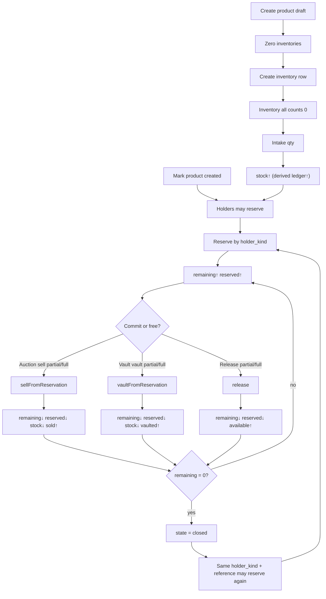
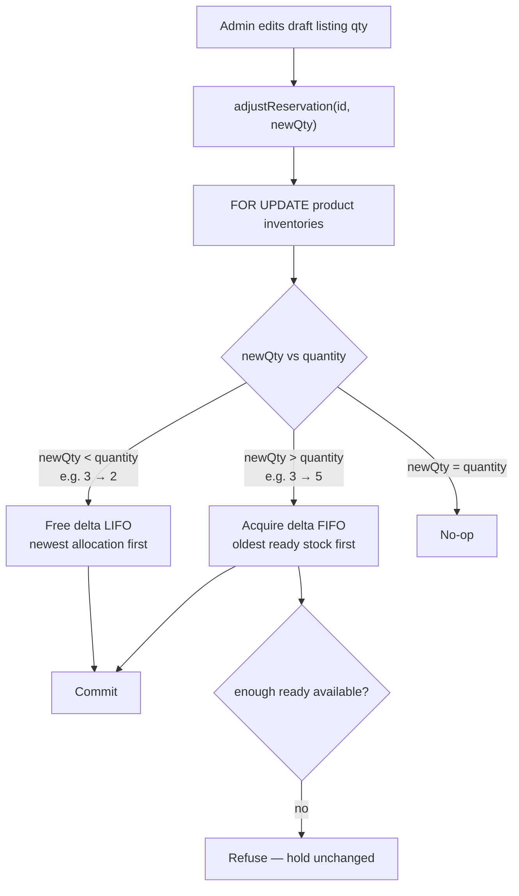
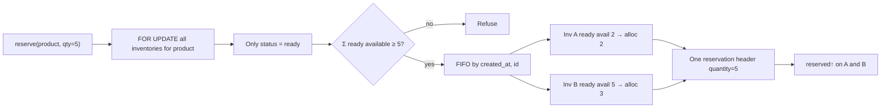
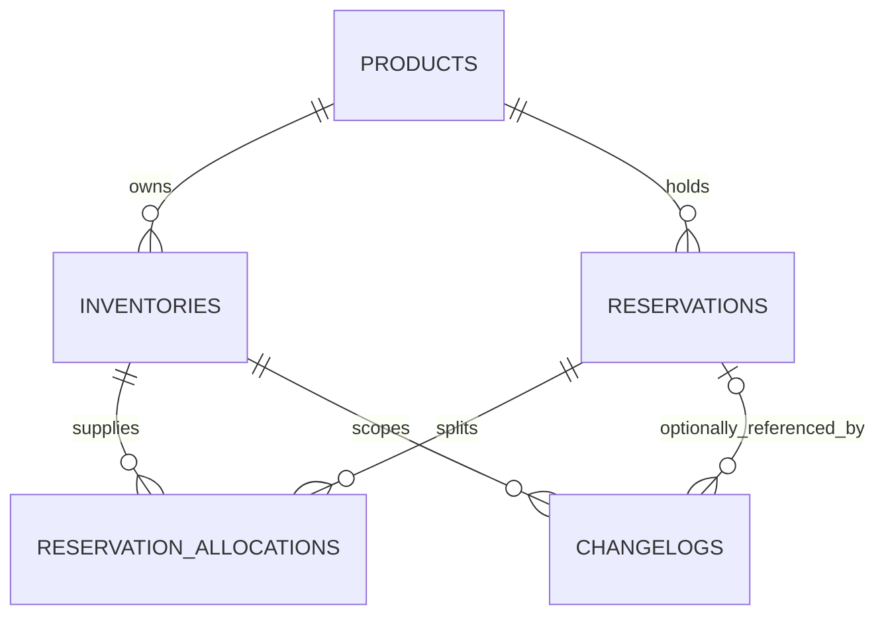

## Context

Grade10 has no aggregate house-stock owner. Auction has a thin product identity
and Shopify owns storefront quantities, but neither arbitrates stock shared by
Auction and Vault. Vault’s real product story is custody (`vaulted` →
`released`), not sale — see the implementing repo’s
`docs/architecture/vault.md`. Capability:
[`grade10-inventory/catalog`](specs/grade10-inventory/catalog/spec.md).
Screens: [ui.md](ui.md).

This design follows `docs/conventions/packages.md`,
`docs/conventions/backend.md`, `docs/architecture/cross-service.md`,
`docs/architecture/multi-product.md`, and
`docs/architecture/security.md` in the grade10 monorepo.

## Goals / Non-Goals

**Goals:**

- Ship inventory snapshots per product stock-up row (multiple rows per product;
  admins create rows explicitly; product create starts `draft` with zero
  inventories), including a separate stored `vaulted` partition and a derived
  ledger.
- Product lifecycle `draft` | `created` (one-way mark); holder reserve only
  when `created`.
- Serialize every count transition on that snapshot.
- Reserve quantities for consumers classified by explicit `holder_kind`
  (`auction` | `vault`), with remaining / sold / vaulted / released tracking.
- Support partial sell-from-reservation (Auction), partial
  vault-from-reservation (Vault), and partial release back to available.
- Allow the same business reference to reserve again after a reservation
  closes.
- Retain an append-only explanation of how the current counts were reached.

**Non-Goals:**

- Identifying or tracking individual physical objects.
- Wiring Auction or Vault flows to inventory in this change.
- Unvault (decrementing `vaulted` back to stock).
- Shopify inventory sync, ZZZ inventory, warehouses, or transfers.
- New design-system or `@grade10/ui` components.

## Decisions

### Inventory is a standalone product boundary

Place the product under `packages/inventory/{contracts,backend,admin-frontend}`
publishing `@grade10/inventory-contracts`,
`@grade10/inventory-service`, and
`@grade10/inventory-admin-frontend`. The thin worker lives at
`apps/backend/grade10/inventory`. Register `inventory` in
`packages/app-env` for Grade10 only and bind `INVENTORY_SERVICE` on the API
gateway for admin HTTP routing.

**Rejected:** inventory inside Auction or Vault. Shared stock and its
reservation arbitration outlive either consumer. **Rejected:** Shopify as the
ledger. It owns retail locations, not all Grade10-managed stock.

### Product owns zero or more inventory rows

`products` owns descriptive identity and lifecycle `state` (`draft` |
`created`). `inventories` has its own immutable id and a non-unique
`product_id` foreign key — **multiple inventory rows per product are allowed**
(separate stock-ups / lots). There is no `UNIQUE (product_id)`.

Product create starts **`draft`** with **zero** inventories. Admins create and
edit inventory rows under the product (product page → inventory page). Intake,
free-pool sell, and withdraw target an explicit `inventory_id`. Multi-row
FIFO/LIFO picking is first-class when more than one ready row has available.

Product-level availability for **reservation** is derived only from rows that
are ready to use on a **`created`** product:

```text
product.reservable_available =
  Σ (stock - reserved) over inventories of that product
  where status = 'ready'
```

Rows with `status = 'stocked'` hold quantity after intake but MUST NOT be used
for reserve, increase-adjust, sell-from-reservation, vault-from-reservation,
free-pool sell, or withdraw. Intake and status-change may still target them.
Release and decrease-adjust may free remaining on existing allocation lines.
Count equations and locks still apply **per inventory row**. There is no
inventory-unit table — quantity integrity, not item identity.

**Rejected:** `UNIQUE (product_id)`. It blocks a second stock-up for the same
catalogue product. **Rejected:** one row per physical item. **Rejected:** a
boolean-only `ready` flag with no room for later states — use an explicit
`status` enum (`stocked` | `ready` in this capability).

### The snapshot stores balances; ledger and available are derived

Each `inventories` row **stores** five counters: `stock`, `reserved`,
`vaulted`, `sold`, and `withdrawn`. All five are written by the inventory
service in the same `FOR UPDATE` transaction as the domain mutation (**option
A** — application-owned totals). There is **no** trigger that maintains
`reserved` (or any other counter) from `reservation_allocations`; the service
updates allocations and inventory counters together, and tests assert
`reserved = Σ allocation.remaining` for that inventory after every transition.

```text
available = stock - reserved                    # derived, not a column
ledger    = stock + sold + withdrawn + vaulted  # derived, not a column
```

`ledger` is the lifetime quantity admitted through intake onto that row. It is
**not stored** — displaying or checking it uses the identity above. Because
`sold` / `vaulted` / `withdrawn` never decrease and intake only increases
`stock`, derived ledger is monotonic.

| Transition | stock | reserved | vaulted | sold | withdrawn | derived ledger |
| --- | --- | --- | --- | --- | --- | --- |
| Intake | ↑ | — | — | — | — | ↑ |
| Reserve / increase-adjust | — | ↑ | — | — | — | — |
| Release / decrease-adjust | — | ↓ | — | — | — | — |
| Sell from reservation | ↓ | ↓ | — | ↑ | — | — |
| Vault from reservation | ↓ | ↓ | ↑ | — | — | — |
| Free-pool sell (admin) | ↓ | — | — | ↑ | — | — |
| Withdraw (admin) | ↓ | — | — | — | ↑ | — |

`vaulted`, `sold`, and `withdrawn` are monotonic in this capability (no
unvault, no unsell).

**Rejected:** store `ledger` — it duplicates `stock + sold + withdrawn +
vaulted` and invites drift. **Rejected:** Postgres triggers to maintain
`reserved` / `sold` / `vaulted` / `withdrawn` / `stock` from allocations —
free-pool sell/withdraw have no allocation rows; domain logic stays in one
service transaction; locks still required either way. **Rejected:** store
`available` — it is exactly `stock - reserved`. **Rejected:** treat vaulting
as reserved-only with no partition. **Rejected:** overload `withdrawn` for
vaulting.

Admin and API responses MAY include derived `available` and `ledger` for
readability. Holder-facing availability sums `available` only over **`ready`**
rows.
### `holder_kind` classifies the consumer; reference is not the type

Every reservation carries an explicit **`holder_kind`**: `auction` or `vault`.
Classification MUST NOT be inferred from `holder_reference`, reservation id,
or purpose text. The bound service entrypoint closes over `holder_kind`; RPC
input never supplies it.

| `holder_kind` | Typical `holder_reference` | Commit op |
| --- | --- | --- |
| `auction` | Auction `listingId` | `sellFromReservation` |
| `vault` | Vault `caseId` | `vaultFromReservation` |

**Rejected:** a single ambiguous “holder string” where callers encode kind into
the reference (`auction:listing-1`). Kind is a first-class column and contract
enum. **Rejected:** inferring Vault vs Auction from id shape.

### Reservations are product-level; allocations pin inventory buckets

A **reservation** is the business hold (one listing / one case): product,
`holder_kind`, reference, and aggregate quantity partitions. It does **not**
point at a single `inventory_id`.

**`reservation_allocations`** are the lines that pin quantity to inventory
rows. One reserve may create one or more lines when filling across buckets:

```text
# reservation header
quantity = remaining + sold + vaulted + released
remaining > 0  ⇔  state = active

# each allocation line
line.quantity = line.remaining + line.sold + line.vaulted + line.released
Σ line.quantity = reservation.quantity
Σ line.remaining = reservation.remaining
```

Per inventory row, `reserved` equals the sum of **allocation** `remaining`
for that `inventory_id` (not the reservation header alone).

#### Reserve across inventories

`reserve(productId, qty, …)` under one transaction:

1. Lock all inventory rows for that product in `id` order (`FOR UPDATE`).
2. Consider only rows with `status = 'ready'`. Sum their available; refuse if
   reservable available &lt; qty.
3. Allocate FIFO by `(created_at, id)` among **ready** rows: take
   `min(needed, available)` from each until qty is filled (one line when a
   single ready row covers the qty; multiple lines when it spans stock-ups).
4. Insert the reservation header and one allocation line per contributing
   inventory; increment each row’s `reserved`.
5. Append changelog(s) and commit.

If inventory A is `ready` with 2 available and B is `stocked` with 5 on hand, a
reserve of 5 refuses (only 2 reservable). After B is marked `ready`, the same
reserve can fill `(A,2)` + `(B,3)`.

#### Partial sell / vault / release / adjust

**Pick policy for stock-ups and allocation lines:**

| Operation | Order | Rationale |
| --- | --- | --- |
| Reserve / increase-adjust | **FIFO** on ready inventories by `(inventories.created_at, id)` — oldest stock first | Prefer consuming older stock-ups |
| Decrease-adjust / release / sell-from-reservation / vault-from-reservation | **LIFO** on allocation lines by `(reservation_allocations.created_at, id)` — newest line first | Free or settle the most recently acquired slice first |

Increase-adjust may grow an existing line on the oldest inventory that still has
available, or insert a new line when the next ready inventory is needed.
Decrease-adjust shrinks or removes lines from the newest allocation backward;
it does **not** re-shuffle older lines to stay contiguous.

Example — two ready inventories A (older) and B (newer):

| Step | Allocations | Notes |
| --- | --- | --- |
| Reserve 3 | A:3 | Oldest stock |
| Adjust 3 → 5 | A:3, B:2 | +2 from next oldest with capacity (B) |
| Adjust 5 → 2 | A:2 | Free 3 LIFO: remove B:2, then take 1 from A |

Partial operations:

- `release(id, qty?)` — default qty = header remaining; explicit cancel of
  remaining (increases `released`); draw-down **LIFO** on lines.
- `sellFromReservation(id, qty, money)` — Auction only; draw-down **LIFO**.
- `vaultFromReservation(id, qty)` — Vault only; draw-down **LIFO**.
- `adjustReservation(id, newQuantity)` — set the hold’s `quantity` to
  `newQuantity` and move `remaining` so
  `quantity = remaining + sold + vaulted + released` with **`released`
  unchanged**.  
  - **Increase** (e.g. draft listing 3 → 5): acquire `delta` more from ready
    inventories **FIFO (oldest first)** onto this reservation; do **not**
    release-and-recreate.  
  - **Decrease** (e.g. listing 3 → 2): free `delta` from allocation remaining
    **LIFO (newest line first)** back to available; do **not** increase
    `released`.  
  - Refuse if `newQuantity < sold + vaulted + released`.  
  - Refuse increase if ready available is insufficient for `delta`.  
  - `newQuantity === quantity` is a no-op (no history).

**Rejected:** “release whole reservation then reserve again” for listing qty
edits — opens a race where another holder takes the stock. **Rejected:**
reservation row with a single `inventory_id` only. **Rejected:** multiple
active reservation headers for the same reference. **Rejected:** one row per
unit. **Rejected:** forever-unique `(holder_kind, holder_reference)` that
never reactivates. **Rejected:** FIFO draw-down on decrease — would free
oldest stock while newer allocations remain; LIFO matches “reduce the newest
stock.”

### Active reference uniqueness; re-reserve after close

Partial unique index:

```sql
UNIQUE (holder_kind, holder_reference) WHERE state = 'active'
```

- Exact retry while `active` (same product, quantity, purpose) returns the
  existing row and does not change counts.
- Differing payload while `active` is refused.
- After `closed`, the same `(holder_kind, holder_reference)` MAY create a
  **new** reservation row (relist / new hold cycle).

### The inventory rows serialize every count transition

Every intake, reserve, adjust, release, sell-from-reservation,
vault-from-reservation, free-pool sell, and withdraw locks the **affected**
inventory row(s) with `SELECT … FOR UPDATE` (for a product-scoped reserve or
adjust: all of that product’s inventories, ordered by `id`). Apply domain
checks, write reservation header and allocation lines when applicable, update
inventory counts, append changelog(s), commit.

Without the lock, concurrent reserves can both approve the last available
unit. With `FOR UPDATE`, the second waiter re-reads and receives a typed
insufficient refusal. Concurrency tests use two real worker entrypoints.

**Rejected:** Durable Object or distributed lock — PostgreSQL owns the
snapshot.

### Named service entrypoints are the holder-kind grant

| Entrypoint | Closed-over kind | Methods |
| --- | --- | --- |
| `AuctionInventoryService` | `auction` | availability, reserve, adjustReservation, release, sellFromReservation, own reads |
| `VaultInventoryService` | `vault` | availability, reserve, adjustReservation, release, vaultFromReservation, own reads |
| Default (admin HTTP) | n/a | full admin surface; may name `holder_kind` |

Holder RPC methods are not routed through the public gateway.

**Rejected:** caller-supplied `holder_kind`. **Rejected:** Vault entrypoint
exposing sell, or Auction exposing vault.

### Read models are scoped before serialization

Admin queries return the full snapshot (including `vaulted`), active and
closed reservations, quantities grouped by `holder_kind`, and changelogs.
Holder queries return available and reservations filtered by the fixed
entrypoint kind. They never load another kind’s rows into a holder response
DTO. Holder responses omit stock, ledger, aggregate reserved, and vaulted
totals so another application’s allocation cannot be inferred by subtraction.

Auction’s eligibility list returns only products with `state = created` and
ready available > 0 (sum of ready-row availables). Draft and out-of-stock
products are omitted. The auction listing editor
([`add-admin-auction-campaigns`](../add-admin-auction-campaigns/design.md))
consumes that list for `productId` selection.

### Changelogs are the transition ledger

One business mutation writes one changelog. Reserve / release /
sell-from-reservation / vault-from-reservation snapshot both inventory and the
affected reservation. Failed, refused, and idempotent no-op writes append
nothing. Elevated admin mutations also use the platform audit chain.

### Admin composition and RBAC

Add `inventory:read` and `inventory:write`. Only `admin` receives them through
`ALL_PERMISSIONS`. Brand pages under `apps/admin/grade10/src/pages/inventory/`
compose `@grade10/inventory-admin-frontend`:

- products list
- product page (`…/products/:productId`)
- inventory page (`…/products/:productId/inventories/:inventoryId` and create)

## Flows

### Count and reservation lifecycle



### Auction recording flow

```mermaid
sequenceDiagram
  participant A as Auction worker
  participant I as Inventory<br/>AuctionInventoryService
  participant DB as inventories + reservations

  Note over A,DB: holder_kind = auction (from entrypoint)<br/>holder_reference = listingId

  A->>I: reserve(productId, qty, purpose, listingId)
  I->>DB: FOR UPDATE inventory; insert active reservation
  DB-->>I: remaining = qty
  I-->>A: reservation active

  A->>I: sellFromReservation(id, soldQty, money)
  I->>DB: remaining↓ sold↑; stock↓ sold↑; reserved↓
  I-->>A: updated reservation

  opt Cancel remainder
    A->>I: release(id, restQty)
    I->>DB: remaining↓ released↑; reserved↓
  end

  Note over A,DB: When remaining = 0 → closed.<br/>Relist may reserve again with same listingId.
```

### Listing quantity adjust (Auction)



Do **not** release the whole reservation and create a new one for the edit.



`stocked` rows are locked with the product set but never allocated. When only
one **ready** inventory exists (current behaviour), FIFO yields a single
allocation line.

### Vault recording flow

```mermaid
sequenceDiagram
  participant V as Vault worker
  participant I as Inventory<br/>VaultInventoryService
  participant DB as inventories + reservations

  Note over V,DB: holder_kind = vault (from entrypoint)<br/>holder_reference = caseId<br/>Vault does not sell

  V->>I: reserve(productId, qty, purpose, caseId)
  I->>DB: FOR UPDATE inventory; insert active reservation
  DB-->>I: remaining = qty
  I-->>V: reservation active

  V->>I: vaultFromReservation(id, vaultQty)
  I->>DB: remaining↓ vaulted↑ on reservation<br/>stock↓ vaulted↑ reserved↓ on inventory
  I-->>V: updated reservation

  opt Cancel remainder before/after partial vault
    V->>I: release(id, restQty)
    I->>DB: remaining↓ released↑; reserved↓
  end

  Note over V,DB: vaulted is monotonic here (no unvault).<br/>Case release/cancel that only frees a hold uses release,<br/>not sell.
```

## Database schema

Schema lives in `@grade10/inventory-service` under PostgreSQL schema
`inventory`; migrations live under the inventory worker. Application ids are
prefixed UUID strings in `text`. Timestamps use shared `msTimestamp()`:
`timestamp(3) with time zone`.

### Entity relationships



**Today:** product create starts **`draft`** with **zero** inventories; admins
create inventory rows. A reserve usually creates **one** allocation line when
one ready row covers the qty. Multiple inventories / multi-line fills are
first-class.

Products, inventories, reservations, and allocations are not deleted, so
history foreign keys remain valid.

### `products`

| Column | PostgreSQL type | Null | Default / constraint |
| --- | --- | --- | --- |
| `id` | `text` | No | App-minted `prd_<uuid>`, PK |
| `name` | `text` | No | Trimmed length 1–200 |
| `description` | `text` | No | `''` |
| `state` | `text` | No | `'draft'`; check in `draft`, `created` |
| `created_at` | `timestamp(3) with time zone` | No | `now()` |
| `updated_at` | `timestamp(3) with time zone` | No | `now()` |
| `created_by` | `text` | No | Operator user id |
| `remarks` | `text` | No | `''` |

`draft` → `created` is an explicit admin write; `created` → `draft` is refused.
Holder reserve / adjust-up require `state = 'created'`.

### `inventories`

| Column | PostgreSQL type | Null | Default / constraint | Meaning |
| --- | --- | --- | --- | --- |
| `id` | `text` | No | App-minted `inv_<uuid>`, PK | Inventory row identity (one stock-up / lot) |
| `product_id` | `text` | No | FK → `products.id`; **not unique** | Owning product; multiple rows per product allowed |
| `status` | `text` | No | `'ready'`; check in `stocked`, `ready` | `stocked` = on hand but not usable for reserve / adjust-up / sell / vault / free-pool sell / withdraw; `ready` = those actions allowed |
| `stock` | `bigint` | No | `0`; non-negative | Units still on hand on this row (available + reserved); app-updated under lock |
| `reserved` | `bigint` | No | `0`; `0 ≤ reserved ≤ stock` | Units held on this row; app-updated under lock to match `Σ allocation.remaining` |
| `vaulted` | `bigint` | No | `0`; non-negative | Lifetime units vaulted from this row; app-updated under lock |
| `sold` | `bigint` | No | `0`; non-negative | Lifetime units sold from this row; app-updated under lock |
| `withdrawn` | `bigint` | No | `0`; non-negative | Lifetime units withdrawn from this row; app-updated under lock |
| `remarks` | `text` | No | `''` | Operator notes; editable |
| `created_at` | `timestamp(3) with time zone` | No | `now()` | Row create time (FIFO pick order among ready rows) |
| `updated_at` | `timestamp(3) with time zone` | No | `now()` | Last successful transition or edit on this row |

Checks: non-negative counts; `reserved <= stock`; `status` in (`stocked`,
`ready`). Before-update trigger rejects decreases of `sold`, `withdrawn`, or
`vaulted`. Index `(product_id, status, created_at, id)` for lock and FIFO
among ready rows.

**No `ledger` column.** Readers derive `ledger = stock + sold + withdrawn +
vaulted` and `available = stock - reserved`.

**No `UNIQUE (product_id)`.** Multiple stock-ups for the same product are
permitted. Admins create inventory rows explicitly (create product does not
seed one). New rows start with zero counts and an admin-chosen `status`
(default `ready`). Marking `ready` → `stocked` is refused while `reserved > 0`
on that row. Intake targets an inventory id.

All five stored counters are maintained by the inventory service in the locked
domain transaction (option A). Backend tests reconcile `reserved` with
allocation remaining after every race and transition. Holder-facing product
availability sums `available` only over **`ready`** rows on **`created`**
products. Admin reads may include derived `available` and `ledger`.
### `reservations`

Product-level hold header (one active header per `(holder_kind,
holder_reference)`).

| Column | PostgreSQL type | Null | Default / constraint | Meaning |
| --- | --- | --- | --- | --- |
| `id` | `text` | No | App-minted `res_<uuid>`, PK | Reservation identity |
| `product_id` | `text` | No | FK → `products.id` | Product this hold is for |
| `holder_kind` | `text` | No | Check in `auction`, `vault` | Consumer classifier (explicit; not inferred from reference) |
| `holder_reference` | `text` | No | Non-empty; business key (listingId / caseId) | Holder’s own idempotency / business id |
| `purpose` | `text` | No | Trimmed length 1–200 | Why the hold was taken |
| `quantity` | `bigint` | No | Check 1–500; changed only by adjust (and set on reserve) | Current hold size; always `remaining + sold + vaulted + released` |
| `remaining` | `bigint` | No | `≤ quantity`; active when `> 0` | Still reserved across all allocation lines |
| `sold` | `bigint` | No | `0` | Sold from this hold (Auction); sum of allocation sold |
| `vaulted` | `bigint` | No | `0` | Vaulted from this hold (Vault); sum of allocation vaulted |
| `released` | `bigint` | No | `0` | Released back to available; sum of allocation released |
| `state` | `text` | No | `active` or `closed` | `active` while remaining > 0; `closed` when remaining = 0 |
| `created_at` | `timestamp(3) with time zone` | No | `now()` | Reserve time |
| `updated_at` | `timestamp(3) with time zone` | No | `now()` | Last successful reservation mutation |
| `created_actor_kind` | `text` | No | Check in `operator`, `application`, `server` | Who created the hold |
| `created_actor_id` | `text` | Yes | `NULL` only for server | Actor id at create |
| `closed_at` | `timestamp(3) with time zone` | Yes | `NULL` while active | When remaining hit zero |
| `closed_actor_kind` | `text` | Yes | Required when closed | Who closed the hold |
| `closed_actor_id` | `text` | Yes | `NULL` for server close | Actor id at close |

Constraints and indexes:

- `quantity = remaining + sold + vaulted + released`
- `state = active` ⇔ `remaining > 0` and `closed_at` null
- `state = closed` ⇔ `remaining = 0` and `closed_at` set
- **Partial unique:** `UNIQUE (holder_kind, holder_reference) WHERE state = 'active'`
- Index `(product_id, state, holder_kind)`

Auction reservations SHOULD keep `vaulted = 0`. Vault reservations SHOULD keep
`sold = 0`. Enforced at the entrypoint.

### `reservation_allocations`

Lines that bind a reservation to concrete inventory rows. Required even when
there is only one inventory (one line). Supports multi-bucket fill without
changing the holder API.

| Column | PostgreSQL type | Null | Default / constraint | Meaning |
| --- | --- | --- | --- | --- |
| `id` | `text` | No | App-minted `ral_<uuid>`, PK | Allocation line identity |
| `reservation_id` | `text` | No | FK → `reservations.id` | Parent hold |
| `inventory_id` | `text` | No | FK → `inventories.id` | Bucket supplying this slice |
| `quantity` | `bigint` | No | 1–500; grows/shrinks with adjust on this line | Qty taken from this inventory for the hold |
| `remaining` | `bigint` | No | `≤ quantity` | Still reserved on this line |
| `sold` | `bigint` | No | `0` | Sold from this line |
| `vaulted` | `bigint` | No | `0` | Vaulted from this line |
| `released` | `bigint` | No | `0` | Released from this line back to this inventory’s available |
| `created_at` | `timestamp(3) with time zone` | No | `now()` | Line create time (LIFO draw-down / FIFO documented on inventory age) |
| `updated_at` | `timestamp(3) with time zone` | No | `now()` | Last mutation of this line |

Constraints and indexes:

- `quantity = remaining + sold + vaulted + released`
- `UNIQUE (reservation_id, inventory_id)` — one line per bucket per hold
- Index `(inventory_id)` for reserved-sum reconciliation
- Writer ensures the allocation’s inventory belongs to the reservation’s
  `product_id`

Header aggregates MUST equal the sums of the corresponding allocation columns
after every mutation (same transaction).

### `changelogs`

| Column | PostgreSQL type | Null | Default / constraint |
| --- | --- | --- | --- |
| `id` | `text` | No | App-minted `chg_<uuid>`, PK |
| `occurred_at` | `timestamp(3) with time zone` | No | `now()` |
| `inventory_id` | `text` | Yes | FK → `inventories.id`; null only for pure product metadata changes |
| `subject_kind` | `text` | No | Check in `product`, `inventory` |
| `actor_kind` | `text` | No | Check in `operator`, `application`, `server` |
| `actor_id` | `text` | Yes | `NULL` only for server |
| `action` | `text` | No | `product-create`, `product-update`, `inventory-create`, `inventory-update`, `intake`, `status-change`, `reserve`, `adjust`, `release`, `sell-from-reservation`, `vault-from-reservation`, `sell`, `withdraw` |
| `quantity` | `bigint` | Yes | Positive for inventory actions; `NULL` for product actions |
| `reservation_id` | `text` | Yes | Required for reserve/release/sell-from-reservation/vault-from-reservation |
| `sold_total_price` | `bigint` | Yes | Positive for sell actions |
| `sold_currency` | `text` | Yes | ISO 4217 for sell actions |
| `reason` | `text` | Yes | Required for withdraw; optional for intake |
| `before` | `jsonb` | Yes | `NULL` only for product-create |
| `after` | `jsonb` | No | Canonical complete snapshot |

For a reserve/settle that touches multiple inventories, append **one changelog
row per affected inventory** (same `reservation_id`, `occurred_at`, and action;
`quantity` is that line’s delta). Snapshots include the reservation header and
the allocation line for that inventory.

Indexes `(inventory_id, occurred_at DESC, id DESC)` and
`(reservation_id, occurred_at DESC, id DESC)`. Append-only triggers reject
`UPDATE` / `DELETE` / `TRUNCATE`. FK `(reservation_id)` → `reservations(id)`.

### `audit_logs`

Instantiate shared `createAuditLogsTable(inventorySchema)` unchanged.

## Risks / Trade-offs

- **No physical identity** → quantity integrity only.
- **Cached counters on each inventory** → `stock`, `reserved`, `sold`,
  `vaulted`, and `withdrawn` are app-written under the inventory row lock
  (option A). Tests reconcile `reserved` with `Σ allocation.remaining` and
  check derived `ledger = stock + sold + withdrawn + vaulted` after every
  transition and race. No counter-maintaining triggers.
- **Multi-inventory is first-class** → schema and admin UI create/edit multiple
  rows per product; reserves fill FIFO across ready rows. Product create does
  not seed an inventory.
- **Monotonic vaulted / sold / withdrawn** → no unvault/unsell in this
  capability; derived ledger never decreases while those hold.
- **Partial ops require remaining checks** → callers pass qty; default release
  qty is header remaining; increase walks ready inventories FIFO; decrease /
  release / sell / vault walk allocation lines LIFO.
- **Quantity cap 500** → large holds use multiple references or repeated ops.
- **Customer-owned Vault cases** are not inventory products; wiring only
  applies when a case is bound to a Grade10 catalogue `productId`.

## Migration Plan

Greenfield `grade10-inventory` Neon database with all tables (including
`reservation_allocations`), constraints, triggers, and audit genesis in the
initial migration. No Auction/Vault backfill. Deploy inventory worker after
auth and before or with the admin frontend. Named consumer entrypoints need no
caller binding until integration lands.

Rollback removes the unused admin route and worker deployment. Once activity
exists, retain the database and restore the service.

## Open Questions

None that change the specs, approach, or task breakdown. Unvault and full
Auction/Vault reserve-on-create wiring (beyond eligibility reads and the
listing product picker in `add-admin-auction-campaigns`) remain explicit
follow-ons. Multi-inventory create/edit and FIFO/LIFO picking are in this
change.
