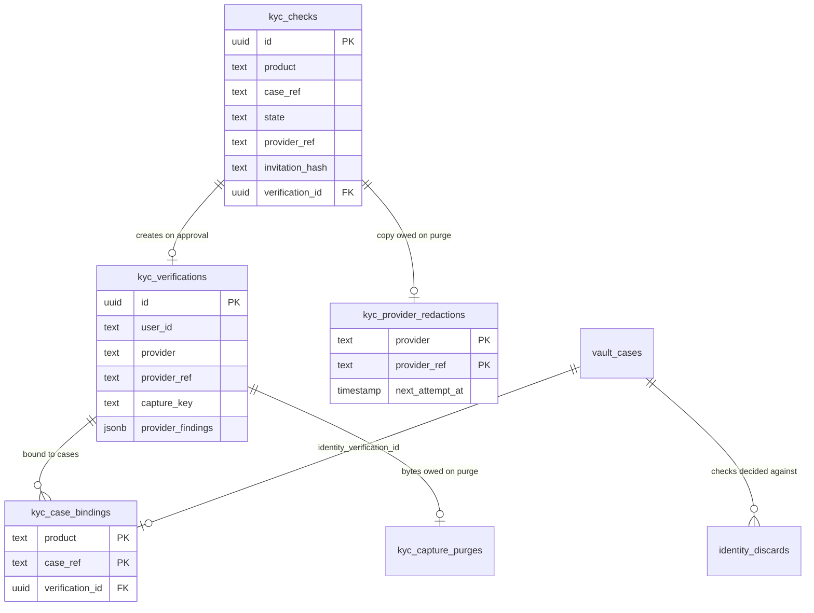

## Context

What the identity store already is, and what a hosted check has to fit into.
Motivation is the proposal; the requirements are the three delta specs.

- **The store is a worker nothing public reaches** — `grade10-e-kyc-service`,
  its own `ekyc` schema, its own R2 bucket, an hourly cron for the orphan
  sweep. No `routes`, and no `ServiceId` in `packages/app-env`, so the gateway
  cannot forward to it at all
- **Two tables and a purge queue** — `kyc_verifications` (one per check, keyed
  to the person), `kyc_case_bindings` (primary key `(product, case_ref)`, one
  identity per case), `kyc_capture_purges` (bytes still owed a delete)
- **`provider` and `provider_ref` already exist** — every row today is
  `manual` / `NULL`
- **Reached only over `KYC_SERVICE`** — a class factory mints one entrypoint
  per product, and that binding is what says which product a caller speaks
  for; `product` is never an argument
- **The vault keeps a reference, never a copy** —
  `vault_cases.identity_verification_id` and `identity_bound_at`, paired by a
  check constraint; `identity_release_pending_at` is the erasure debt
- **`recordCaseKyc` is already two-phase** — the RPC runs with no transaction
  open, then a short transaction takes the case row's lock, re-judges the
  case, voids any packet still out, and writes the reference; every id the
  locked row does not claim goes to the `identity_discards` outbox and is
  settled after commit
- **One routed worker** — `api.<brand>` forwards `/{serviceId}/*` verbatim to
  the service's default entrypoint
- **doc-sign is the precedent for a token surface** — the ceremony mounts at
  `/api/sign` on the vault worker with no session middleware, a 256-bit
  base64url secret whose digest is stored, and first-use device binding that
  refuses a second device

## Goals / Non-Goals

Goals:

- **A check with its own life** — raised, invited, walked, decided or
  abandoned, in the identity store, with nothing in the vault waiting on it
- **One settle path** — a webhook and a stalled sweep reach the same code
- **No second copy of a person** — the hosted path writes exactly the row the
  counter path writes, in the same database
- **A deployment with no provider configured behaves as it does today** — the
  counter is unchanged and no case is stranded

Non-Goals, on the delivery side:

- **No route on the e-kyc worker** — the collector's surface and the
  provider's callback mount elsewhere
- **No second area in the captures bucket** — one kind of object stays one
  kind of object
- **No vendor name in `packages/e-kyc/contracts`** — the provider is a port in
  the backend
- **No change to `recordCaseKyc`'s two-phase shape** — the hosted path reuses
  its locked transaction rather than adding a second one

## Decisions

### The check is a row in the identity store, scoped like a binding

- New table `ekyc.kyc_checks`, keyed `(product, case_ref)` the way a binding
  is, holding the provider's own reference, the invitation digest, the state
  and the timestamps.
- The product comes from the entrypoint, never an argument — the same rule
  every other write in this package follows.
- Alternatives rejected:
  - A `vault.identity_checks` table — the vault would hold the provider
    reference and the invitation digest, and finance would need a second
    copy of the whole machine.
  - Columns on `kyc_verifications` — a check that expires, is withdrawn, or
    is declined never becomes a verification, so it would have no row to
    live on.

### A verdict is a doorbell; the settle reads the check back

- The callback proves the signature, resolves which check the delivery names,
  and marks it due. **Nothing in the delivery's body is read as fact.**
- The settle then asks the provider what the check says and applies that.
- One path serves three triggers: a callback, a stalled check the provider
  never decided (`grade10-site-e-kyc-hosted-verification-SC-22` already
  requires read-back), and a callback that never arrived.
- Alternatives rejected:
  - Trust the signed body — two settle paths that can disagree, and every
    field of a body signed with a leaked secret becomes an input to a write
    of personal data.
  - Poll only, no callback — a decided check waits for the next tick, and
    the collector's page is stale for as long.

### Both public surfaces mount on the vault worker

- `/vault/api/identity/*`, beside the signing ceremony's `/api/sign`, reached
  through the gateway's existing `vault` prefix. The collector's page is an
  SPA route at `/vault/verify`.
- The routes hold no identity fields: the callback carries a provider
  reference, and the collector's read answers a state and a next step.
- Alternatives rejected:
  - Give e-kyc a route — the one thing that worker's configuration exists to
    forbid; a route there puts every customer's legal name and passport
    photograph one misconfigured origin from a browser.
  - A new routed worker — a `ServiceId` minted for one callback, and the
    collector's page would still need the case the vault owns.
- **When finance verifies somebody**, it mounts the same two routes on its own
  worker and registers a second callback URL. A verdict for another product's
  check reaching this worker resolves to null through the vault's entrypoint
  and is acknowledged without a write.

### The invitation reuses doc-sign's token shape

- 256 bits from the platform CSPRNG, base64url, carried in the URL
  **fragment**; only `sha256` of it is stored.
- First use records the digest of a cookie value; a request presenting a
  different one, or none, is a conflict — a second device continues nothing
  (`grade10-site-e-kyc-hosted-verification-SC-23`).
- The fragment never leaves the browser, so the secret is in no request path,
  no query string, no log line and no referrer
  (`grade10-site-e-kyc-hosted-verification-SC-24`) by construction rather than
  by redaction.
- The secret is returned **once**, at mint, and the vault sends it and forgets
  it. A resend is a withdraw and a new check — which is what "a new one is a
  new check" already means.
- Alternatives rejected:
  - A signed token in the path — every log line and every referrer carries
    it.
  - An emailed one-time code — a second thing to type, and the same
    storage question.

### One live check per case is a partial unique index

- `UNIQUE (product, case_ref) WHERE state IN ('invited','started','submitted','stalled')`.
- Raising inserts and catches the conflict, then reads the live check back and
  answers with it — so two requests arriving together cannot both raise one
  (`grade10-site-e-kyc-hosted-verification-SC-09`).
- Alternatives rejected:
  - Read, then insert — both requests pass the read.
  - A lock on the vault case row — the check is in another database, and the
    vault's lock cannot serialize a write it does not make.

### The provider's reference is unique, and a conflict is read back

- `UNIQUE (provider, provider_ref) WHERE provider_ref IS NOT NULL`.
- That, not the delivery, is what makes a verdict apply once
  (`grade10-site-e-kyc-hosted-verification-SC-13`): a repeated callback
  resolves to the same row, and a settle of a check already decided is a
  no-op.

### The raise inserts first and records the reference second

1. Insert the check `invited` with `provider_ref` null — the unique index
   above is taken here, before any network call.
2. Raise with the provider, passing the check's own id as the idempotency key.
3. Update the row with the reference and the environment.
4. Return the secret; the vault notifies.

- A crash between 1 and 3 leaves a live check with no reference. The settle
  work list picks it up and completes the raise, idempotently — no orphan, and
  no invitation was sent for a check that does not exist at the provider.
- Alternatives rejected:
  - Raise first, then insert — a crash between them leaves an inquiry at the
    provider that nothing here names, and the unique index cannot help.

### `KYC_PROVIDER_KINDS` gains one value; the write path gains a sibling creator

- `KYC_PROVIDER_KINDS = ["manual", "hosted"]`.
- `verification/record.ts` stops hardcoding `provider: "manual"`. The hosted
  settle calls a sibling creator in the same module rather than a branch
  inside the counter's write — the seam is the package boundary, which is what
  that file's own comment says.
- Alternatives rejected:
  - A dispatch inside `record` — every future provider adds a branch to the
    one write that must stay simple.
  - A `KYC_PRODUCTS` value — the product is who asked, not who checked.

### The vault drives the settle, under the case lock it already takes

- `settleCheck` in e-kyc does the provider read-back, the refusals, the
  document fetch and `insertAndBind`, and answers the **same `KycBound`
  shape** `record` answers.
- The vault's `settleHostedCheck(caseId)` then runs the existing `bindToCase`
  — the same locked transaction, the same re-judgment, the same packet void,
  the same `identity_discards` compensation.
- That is what delivers every refusal in
  `grade10-site/vault/identity-check` without a second write path: a case in
  custody, holding sealed evidence, erased, or verified elsewhere is already
  refused by the re-check inside that lock, and the identity the verdict
  created is already settled by the outbox.
- Alternatives rejected:
  - e-kyc binds and tells the vault — the store would have to know the
    vault's statuses, its packets and its erasure.
  - A second locked transaction for the hosted path — two places to keep the
    same five refusals correct.

### The document image is fetched before the identity exists; the face is not

- Settle order: read back → fetch the document image → put it in the bucket
  (content-addressed, so a retry is not a second object) → one transaction
  that inserts the verification, binds it, and moves the check to `approved`.
- A failed fetch leaves the check `submitted` or `stalled` with a backoff.
  Nothing is bound, so there is nothing half-written to unwind.
- No face capture is fetched at all: Grade10 runs no matching engine, so a
  stored selfie could never be re-compared. What the row keeps is the
  provider's findings.

### Erasure hooks the two purge paths that already exist

- New outbox `ekyc.kyc_provider_redactions`, written **in the same
  transaction** that purges a verification row — by `release` and by
  `discardUnbound` alike, which is every way a verification ends.
- The drain commands the provider and keeps asking on a backoff. It never
  blocks the local purge: the bytes and the row go on their own clock.
- Modelled on `erasePairing` in `packages/grade10-store` — the terminal local
  move first and alone, the vendor work idempotent on the row's own backoff.
- A standing retention window configured at the provider erases its copy
  anyway, which is what covers a check that never became a verification and
  therefore never had a row to purge.
- Alternatives rejected:
  - Block the purge until the provider acknowledges — a hosted provider
    redacts child objects asynchronously, so the acknowledgment a blocking
    purge waits for never comes.
  - Rely on the retention window alone — a release before the window closes
    leaves the copy standing for the rest of it.

### The provider is a port in the backend, not a name in contracts

- One interface beside `KycStorePort`: `raise`, `read`, `hostedUrl`,
  `fetchDocument`, `redact`. Five methods, one adapter, one fake.
- `packages/e-kyc/contracts` stays vendor-free — it is what a calling product
  imports, and a product has no business knowing who checks documents.

### The override is a second procedure, not a conditional grant

- `ADMIN_PERMISSIONS` maps a procedure to its grant statically, and the
  console renders from that map — so a grant that changes per case cannot be
  expressed there.
- `admin.recordKyc` keeps `vault:operate`. New `admin.recordKycOverride` takes
  `vault:approve` and requires a reason. `recordCaseKyc` refuses when the
  case's last hosted check is `declined` and no override reason came with it.
- That delivers `grade10-site-vault-identity-check-SC-17` deterministically,
  and the console shows the override control only to whoever may use it.

### Identity state reads under `vault:read`; identity detail takes `kyc:read`

- `admin.detail` grows the check's state, who performed the bound check, and
  when — no name, no birth date, no mask, no refusal reason.
- New `admin.caseIdentity` at `kyc:read` answers the record itself and the
  decline reason. The capture download route is already `kyc:read`.

## Database Schema

Storage rules:

- Schema `ekyc`. New timestamp columns use `msTimestamp()` —
  `timestamptz(3)` — per that schema's own `columns.ts`; the three existing
  microsecond columns are left alone.
- `kyc_verifications` gains one column. `provider` and `provider_ref` are
  already there and start meaning something.
- No new column on `vault_cases`: the check's state is read over the binding
  when a case screen is assembled, never cached.

### `ekyc.kyc_verifications` — one additive column

| Column | Type | Null | Default | Meaning |
| --- | --- | --- | --- | --- |
| `provider_findings` | `jsonb` | yes | `NULL` | What the provider checked and what each check found. `NULL` for a counter check. |

- **Grade10's own words, not the vendor's** — the adapter maps each finding to
  `{ check, outcome }` where `check` is a closed set (document authenticity,
  document expiry, face match, liveness) and `outcome` is
  `passed` / `failed` / `not_run`. A vendor's own strings never land, so a
  reader years from now needs no vendor glossary and a vendor rename is an
  adapter change.
- `jsonb` rather than a child table: nothing queries a finding, and a record
  is read whole or not at all.

### `ekyc.kyc_checks` — new

| Column | Type | Null | Default | Meaning |
| --- | --- | --- | --- | --- |
| `id` | `uuid` | no | `gen_random_uuid()` | Also the idempotency key sent to the provider. |
| `product` | `text` | no | — | From the entrypoint. |
| `case_ref` | `text` | no | — | The product's own case. Opaque. |
| `user_id` | `text` | no | — | Who the check is about. |
| `state` | `text` | no | `'invited'` | The eight states. |
| `provider` | `text` | no | — | `hosted` today. |
| `provider_ref` | `text` | yes | `NULL` | The provider's own id, written at step 3 of the raise. |
| `provider_env` | `text` | yes | `NULL` | The environment the check was raised in; a verdict signed for another is refused. |
| `invitation_hash` | `text` | no | — | `sha256` of the 256-bit secret. |
| `binding_hash` | `text` | yes | `NULL` | First-use device digest. |
| `verification_id` | `uuid` | yes | `NULL` | What an approved settle created. `REFERENCES kyc_verifications(id) ON DELETE SET NULL`. |
| `decline_reason` | `text` | yes | `NULL` | Which refusal, for an operator. |
| `override_reason` | `text` | yes | `NULL` | Why a counter check stood over this decline. |
| `overridden_by` | `text` | yes | `NULL` | Who gave it. |
| `overridden_at` | `timestamptz(3)` | yes | `NULL` | When. |
| `invited_at` | `timestamptz(3)` | no | `now()` | |
| `started_at` | `timestamptz(3)` | yes | `NULL` | |
| `submitted_at` | `timestamptz(3)` | yes | `NULL` | |
| `decided_at` | `timestamptz(3)` | yes | `NULL` | |
| `expires_at` | `timestamptz(3)` | no | — | The invitation's life, rewritten to the shorter window when the check starts. |
| `settle_due_at` | `timestamptz(3)` | yes | `NULL` | When the work list next picks it up. |
| `settle_attempts` | `integer` | no | `0` | The backoff's counter. |

Keys, constraints, indexes:

| Kind | Definition | Why |
| --- | --- | --- |
| PK | `(id)` | |
| Unique | `(product, case_ref) WHERE state IN ('invited','started','submitted','stalled')` | One live check per case, as a constraint rather than a question. |
| Unique | `(provider, provider_ref) WHERE provider_ref IS NOT NULL` | A verdict applies once, keyed on the provider's id. |
| Unique | `(invitation_hash)` | A secret opens one check. |
| Index | `(product, settle_due_at) WHERE state IN ('submitted','stalled')` | The settle work list. |
| Index | `(state, expires_at) WHERE state IN ('invited','started')` | The expiry sweep. |
| Index | `(user_id)` | An operator asking what this person has walked. |
| Check | `state IN ('invited','started','submitted','stalled','approved','declined','expired','withdrawn')` | The closed vocabulary. |
| Check | `(state IN ('approved','declined')) = (decided_at IS NOT NULL)` | A decision and its instant are one fact. |
| Check | `verification_id IS NULL OR state = 'approved'` | Only an approved check made a record. |
| Check | `(override_reason IS NULL) = (overridden_by IS NULL) AND (override_reason IS NULL) = (overridden_at IS NULL)` | An override is all three columns or none. |

Authoritative here: the state, the invitation digest, the device digest, the
override. Derived and never stored: whether the case may still take a bind —
that is the vault's, read under its own lock.

### `ekyc.kyc_provider_redactions` — new

| Column | Type | Null | Default | Meaning |
| --- | --- | --- | --- | --- |
| `provider` | `text` | no | — | |
| `provider_ref` | `text` | no | — | What the provider is told to erase. |
| `queued_at` | `timestamptz(3)` | no | `now()` | |
| `attempts` | `integer` | no | `0` | |
| `next_attempt_at` | `timestamptz(3)` | no | `now()` | The backoff. |

| Kind | Definition | Why |
| --- | --- | --- |
| PK | `(provider, provider_ref)` | One reference, one debt. |
| Index | `(next_attempt_at)` | The drain's work list, oldest due first. |

No foreign key: the row it came from is gone by the time this is drained —
that is the point.

### Entity relationships

`kyc_checks` and `kyc_verifications` are in one database; `vault_cases` and
`identity_discards` are in another, and the line between them is the
`KYC_SERVICE` binding rather than a foreign key.

## Service Interfaces

### Processing model

- **Entrypoint** — the per-product `KycServiceEntrypoint`, unchanged in shape;
  new methods land on `KycServiceApi`.
- **Service** — judges, orders the calls, owns no transaction of its own
  beyond what the store port opens.
- **Store port** — each method one atomic unit, as today.
- **Provider port** — the only thing that talks to the vendor. Never called
  inside a transaction.
- **The vault** — owns the case lock and every case refusal, and reaches all
  of the above over the binding.

| Method | Input | Success | Refusal |
| --- | --- | --- | --- |
| `raiseCheck` | `{ userId, caseRef, at }` | `{ check, invitationSecret }` on mint; `{ check, invitationSecret: null }` when one was already live | `caseHasIdentity` |
| `checkForCase` | `{ caseRef }` | `KycCheckView \| null` | — |
| `checkByProviderRef` | `{ providerRef }` | `{ caseRef } \| null` | — |
| `dueChecks` | `{ limit }` | `{ caseRef }[]` | — |
| `settleCheck` | `{ caseRef, at }` | `{ settled: "approved", verification, displacedVerificationId }` / `{ settled: "declined", reason }` / `{ settled: "pending" }` | `noLiveCheck` |
| `withdrawCheck` | `{ caseRef }` | `void`, idempotent | — |
| `openInvitation` | `{ secret, binding }` | `{ state, next }` | `expired`, `deviceConflict`, `unknown` |
| `startCheck` | `{ secret, binding }` | `{ hostedUrl }` | `expired`, `deviceConflict`, `notStartable` |

`KycCheckView` carries the state, who raised it, the instants, the decline
reason and the override — and **no identity field and no secret**. It is what
a case screen renders and what a `kyc:read` reader sees more of.

### `raiseCheck`

- **Reads** — the live check for `(product, case_ref)`.
- **Writes** — one insert; then one update carrying the provider reference.
- **Transaction** — the insert alone. The provider call is outside it.
- **Idempotency** — the partial unique index. A conflict is caught, the live
  row read back, and answered with a null secret.
- **Faults** — a provider that refuses leaves the row live with no reference;
  the settle work list retries the raise on the backoff.

### `settleCheck`

- **Reads** — the live check; then the provider, twice (the check, then the
  document image).
- **Writes** — the bucket, then one transaction: insert the verification,
  bind it to the case, move the check to `approved` with its
  `verification_id`. A declined outcome writes the state and the reason only.
- **Transaction** — one, at the end, after every network call has returned.
- **Idempotency** — a check not in `submitted` or `stalled` answers
  `pending` or the decision already recorded, so a repeated settle writes
  nothing.
- **Refusals applied here** — under age and expired document, on the vault's
  `at`, at the instant the verdict is applied.
- **Faults** — a read-back or fetch failure bumps `settle_attempts` and
  `settle_due_at` and leaves the state where it was.

### `settleHostedCheck` (vault)

- Calls `settleCheck`, then — on `approved` — the existing `bindToCase` with
  the returned verification and displaced id.
- **Everything after that is unchanged code**: the case row's lock, the
  re-judgment against `KYC_RECORDABLE_STATUSES`, sealed evidence, `erased_at`,
  the packet void, and the `identity_discards` intents the drain settles.

### Mutation example — an approved verdict binds

Before:

| Row | State |
| --- | --- |
| `kyc_checks` | `state='submitted'`, `provider_ref='inq_9'`, `verification_id=NULL` |
| `vault_cases` | `status='accepted'`, `identity_verification_id=NULL` |
| `kyc_case_bindings` | no row for `('vault','case_7')` |

Order: provider read → document fetch → bucket put → `ekyc` transaction →
vault transaction.

After:

| Row | State |
| --- | --- |
| `kyc_verifications` | new row, `provider='hosted'`, `provider_ref='inq_9'`, `capture_key='<sha256>.jpg'`, `provider_findings` mapped |
| `kyc_case_bindings` | `('vault','case_7') → <verification id>` |
| `kyc_checks` | `state='approved'`, `decided_at` set, `verification_id` set |
| `vault_cases` | `identity_verification_id` and `identity_bound_at` set |
| open packets on `case_7` | void |

### Mutation example — the same verdict, landing on a case in custody

Before: as above, but `vault_cases.status='vaulted'` with an identity already
bound.

After the `ekyc` transaction the verification and the binding exist. The
vault's locked re-check then refuses, and in the same commit:

| Row | State |
| --- | --- |
| `vault_cases` | unchanged — the identity it was vaulted under stands |
| `identity_discards` | one row for the verification the settle created |

The drain then restores the store's binding to the id the column claims and
discards the new verification; that purge queues `kyc_capture_purges` for the
image and `kyc_provider_redactions` for the provider's copy. The operator is
told the check landed and was refused.

## Contracts

New wire, all on the vault worker, all unauthenticated by session:

| Method | Path | Carries | Answers |
| --- | --- | --- | --- |
| `POST` | `/vault/api/identity/verdicts` | The provider's signature header and its body | `204` once the signature is proven and the check marked due; `401` otherwise |
| `GET` | `/vault/api/identity/invitation` | The secret in an `Authorization` header, the binding cookie | The state and the next step |
| `POST` | `/vault/api/identity/invitation/start` | The same | The provider's hosted URL, and sets the binding cookie on first use |

No path parameter anywhere: an identifier in a path is an identifier in a log.

SPA: `/vault/verify`, reading the secret from the fragment and sending it as a
header. The existing `SIGNING_PATH` pattern, one surface over.

Unchanged: every existing procedure and route. `admin.detail`'s payload grows
the identity state; `admin.caseIdentity` and `admin.recordKycOverride` are new.

## Risks / Trade-offs

- **[A callback for another product's check reaches this worker]** → the
  entrypoint resolves it to null and the route answers `204`; the owning
  product's own callback URL settles it. The refusal is a metric, so a
  misconfiguration is visible rather than silent.
- **[The provider never acknowledges a redaction]** → the outbox retries on a
  backoff, its depth and oldest entry are metrics, and the standing retention
  window at the provider erases the copy regardless.
- **[A collector loses the binding cookie mid-check]** → they cannot continue;
  the check is withdrawn and re-raised, or the counter takes it. Same
  behaviour, same reason, as the signing ceremony.
- **[The document fetch fails repeatedly]** → the check stays `submitted` or
  `stalled` and shows as such; nothing is bound, and the counter is open the
  whole time.
- **[The provider is down when a case books]** → the raise fails, the check
  row stays live with no reference, and the work list retries. No case is
  blocked: booking, valuation and every pre-custody move are independent of
  the check.
- **[The invitation secret is 256 bits in a URL a collector may forward]** →
  first-use device binding is what makes a forwarded link useless, and the
  page it opens carries no identity field.
- **[Two settles run for one case at once]** → the `ekyc` transaction and the
  vault's case lock each serialize their own half; the second settle finds the
  check decided and writes nothing.

## Migration Plan

1. **`ekyc` migration** — two new tables, their indexes, and one nullable
   column on `kyc_verifications`. Additive only, so no expand/contract phase:
   `pnpm run check:migrations` has nothing destructive to gate.
2. **`KYC_PROVIDER_KINDS` widens** — existing rows stay `manual`; no backfill.
3. **Deploy dark** — with no provider secret set, `raiseCheck` is never
   called: booking does not invite, the case screen shows `None`, and the
   counter path is byte-for-byte what it is today.
4. **Configure the provider** — template, environment, callback URL, and the
   retention window Compliance sets. Read the window back and refuse to start
   if it is unset.
5. **Enable per environment** — staging first, with a real document walked end
   to end and its provider copy confirmed redacted after a release.

Rollback is removing the provider secret: the store stops raising, live checks
expire on their own clock, and the counter carries every visit.

## Open Questions

- ❓ **Which cron carries the settle work list** — the vault's existing
  15-minute lane, or its own. Measurement decides it; neither changes the
  specs or the tasks.
- ❓ **The provider template per document type** — configuration, once
  Compliance names the documents and issuing countries.

The proposal's seven open questions are Product's and Compliance's. None of
them changes the shape above: every one of them is a value, a wording, or a
policy class this design already has a column or a refusal for.
