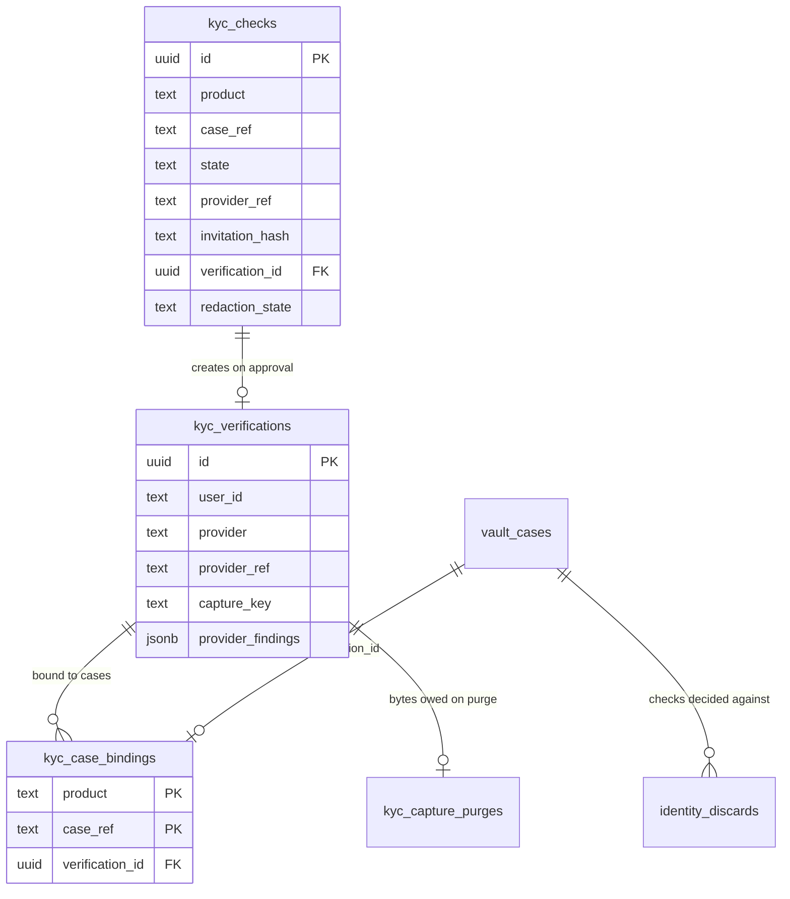

## Context

What the identity store already is, and what a hosted check has to fit into.
Motivation is the proposal; the requirements are the three delta specs.

- **The store is a worker nothing public reaches** — `grade10-e-kyc-service`,
  its own `ekyc` schema, its own R2 bucket, an hourly cron for the orphan
  sweep. No `routes`, and no `ServiceId` in `packages/app-env`, so the gateway
  cannot forward to it at all
- **Two tables and a purge queue** — `kyc_verifications` (one per check, keyed
  to the person), `kyc_case_bindings` (primary key `(product, case_ref)`, one
  identity per case), `kyc_capture_purges` (bytes still owed a delete)
- **`provider` and `provider_ref` already exist** — every row today is
  `manual` / `NULL`
- **Reached only over `KYC_SERVICE`** — a class factory mints one entrypoint
  per product, and that binding is what says which product a caller speaks
  for; `product` is never an argument
- **The vault keeps a reference, never a copy** —
  `vault_cases.identity_verification_id` and `identity_bound_at`, paired by a
  check constraint; `identity_release_pending_at` is the erasure debt
- **`recordCaseKyc` is already two-phase** — the RPC runs with no transaction
  open, then a short transaction takes the case row's lock, re-judges the
  case, voids any packet still out, and writes the reference; every id the
  locked row does not claim goes to the `identity_discards` outbox and is
  settled after commit
- **One routed worker** — `api.<brand>` forwards `/{serviceId}/*` verbatim to
  the service's default entrypoint
- **doc-sign is the precedent for a token surface** — the ceremony mounts at
  `/api/sign` on the vault worker with no session middleware, a 256-bit
  base64url secret whose digest is stored, and first-use device binding that
  refuses a second device

## Goals / Non-Goals

Goals:

- **A check with its own life** — raised, invited, walked, decided or
  abandoned, in the identity store, with nothing in the vault waiting on it
- **One settle path** — a webhook and a stalled sweep reach the same code
- **No second copy of a person** — the hosted path writes exactly the row the
  counter path writes, in the same database
- **A deployment with no provider configured behaves as it does today** — the
  counter is unchanged and no case is stranded

Non-Goals, on the delivery side:

- **No route on the e-kyc worker** — the collector's surface and the
  provider's callback mount elsewhere
- **No second area in the captures bucket** — one kind of object stays one
  kind of object
- **No vendor name in `packages/e-kyc/contracts`** — the provider is a port in
  the backend
- **No change to `recordCaseKyc`'s two-phase shape** — the hosted path reuses
  its locked transaction rather than adding a second one

## Decisions

### The check is a row in the identity store, scoped like a binding

- New table `ekyc.kyc_checks`, keyed `(product, case_ref)` the way a binding
  is, holding the provider's own reference, the invitation digest, the state
  and the timestamps.
- The product comes from the entrypoint, never an argument — the same rule
  every other write in this package follows.
- Alternatives rejected:
  - A `vault.identity_checks` table — the vault would hold the provider
    reference and the invitation digest, and finance would need a second
    copy of the whole machine.
  - Columns on `kyc_verifications` — a check that expires, is withdrawn, or
    is declined never becomes a verification, so it would have no row to
    live on.

### A verdict is a doorbell; the settle reads the check back

- The callback proves the signature, resolves which check the delivery names,
  and settles it in `ctx.waitUntil` after answering. **Nothing in the
  delivery's body is read as fact** — the settle asks the provider what the
  check says and applies that.
- A settle that never ran, or ran and failed, is picked up by the work list.
  The collector's own read of their invitation settles a `submitted` or
  `stalled` check that is due, so the one person watching for the answer is
  never waiting on a tick.
- One path serves three triggers: a callback, a stalled check the provider
  never decided (`grade10-site-e-kyc-hosted-verification-SC-22` already
  requires read-back), and a callback that never arrived.
- Alternatives rejected:
  - Trust the signed body — two settle paths that can disagree, and every
    field of a body signed with a leaked secret becomes an input to a write
    of personal data.
  - Poll only, no callback — a decided check waits for the next tick, and
    the collector's page is stale for as long.

### Both public surfaces mount on the vault worker

- `/vault/api/identity/*`, beside the signing ceremony's `/api/sign`, reached
  through the gateway's existing `vault` prefix. The collector's page is an
  SPA route at `/vault/verify`.
- The routes hold no identity fields: the callback carries a provider
  reference, and the collector's read answers a state and a next step.
- Alternatives rejected:
  - Give e-kyc a route — the one thing that worker's configuration exists to
    forbid; a route there puts every customer's legal name and passport
    photograph one misconfigured origin from a browser.
  - A new routed worker — a `ServiceId` minted for one callback, and the
    collector's page would still need the case the vault owns.
- **The vault route holds no vendor knowledge.** It forwards the raw body and
  the signature headers over the binding to `receiveVerdict`, which proves the
  signature and parses the body inside e-kyc. The signing secret lives in
  `EKYC_SECRETS` beside the API key rather than being split across two
  workers' secret ladders.

### The invitation reuses doc-sign's token shape

- 256 bits from the platform CSPRNG, base64url, carried in the URL
  **fragment**; only `sha256` of it is stored.
- First use records the digest of a cookie value; a request presenting a
  different one, or none, is a conflict — a second device continues nothing
  (`grade10-site-e-kyc-hosted-verification-SC-23`).
- The fragment never leaves the browser, so the secret is in no request path,
  no query string, no log line and no referrer
  (`grade10-site-e-kyc-hosted-verification-SC-24`) by construction rather than
  by redaction.
- The lookup is scoped by the entrypoint's product — `UNIQUE (product,
  invitation_hash)`, never `invitation_hash` alone — so the vault's route
  cannot advance a finance check.
- The binding cookie is named per check, as doc-sign names its own per token,
  so two ceremonies in one browser do not clobber each other. The vault's
  `secure()` gains `referrer-policy: no-referrer`, which doc-sign already sets
  and the vault does not.
- The provider returns the collector to `/vault/verify` with no secret. That
  page reads the state from the fragment it still holds, or, if the browser
  dropped it, tells the collector to reopen the link they were sent.
- The secret is returned **once**, at mint, and the vault sends it and forgets
  it. A resend is a withdraw and a new check — which is what "a new one is a
  new check" already means.
- Alternatives rejected:
  - A signed token in the path — every log line and every referrer carries
    it.
  - An emailed one-time code — a second thing to type, and the same
    storage question.

### One live check per case is a partial unique index

- `UNIQUE (product, case_ref) WHERE state IN ('invited','started','submitted','stalled')`.
- Raising inserts and catches the conflict, then reads the live check back and
  answers with it — so two requests arriving together cannot both raise one
  (`grade10-site-e-kyc-hosted-verification-SC-09`).
- Alternatives rejected:
  - Read, then insert — both requests pass the read.
  - A lock on the vault case row — the check is in another database, and the
    vault's lock cannot serialize a write it does not make.

### The provider's reference is unique, and a conflict is read back

- `UNIQUE (provider, provider_ref) WHERE provider_ref IS NOT NULL`.
- That, not the delivery, is what makes a verdict apply once
  (`grade10-site-e-kyc-hosted-verification-SC-13`): a repeated callback
  resolves to the same row, and a settle of a check already decided is a
  no-op.

### The raise inserts first and records the reference second

1. Insert the check `invited` with `provider_ref` null — the unique index
   above is taken here, before any network call.
2. Raise with the provider, passing the check's own id as the idempotency key.
3. Update the row with the reference and the environment.
4. Return the secret; the vault notifies.

- A crash between 1 and 3 leaves a live check with no reference. The settle
  work list picks it up and completes the raise, idempotently — no orphan, and
  no invitation was sent for a check that does not exist at the provider. That
  needs the work list to see it: its predicate covers `invited` rows whose
  `provider_ref` is null, and `settle_due_at` defaults to `now()` so such a row
  sorts into the queue rather than out of it.
- **Before step 1** the vault asks for the person's most recent verified
  identity and binds it when it passes the refusals — reuse before asking, per
  `grade10-site-vault-identity-check-SC-02` — and checks the case names a
  person and holds an email address. A case failing either is reported, not
  raised, so no invitation is minted that nobody can be sent
  (`grade10-site-vault-identity-check-SC-19`).
- Alternatives rejected:
  - Raise first, then insert — a crash between them leaves an inquiry at the
    provider that nothing here names, and the unique index cannot help.

### `KYC_PROVIDER_KINDS` gains one value; the write path gains a sibling creator

- `KYC_PROVIDER_KINDS = ["manual", "hosted"]`. That constant's own comment
  currently argues a hosted provider is *not* another entry here — "it arrives
  with its own ceremony and webhooks, which is a different flow rather than
  another value". The value is added and the comment is rewritten in the same
  edit; leaving it would tell the next reader the opposite of the code.
- A second hosted vendor later would collide with this one on
  `UNIQUE (provider, provider_ref)`. Accepted while there is one: the day there
  are two, the value is named for the vendor.
- `verification/record.ts` stops hardcoding `provider: "manual"`. The hosted
  settle calls a sibling creator in the same module rather than a branch
  inside the counter's write — the seam is the package boundary, which is what
  that file's own comment says.
- Alternatives rejected:
  - A dispatch inside `record` — every future provider adds a branch to the
    one write that must stay simple.
  - A `KYC_PRODUCTS` value — the product is who asked, not who checked.

### The vault drives the settle, under the case lock it already takes

- `settleCheck` in e-kyc does the provider read-back, the refusals, the
  document fetch and `insertAndBind`, and answers the **same `KycBound`
  shape** `record` answers. It does **not** decide the check.
- The vault's `settleHostedCheck(caseId)` then runs the existing `bindToCase`
  — the same locked transaction, the same re-judgment, the same packet void,
  the same `identity_discards` compensation — and calls `finishCheck` with
  what happened.
- **Three refusals ride free.** A case past recording, one holding sealed
  evidence, and one whose data has been erased are already refused by
  `recordableRefusal` and the sealed-evidence test inside that lock, and the
  identity the verdict created is already settled by the `identity_discards`
  outbox.
- **One does not, and needs a clause.** Nothing in `bindToCase` refuses a case
  that already holds a *different* identity — deliberately, because
  `recordCaseKyc` is the re-record path. So a hosted verdict landing on a case
  staff verified at the counter would overwrite that binding and void its
  packets, which is the opposite of
  `grade10-site-vault-identity-check-SC-18`. `settleHostedCheck` passes
  `expectedIdentityBoundBefore = check.invitedAt`, and `bindToCase` refuses as
  a **third arm of its existing refusal chain** — not an early return, so
  `queueUnclaimed` still runs and the hosted verification is discarded rather
  than orphaned — when the case bound an identity after the check was raised.
  A binding made before the raise stays replaceable, which is what reuse and
  re-record need.
- **`finishCheck({ caseRef, outcome, reason })`** moves the check to
  `approved` or `declined` after the vault has answered. Without it a refused
  landing leaves the check reading `approved` for ever, and the discard's
  `ON DELETE SET NULL` then nulls its verification link — a row asserting an
  approval that produced nothing. It is called outside `bindToCase`'s own
  drain `try/catch`, is idempotent, and is reachable from the work list so a
  crash between the two calls converges.
- Alternatives rejected:
  - e-kyc binds and tells the vault — the store would have to know the
    vault's statuses, its packets and its erasure.
  - A second locked transaction for the hosted path — two places to keep the
    same refusals correct.
  - Deciding the check inside `settleCheck` — the decision would be written
    before the vault has judged it, which is exactly the lie `finishCheck`
    exists to prevent.

### The document image is fetched before the identity exists; the face is not

- Settle order: read back → **apply the refusals** → fetch the document image
  → put it in the bucket (content-addressed, so a retry is not a second
  object) → one transaction that inserts the verification and binds it.
- The refusals come before the fetch because the read-back already carries the
  date of birth and the expiry, and `verification/record.ts` runs them before a
  byte is written for the same reason its own comment gives: refusing after the
  photograph is in the bucket leaves the document of somebody the store just
  declined sitting in it.
- The settle also refuses **before the fetch** when the vault's case is erased
  or past recording, so an erasure reported done is not followed by a fresh
  photograph of the erased person.
- A fetch the evidence store may not hold — the wrong content type, or over the
  20 MiB ceiling — is checked before the put and **declines** the check rather
  than retrying, because those helpers throw rather than refuse
  (`grade10-site-e-kyc-identity-record-SC-21`).
- A fetch that fails for any other reason leaves the check `submitted` or
  `stalled` with a backoff. Nothing is bound, so there is nothing half-written
  to unwind. After the stated number of attempts the check is reported to an
  operator rather than retried for ever
  (`grade10-site-e-kyc-identity-record-SC-15`).
- No face capture is fetched at all: Grade10 runs no matching engine, so a
  stored selfie could never be re-compared. What the row keeps is the
  provider's findings.

### The check row carries its own erasure debt

- The debt lives on `kyc_checks` — `redaction_state` (`owed`, `done`,
  `refused`), `redaction_reason`, `redaction_queued_at` — not in a table of
  its own. Nothing ever deletes a check row, so the row that knows the
  provider's reference is still there when the debt is drained.
- **A separate outbox could not carry the case that matters.** It would be
  written in the transaction that purges a *verification*, and a declined
  check never creates one — so `grade10-site-e-kyc-identity-record-SC-25` and
  `SC-21`, the checks whose image Grade10 fetched and which then failed, would
  queue nothing at all. Every debt is reachable from a check; only some are
  reachable from a verification.
- Marked `owed` wherever a check's image reaches Grade10 and the check then
  ends — declined, expired, withdrawn, refused on landing, or displaced — and
  by `releaseCaseBinding`, which is how the vault's erasure arrives.
- Drained oldest-first from the same work list, with no per-row backoff, the
  way `kyc_capture_purges` is already drained. Three retry disciplines in one
  schema is two too many.
- It never blocks the local purge: the bytes and the row go on their own clock.
  Modelled on `erasePairing` in `packages/grade10-store` — the terminal local
  move first and alone, the vendor work idempotent afterwards.
- A manual check has no `provider_ref` and owes nothing, so the counter path's
  erasure is byte-for-byte what it is today.
- **Erasure also ends a live check.** `releaseCaseBinding` withdraws any check
  still `invited`, `started`, `submitted` or `stalled` for that case and clears
  what the row holds about the person, in the same transaction. Otherwise an
  invitation keeps working for the rest of its 14 days and the row keeps an
  erased person's identifier for ever
  (`grade10-site-e-kyc-identity-record-SC-27`).
- Alternatives rejected:
  - Block the purge until the provider acknowledges — a hosted provider
    redacts child objects asynchronously, so the acknowledgment a blocking
    purge waits for never comes.
  - Rely on the retention window alone — a release before the window closes
    leaves the copy standing for the rest of it.

### The provider is a port in the backend, not a name in contracts

- One interface beside `KycStorePort`: `raise`, `read`, `fetchDocument`,
  `redact`, `retentionWindow`. `raise` answers the provider's reference **and**
  its hosted URL together, which is how a hosted provider answers; a fifth
  method for a value the first call handed over would be a call that never
  needed making.
- `read` answers what `kyc_verifications` requires and nothing more:
  `legalName`, `dateOfBirth`, `idType`, `idNumber` (raw, for the mask and the
  peppered digest, never stored), `documentExpiresAt`, `findings`, and the
  provider's decision. A document type outside `KYC_ID_TYPES` **declines** the
  check with that reason rather than sticking it in `submitted` for ever.
- `KYC_METHODS` gains `hosted_capture`. `method` is `NOT NULL` and neither
  `in_person` nor `document_upload` is true of a provider-hosted ceremony, so
  the settle has no value to write without it.
- `verifiedBy` on a hosted check names the operator who asked, or is the
  case's own booking where nobody asked — the same fact
  `grade10-site-e-kyc-identity-record-SC-02` records.
- `packages/e-kyc/contracts` stays vendor-free — it is what a calling product
  imports, and a product has no business knowing who checks documents.

### The override is a recorded reason, on a second procedure

- `admin.recordKyc` keeps `vault:operate`. New `admin.recordKycOverride` takes
  `vault:approve` and **requires** a reason; `recordCaseKyc` refuses a counter
  check on a case whose last hosted check is `declined` when no reason came
  with it. That refusal is what
  `grade10-site-vault-identity-check-SC-17` asks for.
- **The grant separates nobody today.** `staff` holds `vault:approve` wherever
  it holds `vault:operate`, and no other role holds either, so the second
  procedure is reachable by exactly the people the first is. It is kept
  because it costs nothing and is correct the day a role separates them — not
  because it refuses anyone now. The proposal carries that as an open question.
- The decline is read from the identity store, so it is a pre-check outside
  the case lock: a decline landing between the pre-check and the commit lets
  one counter check through without a reason. Accepted — the window is a
  provider read wide, and the failure mode is a legitimate counter check
  recorded without an approval note, not a wrong identity.

### An operator can raise and withdraw a check

- `admin.raiseIdentityCheck` and `admin.withdrawIdentityCheck`, both
  `vault:operate`.
- Without them `grade10-site-vault-identity-check-SC-03` and
  `grade10-site-e-kyc-hosted-verification-SC-26` have no wire, and a stalled
  check has no exit but a collector arriving at the counter with a document.

### Identity state reads under `vault:read`; identity detail takes `kyc:read`

- `admin.detail` grows the check's state, who performed the bound check, and
  when — no name, no birth date, no mask, no provider finding, no refusal
  reason. `forCase` answers the whole record, so the projection to those three
  fields happens in the vault before the payload is built, never at the
  console.
- **It is cached, not fetched.** `detailOf` is what twenty-one mutations
  return, and it touches only the vault's own database today; a cross-worker
  RPC there would put the identity store on the critical path of `acceptOffer`,
  `recordValuation` and `bookVisit`, and make e-kyc's availability the
  console's. The check's state is cached on `vault_cases` the way a booking
  already is, with the same repair lane.
- New `admin.caseIdentity` at `kyc:read` answers the record itself, its
  provider findings and the decline reason, and is fetched by the panel that
  shows them rather than by every case read. The capture download route is
  already `kyc:read`.

## Database Schema

Storage rules:

- Schema `ekyc`. New timestamp columns use `msTimestamp()` —
  `timestamptz(3)` — per that schema's own `columns.ts`; the three existing
  microsecond columns are left alone.
- `kyc_verifications` gains one column. `provider` and `provider_ref` are
  already there and start meaning something.
- One new table, `kyc_checks`, which carries its own erasure debt rather than
  handing it to a second one.
- `vault_cases` — in the vault's own database, not this one — gains a cached
  check state, kept the way the booking cache already is, so reading a case
  does not reach across the binding.

### `ekyc.kyc_verifications` — one additive column

| Column | Type | Null | Default | Meaning |
| --- | --- | --- | --- | --- |
| `provider_findings` | `jsonb` | yes | `NULL` | What the provider checked and what each check found. `NULL` for a counter check. |

- **Grade10's own words, not the vendor's** — the adapter maps each finding to
  `{ check, outcome }` where `check` is a closed set (document authenticity,
  document expiry, face match, liveness) and `outcome` is
  `passed` / `failed` / `not_run`. A vendor's own strings never land, so a
  reader years from now needs no vendor glossary and a vendor rename is an
  adapter change.
- `jsonb` rather than a child table: nothing queries a finding, and a record
  is read whole or not at all.

### `ekyc.kyc_checks` — new

| Column | Type | Null | Default | Meaning |
| --- | --- | --- | --- | --- |
| `id` | `uuid` | no | `gen_random_uuid()` | Also the idempotency key sent to the provider. |
| `product` | `text` | no | — | From the entrypoint. |
| `case_ref` | `text` | no | — | The product's own case. Opaque. |
| `state` | `text` | no | `'invited'` | The eight states. |
| `provider` | `text` | no | — | `hosted` today. |
| `provider_ref` | `text` | yes | `NULL` | The provider's own id, written at step 3 of the raise. |
| `invitation_hash` | `text` | no | — | `sha256` of the 256-bit secret. |
| `binding_hash` | `text` | yes | `NULL` | First-use device digest. |
| `verification_id` | `uuid` | yes | `NULL` | What an approved settle created. `REFERENCES kyc_verifications(id) ON DELETE SET NULL`. |
| `decline_reason` | `text` | yes | `NULL` | Which refusal, for an operator. |
| `override_reason` | `text` | yes | `NULL` | Why a counter check stood over this decline. The actor and the instant are on the case's own event chain, which is append-only and already rendered. |
| `redaction_state` | `text` | yes | `NULL` | `owed`, `done` or `refused` once this check's image reached Grade10 and the check ended. `NULL` when nothing is owed. |
| `redaction_reason` | `text` | yes | `NULL` | Why the provider refused the command. |
| `redaction_queued_at` | `timestamptz(3)` | yes | `NULL` | Oldest-first drain order. |
| `invited_at` | `timestamptz(3)` | no | `now()` | |
| `started_at` | `timestamptz(3)` | yes | `NULL` | |
| `submitted_at` | `timestamptz(3)` | yes | `NULL` | |
| `decided_at` | `timestamptz(3)` | yes | `NULL` | |
| `expires_at` | `timestamptz(3)` | no | — | The **earlier** of the invitation's own deadline and, once started, the started-check window — a started check never outlives its invitation. |
| `settle_due_at` | `timestamptz(3)` | no | `now()` | When the work list next picks it up. Also the claim lease. |
| `settle_attempts` | `integer` | no | `0` | The backoff's counter, and the ceiling that reports to an operator. |

No `user_id`. The vault holds who the case is about and passes it at settle
time; a column snapshotted weeks earlier is stale the moment an erasure nulls
the vault's copy, and nothing in the specs reads a person's check history.

| Kind | Definition | Why |
| --- | --- | --- |
| PK | `(id)` | |
| Unique | `(product, case_ref) WHERE state IN ('invited','started','submitted','stalled')` | One live check per case, as a constraint rather than a question. |
| Unique | `(provider, provider_ref) WHERE provider_ref IS NOT NULL` | A verdict applies once, keyed on the provider's id. |
| Unique | `(product, invitation_hash)` | A secret opens one check, in one product. |
| Index | `(product, settle_due_at) WHERE state IN ('invited','started','submitted','stalled')` | The settle work list — wide enough to complete a raise that crashed before its reference was written. |
| Index | `(product, case_ref, invited_at DESC)` | The case's last check, whatever state it ended in — what the panel and the override pre-check read. |
| Index | `(expires_at) WHERE state IN ('invited','started')` | The expiry sweep. |
| Index | `(redaction_queued_at) WHERE redaction_state = 'owed'` | The redaction drain, oldest due first. |
| Check | `state IN ('invited','started','submitted','stalled','approved','declined','expired','withdrawn')` | The closed vocabulary. |
| Check | `(state IN ('approved','declined')) = (decided_at IS NOT NULL)` | A decision and its instant are one fact. |
| Check | `verification_id IS NULL OR state = 'approved'` | Only an approved check made a record. |
| Check | `state = 'approved' OR provider_ref IS NOT NULL OR state IN ('invited','expired','withdrawn')` | A check the provider decided has the provider's reference. |
| Check | `started_at IS NULL OR state <> 'invited'` | A started check is not still invited. |
| Check | `submitted_at IS NULL OR state NOT IN ('invited','started')` | A submitted check has left the collector. |
| Check | `redaction_state IS NULL OR provider_ref IS NOT NULL` | Nothing is owed for a check no provider performed. |

The raise's insert is `ON CONFLICT ON CONSTRAINT <the live-check index> DO
NOTHING` rather than a bare `23505` catch: three unique indexes sit on this
table and a bare catch cannot tell which one fired.

The stall threshold and the stalled-read-back window are stated constants, not
columns — every check uses the same two. Both are `TBC` in the spec.

### Entity relationships

`kyc_checks` and `kyc_verifications` are in one database; `vault_cases` and
`identity_discards` are in another, and the line between them is the
`KYC_SERVICE` binding rather than a foreign key.

## Service Interfaces

### Processing model

- **Entrypoint** — the per-product `KycServiceEntrypoint`, unchanged in shape;
  new methods land on `KycServiceApi`.
- **Service** — judges, orders the calls, owns no transaction of its own
  beyond what the store port opens.
- **Store port** — each method one atomic unit, as today.
- **Provider port** — the only thing that talks to the vendor. Never called
  inside a transaction.
- **The vault** — owns the case lock and every case refusal, and reaches all
  of the above over the binding.

| Method | Input | Success | Refusal |
| --- | --- | --- | --- |
| `raiseCheck` | `{ userId, caseRef, at }` | `{ check, invitationSecret }` on mint; `{ check, invitationSecret: null }` when one was already live | `CASE_HAS_IDENTITY`, `PROVIDER_UNREACHABLE` |
| `checkForCase` | `{ caseRef }` | `KycCheckView \| null` | — |
| `receiveVerdict` | `{ rawBody, headers }` | `{ caseRef } \| null` once the signature is proven | `SIGNATURE_INVALID` |
| `dueChecks` | `{ limit, at }` | `{ caseRef }[]`, each row claimed for a lease | — |
| `settleCheck` | `{ caseRef, userId, at }` | `{ settled: "approved", verification, displacedVerificationId }` / `{ settled: "declined", reason }` / `{ settled: "pending" }` — the check is **not** decided here | `NO_LIVE_CHECK` |
| `finishCheck` | `{ caseRef, outcome, reason }` | `void`, idempotent | — |
| `withdrawCheck` | `{ caseRef }` | `void`, idempotent | — |
| `openInvitation` | `{ secret, binding }` | `{ state, next, hostedUrl? }` | `EXPIRED`, `DEVICE_CONFLICT`, `UNKNOWN` |
| `startCheck` | `{ secret, binding }` | `{ hostedUrl }` | `EXPIRED`, `DEVICE_CONFLICT`, `NOT_STARTABLE` |

`userId` is passed at settle time rather than held on the row, and
`receiveVerdict` replaces `checkByProviderRef`: the vault forwards the delivery
unparsed, so the vendor's signature scheme and body shape stay inside e-kyc.

Refusal names follow the platform's `SCREAMING_SNAKE` failure codes rather than
a second convention, and both exhaustive maps that translate them — the vault's
`VAULT_CODES` and its route-level `REFUSAL_STATUS` — grow with them or fail to
compile.

`KycCheckView` carries the state, who raised it, the instants, the decline
reason and the override — and **no identity field and no secret**. It is what
a case screen renders and what a `kyc:read` reader sees more of.

`KycVerification` gains `providerFindings`, in the contract schema and in
`toKycVerification`, and `admin.caseIdentity` is where it surfaces — without
that, nothing can answer
`grade10-site-vault-identity-check-SC-05`.

A hosted bind writes no staff member into the case's history: `CASE_ACTOR_KINDS`
has no fit for a provider, so it gains one rather than a hosted settle
pretending to be `staff`.

### `raiseCheck`

- **Reads** — the live check for `(product, case_ref)`.
- **Writes** — one insert; then one update carrying the provider reference.
- **Transaction** — the insert alone. The provider call is outside it.
- **Idempotency** — the partial unique index. A conflict is caught, the live
  row read back, and answered with a null secret.
- **Faults** — a provider that refuses leaves the row live with no reference;
  the settle work list retries the raise on the backoff.

### `settleCheck`

- **Reads** — the live check; then the provider, twice (the check, then the
  document image).
- **Writes** — the bucket, then one transaction: insert the verification and
  bind it to the case, staging `verification_id` on the check. The check's own
  state moves later, in `finishCheck`, once the vault has judged it.
- **Transaction** — one, at the end, after every network call has returned.
- **Idempotency is a claim and a conditional write, not a read.** `dueChecks`
  hands out rows through the work list's `claimRow` — `SELECT … FOR UPDATE SKIP
  LOCKED`, the lease written before the side effect — and the terminal update
  carries `WHERE id = $1 AND state IN ('submitted','stalled')`. Zero rows rolls
  the transaction back and discards what it built. Reading the state at the top
  and trusting it across two network calls and a bucket put is the exact
  time-of-check-to-time-of-use the vault's own work list was built to end; it
  is what lets a withdraw racing a verdict resurrect a withdrawn check, which
  `grade10-site-e-kyc-hosted-verification-SC-14` forbids.
- **Refusals applied here** — under age and expired document, on the vault's
  `at`, before the document is fetched.
- **Faults** — a read-back or fetch failure bumps `settle_attempts` and
  `settle_due_at` and leaves the state where it was.

### `settleHostedCheck` (vault)

- Refuses before calling `settleCheck` when its own case is erased or past
  recording, so no photograph is fetched for a case that cannot take one.
- Calls `settleCheck`, then — on `approved` — the existing `bindToCase` with
  the returned verification, the displaced id, and
  `expectedIdentityBoundBefore`.
- Calls `finishCheck` with the outcome, outside `bindToCase`'s drain
  `try/catch`, so a refused landing is written to the check rather than lost.
- **Everything else is unchanged code**: the case row's lock, the re-judgment
  against `KYC_RECORDABLE_STATUSES`, sealed evidence, `erased_at`, the packet
  void, and the `identity_discards` intents the drain settles. The one addition
  inside the lock is the third refusal arm above.

### Mutation example — an approved verdict binds

Before:

| Row | State |
| --- | --- |
| `kyc_checks` | `state='submitted'`, `provider_ref='inq_9'`, `verification_id=NULL` |
| `vault_cases` | `status='accepted'`, `identity_verification_id=NULL` |
| `kyc_case_bindings` | no row for `('vault','case_7')` |

Order: provider read → document fetch → bucket put → `ekyc` transaction →
vault transaction.

After:

| Row | State |
| --- | --- |
| `kyc_verifications` | new row, `provider='hosted'`, `provider_ref='inq_9'`, `capture_key='<sha256>.jpg'`, `provider_findings` mapped |
| `kyc_case_bindings` | `('vault','case_7') → <verification id>` |
| `kyc_checks` | `verification_id` staged in the `ekyc` transaction; `state='approved'` and `decided_at` written by `finishCheck` after the vault commits |
| `vault_cases` | `identity_verification_id` and `identity_bound_at` set |
| open packets on `case_7` | void |

### Mutation example — the same verdict, landing on a case in custody

Before: as above, but `vault_cases.status='vaulted'` with an identity already
bound.

After the `ekyc` transaction the verification and the binding exist. The
vault's locked re-check then refuses, and in the same commit:

| Row | State |
| --- | --- |
| `vault_cases` | unchanged — the identity it was vaulted under stands |
| `identity_discards` | one row for the verification the settle created |
| `kyc_checks` | `state='declined'`, `decided_at` set, `decline_reason` naming the case refusal, `verification_id` cleared |

The drain then restores the store's binding to the id the column claims and
discards the new verification; that purge queues `kyc_capture_purges` for the
image and marks the check's own `redaction_state` `owed` for the provider's
copy. The check reads Declined with the reason recorded, which is what
`grade10-site-vault-identity-check-SC-11` asks for and what a check left
reading `approved` could never say.

## Contracts

New wire, all on the vault worker, all unauthenticated by session:

| Method | Path | Carries | Answers |
| --- | --- | --- | --- |
| `POST` | `/vault/api/identity/verdicts` | The provider's signature header and its body, forwarded to e-kyc unparsed | `204` once the signature is proven and the settle scheduled; `401` otherwise |
| `GET` | `/vault/api/identity/invitation` | The secret in an `Authorization` header, the binding cookie | The state and the next step |
| `POST` | `/vault/api/identity/invitation/start` | The same | The provider's hosted URL, and sets the binding cookie on first use |

No path parameter on these three: an identifier in a path is an identifier in a
log, and the secret must not be one. The platform's other vault routes do carry
path parameters — this is a rule for the identity surface, not for the worker.

SPA: `/vault/verify`, reading the secret from the fragment and sending it as a
header. The existing `SIGNING_PATH` pattern, one surface over.

`admin.detail`'s payload grows the cached identity state. `KycVerification`
gains `providerFindings`. `admin.caseIdentity`, `admin.recordKycOverride`,
`admin.raiseIdentityCheck` and `admin.withdrawIdentityCheck` are new. Every
other procedure and route is unchanged.

The provider secret is declared `optional` with its reason: an undeclared
secret 503s the whole vault worker, which would make "deploy dark" a 503
instead of a no-op.

## Risks / Trade-offs

- **[A callback for another product's check reaches this worker]** → the
  entrypoint resolves it to null and the route answers `204`; the owning
  product's own callback URL settles it. The refusal is a metric, so a
  misconfiguration is visible rather than silent.
- **[The provider never acknowledges a redaction]** → the outbox retries on a
  backoff, its depth and oldest entry are metrics, and the standing retention
  window at the provider erases the copy regardless.
- **[A collector loses the binding cookie mid-check]** → they cannot continue;
  the check is withdrawn and re-raised, or the counter takes it. Same
  behaviour, same reason, as the signing ceremony.
- **[The document fetch fails repeatedly]** → the check stays `submitted` or
  `stalled` and shows as such; nothing is bound, and the counter is open the
  whole time.
- **[The provider is down when a case books]** → the raise fails, the check
  row stays live with no reference, and the work list retries. No case is
  blocked: booking, valuation and every pre-custody move are independent of
  the check.
- **[The invitation secret is 256 bits in a URL a collector may forward]** →
  first-use device binding is what makes a forwarded link useless, and the
  page it opens carries no identity field.
- **[The invitation is mailed, so whoever reads the mailbox first can walk the
  check]** → device binding answers forwarding and does **not** answer this:
  someone with access to the collector's inbox, or to the mail provider's
  outbound record, can open the link before the collector, bind their own
  device, and complete the ceremony with their own document — leaving the case
  Approved under the wrong identity and the collector locked out with a device
  conflict. The counter is the control: an operator sees the bound identity's
  name beside the person at the visit, and a mismatch is a counter check. The
  narrower fix, if Compliance wants one, is to bind the invitation to the
  case's contact address at first open.
- **[Two settles run for one case at once]** → the work list claims the row
  before the side effect and the terminal update is conditional on the state,
  so the loser rolls back and discards what it built. Without both, two
  verifications are created for one check and the second displaces the first.

## Migration Plan

1. **Two migrations, one per database.** In `ekyc`: the new `kyc_checks` table
   with its indexes, and one nullable column on `kyc_verifications`. In the
   vault's own: one nullable cached-state column on `vault_cases`. Both
   additive, so neither needs an expand/contract phase and
   `pnpm run check:migrations` has nothing destructive to gate.
2. **`KYC_PROVIDER_KINDS` widens** — existing rows stay `manual`; no backfill.
3. **Deploy dark** — with no provider secret set, `raiseCheck` is never
   called: booking does not invite, the case screen shows `None`, and the
   counter path is byte-for-byte what it is today.
4. **Configure the provider** — template, environment, callback URL, and the
   retention window Compliance sets. The window is read back and compared on
   the first raise in an isolate, and by the hourly sweep: a Worker runs no
   code outside a request, so there is no startup in which to fault.
5. **Enable per environment** — staging first, with a real document walked end
   to end and its provider copy confirmed redacted after a release.

Rollback is removing the provider secret **and withdrawing every live check**:
the store stops raising, and the counter carries every visit. Withdrawing is
not optional — a submitted check does not expire on its own, and with no secret
nothing can settle it, so every in-flight check would sit Stalled for ever on a
case screen with no control to clear it.

## Open Questions

- ❓ **The provider template per document type** — configuration, once
  Compliance names the documents and issuing countries.

The settle, expiry and redaction work lists ride the vault's existing
15-minute lane as `WorkList` entries beside `identityDiscards`. e-kyc's own
cron cannot: that worker binds only `AUTH_SERVICE` and so cannot reach
`bindToCase`, and its one hourly tick is far too slow for a backoff a
collector's page reads.

Five of the proposal's seven open questions are a value, a wording or a policy
class this design already has a column or a refusal for. **Two are not:**

- **Which cases must hold an approved check** has no mechanism here at all —
  the gate and its waiver are not built, which is why no requirement claims
  them.
- **The lawful basis for the biometric processing** changes the shape if the
  answer is explicit consent: `kyc_checks` would gain the wording's version and
  the instant it was agreed, the collector's page would gain a step before the
  hand-off, and `hosted-verification` would gain a requirement and a scenario.
  No column is added for it now — a nullable column nothing writes asserts a
  consent record that does not exist, and the table is new either way, so
  adding it later is the same additive migration.
