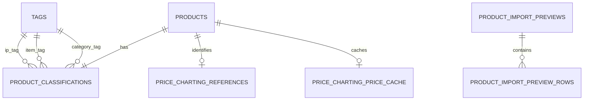

## Context

This change extends the inventory product created by
`add-grade10-inventory`; that change must land before this one migrates or
serves a product. See [proposal.md](proposal.md) for the collector problem and
[the capability spec](specs/grade10-admin/inventory/card-price-reference/spec.md)
for behavior.

PriceCharting's documented paid API identifies an item by its numeric id or a
text query, not by a pasted page URL. It returns current USD-cent values and
does not expose historic prices, sales, PSA population counts, certificates, or
the screenshot's certification details. Its token is secret and its request
limit is one request per second globally.

## Goals / Non-Goals

**Goals:**

- Retain stable provider identity separately from disposable current price data.
- Keep product taxonomy reusable, enforceable, and extendable without a
  schema redesign.
- Make concurrent cache reads and auction refresh requests safe under the
  provider limit.
- Make a bulk import preview durable enough to review while keeping the CSV
  and uncommitted data temporary.

**Non-Goals:**

- Store a valuation ledger, historic price observations, provider raw-response
  archive, PSA population data, or certificate facts.
- Let PriceCharting or its secret cross the browser boundary.
- Make Auction own inventory card metadata or provider fetching.

## Decisions

### Product owns a wide classification

Add a `collectible_type` to the inventory product, retain one kind-less tag
catalogue, and add one wide `product_classifications` row per product. Its
non-null `ip_tag_id`, `item_tag_id`, and `category_tag_id` foreign keys express
the three required roles directly. A tag label is globally reusable: the same
tag may be the IP of one product and the Category of another. Product writes
resolve or create the three tags then insert or replace the one classification
row in the product-write transaction.

**Rejected:** a kinded tag catalogue plus many-to-many product tags. It makes
the three required roles a cross-row validation and duplicates a label when it
is useful in two roles. **Rejected:** comma-separated tags or tags embedded in
product JSON. They cannot enforce reuse or indexed filtering. **Rejected:** a
separate v1 type table. A closed application vocabulary has one value today.

### Confirmation converts a URL into provider identity

The admin client sends the pasted URL only to initiate a server-side search;
the operator selects a result and the server verifies it as a PriceCharting
result before storing the canonical URL and numeric product id. A stored id is
the fetch key; the link remains attribution and operator context.

**Rejected:** scrape a URL for its identity. Page markup is not a provider
contract. **Rejected:** save a free-text id without a selected result. It
allows a product and future prices to be silently mismatched.

### One disposable cache row per reference

Persist one replaceable operational cache row for each PriceCharting reference.
It contains the normalized current values, successful fetch time, refresh
eligibility stamps, and no historical rows or raw-response archive. The
database persistence makes the cache shareable across worker instances; it is
not product history and can be deleted/rebuilt without losing product facts.

The regular eligibility stamp is derived from `fetched_at + 24 hours`. An
auction event can lower a separate `auction_refresh_after` stamp to no earlier
than four hours after the latest successful fetch. It never changes
`fetched_at`, so an event cannot falsely claim that a price was updated.

**Rejected:** durable price snapshots. The approved scope explicitly excludes
history. **Rejected:** browser or per-process caching. Neither survives worker
isolation nor coordinates provider limits.

### The inventory service owns provider access and cadence

`@grade10/inventory-service` holds the PriceCharting port, secret declaration,
fetch policy, cache, and a single-row request gate. A cache-miss claimant takes
the gate transactionally before the external call; the gate refuses a second
request within one second. The network call runs outside the database
transaction; the successful result then replaces the cache atomically. A
failed call leaves the prior cache unchanged.

Auction reaches a narrow inventory RPC that requests earlier eligibility for a
product when its own listing lifecycle becomes active. It has no provider
token, search, or cache-write surface.

**Rejected:** provider calls in the admin frontend. It reveals the token and
cannot globally pace requests. **Rejected:** an Auction-owned polling job. It
duplicates cache authority and makes non-auction reads inconsistent.

### Preview first; commit the batch once

The inventory service parses a CSV into an expiring import preview, validating
the fixed header, row limit, taxonomy, and PriceCharting candidates without
creating products. The preview owns per-row validation outcomes and selected
candidate ids; it expires after 30 minutes. The confirmation request names the
preview and all selected candidate ids. It is valid only when every row has a
confirmed candidate.

The commit transaction locks the preview and rechecks provider-id uniqueness,
then creates each product using the same product/inventory and tag-resolution
paths as single-product creation. It records the confirmed reference in the
same transaction. Any refusal rolls back the entire batch. The uploaded CSV
bytes are not retained after parsing, and terminal/expired preview rows are
removed by the existing scheduled cleanup mechanism or a dedicated sweep.

**Rejected:** per-row commits with a report. It leaves a correction burden and
partial catalogue state. **Rejected:** create first and match later. It weakens
the no-silent-mismatch rule. **Rejected:** a browser-only preview. It cannot
securely retain provider candidates or prevent a changed file from being
committed.

## Database Schema

All tables are in the existing `inventory` PostgreSQL schema. The base
`products` and its one-to-one `inventories` row come from
`add-grade10-inventory`.

### `products` (changed)

| Column | PostgreSQL type | Null | Default / constraint | Meaning |
| --- | --- | --- | --- | --- |
| `collectible_type` | `text` | No | `'collectible-cards'`; check current vocabulary | Stable controlled product type |

Index `idx_products_collectible_type (collectible_type)` supports type-filtered
catalogue reads. The stored code maps to display `Collectible Cards`.

### `tags`

| Column | PostgreSQL type | Null | Default / constraint | Meaning |
| --- | --- | --- | --- | --- |
| `id` | `text` | No | App-minted `tag_<uuid>`, PK | Tag identity |
| `label` | `text` | No | Trimmed, non-empty | Operator-facing label |
| `normalized_label` | `text` | No | Lowercase trimmed label; unique | Comparison key |
| `created_at` | `timestamp(3) with time zone` | No | `now()` | First creation time |

Unique index `uq_tags_normalized_label (normalized_label)` makes inline
creation idempotently reuse an existing tag across all controlled roles.

### `product_classifications`

| Column | PostgreSQL type | Null | Default / constraint | Meaning |
| --- | --- | --- | --- | --- |
| `product_id` | `text` | No | PK, FK → `products.id` | Classified product |
| `ip_tag_id` | `text` | No | FK → `tags.id` | Required IP tag |
| `item_tag_id` | `text` | No | FK → `tags.id` | Required Item tag |
| `category_tag_id` | `text` | No | FK → `tags.id` | Required Category tag |
| `created_at` | `timestamp(3) with time zone` | No | `now()` | Classification time |
| `updated_at` | `timestamp(3) with time zone` | No | `now()` | Last classification update |

Indexes on each tag foreign key support role-specific filtering. The non-null
foreign keys enforce exactly one tag per controlled role. Product detail reads
join `tags` three times, once under each role; a generic tag catalogue uses a
union across those three indexed foreign-key columns.

### `price_charting_references`

| Column | PostgreSQL type | Null | Default / constraint | Meaning |
| --- | --- | --- | --- | --- |
| `product_id` | `text` | No | PK, FK → `products.id` | Referenced card product |
| `provider_product_id` | `text` | No | Unique | PriceCharting numeric identity |
| `canonical_url` | `text` | No | URL from confirmed provider result | Operator attribution link |
| `confirmed_at` | `timestamp(3) with time zone` | No | `now()` | Confirmation time |
| `confirmed_by` | `text` | No | Operator user id | Confirmation actor |

The reference is authoritative provider identity, not a cached price.

### `price_charting_price_cache`

| Column | PostgreSQL type | Null | Default / constraint | Meaning |
| --- | --- | --- | --- | --- |
| `product_id` | `text` | No | PK, FK → `products.id` | Cache owner |
| `values` | `jsonb` | No | Normalized current baseline and PSA-oriented values | Replaceable current result |
| `fetched_at` | `timestamp(3) with time zone` | No | Successful fetch time | Honest last-updated value |
| `auction_refresh_after` | `timestamp(3) with time zone` | Yes | Null without active-auction request | Earliest auction-driven refresh |
| `updated_at` | `timestamp(3) with time zone` | No | `now()` | Cache-row write time |

There is exactly one cache row per product and no snapshot/history table. Index
`idx_price_charting_cache_auction_refresh_after` supports any later refresh
sweep without changing the model.

### `price_charting_request_gate`

| Column | PostgreSQL type | Null | Default / constraint | Meaning |
| --- | --- | --- | --- | --- |
| `id` | `boolean` | No | PK constrained to `true` | Singleton gate |
| `last_requested_at` | `timestamp(3) with time zone` | Yes | Null before the first request | Global provider pacing stamp |

`SELECT … FOR UPDATE` on this singleton serializes PriceCharting request
claims. It is operational state, not product data.

### `product_import_previews`

| Column | PostgreSQL type | Null | Default / constraint | Meaning |
| --- | --- | --- | --- | --- |
| `id` | `text` | No | App-minted `imp_<uuid>`, PK | Import preview identity |
| `created_by` | `text` | No | Operator user id | Preview owner |
| `status` | `text` | No | `previewed`, `committed`, `expired` | Import lifecycle |
| `row_count` | `integer` | No | 1–500 | Parsed CSV row count |
| `expires_at` | `timestamp(3) with time zone` | No | Preview time + 30 minutes | Confirmation deadline |
| `created_at` | `timestamp(3) with time zone` | No | `now()` | Preview time |
| `committed_at` | `timestamp(3) with time zone` | Yes | Null until commit | Completion time |

Index `idx_product_import_previews_expires_at (expires_at)` supports cleanup.

### `product_import_preview_rows`

| Column | PostgreSQL type | Null | Default / constraint | Meaning |
| --- | --- | --- | --- | --- |
| `import_id` | `text` | No | FK → `product_import_previews.id` | Preview owner |
| `row_number` | `integer` | No | Positive; unique with `import_id` | CSV row identity |
| `input` | `jsonb` | No | Parsed allowed CSV columns | Temporary normalized row |
| `candidate` | `jsonb` | Yes | Null if search cannot resolve one | Provider candidate shown for confirmation |
| `validation_errors` | `jsonb` | No | `[]` | Row validation results |
| `confirmed_provider_product_id` | `text` | Yes | Null until operator confirmation | Selected candidate identity |

Primary key `(import_id, row_number)`. Preview rows are temporary staging data,
not products or price history.

## Service Interfaces

All browser-facing methods remain elevated inventory-admin procedures. The
provider port and Auction trigger are worker-only.

| Processor | Input | Success | Refusal / behavior |
| --- | --- | --- | --- |
| `searchPriceCharting` | Pasted valid PriceCharting URL and optional query | Candidate ids, titles, and canonical links | Invalid link or provider unavailable; no write |
| `saveProductClassification` | Product id/new product fields, type, one tag selection or inline label per role | Product with resolved role tags | Missing role, invalid type, or invalid label; product and classification unchanged |
| `confirmPriceChartingReference` | Card product id, selected candidate id and canonical URL | Confirmed reference | Non-card, unknown candidate, or id owned by another product; reference unchanged |
| `readCurrentPriceReference` | Card product id | Normalized values, fetched-at, freshness | No reference, unavailable provider data, or last cached stale result |
| `requestAuctionPriceRefresh` | Product id, Auction service identity | Accepted earlier eligibility request | Unknown/non-card/unmatched product; never fetches directly |
| `previewProductImport` | CSV bytes, inventory-admin identity | Expiring row-by-row preview | Invalid header/file or more than 500 rows; no product write |
| `confirmProductImportCandidates` | Preview id, row-to-candidate confirmations | Ready preview | Expired, invalid, or missing confirmation; no product write |
| `commitProductImport` | Ready preview id, inventory-admin identity | Created product summaries | Expired, changed/duplicate provider identity, or any write refusal; full rollback |

`saveProductClassification` resolves or inserts the three tags then inserts or
updates `product_classifications` in one transaction. Example: `Pokemon`
supplied for IP resolves `tags(id=tag_pokemon)` and writes
`product_classifications(product_id=prd_1, ip_tag_id=tag_pokemon, ...)`
without a duplicate tag.

`confirmPriceChartingReference` locks the product and reference key, verifies
the candidate against the provider result, then inserts or replaces the single
reference in one transaction. It does not make a price fetch part of product
creation, so a provider outage never half-creates a product.

`readCurrentPriceReference` reads the reference and cache. A fresh cache
returns immediately. A stale/missing cache claims the one-second request gate
in a short transaction, releases the lock, fetches outside the transaction,
then upserts the single cache row on success. A failure preserves the prior
row. Concurrent callers that cannot claim the gate receive the current cache,
marked stale when expired; a caller with no prior cache receives unavailable.

`previewProductImport` parses only the documented columns and persists a
temporary preview plus rows after provider candidate lookup. It does not fetch
prices. `confirmProductImportCandidates` verifies that every candidate belongs
to its stored preview. `commitProductImport` locks the preview, checks status
and expiry, rechecks reference uniqueness, then inserts products, inventories,
product classifications, and references in a single transaction. Example: a ready
two-row preview either creates `prd_1` and `prd_2`, both with zero inventories
and confirmed provider ids, or creates neither if `prd_2`'s provider id was
claimed after preview.

## Risks / Trade-offs

- **PriceCharting subscription absent, invalid, or rate-limited** → Declare the
  token as a required worker secret, pace every request through the gate, and
  retain only the last successful cache result.
- **Search finds a near-match** → Require explicit operator selection and
  persist the selected stable id; never infer it by scraping the URL.
- **Provider field coverage varies by card** → Normalize only supplied
  PSA-oriented values and surface unavailable grades distinctly from zero.
- **Auction lifecycle retries events** → The event only lowers an eligibility
  stamp under a four-hour floor, making repeated messages idempotent.
- **Future taxonomy grows beyond cards** → Keep type policy separate from tags
  and refuse provider attachment outside the explicit card type.
- **A large or hostile CSV exhausts resources** → Cap at 500 rows, parse only
  the fixed columns, limit field sizes, and expire/clean preview state.
- **A provider identity is claimed between preview and commit** → Recheck the
  unique identity in the one commit transaction and roll back every row.

## Migration Plan

1. Fold the clean classification, tag, reference, cache, request-gate, and
   preview tables into the unpublished inventory schema/migration before its
   first deployment. No backfill, compatibility default, or expand/contract
   phase is required because no inventory table has production data.
2. Seed the singleton request gate and deploy the inventory worker with
   `PRICECHARTING_TOKEN` configured before enabling the admin procedures.
3. Deploy contracts, API, and frontend through the normal submodule bump.
   Disabling the unlaunched feature before release means no data migration or
   rollback work is required.
