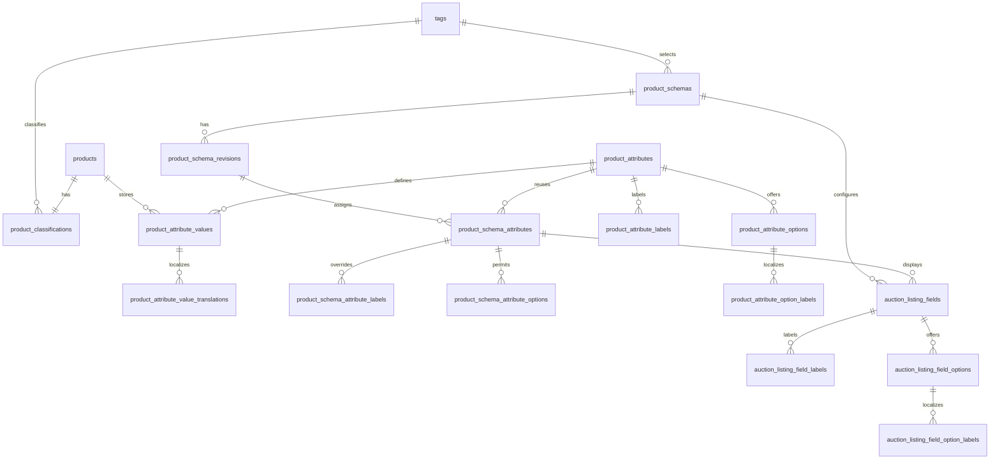

## Context

The inventory service currently stores one product classification in
`inventory.product_classifications`, while product facts are an unconstrained
`products.metadata` object. Auction reads that object through the inventory
binding and renders a hard-coded ordering. That shape cannot validate an exact
IP, Item, and Category schema, query every configured field, or distinguish a
stable field identity from its locale-specific label and value.

See [proposal.md](proposal.md) for the product reason and
[catalog requirements](specs/grade10-admin/inventory/catalog/spec.md) for the
contract.

## Goals / Non-Goals

**Goals:**

- Make the published product-schema revision selected from the existing
  classification tuple, rather than storing a second product classification
- Keep field keys and select-option keys stable while resolving labels and
  displayed values for `en`, `zh-Hant`, and `zh-Hans`
- Validate a supplied value on every write and validate the complete required
  set before either configuration publishing or a product enters `created`
- Make universal tags and configured fields queryable without treating
  localized display text as an identifier

**Non-Goals:**

- Migrate or reinterpret existing free-form `products.metadata` entries
- Keep a history of product field values or published configuration revisions
  beyond the active revision and one editable draft
- Design the configuration or product-editor screens; that belongs to
  `ui-design.md`

## Decisions

### Normalize Configured Facts

Use relational rows for product schemas, their attributes, and product values. Keep
`products.metadata jsonb` intact for legacy, unstructured metadata during this
change, but remove it from the structured product editor and Auction's
structured presentation path.

The service resolves a product's product schema by joining its one existing
`product_classifications` row to the one published product-schema revision with
the same `ip_tag_id`, `item_tag_id`, and `category_tag_id`. The product does
not persist a product-schema id or an eligibility flag: both would duplicate
facts that can change when the classification or active revision changes.

**Alternative considered — retain structured data in `products.metadata`.** A
JSON object makes a first editor quick, but cannot enforce stable field and
option identities, scoped validation, select values, localized text, or useful
per-field indexes. It also makes a published-schema check scan and interpret
each product document.

**Alternative considered — store a product-schema id on `products`.** It would
allow a product to point at a stale configuration after its classification is
edited. Resolving from the classification keeps one source for the tuple.

### Draft Revisions Preserve the Active Configuration

Model an exact tuple as one `product_schemas` identity with at most one
`published` revision and one `draft` revision. Editing starts or updates the
draft revision; publishing validates it, then changes it to `published` in the
same transaction that retires the prior published revision. Product reads use
only the published revision. A failed publish never changes that read path.

This small version boundary is needed even though historical versions are out
of scope: an editable row must not make the live Auction schema disappear or
change before it passes its affected-product validation.

**Alternative considered — one mutable row with a `published` flag.** Every
draft edit would either alter the live schema or require an unsafe in-place
rollback. It cannot keep the prior published configuration active on refusal.

### Validate Canonical Values, Localize Only Their Display

Product values use the field key and canonical storage appropriate to the data
type. Text has an English canonical value and optional per-locale translations;
number and boolean values are language-neutral; select values store stable
option keys. The renderer resolves a supplied active-locale translation, then
English. It never exposes a field key or option key as display copy.

English is the required base locale at two levels:

- Publishing an attribute/product-schema revision requires its English displayed
  field label and the English displayed value of every allowed select option.
- A required text product field needs a non-empty English value; a required
  number or boolean needs its canonical value; a required select needs a
  permitted option key (or at least one permitted key for multi-select).

Other locale entries are optional. The CMS returns missing-locale warnings for
labels and select options; product reads fall back silently to English. A
locale value that is supplied is still validated using the field's text rules.
This makes missing translation a content-quality report, not a way to bypass a
required field.

**Alternative considered — put dynamic labels and values in
`@grade10/i18n`.** The catalog is for platform copy. These are tenant-managed
CMS data and need admin CRUD, stable option keys, and per-product-schema
overrides.

### Centralize Eligibility and Validation in Inventory

Add one inventory-domain validator used by product create/update, mark-created,
product-schema publish and Auction search.
Entry points decode contracts and authorize; `ProductSchemaService` owns the
transaction and calls repositories. Clients render its field-level outcomes but
do not decide validity.

A draft may save an incomplete required set. Each supplied value is checked
immediately against the currently published revision (or refused if no matching
published revision assigns that field). `markProductCreated` takes a row lock,
resolves the exact active revision, validates universal classification and the
complete required set, then changes status. Auction's existing `created` status
gate remains, and its product reads/searches join the active revision and value
tables. It does not persist an `auction_eligible` projection.

**Alternative considered — validate only in the admin form or only on
publish.** Forms can be bypassed and publishing does not protect a later
product update. The inventory boundary sees every mutation and every
created-state transition.

### Auction Owns Listing Attributes

Keep product attributes in Inventory because they identify the reusable product
and participate in creation validation and search. Move Auction presentation
configuration and listing-specific attributes into the Auction domain. An
Auction listing can select a product attribute for display, or hold an
listing attribute such as `psa_cert_number`. Its value is keyed to
the listing, so two listings of the same product can show different values.

Keep listing-attribute definitions normalized in Auction, but store the values
on `auction.listings.listing_attributes jsonb`. Each key holds a canonical
value and, for text, optional localized values. The definition supplies the
localized label and select-option labels. English remains the required base;
missing Chinese label or text values warn in admin and display English.

```json
{
  "psa_cert_number": {
    "value": "0001234567",
    "translations": { "zh-Hant": "0001234567" }
  },
  "vaulted": { "value": true }
}
```

**Alternative considered — attach listing values to the product schema.**
That makes a unique listing fact appear shared by every listing of the product,
which is incorrect for certification, vaulting, and shipping facts.

**Alternative considered — normalize every listing value and translation.**
It gives direct reverse indexes, but is unnecessary while listing attributes
are display-only. JSONB keeps each listing's flexible value document atomic;
an Auction search projection is added only if a listing attribute later becomes
a public filter.

### Respect the Inventory and Auction Boundary

PostgreSQL transactions span every schema in one database, so an Auction
transaction could atomically write `auction.*` and `inventory.*`. The design
does not use that capability for normal commands. Each domain writes its own
tables and calls the other through its contract. A cross-schema join is not
inherently slower than a same-schema join, but it couples Auction to Inventory
table shapes, permissions, migrations, locks, and availability.

Auction search uses product-attribute data supplied by Inventory through a
contract or an Auction-owned projection. No cross-schema query is part of the
runtime boundary. A shared Neon database gives one atomic transaction only
while both schemas remain in that database; separate databases need a
distributed protocol and are deliberately not treated as atomic.

## Database Schema

Product-schema tables live in the existing `inventory` PostgreSQL schema.
Listing-attribute tables live in the Auction PostgreSQL schema. IDs are
system-minted `text`; timestamps use the existing `msTimestamp` convention:
`timestamp with time zone`, `NOT NULL`, `DEFAULT now()`.

| Table | Columns | Constraints and indexes | Authority |
| --- | --- | --- | --- |
| `product_attributes` | `id text NOT NULL`; `key text NOT NULL`; `data_type text NOT NULL`; `validation jsonb NOT NULL DEFAULT '{}'::jsonb`; audit timestamps | PK `id`; unique `key`; data-type and JSON-object checks; key immutable after a value exists | Reusable product-attribute identity, type, validation |
| `product_attribute_labels`, `product_attribute_options`, `product_attribute_option_labels` | Attribute/option id, locale or stable option key, trimmed label, audit timestamps where applicable | Composite PKs and FKs to the attribute/option; English base enforced by service | Localized reusable labels and select options |
| `product_schemas` | `id text NOT NULL`; `ip_tag_id text NOT NULL`; `item_tag_id text NOT NULL`; `category_tag_id text NOT NULL`; audit timestamps | PK `id`; unique tuple; FKs to `tags` | Exact classification tuple |
| `product_schema_revisions` | `id text NOT NULL`; `product_schema_id text NOT NULL`; `state text NOT NULL DEFAULT 'draft'`; audit timestamps | PK `id`; FK schema; state check; partial unique indexes: one published and one draft revision per schema | Active product configuration |
| `product_schema_attributes` | `id text NOT NULL`; `revision_id text NOT NULL`; `attribute_id text NOT NULL`; `required boolean NOT NULL DEFAULT false`; `validation jsonb NOT NULL DEFAULT '{}'::jsonb`; audit timestamps | PK `id`; unique `(revision_id, attribute_id)`; FKs; JSON-object check; index `(revision_id, required)` | Product-schema assignment, requiredness, validation override |
| `product_schema_attribute_labels`, `product_schema_attribute_options` | Schema-attribute id, locale or option id, label/order | Composite PKs, FKs, non-negative option order | Per-schema labels and allowed options |
| `product_attribute_values` | `id text NOT NULL`; `product_id text NOT NULL`; `attribute_id text NOT NULL`; `text_value text NULL`; `number_value numeric NULL`; `boolean_value boolean NULL`; `option_keys text[] NULL`; audit timestamps | PK `id`; unique `(product_id, attribute_id)`; one canonical-value column check; btree typed-value indexes and GIN `option_keys` | Canonical product facts |
| `product_attribute_value_translations` | `product_attribute_value_id text NOT NULL`; `locale text NOT NULL`; `value text NOT NULL` | PK `(product_attribute_value_id, locale)`; FK value cascade; trimmed non-empty check | Localized product text values |
| `auction_listing_fields` | `id text NOT NULL`; `product_schema_id text NOT NULL`; `key text NOT NULL`; `source text NOT NULL`; `product_schema_attribute_id text NULL`; `data_type text NULL`; `validation jsonb NOT NULL DEFAULT '{}'::jsonb`; `display_order integer NOT NULL`; audit timestamps | Auction PK `id`; unique `(product_schema_id, key)`; `source` check `product-attribute`/`listing-attribute`; exactly one source shape; listing attribute validates data type; index schema/order | Auction display definition and listing-attribute definition |
| `auction_listing_field_labels`, `auction_listing_field_options`, `auction_listing_field_option_labels` | Field/option id, locale or stable option key, trimmed label, audit timestamps where applicable | Composite PKs and FKs; English base enforced by service | Localized listing-attribute labels and select options |
| `auction.listings.listing_attributes` | `jsonb NOT NULL DEFAULT '{}'::jsonb` | JSON-object check; values validated against `auction_listing_fields`; no public-search index while listing attributes are display-only | Canonical listing values and optional localized text values |

`product_classifications` and its three tag columns remain authoritative for
universal classification. `products.status` remains authoritative for its
lifecycle. The matching published revision, validation report, locale fallback,
and Auction eligibility are derived at read or command time and are not stored.
Auction listing fields and `listing_attributes` are authoritative only for
their own listing; they never change product validation or product facts.

`validation` is a JSON object because valid properties differ by field type.
The service accepts only the documented shape: text `minLength`, `maxLength`,
`pattern`; number `minimum`, `maximum`; select allowed keys via the join table;
boolean has no additional rule. It rejects incompatible keys, malformed regular
expressions, inverted ranges, and unknown keys before writing.



## Service Interfaces

`ProductSchemaService` owns the Inventory processors. Each write executes in the
inventory database transaction begun by the service; repositories contain only
SQL and return rows. tRPC admin routers and the inventory RPC binding only
decode/authorize and map outcomes.

| Processor | Input | Success | Refusal and controls |
| --- | --- | --- | --- |
| `saveProductAttribute` | `{ actorId, attribute?: { id }, key, dataType, validation, labels, options }` | `{ attribute, translationWarnings }` | Duplicate/used key, invalid rule, duplicate option key, or absent English base label/value. Transaction writes attribute → labels → options → option labels. |
| `saveProductSchemaDraft` | `{ actorId, tuple, revisionId?, attributes }` | `{ draftRevision, translationWarnings }` | Locks the tuple's `product_schemas` row; validates tags and references; writes identity if absent → draft revision → assignments/labels/options. Replaces draft child rows atomically. |
| `publishProductSchema` | `{ actorId, revisionId }` | `{ publishedRevision, translationWarnings, affectedProductCount }` | Locks schema, draft revision, and matching classifications with `FOR UPDATE`; validates English bases and every matching product. On violation, returns `{ code: 'product-schema-publish-blocked', violations[] }` and rolls back. On success, retires old published → publishes draft atomically. |
| `upsertProductAttributeValues` | `{ actorId, productId, values }` | `{ product, validationReport }` | Locks product and resolves its published revision. Validates each supplied product attribute and locale value before replacing its values and translations. Refusal leaves prior values unchanged. Draft completeness is reported, not refused. |
| `markProductCreated` | `{ actorId, productId }` | `{ product }` | Locks product and classification; resolves the published product schema; requires all 3 tags and every required product attribute. Returns `{ code: 'product-schema-invalid', violations[] }` without changing status/history on refusal. |
| `saveAuctionListingFields` | `{ actorId, productSchemaId, fields }` | `{ fields, translationWarnings }` | Auction transaction validates field sources, English bases, presentation order, and listing-attribute validation. A product-attribute source must belong to the selected product schema. |
| `upsertAuctionListingAttributeValues` | `{ actorId, listingId, values }` | `{ listing }` | Locks the listing; validates the complete JSONB value document and localized text against its product schema's Auction fields; replaces `listing_attributes` atomically. It never writes Inventory product values. |
| `readAuctionListingContent` | `{ listingId, locale }` | `{ fields: Array<{ key, label, value, displayOrder }> }` | Reads a created product's schema-resolved product attributes and the listing's own values, resolves `locale → en`, and returns configured fields in order. Missing optional product values are omitted. |
| `searchAuctionProducts` | `{ locale, universalFilters, attributeFilters, query, page }` | `{ results, availableFilters }` | Uses Inventory's product-attribute contract or an Auction-owned projection. It never offers listing attributes as criteria. |

Example: a Pokémon product has `product_classifications = (pokemon,
single-card, tcg)`, a required `grading` assignment, and no
`product_attribute_values` row for `grading`. `markProductCreated` locks the
product and classification, reads the active tuple revision, finds the missing
row, and returns `product-schema-invalid` with `[{ attributeKey: 'grading',
reason: 'required' }]`; its status remains `draft`. If the product has
`grading = ['psa-10']`, validation succeeds and the same transaction writes
`products.status = 'created'`, advances `updated_at`, and creates the existing
`product-update` history row.

## Contracts

Extend `@grade10/inventory-contracts` additively with discriminated schemas
for product attributes, localized labels, option keys, product-schema
revisions, canonical typed product values, translation warnings, and validation
violations. The schemas preserve the stable key on admin reads but require
renderers to use resolved `label` and `value`.

Add authorized inventory-admin procedures for product-attribute and
product-schema draft/save/review/publish operations, and extend product
create/update/read with structured values plus a validation report. Add Auction
contracts for listing-field configuration and listing-attribute values, then
update its public listing contract to carry ordered displayed fields. Remove
the hard-coded metadata mapper only after consumers use the new field list.

## Risks / Trade-offs

- **[A published schema change can invalidate many products]** → Lock the
  tuple and affected classifications during publish; validate every affected
  product before flipping the active revision
- **[Requiredness can be confused with missing translations]** → Validate
  canonical required values separately from translation warnings; require
  English base content only
- **[Dynamic field filters can become slow]** → Query typed canonical columns
  through per-type indexes and option-key GIN indexes; paginate from the
  inventory query rather than filtering Auction results in memory
- **[A listing attribute later needs public search]** → Add a JSONB GIN index
  for exact containment first; introduce an Auction-owned typed search
  projection only for range, sort, facet, or high-volume requirements
- **[A cross-schema command hides ownership]** → Keep writes behind Inventory
  and Auction services; use one database transaction across schemas only for a
  deliberately owned operational migration or repair
- **[Legacy metadata and structured fields can show different facts]** → Make
  structured content the only source for the new Auction presentation and
  leave legacy metadata unchanged until an explicit migration change is scoped
- **[Configuration removal changes a live product read]** → Do not delete a
  published revision; retire it only after a successor validates, and refuse
  deletion of a field/value referenced by a published revision or product

## Migration Plan

1. Add Drizzle tables, checks, foreign keys, and indexes in a new append-only
   inventory migration. Do not modify existing migration files or drop
   `products.metadata`.
2. Deploy contracts and inventory service support with no product schemas. All
   existing products remain `draft`/`created` according to their current status;
   existing created products retain their existing stock behavior, while only
   the new content-aware Auction presentation requires an active revision.
3. Create and publish product schemas, then backfill product structured values
   through the admin CMS. Publishing blocks until matching products meet the
   new required set.
4. Add Auction listing-field configuration and listing-attribute values. Move
   Auction reads and displays to the composed product-and-listing contract;
   filters use product attributes only. Keep the legacy metadata read
   compatible until the consuming listing contract has landed.
5. Roll back application code by leaving new tables and rows inert. Do not
   roll back the migration or delete configured content; forward-fix a faulty
   revision from its draft.
