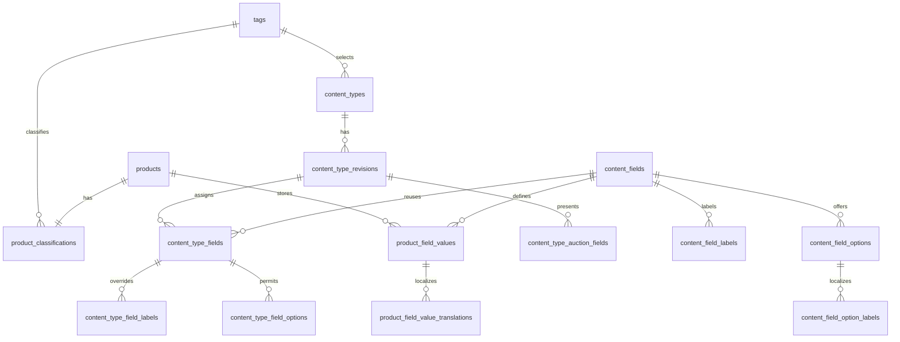

## Context

The inventory service currently stores one product classification in
`inventory.product_classifications`, while product facts are an unconstrained
`products.metadata` object. Auction reads that object through the inventory
binding and renders a hard-coded ordering. That shape cannot validate an exact
IP, Item, and Category schema, query every configured field, or distinguish a
stable field identity from its locale-specific label and value.

See [proposal.md](proposal.md) for the product reason and
[catalog requirements](specs/grade10-admin/inventory/catalog/spec.md) for the
contract.

## Goals / Non-Goals

**Goals:**

- Make the published content-type revision selected from the existing
  classification tuple, rather than storing a second product classification
- Keep field keys and select-option keys stable while resolving labels and
  displayed values for `en`, `zh-Hant`, and `zh-Hans`
- Validate a supplied value on every write and validate the complete required
  set before either configuration publishing or a product enters `created`
- Make universal tags and configured fields queryable without treating
  localized display text as an identifier

**Non-Goals:**

- Migrate or reinterpret existing free-form `products.metadata` entries
- Keep a history of product field values or published configuration revisions
  beyond the active revision and one editable draft
- Design the configuration or product-editor screens; that belongs to
  `ui-design.md`

## Decisions

### Normalize Configured Facts

Use relational rows for content types, their fields, and product values. Keep
`products.metadata jsonb` intact for legacy, unstructured metadata during this
change, but remove it from the structured product editor and Auction's
structured presentation path.

The service resolves a product's content type by joining its one existing
`product_classifications` row to the one published content-type revision with
the same `ip_tag_id`, `item_tag_id`, and `category_tag_id`. The product does
not persist a content-type id or an eligibility flag: both would duplicate
facts that can change when the classification or active revision changes.

**Alternative considered — retain structured data in `products.metadata`.** A
JSON object makes a first editor quick, but cannot enforce stable field and
option identities, scoped validation, select values, localized text, or useful
per-field indexes. It also makes a published-schema check scan and interpret
each product document.

**Alternative considered — store a content-type id on `products`.** It would
allow a product to point at a stale configuration after its classification is
edited. Resolving from the classification keeps one source for the tuple.

### Draft Revisions Preserve the Active Configuration

Model an exact tuple as one `content_types` identity with at most one
`published` revision and one `draft` revision. Editing starts or updates the
draft revision; publishing validates it, then changes it to `published` in the
same transaction that retires the prior published revision. Product reads use
only the published revision. A failed publish never changes that read path.

This small version boundary is needed even though historical versions are out
of scope: an editable row must not make the live Auction schema disappear or
change before it passes its affected-product validation.

**Alternative considered — one mutable row with a `published` flag.** Every
draft edit would either alter the live schema or require an unsafe in-place
rollback. It cannot keep the prior published configuration active on refusal.

### Validate Canonical Values, Localize Only Their Display

Product values use the field key and canonical storage appropriate to the data
type. Text has an English canonical value and optional per-locale translations;
number and boolean values are language-neutral; select values store stable
option keys. The renderer resolves a supplied active-locale translation, then
English. It never exposes a field key or option key as display copy.

English is the required base locale at two levels:

- Publishing a field/content-type revision requires its English displayed
  field label and the English displayed value of every allowed select option.
- A required text product field needs a non-empty English value; a required
  number or boolean needs its canonical value; a required select needs a
  permitted option key (or at least one permitted key for multi-select).

Other locale entries are optional. The CMS returns missing-locale warnings for
labels and select options; product reads fall back silently to English. A
locale value that is supplied is still validated using the field's text rules.
This makes missing translation a content-quality report, not a way to bypass a
required field.

**Alternative considered — put dynamic labels and values in
`@grade10/i18n`.** The catalog is for platform copy. These are tenant-managed
CMS data and need admin CRUD, stable option keys, and per-content-type
overrides.

### Centralize Eligibility and Validation in Inventory

Add one inventory-domain validator used by product create/update, mark-created,
content-type publish, Auction search, and the product-presentation binding.
Entry points decode contracts and authorize; `ProductContentService` owns the
transaction and calls repositories. Clients render its field-level outcomes but
do not decide validity.

A draft may save an incomplete required set. Each supplied value is checked
immediately against the currently published revision (or refused if no matching
published revision assigns that field). `markProductCreated` takes a row lock,
resolves the exact active revision, validates universal classification and the
complete required set, then changes status. Auction's existing `created` status
gate remains, and its product reads/searches join the active revision and value
tables. It does not persist an `auction_eligible` projection.

**Alternative considered — validate only in the admin form or only on
publish.** Forms can be bypassed and publishing does not protect a later
product update. The inventory boundary sees every mutation and every
created-state transition.

## Database Schema

All new tables live in the existing `inventory` PostgreSQL schema. IDs are
system-minted `text`; timestamps use the existing `msTimestamp` convention:
`timestamp with time zone`, `NOT NULL`, `DEFAULT now()`.

| Table | Columns | Constraints and indexes | Authority |
| --- | --- | --- | --- |
| `content_fields` | `id text NOT NULL`; `key text NOT NULL`; `data_type text NOT NULL`; `validation jsonb NOT NULL DEFAULT '{}'::jsonb`; audit timestamps | PK `id`; unique `key`; `data_type` check: `text`, `number`, `boolean`, `single-select`, `multi-select`; JSON object check; field key is immutable after a value exists | Reusable field identity, type, and validation |
| `content_field_labels` | `field_id text NOT NULL`; `locale text NOT NULL`; `label text NOT NULL` | PK `(field_id, locale)`; FK field cascade; trimmed non-empty label check | Default localized field labels |
| `content_field_options` | `id text NOT NULL`; `field_id text NOT NULL`; `key text NOT NULL`; audit timestamps | PK `id`; unique `(field_id, key)`; FK field cascade; allowed only for select field enforced by service | Stable select-option identity |
| `content_field_option_labels` | `option_id text NOT NULL`; `locale text NOT NULL`; `label text NOT NULL` | PK `(option_id, locale)`; FK option cascade; trimmed non-empty check | Default localized option labels |
| `content_types` | `id text NOT NULL`; `ip_tag_id text NOT NULL`; `item_tag_id text NOT NULL`; `category_tag_id text NOT NULL`; audit timestamps | PK `id`; unique `(ip_tag_id, item_tag_id, category_tag_id)`; FKs to `tags`; tuple lookup index duplicates the unique index | Exact classification tuple |
| `content_type_revisions` | `id text NOT NULL`; `content_type_id text NOT NULL`; `state text NOT NULL DEFAULT 'draft'`; audit timestamps | PK `id`; FK content type; state check `draft`/`published`; partial unique indexes: one `published` and one `draft` revision per content type | Active configuration is the `published` revision; draft is editable only |
| `content_type_fields` | `id text NOT NULL`; `revision_id text NOT NULL`; `field_id text NOT NULL`; `required boolean NOT NULL DEFAULT false`; `auction_only boolean NOT NULL DEFAULT false`; `validation jsonb NOT NULL DEFAULT '{}'::jsonb`; audit timestamps | PK `id`; unique `(revision_id, field_id)`; FKs; JSON object check; `auction_only` implies `required = false`; index `(revision_id, required)` | Field assignment, requiredness, per-type validation override, and Auction-only status |
| `content_type_field_labels` | `content_type_field_id text NOT NULL`; `locale text NOT NULL`; `label text NOT NULL` | PK `(content_type_field_id, locale)`; FK assignment cascade; trimmed non-empty check | Per-content-type label override; falls back to `content_field_labels` |
| `content_type_field_options` | `content_type_field_id text NOT NULL`; `option_id text NOT NULL`; `display_order integer NOT NULL DEFAULT 0` | PK `(content_type_field_id, option_id)`; FKs; non-negative order check | Allowed options and their per-type ordering |
| `content_type_auction_fields` | `revision_id text NOT NULL`; `content_type_field_id text NULL`; `universal_tag_kind text NULL`; `display_order integer NOT NULL` | PK `(revision_id, display_order)`; FK revision/assignment; check exactly one target; `universal_tag_kind` check `ip`/`item`/`category`; unique target per revision | Ordered Auction display selection, including universal tags |
| `product_field_values` | `id text NOT NULL`; `product_id text NOT NULL`; `field_id text NOT NULL`; `text_value text NULL`; `number_value numeric NULL`; `boolean_value boolean NULL`; `option_keys text[] NULL`; audit timestamps | PK `id`; unique `(product_id, field_id)`; FKs product/field; check exactly one canonical-value column is populated; btree indexes `(field_id, text_value)`, `(field_id, number_value)`, `(field_id, boolean_value)` and GIN `(option_keys)` | Canonical structured product values; service verifies the populated column matches field type and permitted options |
| `product_field_value_translations` | `product_field_value_id text NOT NULL`; `locale text NOT NULL`; `value text NOT NULL` | PK `(product_field_value_id, locale)`; FK value cascade; trimmed non-empty check; English may mirror the canonical text value but is not separately authoritative | Non-English text display values |

`product_classifications` and its three tag columns remain authoritative for
universal classification. `products.status` remains authoritative for its
lifecycle. The matching published revision, validation report, locale fallback,
and Auction eligibility are derived at read or command time and are not stored.

`validation` is a JSON object because valid properties differ by field type.
The service accepts only the documented shape: text `minLength`, `maxLength`,
`pattern`; number `minimum`, `maximum`; select allowed keys via the join table;
boolean has no additional rule. It rejects incompatible keys, malformed regular
expressions, inverted ranges, and unknown keys before writing.

## Service Interfaces

`ProductContentService` owns these processors. Each write executes in the
inventory database transaction begun by the service; repositories contain only
SQL and return rows. tRPC admin routers and the inventory RPC binding only
decode/authorize and map outcomes.

| Processor | Input | Success | Refusal and controls |
| --- | --- | --- | --- |
| `saveContentField` | `{ actorId, field?: { id }, key, dataType, validation, labels, options }` | `{ field, translationWarnings }` | Duplicate/used key, invalid rule, duplicate option key, or absent English base label/value. Transaction writes field → labels → options → option labels. Idempotent only when the caller retries the same immutable payload with the same idempotency key. |
| `saveContentTypeDraft` | `{ actorId, tuple, revisionId?, fields, auctionFields }` | `{ draftRevision, translationWarnings }` | Locks the tuple's `content_types` row; validates tags and references; writes identity if absent → draft revision → assignments/labels/options/presentation. Replaces the draft's child rows atomically. A revision cannot select an unassigned field for Auction. |
| `publishContentType` | `{ actorId, revisionId }` | `{ publishedRevision, translationWarnings, affectedProductCount }` | Locks the content type, draft revision, and matching product classifications with `FOR UPDATE`; validates the configuration's English bases, then each matching product's required set and every stored value. On any invalid product, returns `{ code: 'content-type-publish-blocked', violations[] }` and rolls back. On success, updates old published → retired and draft → published atomically. |
| `upsertProductFieldValues` | `{ actorId, productId, values }` | `{ product, validationReport }` | Locks product and resolves its published revision. Validates each supplied field and locale value before replacing only those product/field rows and translations. Refuses values for fields absent from the revision, invalid canonical shape, invalid translations, or invalid option keys; previous values remain unchanged. Draft completeness is reported, not refused. |
| `markProductCreated` | `{ actorId, productId }` | `{ product }` | Extends the existing state transition. Locks product and classification; resolves the published revision; requires all 3 tags and checks every assigned required value. Returns `{ code: 'product-content-invalid', violations[] }` with stable field keys and localized labels available for the caller. No status/history row changes on refusal. On success: validation → product status/updated timestamp → existing history entry in one transaction. |
| `readAuctionProductContent` | `{ productId, locale }` | `{ fields: Array<{ key, label, value, displayOrder }> }` | Reads only `created` products and the matching published revision. Resolves translation `locale → en`; returns configured Auction fields in order. Missing optional values are omitted. A no-content-type product returns a refusal, not legacy metadata. |
| `searchAuctionProducts` | `{ locale, universalFilters, fieldFilters, query, page }` | `{ results, availableFilters }` | Builds parameterized joins on classification, published revision, and canonical value indexes. It offers only non-Auction-only assigned fields, matches stable field/option identities, and localizes filter copy at read time. |

Example: a Pokémon product has `product_classifications = (pokemon,
single-card, tcg)`, a required `grading` assignment, and no
`product_field_values` row for `grading`. `markProductCreated` locks the
product and classification, reads the active tuple revision, finds the missing
row, and returns `product-content-invalid` with `[{ fieldKey: 'grading',
reason: 'required' }]`; its status remains `draft`. If the product has
`grading = ['psa-10']`, validation succeeds and the same transaction writes
`products.status = 'created'`, advances `updated_at`, and creates the existing
`product-update` history row.

## Contracts

Extend `@grade10/inventory-contracts` additively with discriminated schemas
for field definitions, localized labels, option keys, content-type revisions,
canonical typed product values, translation warnings, validation violations,
and ordered Auction display fields. The schemas preserve the stable key on
admin reads but require renderers to use resolved `label` and `value`.

Add authorized inventory-admin procedures for content-field and content-type
draft/save/review/publish operations, and extend product create/update/read
with structured values plus a validation report. Replace the Auction-facing
`getProductMetadata` use with an additive locale-aware structured-content
method; update Auction's public listing contract to carry ordered displayed
fields. Remove the hard-coded metadata mapper only after consumers use the new
field list.

## Risks / Trade-offs

- **[A published schema change can invalidate many products]** → Lock the
  tuple and affected classifications during publish; validate every affected
  product before flipping the active revision
- **[Requiredness can be confused with missing translations]** → Validate
  canonical required values separately from translation warnings; require
  English base content only
- **[Dynamic field filters can become slow]** → Query typed canonical columns
  through per-type indexes and option-key GIN indexes; paginate from the
  inventory query rather than filtering Auction results in memory
- **[Legacy metadata and structured fields can show different facts]** → Make
  structured content the only source for the new Auction presentation and
  leave legacy metadata unchanged until an explicit migration change is scoped
- **[Configuration removal changes a live product read]** → Do not delete a
  published revision; retire it only after a successor validates, and refuse
  deletion of a field/value referenced by a published revision or product

## Migration Plan

1. Add Drizzle tables, checks, foreign keys, and indexes in a new append-only
   inventory migration. Do not modify existing migration files or drop
   `products.metadata`.
2. Deploy contracts and inventory service support with no content types. All
   existing products remain `draft`/`created` according to their current status;
   existing created products retain their existing stock behavior, while only
   the new content-aware Auction presentation requires an active revision.
3. Create and publish content types, then backfill product structured values
   through the admin CMS. Publishing blocks until matching products meet the
   new required set.
4. Move Auction reads, displays, and filters to the structured binding after
   configured content exists. Keep the legacy metadata read compatible until
   the consuming listing contract has landed.
5. Roll back application code by leaving new tables and rows inert. Do not
   roll back the migration or delete configured content; forward-fix a faulty
   revision from its draft.
