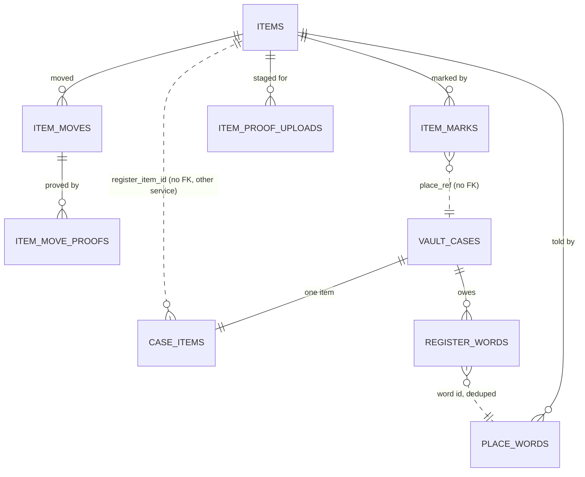

## Context

See [proposal.md](proposal.md#why) for the motivation and
[decisions.md](decisions.md) for what the interview settled; the journeys sit
beside each capability under `specs/`. Every path below is the application
repository's unless it says `grade10-spec`.

- **Inventory today** - one worker (`apps/backend/grade10/inventory`, the code
  in `packages/inventory/backend`) on its own Postgres schema `inventory`,
  hourly cron, an R2 bucket `INVENTORY_PRODUCT_ASSETS` for product media,
  tRPC under `elevatedProcedure` with `ADMIN_PERMISSIONS`
  (`inventory:read`, `inventory:write`) pinned to the router, a hash-chained
  `audit_logs`. Three named entrypoints serve other workers
  (`rpc/entrypoints.ts`): the auction's and the stock console's reservations,
  and grading's card match. No erasure router: inventory holds no personal
  data today
- **Vault today** - `packages/vault/backend`: `cases/transitions.ts` is the
  only writer of a status; `case_items` holds one row per case (category from
  six, title, description) under a unique `case_id`; `custody_items` is open
  while the item is held; `prepareCaseDocuments` reads its cross-service facts
  in a render phase before the locked commit; sweeps run on a 15-minute fast
  lane and an hourly slow lane (`sweeps/pass.ts`). The vault binds auth,
  appointment and e-kyc, and not inventory. Outboxes already in use:
  `identity_discards`, `notification_retries`
- **The worked example of a fact another service must not miss** is the
  store's `order_events` (`docs/architecture/cross-service.md`, Tell-push):
  a row written with the fact, its own id the consumer's dedupe key, drained
  at least once
- **Auth answers accounts** - `accountByEmail` and `accountsByUserIds`
  (≤ 100 ids) on the binding every worker holds; the erasure guard and
  `createErasureRouter` from `@grade10/worker` frame each product's half of an
  erasure
- **Built on `vault-walk-ins-and-owners`** - the walk-in act and its form, the
  collector names behind `kyc:read`, and the collector page. This change adds
  to all three and lands after it (Migration Plan)

## Goals / Non-Goals

**Goals:**

- The register is inventory's own tables; the vault never waits on inventory to
  commit a case act
- Every vault fact the register mirrors is a due row committed with the fact
  and delivered at least once, deduplicated by the register
- Marked or not, owners disagreeing and a name are read, never stored

**Non-Goals:**

- A second place, a value, a photograph or a location on an item
  ([decisions.md](decisions.md#non-goals))
- Any change to the stock console's reservations

## Decisions

### The register is four tables in the inventory schema

`grade10-admin/inventory/items` governs what an item says and who owns it.
The record lives in `packages/inventory/backend` beside the catalogue, in
tables of its own (Q1): `items`, `item_marks`, `item_moves`,
`item_move_proofs`, plus the staging and dedupe tables below. Nothing joins
`products` or `inventories`, so a slab never becomes stock (Q26).

- **Rejected** - a new service and database (a deploy and a binding for
  nothing); columns on `products` (a product counts units)

### The vault tells the register through a due row committed with the fact

`grade10-site/vault/case-lifecycle` governs when the vault registers, marks and
lets go. Each of those acts writes one `vault.register_words` row in the
transaction that moves the case, and the vault drains the rows to inventory
over a new named entrypoint, `VaultItemsService`
(`docs/conventions/backend.md`, "A guaranteed side effect is a due row
committed with its fact").

| Vault act | Word | Carries |
| --- | --- | --- |
| Start valuation (`submitted → under_valuation`) | `registered` | item id, case id and reference, the collector, category, title, description, grader, grade, cert |
| Confirm vaulted (`signing → vaulted`) | `marked` | item id, case id and reference, the collector |
| Release (`→ released`), unwind (`vaulted → cancelled`) | `unmarked` | item id, case id |
| Forfeit (`active → forfeited`) | `unmarked` | item id, case id, `newOwner: lender` |

- **One word per kind per case** - unique `(case_id, kind)`. A corrected
  advance (`active → vaulted`) writes nothing, so a case is marked once and
  let go once
- **The vault mints the item id** at Start valuation (`itm_<uuid>`) or takes
  the id a lookup found, and writes it to `case_items.register_item_id` in the
  same transaction, so the case knows its item before the register does and
  every later word names it
- **Ordered per item** - a row is claimable only while no earlier undelivered
  row (`seq`) names the same item; a parked row holds the rest of that item's
  words back, loudly
- **Delivered three ways, one ledger** - a best-effort attempt after the
  act's commit (`waitUntil`, since the row is the guarantee); the fast lane's
  `registerWords` list (15 minutes, `@grade10/postgres/ladder`, cap 12, then
  parked and counted on `vault.register.parked`); and `prepareCaseDocuments`,
  which delivers its own case's rows before it reads the register
- **Refusal is a fault here** - a queued fact (`cross-service.md`): any answer
  but `applied` or `duplicate` costs a rung; a missing binding answers
  `unreachable` and costs none
- **Rejected** - the register reserving before the vault acts (Q6, Q30); a
  synchronous call inside the case transaction, which ties every counter act to
  inventory's uptime

### The register mirrors and never refuses

`VaultItemsService.tell(word)` applies a word in one inventory transaction
that first inserts `(place, word_id)` into `place_words`; a conflict answers
`duplicate` and changes nothing. Otherwise:

| Word | Item absent | Item present |
| --- | --- | --- |
| `registered` | insert the item under the collector; a grader and cert a live item already holds registers the item without its slab and records outcome `cert_taken` naming that item | nothing changes (a walk-in linked a known slab) |
| `marked` | refused `ITEM_UNKNOWN`, a fault: ordering makes it unreachable | open mark `(item, vault, case)` with the vault's owner, unless one exists for that case, open or closed |
| `unmarked` | refused `ITEM_UNKNOWN` | close the case's mark if open, closer `place`; with `newOwner: lender`, move the owner to the lender with a move row by the vault, unless the lender already owns it |

- **A hand close is final** - a later `marked` for the same case finds the
  closed row and leaves it (Q19)
- **Owners disagreeing is read** - an open mark keeps the owner the vault
  named; the item page compares it with the item's owner at the read (Q6)
- **A neutral close** - a mark records who closed it, never why the vault
  let go; only the forfeit's owner move is visible (Q16)
- **Two marks at once** - the unique key is `(item, place, place_ref)`, so a
  second place or a second case marks beside the first (Q7)

### Marked or not is read from the open marks

An item is marked while any `item_marks` row for it has `closed_at IS NULL`;
there is no flag on `items`. Transfer and Retire refuse inside the item's row
lock by reading open marks, naming the place and its reference.

### A hand close asks the vault, the one call inventory makes to it

Close mark is offered only while the vault reads the item as no longer held
(Q29), and the worker refuses it independently. Inventory binds the vault's new
named entrypoint `InventoryVaultService` with one read,
`casesOf({ caseIds }) → [{ caseId, reference, status, held }]`, `held` meaning
an open `custody_items` row on a case not erased. The item page reads the
place row's status through the same call (fault as value: "status
unavailable"); the close treats a fault as a refusal, `PLACE_UNREACHABLE`.

- **A declared cycle** - vault → inventory carries words, inventory → vault
  reads custody; store ↔ loyalty is the precedent. Deploy order is in the
  Migration Plan
- **Rejected** - trusting the console's offer alone, which lets a crafted
  request free an item still in a locker; reading status in the browser from
  two products' clients, which couples two admin packages

### Walk-in and Start valuation find a known slab through the vault

The walk-in form and Start valuation send an optional grader and cert to the
vault, which asks `VaultItemsService.lookupSlab({ grader, cert })` before its
transaction (Ask, fault as value: the form keeps what was typed).

| Lookup answer | The vault does |
| --- | --- |
| A live item, no open mark | `register_item_id` = that item; `case_items` takes its category and title; the Case tab reads it |
| A live item another case marks | refuses `SLAB_MARKED`, naming the case |
| A live item under another owner | links it; Prepare documents is refused until the owner matches |
| A retired item, or none | keeps the typed pair in `case_items.slab_grader`, `slab_cert` for the `registered` word |

The walk-in's linked draft keeps `register_item_id`; the collector's draft
edit (`vault-walk-ins-and-owners`) refuses category and title on a linked
draft (Q43), and photographs and the description stay theirs.

### The Case tab and the valuation read the register; the vault keeps the request

`case_items` stays the collector's request as sent (Q35). The Case tab's facts
section and the valuation's slab line are views of
`packages/inventory/admin-frontend` (`ItemFactsSection`, `SlabLine`), reading
`items.get` by the case's `registerItemId` and editing through
`items.edit` under `inventory:write`. `CaseDetailPanel` takes them as two
render slots the app page fills, so neither admin package imports the other.
No `registerItemId`, or the register answering not found, reads as
registration pending.

### Prepare documents reads the register in its render phase

`prepareCaseDocuments` already reads identity and the shop over bindings
before its locked commit. It adds:

1. Deliver the case's undelivered words (awaited)
2. `VaultItemsService.itemOf({ itemId })` - absent refuses
   `REGISTER_PENDING`; unreachable refuses `REGISTER_UNREACHABLE`; an owner
   that is not this case's collector refuses `ITEM_OWNER_DIFFERS`, naming the
   owner
3. Render the custody agreement from the register's category, title,
   description, grader, grade and cert; the sealed PDF is the snapshot, and a
   re-prepare reads again (Q22)

The case read (`cases.detail`) asks `itemOf` too, fault as value, so the
Documents tab withholds Prepare documents under "another owner" before staff
press it.

### Names are read per page behind `kyc:read`

Items, one item, a move's sides and the collector section carry owner ids.
The router asks auth `accountsByUserIds` once per page (≤ 100) only for a
caller holding `kyc:read`, and the read declares its audit entry (who read
which owners). A fault, a missing name or no `kyc:read` answers the short id
with `nameUnavailable: true`; the page stands. Search by email asks
`accountByEmail` and filters on the id; no query reads a name (Q18).

### Proofs follow the auction's two-step upload

`POST /api/items/:itemId/proofs` (`inventory:transfer`) stores one file in a
new private bucket `INVENTORY_ITEM_PROOFS` and stages it in
`item_proof_uploads`; `items.transfer` names the staged keys and moves them to
`item_move_proofs` in its transaction. Opening a proof is `items.proof`
(`inventory:transfer`), which streams the object and writes an audit entry.
The storage area's `referenced` check is the proof rows, so the existing
orphan sweep removes an object no row names, including those erasure frees.

### Erasure is inventory's own router

`packages/inventory/backend/src/erasure/` over `createErasureRouter`, added to
the console's erasure checklist and the registry of erasure consumers. `holds`
lists one line per marked item the person owns
(`<item id> · vault <reference>`). `erase`, refused while any hold stands, in
one transaction: owner → erased with `title` and `description` null; each move
naming the person loses their side and its reason; a proof survives only where
the other side is the custodian, the lender or an account not erased; the
person's id leaves `item_marks.place_owner_user_id` and `place_words`
payloads. Rerunning finds nothing to do (Q17, Q34, Q38).

### Backfill is a slow-lane list in the vault

`registerBackfill` writes, per case, the words the live path would have
written, so one receiver serves both. It takes cases with no
`register_item_id`, not erased, that reached custody or are past Start
valuation and still open; per case, under the case lock: mint the id, then
`registered`, `marked` where custody opened, and `unmarked` where it closed
(`newOwner: lender` on `forfeited`). The unique `(case_id, kind)` and the
`register_item_id IS NULL` filter make a rerun a no-op; the list ends when it
finds nothing, and `vault.register.backfill_remaining` reads zero (Q10, Q32).

### Categories are one list in inventory's contracts

`ITEM_CATEGORIES` (ten) and `ITEM_GRADERS` (eight) live in
`@grade10/inventory-contracts`; `VAULT_ITEM_CATEGORIES` re-exports the ten,
and `ck_case_items_category` widens to them. The four new words are keys in
`grade10-spec`'s `packages/i18n` under `vault.category` (Q23).

### Items is a detail surface of Inventory

`apps/admin/grade10/src/surfaces.ts` gains `inventoryItems`
(`/inventory/items`) and `inventoryItem` (`/inventory/items/:itemId`), both
`kind: "detail"`, reached from Inventory's header (Q41). The ZZZ panel mounts
neither (Q27).

## Database Schema

Inventory tables live in the `inventory` schema and use `msTimestamp()`; vault
changes live in `vault`.

### `inventory.items`

| Column | Type | Null | Notes |
| --- | --- | --- | --- |
| `id` | `text` | no | PK, `itm_<uuid>` |
| `category` | `text` | no | CHECK in the ten |
| `title` | `text` | yes | ≤ 200; null only once the owner is erased |
| `description` | `text` | yes | ≤ 2,000 |
| `grader` | `text` | yes | CHECK in the eight |
| `grade` | `text` | yes | as printed |
| `cert` | `text` | yes | trimmed, upper case |
| `owner_kind` | `text` | no | `account` · `custodian` · `lender` · `erased` |
| `owner_user_id` | `text` | yes | set iff `owner_kind = 'account'` |
| `retired_at`, `retired_by`, `retired_reason` | `timestamptz`, `text`, `text` | yes | all or none; reason in `duplicate` · `lost` · `destroyed` · `left_platform` |
| `created_at`, `created_by` | `timestamptz`, `text` | no | `created_by` is a staff id or `vault` |
| `updated_at`, `updated_by` | `timestamptz`, `text` | no | the last edit, shown on one item's page |
| `owner_erased_at` | `timestamptz` | yes | |

- `ck_items_slab` - grader, grade and cert all null or all set
- `ck_items_owner` - `(owner_kind = 'account') = (owner_user_id IS NOT NULL)`
- `ck_items_title` - `title IS NOT NULL OR owner_erased_at IS NOT NULL`
- `uq_items_live_slab` - unique `(grader, cert)` `WHERE retired_at IS NULL AND cert IS NOT NULL`
- `idx_items_owner_user_id`, `idx_items_created_at_id` (paging)

### `inventory.item_marks`

| Column | Type | Null | Notes |
| --- | --- | --- | --- |
| `id` | `text` | no | PK |
| `item_id` | `text` | no | FK `items` |
| `place` | `text` | no | CHECK `vault` |
| `place_ref` | `text` | no | the vault case id |
| `place_label` | `text` | no | the case reference |
| `place_owner_kind`, `place_owner_user_id` | `text` | yes | the owner the place named; erasure nulls the id |
| `opened_at` | `timestamptz` | no | |
| `closed_at`, `closed_by_kind`, `closed_by`, `closed_reason` | `timestamptz`, `text`, `text`, `text` | yes | `closed_by_kind` `place` or `staff`; a staff close carries its id and reason |

- `uq_item_marks_item_place_ref` - unique `(item_id, place, place_ref)`
- `idx_item_marks_open_item` - `(item_id) WHERE closed_at IS NULL`

### `inventory.item_moves` and `inventory.item_move_proofs`

| Column | Type | Null | Notes |
| --- | --- | --- | --- |
| `id` | `text` | no | PK |
| `item_id` | `text` | no | FK `items` |
| `from_kind`, `from_user_id`, `to_kind`, `to_user_id` | `text` | kinds no, ids yes | same kinds as the owner |
| `actor_kind`, `actor_id` | `text` | no | `staff` + staff id, or `place` + `vault` |
| `place_ref` | `text` | yes | the case a forfeit came from |
| `reason` | `text` | yes | ≤ 500; null only after an erasure |
| `moved_at` | `timestamptz` | no | |

`idx_item_moves_item_moved_at` on `(item_id, moved_at DESC)`.

`item_move_proofs`: `id` PK, `move_id` FK, `object_key`, `file_name`,
`content_type` CHECK in PDF, PNG, JPEG, `byte_size` CHECK `> 0 AND ≤ 10485760`,
`position` `0..4`, unique `(move_id, position)`. `item_proof_uploads` is the
auction's staging shape keyed `(item_id, key)`, reclaimed after a day.

### `inventory.place_words`

`place` `text`, `word_id` `text`, PK `(place, word_id)`; `item_id` `text`,
`kind` `text`, `outcome` `text` (`applied` · `cert_taken`), `detail` `jsonb`
(the other item on `cert_taken`), `received_at`. The item page reads
`cert_taken` rows to show staff the slab the vault named.

### Vault changes

| Table | Change |
| --- | --- |
| `vault.case_items` | add `register_item_id text NULL` (indexed), `slab_grader text NULL`, `slab_cert text NULL`; replace `ck_case_items_category` with the ten (`NOT VALID`, then `VALIDATE`) |
| `vault.register_words` | new: `id text` PK (`rw_<uuid>`, the register's dedupe key), `seq bigint` identity, `case_id` FK, `item_id text`, `kind text` CHECK, `payload jsonb` whole, `attempts int` default 0, `next_attempt_at`, `delivered_at`, `parked_at`, `last_error`, `created_at`; unique `(case_id, kind)`; index `(next_attempt_at, seq) WHERE delivered_at IS NULL AND parked_at IS NULL` |

Authoritative: the item's facts and owner (`items`), each mark (`item_marks`),
each move (`item_moves`). Derived at the read: marked or not, owners
disagreeing, names, the place row's status.

## Service Interfaces

### Vault: write a word with its act

`appendRegisterWord(tx, { caseId, itemId, kind, payload, at })` - called by
the transitions above inside their transaction, after the status write.
`INSERT … ON CONFLICT (case_id, kind) DO NOTHING`, so a retried act writes
nothing twice.

Example - Start valuation on case `vc_1` (collector `u_9`):

| Row | Written |
| --- | --- |
| `vault_cases` | `status: under_valuation` |
| `case_items` | `register_item_id: itm_4f…` |
| `register_words` | `{ id: rw_a1, seq: 88, case_id: vc_1, item_id: itm_4f…, kind: registered, payload: { caseReference: "K7P2QX", owner: { kind: "account", userId: "u_9" }, facts: { category: "trading_card", title: "Charizard 1999", description: null, grader: "PSA", grade: "10", cert: "12345678" } } }` |

### Vault: deliver words

`deliverRegisterWords(db, register, { caseId?, limit })` → `{ delivered, failed, parked }`.
One row per transaction: claim (`FOR UPDATE SKIP LOCKED`, the ordering
predicate), call `tell`, then stamp `delivered_at`, or raise `attempts` and
`next_attempt_at`, or park at the cap - claim and stamp commit together.

### Inventory: `VaultItemsService`

| Method | Input | Success | Refusal |
| --- | --- | --- | --- |
| `tell` | `RegisterWord` (`wordId`, `kind`, `itemId`, `caseId`, `caseReference`, `owner?`, `facts?`, `newOwner?`, `at`) | `{ outcome: "applied" \| "duplicate" \| "cert_taken" }` | `ITEM_UNKNOWN`, `WORD_MALFORMED` |
| `lookupSlab` | `{ grader, cert }` | `{ item: ItemFacts & { owner, retired, openMarks: [{ place, ref, label }] } \| null }` | `GRADER_UNKNOWN` |
| `itemOf` | `{ itemId }` | `{ item: ItemFacts & { owner } \| null }` | - |

One transaction per `tell`; the `place_words` insert is its first statement
and its idempotency.

Example - the forfeit's `unmarked` on `itm_4f…`:

| Row | Before | After |
| --- | --- | --- |
| `place_words` | - | `(vault, rw_c3, applied)` |
| `item_marks` | open, `place_ref vc_1` | `closed_at`, `closed_by_kind: place` |
| `items` | `owner_kind: account, u_9` | `owner_kind: lender` |
| `item_moves` | - | `account u_9 → lender`, actor `place vault`, `place_ref vc_1`, reason `Forfeited to the lender by the vault` |

### Vault: `InventoryVaultService`

`casesOf({ caseIds ≤ 100 })` → `[{ caseId, reference, status, held }]`; an id
the vault does not hold is absent. Read only.

### Inventory: console acts

Each is an `elevatedProcedure` (audit row written by the ladder); each
mutation locks the item row `FOR UPDATE` first.

| Act | Grant | Input | Writes | Refusals |
| --- | --- | --- | --- | --- |
| `items.register` | write | category, title, description?, grader?, grade?, cert?, owner (`account` email or `custodian`) | `items` | `ITEM_CERT_TAKEN` (names the item), `OWNER_NOT_FOUND`, field limits |
| `items.edit` | write | item id, the six facts | `items`, `updated_*` | `ITEM_RETIRED`, `ITEM_CERT_TAKEN` |
| `items.transfer` | transfer | item id, to (`account` email or `custodian`), reason, proof keys ≤ 5 | `items`, `item_moves`, `item_move_proofs`; deletes the used uploads | `ITEM_MARKED` (place, reference), `ITEM_RETIRED`, `ITEM_SAME_OWNER`, `OWNER_NOT_FOUND`, `PROOF_REFUSED` |
| `items.retire` | write | item id, reason | `retired_*` | `ITEM_MARKED`, `ITEM_RETIRED` |
| `items.restore` | write | item id, reason | clears `retired_*` | `ITEM_NOT_RETIRED`, `ITEM_CERT_TAKEN` |
| `items.closeMark` | write | mark id, reason | `item_marks` closed by staff | `MARK_STILL_HELD`, `PLACE_UNREACHABLE`; a closed mark answers as closed |
| `items.proof` | transfer | proof id | audit row | `PROOF_REMOVED` |

The owner's email is resolved with `accountByEmail` before the transaction; a
retried transfer is refused `ITEM_SAME_OWNER`, so a double click moves once.

### Inventory: reads

| Read | Grant | Answers |
| --- | --- | --- |
| `items.list` | read | `{ tab: marked \| all \| retired, q?, ownerUserId?, cursor? }` → rows of id, title, category, grader, cert, owner (name behind `kyc:read`), open places; keyset on `(created_at, id)`, marked on the newest open mark |
| `items.get` | read | the facts, owner, `updatedAt`, `updatedBy`, retired, marks with each case's status from `casesOf`, owners disagreeing, `cert_taken` words, moves with proofs (proof ids only for `inventory:transfer`) |
| `items.resolveOwner` | read | `{ email }` → `{ userId, name \| null } \| null` |

`q` is read in order: an exact email (`@`), an item id (`itm_`), a listed
grader followed by a cert, otherwise a case-insensitive match on title or
description.

## API Contracts

- **New tRPC** `items.*` on the inventory router, each in
  `ADMIN_PERMISSIONS`, which gains `inventory:transfer`
- **New route** `POST /api/items/:itemId/proofs`, multipart, one file
- **New tRPC** `erasure.status`, `erasure.erase` on inventory
- **New RPC** `VaultItemsService` (inventory) and `InventoryVaultService`
  (vault), each a named entrypoint `implements` its contracts surface
- **Vault, additive** - `cases.detail` gains
  `item: { registerItemId: string | null, register: { state: "pending" | "registered" | "unavailable", owner?, ownerMatches? } }`;
  `valuation.start` and the walk-in open take an optional
  `slab: { grader, grade?, cert }`; new `cases.lookupSlab` (`vault:operate`);
  new refusals `REGISTER_PENDING`, `REGISTER_UNREACHABLE`,
  `ITEM_OWNER_DIFFERS`, `SLAB_MARKED`
- **Auth contracts** - `inventory: ["read", "write", "transfer"]`; `staff`
  gains `inventory:transfer`; the description; the regenerated
  `roles-and-permissions.json`

## Risks / Trade-offs

- [A word parked behind a bad payload holds back every later word for that
  item] → `vault.register.parked` gauge and alarm; Close mark is the person's
  way out for a stuck mark, and an engineer hands the row back
- [Two counters register the same new slab before either word lands] →
  `uq_items_live_slab` keeps one; the second item registers without its slab
  and the item page shows the pair the vault named, for staff to retire one
  as a duplicate
- [A transfer lands between the prepare read and the commit] → the mark word
  carries the vault's owner, and the item page shows both owners
- [The inventory ↔ vault cycle] → deploy the vault's `InventoryVaultService`
  before inventory's binding to it; until then the place row reads "status
  unavailable" and Close mark refuses `PLACE_UNREACHABLE`
- [Inventory down at Prepare documents] → `REGISTER_UNREACHABLE`, named on
  the Documents tab; every other case act still commits
- [Names leak through the audit-free email search] → the read declares an
  audit entry for every search and every page that resolved names
- [Proof objects outliving their rows] → the area's `referenced` check is the
  rows, and the orphan sweep removes the rest
- [Title search over a growing table] → a GIN trigram index on
  `lower(title || ' ' || coalesce(description, ''))`, added if `pg_trgm` is
  available, else a sequential scan over a register of thousands

## Migration Plan

1. **grade10-spec** - the four category words; the submodule bump carries
   them
2. **Auth contracts** - `inventory:transfer`, staff's grant, the regenerated
   roles; deploy auth
3. **Inventory migration** - the six tables (all new, so no `-- lock:` line);
   `pnpm db:migrate --env=<env> --db=inventory`
4. **Vault migration**, after `vault-walk-ins-and-owners`' migrations - the
   three `case_items` columns, the category check widened `NOT VALID` with a
   `VALIDATE` statement, `register_words`
5. **Deploy the vault** with `InventoryVaultService` and its words written but
   its `INVENTORY_ITEMS` binding absent: words wait, nothing is lost
6. **Deploy inventory** with `VaultItemsService` and the `VAULT` binding, and
   the new private bucket
7. **Bind the vault to inventory** and deploy; the fast lane drains the
   waiting words; the slow lane's `registerBackfill` runs until
   `vault.register.backfill_remaining` reads zero
8. **The console** - Items, one item, the Case tab slots, the collector
   section, the erasure line

Rollback: unbind `INVENTORY_ITEMS` from the vault - words keep accumulating and
deliver on rebinding; the register's tables stay.

## Open Questions

- The `vault.register.parked` alarm's destination follows the vault's other
  parked lists - Operations names the channel
