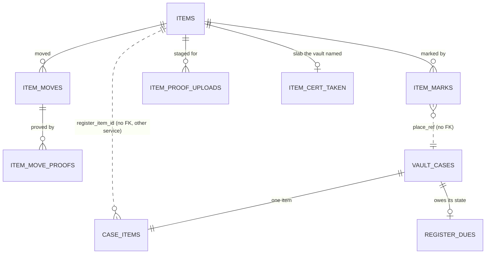

## Context

See [proposal.md](proposal.md#why) for the motivation and
[decisions.md](decisions.md) for what the interview settled; the journeys sit
beside each capability under `specs/`. Every path below is the application
repository's unless it says `grade10-spec`.

- **Inventory today** - one worker (`apps/backend/grade10/inventory`, the code
  in `packages/inventory/backend`) on its own Postgres schema `inventory`,
  hourly cron, an R2 bucket `INVENTORY_PRODUCT_ASSETS` for product media,
  tRPC under `elevatedProcedure` with `ADMIN_PERMISSIONS`
  (`inventory:read`, `inventory:write`) pinned to the router, a hash-chained
  `audit_logs`. Three named entrypoints serve other workers
  (`rpc/entrypoints.ts`): the auction's and the stock console's reservations,
  and grading's card match. No erasure router: inventory holds no personal
  data today
- **Vault today** - `packages/vault/backend`: `cases/transitions.ts` is the
  only writer of a status; `case_items` holds one row per case (category from
  six, title, description) under a unique `case_id`; `custody_items` is open
  while the item is held; `prepareCaseDocuments` reads its cross-service facts
  in a render phase before the locked commit; sweeps run on a 15-minute fast
  lane and an hourly slow lane (`sweeps/pass.ts`). The vault binds auth,
  appointment and e-kyc, and not inventory. Outboxes already in use:
  `identity_discards`, `notification_retries`
- **The worked example of a fact another service must not miss** is the
  store's `order_events` (`docs/architecture/cross-service.md`, Tell-push):
  a row written with the fact, its own id the consumer's dedupe key, drained
  at least once
- **Auth answers accounts** - `accountByEmail` and `accountsByUserIds`
  (≤ 100 ids) on the binding every worker holds; the erasure guard and
  `createErasureRouter` from `@grade10/worker` frame each product's half of an
  erasure
- **Built on `vault-walk-ins-and-owners`** - the walk-in act and its form, the
  collector names behind `kyc:read`, and the collector page. This change adds
  to all three and lands after it (Migration Plan)

## Goals / Non-Goals

**Goals:**

- The register is inventory's own tables; no case act but Prepare documents
  waits on inventory
- Every vault fact the register mirrors is owed by one due row per case,
  committed with the fact; the case's state is computed at delivery and
  applied by the register as an idempotent upsert that only moves forward
- Marked or not, owners disagreeing and a name are read, never stored

**Non-Goals:**

- A second place, a value, a photograph or a location on an item
  ([decisions.md](decisions.md#non-goals))
- Any change to the stock console's reservations

## Decisions

### The register is four tables in the inventory schema

`grade10-admin/inventory/items` governs what an item says and who owns it.
The record lives in `packages/inventory/backend` beside the catalogue, in
tables of its own (Q1): `items`, `item_marks`, `item_moves`,
`item_move_proofs`, plus the proof staging table and the `cert_taken` record
below. Nothing joins
`products` or `inventories`, so a slab never becomes stock (Q26).

- **Rejected** - a new service and database (a deploy and a binding for
  nothing); columns on `products` (a product counts units)

### The vault owes the register its case's state, one due row per case

`grade10-site/vault/case-lifecycle` governs when the vault registers, marks and
lets go. Each act that changes what the register should read raises one
`vault.register_dues` row for the case in the transaction that moves the case
(`docs/conventions/backend.md`, "A guaranteed side effect is a due row
committed with its fact"):

| Vault act | Raises the case's due row |
| --- | --- |
| Start valuation (`submitted → under_valuation`) | yes; the vault mints `itm_<uuid>`, or takes the id a lookup found, into `case_items.register_item_id` |
| Confirm vaulted (`signing → vaulted`) | yes |
| Release (`→ released`), unwind (`vaulted → cancelled`), forfeit (`active → forfeited`) | yes |
| Erasure of the case | yes |
| A corrected advance, a locker move, a decline or cancel before custody | no |

- **The row holds no payload** - `case_id`, `version`, `delivered_version`
  and the delivery ladder's columns. The delivery reads the case as it then
  stands and sends its state: the item id, the case's reference, the
  collector, the case's category, title and description, the named slab,
  custody opened or closed, forfeited, erased. No personal fact sits in the
  row, and an erased case registers nothing: its delivery stamps the row and
  sends nothing
- **Delivered three ways, one row** - a best-effort attempt after the act's
  commit (`waitUntil`, since the row is the guarantee); the fast lane's
  `registerDues` list (15 minutes, `@grade10/postgres/ladder`, cap 12, then
  parked and counted on `vault.register.parked`); and Prepare documents,
  which delivers its own case inline before it reads the register
- **Order does not matter** - the state is read at delivery and the register
  only moves forward, so a late or repeated delivery changes nothing and one
  case never waits on another
- **Refusal is a fault here** - a queued fact (`cross-service.md`): any answer
  but `applied` costs a rung; a missing binding answers `unreachable` and
  costs none
- **Rejected** - the register reserving before the vault acts (Q6, Q30); a
  synchronous call inside the case transaction, which ties every counter act to
  inventory's uptime; an ordered per-item ledger of words, which stores the
  collector's facts in the vault's outbox, lets one bad word hold back every
  later one, and needs a dedupe table on the register's side

### The register applies a case's state as a forward-only upsert

`VaultItemsService.tell(state)` applies one case's state in one inventory
transaction, locking the item row:

| The case's state | The register |
| --- | --- |
| Any | inserts the item under the collector if absent; a grader and cert a live item already holds registers the item without its slab and writes its `item_cert_taken` row naming that item |
| Custody opened | opens the mark `(item, vault, case)` with the vault's owner, unless a row exists for that case, open or closed |
| Custody closed | closes the case's mark if open, closer `place`; inserts it opened and closed where it was never opened |
| Forfeited | moves the owner to the lender with a move row by the vault on that case, unless that case already has a move |

- **A hand close is final** - a later state for the same case finds the
  closed row and leaves it (Q19)
- **A hand close on a forfeited case moves the item** - Close mark reads the
  case as forfeited from the vault and writes the vault's move to the lender
  in its own transaction; the later state finds the case's move and moves
  nothing (Q53, recommended A)
- **Owners disagreeing is read** - an open mark keeps the owner the vault
  named; the item page compares it with the item's owner at the read (Q6)
- **A neutral close** - a mark records who closed it, never why the vault
  let go; only the forfeit's owner move is visible (Q16)
- **Two marks at once** - the unique key is `(item, place, place_ref)`, so a
  second place or a second case marks beside the first (Q7)

### Marked or not is read from the open marks

An item is marked while any `item_marks` row for it has `closed_at IS NULL`;
there is no flag on `items`. Transfer and Retire refuse inside the item's row
lock by reading open marks, naming the place and its reference.

### A hand close asks the vault, the one call inventory makes to it

Close mark is offered only while the vault reads the item as no longer held
(Q29), and the worker refuses it independently. Inventory binds the vault's new
named entrypoint `InventoryVaultService` with one read,
`casesOf({ caseIds }) → [{ caseId, reference, status, held, forfeited }]`,
`held` meaning an open `custody_items` row on a case not erased. The item page reads the
place row's status through the same call (fault as value: "status
unavailable"); the close treats a fault as a refusal, `PLACE_UNREACHABLE`.

- **A declared cycle** - vault → inventory carries case states, inventory → vault
  reads custody; store ↔ loyalty is the precedent. Deploy order is in the
  Migration Plan
- **Rejected** - trusting the console's offer alone, which lets a crafted
  request free an item still in a locker; reading status in the browser from
  two products' clients, which couples two admin packages

### Walk-in and Start valuation find a known slab through the vault

The walk-in form and Start valuation send an optional
`slab: { grader, grade, cert }`, all three or none, to the vault, which asks
`VaultItemsService.lookupSlab({ grader, cert })` before its transaction (Ask,
fault as value: the form keeps what was typed). The cert is trimmed and
capitalised by the contracts' one cert schema, the same one `items.register`,
`items.edit` and the search read (Q48). Taking an item only sets
`case_items.register_item_id`, and `case_items.facts_from_register` where the
item is the customer's own; `case_items` keeps the collector's request (Q35).
The vault's procedures are `admin.openWalkIn`, `admin.startValuation` and a
new `admin.lookupSlab` (`vault:operate`).

| Lookup answer | The vault does |
| --- | --- |
| A live item the customer at the counter owns, no open mark | links it; on a walk-in the form fills category and title from the register; the Case tab reads it |
| A live item under another owner, no open mark | links it and fills nothing; the owner reads by name behind `kyc:read`, else by short id; Prepare documents is refused until the owner matches |
| A live item another case marks | refuses `SLAB_MARKED`, naming the case |
| A retired item, or none | keeps the slab in `case_items.slab_grader`, `slab_grade`, `slab_cert` for the registration |

The walk-in's linked draft keeps `register_item_id`; where
`facts_from_register` is set, the collector's draft edit
(`vault-walk-ins-and-owners`) refuses category and title (Q43), photographs
and the description stay theirs, and the collector's case wire carries the
flag so the wizard reads those two fields only.

### The Case tab and the valuation read the register; the vault keeps the request

`case_items` stays the collector's request as sent (Q35). The Case tab's facts
section and the valuation's slab line are views of
`packages/inventory/admin-frontend` (`ItemFactsSection`, `SlabLine`), reading
`items.get` by the case's `registerItemId` and editing through
`items.edit` under `inventory:write`. `CaseDetailPanel` takes them as two
render slots the app page fills (`itemFacts`, and `slabLine`, which
`CaseFlowPanel` passes on to `ValuationDialog`), so neither admin package
imports the other.
No `registerItemId`, or the register answering not found, reads as
registration pending; a caller without `inventory:read`, the treasurer, is
answered forbidden and the section names the grant (Q44).

### Prepare documents reads the register in its render phase

`prepareCaseDocuments` already reads identity and the shop over bindings
before its locked commit. It adds:

1. A case with no `register_item_id` (one valued before the vault's deploy)
   mints it and raises its due row under the case lock, so it registers here
2. Deliver the case's due row inline (awaited)
3. `VaultItemsService.itemOf({ itemId })` - absent refuses
   `REGISTER_PENDING`, meaning only that the delivery has not landed;
   unreachable refuses `REGISTER_UNREACHABLE`; an owner that is not this
   case's collector refuses `ITEM_OWNER_DIFFERS`, naming the owner by name
   behind `kyc:read` and by short id otherwise; a retired item refuses
   `ITEM_RETIRED`, naming the item (Q56)
4. Render the custody agreement from the register's category, title,
   description, grader, grade and cert, and the loan agreement's collateral
   from its category, title, grader, grade and cert; the sealed PDF is the
   snapshot, and a re-prepare reads again (Q22, Q57)

`prepareReleaseDocument` reads the register through the same steps 2 and 3,
one function both call, and prints the release receipt's item from the same
facts (Q57). It refuses a retired item and an unreachable register
(`grade10-site-vault-case-lifecycle-SC-61`), never another owner: a release
hands back what the vault took in from its collector, and the register
refuses a transfer while the vault marks the item, so refusing another owner
would leave the item held with no act to free it; its case was valued after the deploy, or registered by its own
Prepare documents, so it always has an item id.

The console's case read (`admin.detail`, and not the collector's own read or
the answer of every act) asks `itemOf` too, fault as value, as a top-level
`register` field, so the Documents tab withholds Prepare documents under
"another owner" before staff press it. The vault names that owner the way it
names a collector (`vault-walk-ins-and-owners`): its `admin.collectorNames`
behind `kyc:read`, the read audited, else the short id.

### Names are read per page behind `kyc:read`

Items, one item, a move's sides and the collector section carry owner ids.
Their names come from a separate `items.ownerNames` (`kyc:read`), asked once
per page with the page's ids (≤ 100, `accountsByUserIds` over inventory's new
`AccountsPort` on `AUTH_SERVICE`), which declares its audit entry (who read
which owners), as the vault's `admin.collectorNames` does. A fault, a missing
name or no `kyc:read` shows the short id with "name unavailable"; the page
stands. Search by email asks
`accountByEmail` and filters on the id; no query reads a name (Q18).

### Proofs follow the auction's two-step upload

`PUT /api/items/:itemId/proofs?name=` (`inventory:transfer`, a raw body, as
the auction's `routes/orderProofs.ts`) stores one file in a new private bucket
`INVENTORY_ITEM_PROOFS` and stages it in `item_proof_uploads`;
`items.transfer` names the staged keys and moves them to `item_move_proofs` in
its transaction. Opening a proof is `GET /api/items/proofs/:proofId`
(`inventory:transfer`), which streams the object with private, no-store
headers and appends its audit entry.
The storage area's `referenced` check is the proof rows, so the existing
orphan sweep removes an object no row names, including those erasure frees.
The dialog's picker is the auction's `ProofFilesField`, moved into
`@grade10/frontend-console` so both products import one field.

### Erasure is inventory's own router

`packages/inventory/backend/src/erasure/` over `createErasureRouter`, added to
the console's erasure checklist and the registry of erasure consumers. `holds`
lists one line per marked item the person owns
(`<item id> · vault <reference>`). `erase`, refused while any hold stands, in
one transaction: owner → erased with `title` and `description` null; each move
naming the person loses their side and its reason; a proof survives only where
the other side is the custodian, the lender or an account not erased; the
person's id leaves `item_marks.place_owner_user_id`. A kept proof is a
retention exemption, never counted in `remaining`. Rerunning finds nothing to
do (Q17, Q34, Q38).

### No fill of the register

Staging and production hold no vault case, so nothing is filled (Q10, Q52). A
case valued before the vault's deploy carries no `register_item_id`; its
Prepare documents mints one and registers it inline, step 1 of Prepare documents above.

### Every act declares its audit entry by ids

Each `items.*` procedure declares `auditDetails` and `auditSubject` (the item
id). The entry records ids, owner kinds, the account an email resolved to and
the retire code; a typed reason is named by its row (the move, the mark, the
item's restore), never copied, and no entry carries an email or a search term
(Q50). `items.resolveOwner` keeps its read grant and declares the found id or
none.

### Categories are one list in inventory's contracts

`ITEM_CATEGORIES` (ten) and `ITEM_GRADERS` (eight) live in
`@grade10/inventory-contracts`; `VAULT_ITEM_CATEGORIES` re-exports the ten,
and `ck_case_items_category` widens to them. The four new words are keys in
`grade10-spec`'s `packages/i18n` under `vault.category` (Q23).

### Items is a detail surface of Inventory

`apps/admin/grade10/src/surfaces.ts` gains `inventoryItems`
(`/inventory/items`) and `inventoryItem` (`/inventory/items/:itemId`), both
`kind: "detail"`, reached from Inventory's header (Q41). The ZZZ panel mounts
neither (Q27).

## Database Schema

Inventory tables live in the `inventory` schema and use `msTimestamp()`; vault
changes live in `vault`.

### `inventory.items`

| Column | Type | Null | Notes |
| --- | --- | --- | --- |
| `id` | `text` | no | PK, `itm_<uuid>` |
| `category` | `text` | no | CHECK in the ten |
| `title` | `text` | yes | ≤ 200; null only once the owner is erased |
| `description` | `text` | yes | ≤ 2,000 |
| `grader` | `text` | yes | CHECK in the eight |
| `grade` | `text` | yes | as printed |
| `cert` | `text` | yes | trimmed, upper case |
| `owner_kind` | `text` | no | `account` · `custodian` · `lender` · `erased` |
| `owner_user_id` | `text` | yes | set iff `owner_kind = 'account'` |
| `retired_at`, `retired_by`, `retired_reason` | `timestamptz`, `text`, `text` | yes | all or none; reason in `duplicate` · `lost` · `destroyed` · `left_platform` |
| `created_at`, `created_by` | `timestamptz`, `text` | no | `created_by` is a staff id or `vault` |
| `updated_at`, `updated_by` | `timestamptz`, `text` | no | the last edit, shown on one item's page |
| `restored_at`, `restored_by`, `restored_reason` | `timestamptz`, `text`, `text` | yes | the last restore; all or none |

- `ck_items_slab` - grader, grade and cert all null or all set
- `ck_items_owner` - `(owner_kind = 'account') = (owner_user_id IS NOT NULL)`
- `ck_items_title` - `title IS NOT NULL OR owner_kind = 'erased'`; a
  transfer from an erased owner carries a title
- `uq_items_live_slab` - unique `(grader, cert)` `WHERE retired_at IS NULL AND cert IS NOT NULL`
- `idx_items_owner_user_id`, `idx_items_created_at_id` (paging)

### `inventory.item_marks`

| Column | Type | Null | Notes |
| --- | --- | --- | --- |
| `id` | `text` | no | PK |
| `item_id` | `text` | no | FK `items` |
| `place` | `text` | no | CHECK `vault` |
| `place_ref` | `text` | no | the vault case id |
| `place_label` | `text` | no | the case reference |
| `place_owner_kind`, `place_owner_user_id` | `text` | yes | the owner the place named; erasure nulls the id |
| `opened_at` | `timestamptz` | no | |
| `closed_at`, `closed_by_kind`, `closed_by`, `closed_reason` | `timestamptz`, `text`, `text`, `text` | yes | `closed_by_kind` `place` or `staff`; a staff close carries its id and reason |

- `uq_item_marks_item_place_ref` - unique `(item_id, place, place_ref)`
- `idx_item_marks_open_item` - `(item_id) WHERE closed_at IS NULL`

### `inventory.item_moves` and `inventory.item_move_proofs`

| Column | Type | Null | Notes |
| --- | --- | --- | --- |
| `id` | `text` | no | PK |
| `item_id` | `text` | no | FK `items` |
| `from_kind`, `from_user_id`, `to_kind`, `to_user_id` | `text` | kinds no, ids yes | same kinds as the owner |
| `actor_kind`, `actor_id` | `text` | no | `staff` + staff id, or `place` + `vault` |
| `place_ref` | `text` | yes | the case a forfeit came from |
| `reason` | `text` | yes | ≤ 500; null only after an erasure |
| `moved_at` | `timestamptz` | no | |

`idx_item_moves_item_moved_at` on `(item_id, moved_at DESC)`;
`uq_item_moves_item_place_ref` unique `(item_id, place_ref)` `WHERE place_ref
IS NOT NULL`, so a case moves its item once.

`item_move_proofs`: `id` PK, `move_id` FK, `object_key`, `file_name`,
`content_type` CHECK in PDF, PNG, JPEG, `byte_size` CHECK `> 0 AND ≤ 10485760`,
`position` `0..4`, unique `(move_id, position)`. `item_proof_uploads` is the
auction's staging shape keyed `(item_id, key)`, reclaimed after a day.

### `inventory.item_cert_taken`

`item_id` `text` PK FK `items`; `grader`, `grade`, `cert` `text`, the slab the
vault named; `held_by_item_id` `text`; `recorded_at`. The item page reads it
to show staff the slab the vault named and the item that holds it.

### Vault changes

| Table | Change |
| --- | --- |
| `vault.case_items` | add `register_item_id text NULL` (indexed), `slab_grader`, `slab_grade`, `slab_cert` `text NULL`, all three or none, `facts_from_register boolean NOT NULL DEFAULT false`; replace `ck_case_items_category` with the ten (`NOT VALID`, then `VALIDATE`) |
| `vault.register_dues` | new: `case_id` PK FK, `version int` default 1, `delivered_version int` default 0, `attempts int` default 0, `next_at`, `parked_at`, `last_error`, `updated_at`; index `(next_attempt_at) WHERE delivered_version < version AND parked_at IS NULL` |

Authoritative: the item's facts and owner (`items`), each mark (`item_marks`),
each move (`item_moves`). Derived at the read: marked or not, owners
disagreeing, names, the place row's status.

## Service Interfaces

### Vault: owe the register with the act

`oweRegister(tx, caseId)` - called by the transitions above inside their
transaction, after the status write: `INSERT … ON CONFLICT (case_id) DO UPDATE
SET version = version + 1, parked_at = NULL, attempts = 0`.

Example - Start valuation on case `vc_1`:

| Row | Written |
| --- | --- |
| `vault_cases` | `status: under_valuation` |
| `case_items` | `register_item_id: itm_4f…`, `slab_grader: PSA`, `slab_grade: 10`, `slab_cert: 12345678` |
| `register_dues` | `{ case_id: vc_1, version: 1, delivered_version: 0 }` |

### Vault: deliver a case's state

`deliverRegisterDues(db, register, { caseId?, limit })` → `{ delivered, failed, parked }`.
Per row: note `version` and `attempts`, read the case's state, call `tell`,
then set `delivered_version` to the noted version, or raise `attempts` and
`next_at`, or park at the cap. No row is claimed, since no transaction stays
open across a call to another service: each update matches the noted
`version` and `attempts` and the row still owed, so two failures together
spend one rung and a failure never writes onto a delivered row. An act that
raised `version` meanwhile leaves the row due.

### Inventory: `VaultItemsService`

| Method | Input | Success | Refusal |
| --- | --- | --- | --- |
| `tell` | `CaseState` (`itemId`, `caseId`, `caseReference`, `owner`, `facts`, `custody: "none" \| "open" \| "closed"`, `forfeited`, `at`) | `{ outcome: "applied" \| "cert_taken" }` | `STATE_MALFORMED` |
| `lookupSlab` | `{ grader, cert }` | `{ item: ItemFacts & { owner, retired, openMarks: [{ place, ref, label }] } \| null }` | `GRADER_UNKNOWN` |
| `itemOf` | `{ itemId }` | `{ item: ItemFacts & { owner, retired } \| null }` | - |

One transaction per `tell`, locking the item row; applying a state twice
writes nothing the second time.

Example - the forfeited state of `vc_1` on `itm_4f…`:

| Row | Before | After |
| --- | --- | --- |
| `item_marks` | open, `place_ref vc_1` | `closed_at`, `closed_by_kind: place` |
| `items` | `owner_kind: account, u_9` | `owner_kind: lender` |
| `item_moves` | - | `account u_9 → lender`, actor `place vault`, `place_ref vc_1`, reason `Forfeited to the lender by the vault` |

### Vault: `InventoryVaultService`

`casesOf({ caseIds ≤ 100 })` → `[{ caseId, reference, status, held, forfeited }]`;
an id the vault does not hold is absent. Read only.

### Inventory: console acts

Each is an `elevatedProcedure` declaring `auditDetails` and `auditSubject`
(audit row written by the ladder); each mutation locks the item row
`FOR UPDATE` first.

| Act | Grant | Input | Writes | Refusals |
| --- | --- | --- | --- | --- |
| `items.register` | write | category, title, description?, grader?, grade?, cert?, owner (`account` email or `custodian`) | `items` | `ITEM_CERT_TAKEN` (names the item), `OWNER_NOT_FOUND`, field limits |
| `items.edit` | write | item id, the six facts | `items`, `updated_*` | `ITEM_RETIRED`, `ITEM_CERT_TAKEN` |
| `items.transfer` | transfer | item id, to (`account` email or `custodian`), reason, title (required from an erased owner), proof keys ≤ 5; answers the item and its new move | `items`, `item_moves`, `item_move_proofs`; deletes the used uploads | `ITEM_MARKED` (place, reference), `ITEM_RETIRED`, `ITEM_SAME_OWNER`, `TITLE_REQUIRED`, `OWNER_NOT_FOUND`, `PROOF_REFUSED` |
| `items.retire` | write | item id, reason | `retired_*` | `ITEM_MARKED`, `ITEM_RETIRED` |
| `items.restore` | write | item id, reason | clears `retired_*`, sets `restored_*` | `ITEM_NOT_RETIRED`, `ITEM_CERT_TAKEN` |
| `items.closeMark` | write | mark id, reason | `item_marks` closed by staff; on a forfeited case, the vault's move to the lender unless the case has one | `MARK_STILL_HELD`, `PLACE_UNREACHABLE`; a closed mark answers as closed |
| `GET /api/items/proofs/:proofId` | transfer | proof id | audit row | `PROOF_REMOVED` |

The owner's email is resolved with `accountByEmail` before the transaction; a
retried transfer is refused `ITEM_SAME_OWNER`, so a double click moves once,
and the dialog reads that refusal as moved. The dialog keeps Transfer
disabled while the owner it resolved is the present one.

### Inventory: reads

| Read | Grant | Answers |
| --- | --- | --- |
| `items.list` | read | `{ tab: marked \| all \| retired, q?, ownerUserId?, cursor? }` → rows of id, title, category, grader, cert, owner (name behind `kyc:read`), open places; keyset on `(created_at, id)`, marked on the newest open mark |
| `items.get` | read | the facts, owner, `updatedAt`, `updatedBy`, retired, marks with each case's status from `casesOf`, owners disagreeing, the `item_cert_taken` row, moves with proofs (proof ids only for `inventory:transfer`) and the count of proofs an erasure removed |
| `items.resolveOwner` | read | `{ email }` → `{ userId, name \| null } \| null` |

`q` is read in order: an exact email (`@`), an item id (`itm_`), a listed
grader followed by a cert, both read in any case and the cert trimmed (Q48),
otherwise a case-insensitive match on title or description. A search ignores
the tab and reads every item, returning `retired` on each row for the badge.

## API Contracts

- **New tRPC** `items.*` on the inventory router, each in
  `ADMIN_PERMISSIONS`, which gains `inventory:transfer`
- **New routes** `PUT /api/items/:itemId/proofs`, one file as a raw body,
  and `GET /api/items/proofs/:proofId`
- **New tRPC** `items.ownerNames` (`kyc:read`), audited
- **New tRPC** `erasure.status`, `erasure.erase` on inventory
- **New RPC** `VaultItemsService` (inventory) and `InventoryVaultService`
  (vault), each a named entrypoint `implements` its contracts surface
- **Vault, additive** - `caseItemSchema` gains `registerItemId` and `slab`;
  `admin.detail` gains
  `register: { state: "pending" | "registered" | "unavailable", owner?, ownerName?, ownerMatches?, retired? }`, the name only for `kyc:read`;
  the collector's case wire gains `factsFromRegister`;
  `admin.startValuation` and `admin.openWalkIn` take an optional
  `slab: { grader, grade, cert }`, all three required together; new
  `admin.lookupSlab` (`vault:operate`);
  new refusals `REGISTER_PENDING`, `REGISTER_UNREACHABLE`,
  `ITEM_OWNER_DIFFERS`, `ITEM_RETIRED`, `SLAB_MARKED`,
  `FACTS_FROM_REGISTER` (a collector's change to a category or title the
  register holds) and `ITEM_FACTS_OVERRUN` (an item whose facts would run
  past the paper's signature box, naming the item)
- **Auth contracts** - `inventory: ["read", "write", "transfer"]`; `staff`
  gains `inventory:transfer`; the description; the regenerated
  `roles-and-permissions.json`

## Risks / Trade-offs

- [A case's due row parks] → that case alone waits; `vault.register.parked`
  gauge and alarm; Prepare documents delivers its own case inline, Close mark
  is the person's way out for a stuck mark, and an engineer hands the row
  back
- [Two counters register the same new slab before either state lands] →
  `uq_items_live_slab` keeps one; the second item registers without its slab
  and the item page shows the pair the vault named, for staff to retire one
  as a duplicate
- [A transfer lands between the prepare read and the commit] → the case's state
  carries the vault's owner, and the item page shows both owners
- [The inventory ↔ vault cycle] → inventory deploys first with no `VAULT`
  binding, then the vault bound to inventory, then inventory is bound to the
  vault; until then the place row reads "status unavailable" and Close mark
  refuses `PLACE_UNREACHABLE`
- [Inventory down at Prepare documents] → `REGISTER_UNREACHABLE`, named on
  the Documents tab; every other case act still commits
- [Inventory down at a hand-back] → the release receipt is refused
  `REGISTER_UNREACHABLE` too (Q57), so the counter waits for inventory before
  papering a release; the release itself never waits on it
- [Names leak through the audit-free email search] → the read declares an
  audit entry for every search and every page that resolved names
- [Proof objects outliving their rows] → the area's `referenced` check is the
  rows, and the orphan sweep removes the rest
- [Title search over a growing table] → a sequential scan over a register of
  thousands; a trigram index waits until the register is large, since the
  repository tests' database has no `pg_trgm`

## Migration Plan

1. **grade10-spec** - the four category words; the submodule bump carries
   them
2. **Auth contracts** - `inventory:transfer`, staff's grant, the regenerated
   roles; deploy auth
3. **Inventory migration** - the six tables (all new, so no `-- lock:` line);
   `pnpm db:migrate --env=<env> --db=inventory`
4. **Vault migration**, after `vault-walk-ins-and-owners`' migrations - the
   three `case_items` columns, the category check widened `NOT VALID` with a
   `VALIDATE` statement, `register_dues`
5. **Deploy inventory** with `VaultItemsService` and the new private bucket,
   and no `VAULT` binding: the place row reads "status unavailable"
6. **Deploy the vault** with `InventoryVaultService` and its `INVENTORY_ITEMS`
   binding; the fast lane delivers the due rows
7. **Bind inventory to the vault** and deploy
8. **The console** - Items, one item, the Case tab slots, the collector
   section, the erasure line

Rollback: unbind `INVENTORY_ITEMS` from the vault - due rows keep accumulating
and deliver on rebinding; the register's tables stay.

## Open Questions

- The `vault.register.parked` alarm's destination follows the vault's other
  parked lists - Operations names the channel
