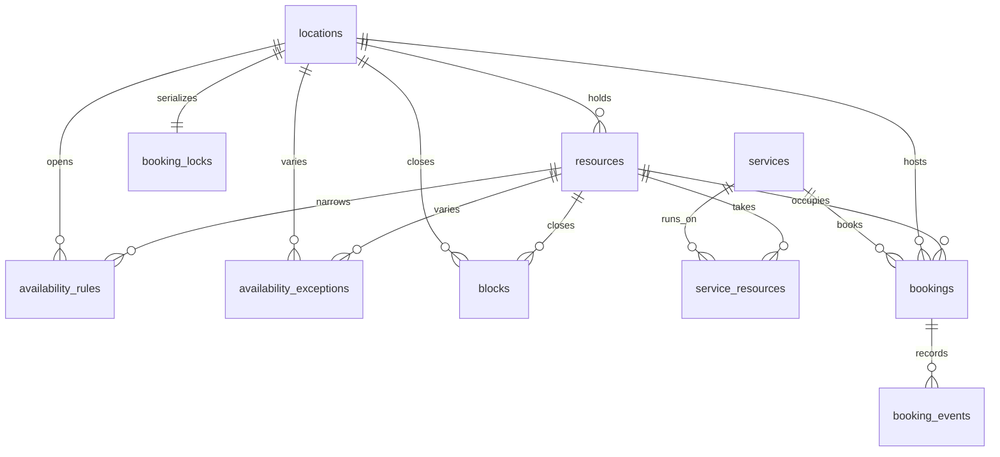

## Context

See [proposal.md](proposal.md#why) for the motivation and the four deltas for
the requirements: [scheduling](specs/shared/appointment/scheduling/spec.md),
[booking](specs/grade10-site/appointment/booking/spec.md),
[diary](specs/grade10-admin/appointment/diary/spec.md) and the
[booking blocks](specs/shared/ui/appointment-booking/spec.md).

- **Built today** — one appointment worker per brand (`packages/appointment/`
  in the application repository, deployed as `grade10-appointment-service`)
  with shops, weekly rules carrying a seat count, closed and override dates,
  bookings keyed on `(product, caseRef)`, a `slot_claims` lock row per
  `(shop, start)` that a composite foreign key from `bookings` makes
  unbypassable, an hourly sweep, an audit chain, and erasure by product lane.
  Every tRPC procedure is elevated and operator-only; the vault books over a
  named service binding entrypoint; refusals travel as `RPCResult` data.
- **Constraints** — Cloudflare Workers on Neon through Hyperdrive with
  drizzle; a pglite test lane that runs the committed migrations; the
  expand/contract migration practice and its `-- contract:` and `-- lock:`
  annotations; `ADMIN_PERMISSIONS` pinned to router meta by a spec; the
  feature-slice frontend architecture with fixture transports; `@grade10/ui`
  blocks that carry no copy and fetch nothing; wall-clock to instant folding
  in the contracts package, allowlisted by the dates check.
- **Not launched** — the service holds no production bookings and the vault
  is pre-launch, so the contract half of the migration ships in the same
  change (as the deletion-table drop did).

## Goals / Non-Goals

**Goals:**

- One derivation of availability, pure and clock-parameterized, shared by the
  public picker, the operator's day view and the booking processor.
- A structural guarantee that two live bookings never share a resource at
  once, independent of which code path wrote them.
- A public tier for guest bookings that never puts a secret in a URL the
  server sees, beside the elevated tier that already exists.
- Mail that cannot fail a booking, and a reminder that is sent once.
- The vault's integration changed in one place: the service it names.

**Non-Goals:**

- A second worker, a queue, or a Durable Object per shop: the database lock
  and the exclusion constraint are enough at shop scale.
- Materialized slots or a cache of availability.
- Moving the admin diary out of the existing Appointments section.
- Migrating the seat counts of existing rules into resources: the rules lose
  their counts and every shop gains its resources by hand.

## Decisions

### Availability is one pure derivation, used three ways

`availability/derive.ts` takes a shop (with its zone), its rules, special
dates and blocks, the resources assigned to a service, the service, the live
occupations in range, the range and `now`, and answers per-resource windows
and per-instant slots with `capacity` and `remaining`. The public listing and
the day view call it over a range; `book` and `reschedule` call it for the one
instant they were asked for, again, under the shop lock, with the same
`now` the request started with.

Alternatives rejected: deriving in SQL (the zone fold and the DST rules
already live in TypeScript and are allowlisted there); caching derived slots
(a rule edit or a booking invalidates every cached day, and the derivation is
cheap: one shop, one service, at most 62 days).

### A resource occupation is a stored interval with an exclusion constraint

Each live booking with a resource stores `occupies_from` and
`occupies_until` — its start minus the service's buffer before, its end plus
the buffer after, frozen at the moment it was written or moved — and the
`bookings` table carries `EXCLUDE USING gist (resource_id WITH =,
tstzrange(occupies_from, occupies_until, '[)') WITH &&) WHERE status =
'booked' AND resource_id IS NOT NULL`. The derivation reads the same two
columns, so what it counts is exactly what the constraint forbids. The
extension is `btree_gist`, created by the migration; the pglite lane loads it
from the package's contrib bundle.

Alternatives rejected: the old `(shop, start)` claim row (a resource-sized
claim would need one row per `(resource, start)` and could not express a
buffer); a per-resource advisory lock (holds nothing once the transaction
ends, and proves nothing about a second writer); trusting the lock alone (a
future write path that forgets it would overbook silently).

### One lock row per shop serializes every write at that shop

`booking_locks` holds one row per shop, inserted with the shop.
`book` takes it with `SELECT … FOR UPDATE` before re-deriving; `reschedule`
across shops takes both rows in one statement ordered by id, so two
reschedules swapping shops cannot deadlock. The exclusion constraint is the
backstop; the lock is what keeps "derive, then assign the lowest free
resource" a single decision rather than a race that surfaces as constraint
errors.

Alternative rejected: `SELECT … FOR UPDATE` on the resource rows (a booking
without a named resource would have to lock every assigned resource, and a
cross-shop move would lock two sets).

### The manage secret is a fragment, a hash, and a request body

Booking a direct visit mints 32 random bytes, stores their SHA-256 in
`manage_token_hash`, and returns the secret once. The link is
`/book/manage#<secret>`: a fragment never reaches a server. The three
manage procedures — read, reschedule, cancel — are tRPC mutations whose input
carries the secret, so it travels in a request body over TLS and never in a
query string a log could keep. Erasure clears the hash, which is what makes
the link stop answering.

Alternative rejected: a signed-in requirement (a guest has no account by
design); a short-lived code in the query string (logged by every proxy).

### The public tier sits beside the elevated one on the same worker

The worker already mounts `/api/:tier{trpc|admin}/*`. The `trpc` tier gains a
`public` router: `services.list`, `locations.forService`, `slots.list`,
`book`, `manage.get`, `manage.reschedule`, `manage.cancel` need no session;
`mine.list` requires one and keys on the session's verified email. Every
public procedure is rate-limited by the platform's existing edge limits and
answers refusals as data, the same codes the binding answers.

Alternative rejected: routing customer calls through the site worker (a
second copy of every codec, and the vault already speaks to this worker
directly).

### Mail is a port, cannot fail a booking, and reminders are stamped once

`email/` in the appointment backend renders four react-email templates
(confirmation, update, cancellation, reminder) with `@grade10/email`'s
layout, each attaching the calendar file `@grade10/appointment-contracts`
builds. Sending goes through a `notifyQuietly` channel, as the vault's does:
a provider failure is logged and never unwinds the transaction that booked.
`RESEND_API_KEY` is an optional secret; absent, the channel logs the mail it
would have sent.

Reminders are a work list of the hourly sweep: `book` and `reschedule` set
`reminder_due_at = start − lead` when that instant is still ahead, else
`NULL`; the sweep sends every live booking whose `reminder_due_at <= now`
and `reminder_sent_at IS NULL`, stamping `reminder_sent_at` only after the
send resolves, so a failed send is retried next hour and a sent one never
repeats.

### The vault names its service

The vault's booking input gains `serviceId`; its console's visit picker lists
the services the binding answers (`listServices`), which for the vault is the
one seeded `Vault visit` service. The binding keeps every existing method,
adds `listServices`, and `listSlots`, `book` and `reschedule` take
`serviceId`.

### Frontend: one feature package, thin routes, fixture-first

`@grade10/appointment-frontend` follows the vault package: a `core` port
(`AppointmentApi`), a procedure transport with a tRPC and a fixture
implementation, decoded through the contracts codecs, DI tokens prefixed
`appointmentCore.`, and three slices — `book`, `manage`, `mine` — whose views
compose the `@grade10/ui` blocks. The site's three routes render those views
and nothing else. The admin package gains `services`, `resources`, `blocks`,
`operator-bookings` and `bookings-list` slices beside the existing diary ones.

## Database Schema

Schema `appointment`. Ids are text ULIDs minted by the worker. Timestamps are
`timestamp(3) with time zone` through `msTimestamp`; dates are `date` through
`localDate`. Authoritative unless marked derived.

### New tables

**`services`**

| Column | Type | Null | Default |
| --- | --- | --- | --- |
| `id` | text PK | no | |
| `slug` | text unique | no | |
| `name` | text | no | |
| `description` | text | no | `''` |
| `product` | text | yes | |
| `customer_bookable` | boolean | no | `false` |
| `duration_minutes` | integer | no | |
| `increment_minutes` | integer | no | |
| `buffer_before_minutes` | integer | no | `0` |
| `buffer_after_minutes` | integer | no | `0` |
| `min_notice_minutes` | integer | no | `0` |
| `max_advance_days` | integer | no | `60` |
| `reminder_lead_minutes` | integer | yes | |
| `questions` | jsonb | no | `'[]'` |
| `active` | boolean | no | `true` |
| `sort_order` | integer | no | `0` |
| `created_at`, `updated_at` | timestamptz | no | `now()` |

Checks: `product IN ('vault','finance')` when set; `NOT (product IS NOT NULL
AND customer_bookable)`; duration and increment `BETWEEN 5 AND 1440` and
`% 5 = 0`; buffers `BETWEEN 0 AND 1440` and `% 5 = 0`; notice and reminder
lead `BETWEEN 0 AND 43200`; horizon `BETWEEN 1 AND 365`. Index
`(active, sort_order)`.

**`resources`**

| Column | Type | Null | Default |
| --- | --- | --- | --- |
| `id` | text PK | no | |
| `location_id` | text FK `locations.id` | no | |
| `name` | text | no | |
| `kind` | text | no | |
| `active` | boolean | no | `true` |
| `sort_order` | integer | no | `0` |
| `created_at`, `updated_at` | timestamptz | no | `now()` |

Check `kind IN ('desk','room','device')`; unique `(location_id, name)`;
index `(location_id, active, sort_order)`.

**`service_resources`** — `service_id` FK, `resource_id` FK, `created_at`;
PK `(service_id, resource_id)`; index `(resource_id)`.

**`blocks`**

| Column | Type | Null | Default |
| --- | --- | --- | --- |
| `id` | text PK | no | |
| `location_id` | text FK | no | |
| `resource_id` | text FK | yes | |
| `starts_at`, `ends_at` | timestamptz | no | |
| `reason` | text | no | |
| `created_at`, `updated_at` | timestamptz | no | `now()` |

Check `ends_at > starts_at`; index `(location_id, starts_at)`.

**`booking_events`** — append-only, guarded by the same trigger family as
`audit_logs`.

| Column | Type | Null | Default |
| --- | --- | --- | --- |
| `id` | text PK | no | |
| `booking_id` | text FK `bookings.id` | no | |
| `kind` | text | no | |
| `at` | timestamptz | no | `now()` |
| `actor_kind` | text | no | |
| `actor_id` | text | yes | |
| `detail` | jsonb | no | `'{}'` |

Checks `kind IN ('booked','rescheduled','cancelled','completed','no_show','reminder_sent')`,
`actor_kind IN ('customer','operator','product','system')`; index
`(booking_id, at)`.

**`booking_locks`** — `location_id` text PK FK `locations.id`, `created_at`.
One row per shop, inserted with the shop and backfilled for every existing
shop.

### Changed tables

**`locations`** gains `slug` text unique (backfilled from the id) and
`sort_order` integer not null default `0`.

**`availability_rules`** gains `resource_id` text FK nullable; loses
`slot_minutes` and `capacity` (contract). Index `(location_id, resource_id,
weekday)`.

**`availability_exceptions`** gains `resource_id` text FK nullable; loses
`slot_minutes` and `capacity` (contract); the override check becomes
`(kind = 'override') = (start_minute IS NOT NULL AND end_minute IS NOT
NULL)`. Two partial unique indexes replace the old one: `(location_id, date)
WHERE resource_id IS NULL` and `(location_id, resource_id, date) WHERE
resource_id IS NOT NULL`.

**`bookings`**

| Column | Type | Null | Default | Note |
| --- | --- | --- | --- | --- |
| `service_id` | text FK `services.id` | no after contract | | backfilled to the seeded vault service |
| `resource_id` | text FK `resources.id` | yes | | null only on a booking written before this change |
| `occupies_from`, `occupies_until` | timestamptz | yes | | set with the resource; derived from start, end and the service's buffers at write |
| `product` | text | yes | | was not null; `(product IS NULL) = (case_ref IS NULL)` |
| `case_ref` | text | yes | | as above |
| `attendee_name` | text | yes | | |
| `attendee_email` | text | yes | | lowercased |
| `attendee_phone` | text | yes | | |
| `notes` | text | no | `''` | |
| `answers` | jsonb | no | `'{}'` | keyed by question id |
| `source` | text | no | `'product'` | `customer`, `operator`, `product`; `product` iff `product IS NOT NULL` |
| `manage_token_hash` | text unique | yes | | SHA-256 of the secret; cleared by erasure |
| `booked_by` | text | yes | | operator id on an operator booking |
| `locale` | text | no | `'en'` | |
| `reminder_due_at` | timestamptz | yes | | null when no reminder is owed |
| `reminder_sent_at` | timestamptz | yes | | stamped after the send |

Loses the composite foreign key to `slot_claims` (contract). Keeps
`uq_bookings_one_live_per_case`. Gains `uq_bookings_one_live_per_service_email
ON (service_id, attendee_email) WHERE status = 'booked' AND source <>
'product' AND attendee_email IS NOT NULL`, the occupation exclusion above,
and indexes `(resource_id, occupies_from)`, `(attendee_email, slot_start)`,
`(reminder_due_at) WHERE reminder_sent_at IS NULL AND status = 'booked'`.

**`slot_claims`** is dropped (contract).

### Seeded rows

The expand migration inserts the `Vault visit` service (`id
'svc_vault_visit'`, `slug 'vault-visit'`, product `vault`, 30 minutes on a
15-minute grid, no buffers, no reminder, not customer bookable) and sets
`service_id` on every existing booking to it; every existing shop gets its
lock row.

### ER diagram

## Service Interfaces

Every processor runs inside one transaction the service owns; the entrypoint
(tRPC router or binding RPC target) decodes and authorizes, the service
decides, repositories read and write rows, and nothing below the service
knows a request from a sweep. Refusals are `RPCResult` data; faults (a lost
connection, a violated constraint the lock should have prevented) throw and
roll back.

| Processor | Input | Success | Refusals |
| --- | --- | --- | --- |
| `listSlots` | service, shop, range, now | slots with capacity and remaining | `SERVICE_NOT_FOUND`, `LOCATION_NOT_FOUND`, `INVALID_RANGE` |
| `book` | service, shop, start, resource?, identity (case or attendee), answers, notes, source, actor, locale, now | booking, `created`, secret once | the scheduling table |
| `reschedule` | booking or case, shop, start, actor, now | booking | `BOOKING_NOT_FOUND`, `BOOKING_CLOSED`, `BOOKING_SUPERSEDED`, and every `book` refusal |
| `cancel` | booking or case, actor | booking (idempotent) | `BOOKING_NOT_FOUND` |
| `markOutcome` | booking or case, outcome, actor | booking (idempotent) | `BOOKING_NOT_FOUND`, `BOOKING_CLOSED`, `BOOKING_SUPERSEDED` |
| `dueReminders` (sweep) | now, limit | count sent | none; a failed send leaves the row due |
| `eraseUser` | lane, subject | count anonymized | none; idempotent |

**`book`, in order, one transaction:**

1. Read the service and shop; refuse what has written nothing (the first
   table of refusals), including answers against the service's questions.
2. Read the identity's live booking of this service: same shop and start →
   answer it with `created: false` and stop; another → `ALREADY_BOOKED`.
3. `SELECT … FOR UPDATE` on `booking_locks` for the shop.
4. Derive the requested instant: windows of every assigned active resource,
   minus blocks, minus live occupations in the padded range; refuse
   `SLOT_NOT_OFFERED` or `SLOT_FULL`; a named resource that is not free →
   `RESOURCE_NOT_AVAILABLE`.
5. Insert the booking with its occupation, `reminder_due_at`, and the manage
   hash on a direct booking; insert the `booked` event.
6. After commit: send the confirmation through the quiet channel.

Example — a 30-minute grading service with a 10-minute buffer after, shop
open 10:00 to 14:00 Hong Kong time, desks `d1` and `d2` assigned, `d1`
holding a live booking 10:00 to 10:30 (occupying to 10:40):

| Request | Result | Row written |
| --- | --- | --- |
| start 10:30, no resource | booked on `d2` | `resource_id d2`, `occupies 10:30–11:10 HKT` |
| start 10:30, resource `d1` | `RESOURCE_NOT_AVAILABLE` | none |
| start 10:45, no resource | booked on `d1` | `resource_id d1`, `occupies 10:45–11:25 HKT` |

**`reschedule`** repeats steps 1, 3, 4 and 5 for the target — locking the
old and the new shop in id order when they differ — then updates the one row
in place (start, end, shop, resource, occupation, `reminder_due_at`), appends
`rescheduled` with the start it left, and sends the update after commit. A
refused target leaves the row untouched because nothing was written before
the refusal.

**Identity across boundaries:**

| Path | Who the actor is | What reaches the service |
| --- | --- | --- |
| Site → public tier | a guest, or a session's verified email for `mine` | attendee fields from the body; the session's email for `mine` |
| Site → manage mutations | whoever holds the secret | the secret's hash resolves the booking; nothing else selects it |
| Admin console → elevated tier | an operator with a fresh session and `appointment:manage` | operator id as `booked_by` and event actor; audit entry by construction |
| Vault → `VaultAppointmentService` | the vault, for one case | `product = vault` from the entrypoint, `caseRef` and `userId` from the call, `serviceId` named by the call |

## API contracts

Public tier (`/api/trpc`), new: `public.services.list`,
`public.locations.forService`, `public.slots.list`, `public.book`,
`public.manage.get`, `public.manage.reschedule`, `public.manage.cancel`
(mutations, secret in the body), `public.mine.list` (session).

Elevated tier, added to `ADMIN_PERMISSIONS`: `services.{list,create,update,retire,assignResources}`,
`resources.{list,create,update,retire}`, `blocks.{list,create,remove}`,
`availability.{rules,exceptions}.*` gain an optional `resourceId`,
`bookings.{list,day,get,book,reschedule,cancel,markOutcome}`. Reads stay on
`appointment:read`; every write is `appointment:manage`.

Binding (`AppointmentServiceApi`): `listServices()` added; `listSlots`,
`book` and `reschedule` take `serviceId`; `book` takes an optional attendee.

## Risks / Trade-offs

- [Two writers, one resource] → the exclusion constraint refuses the second
  insert even if a write path skips the lock; the lock makes the first-free
  assignment deterministic.
- [`btree_gist` missing on a database] → the expand migration fails on its
  first statement and nothing partial lands; Neon lists the extension as
  supported, and the pglite lane loads its contrib bundle.
- [A secret in a log] → the fragment never leaves the browser; the manage
  procedures are mutations; only the hash is stored.
- [Mail provider down] → the quiet channel logs and moves on; reminders stay
  due and are retried hourly; confirmations are not retried, and the manage
  page is the fallback the confirmation screen already shows.
- [Buffers edited after bookings exist] → occupations are frozen at write
  time; a service edit does not move anybody, which is what a collector was
  told.
- [Bookings written before this change have no resource] → they occupy
  nothing and are counted nowhere; a product reschedule assigns one. No such
  booking exists outside staging.
- [A guest books under an address they do not own] → the confirmation and
  the manage link go to that address, so the owner of the address holds the
  booking; the same trade-off every guest checkout makes.
- [Horizon counted in the shop's calendar] → `today` is the shop's date, not
  the caller's, computed through the same zone fold as the rules.

## Migration Plan

1. **`0008` expand** — `CREATE EXTENSION IF NOT EXISTS btree_gist`; the new
   tables; the new nullable columns; the seeded service, the backfill of
   `service_id`, the lock rows, the `slug` backfill; the new indexes and the
   exclusion constraint (`-- lock:` lines on each index, as every index since
   the practice began).
2. **Deploy** the worker, the site and the console.
3. **`0009` contract** — drop the composite foreign key and `slot_claims`,
   drop `slot_minutes` and `capacity` from rules and exceptions, set
   `service_id NOT NULL`; each statement carries a `-- contract:` line saying
   the service has not launched and every reader is deleted in this change.
4. **Rollback** — before step 3 the old worker still runs against the expanded
   schema; after it, rolling back means restoring `slot_claims` from a branch,
   which is why step 3 waits for step 2 to be green.
