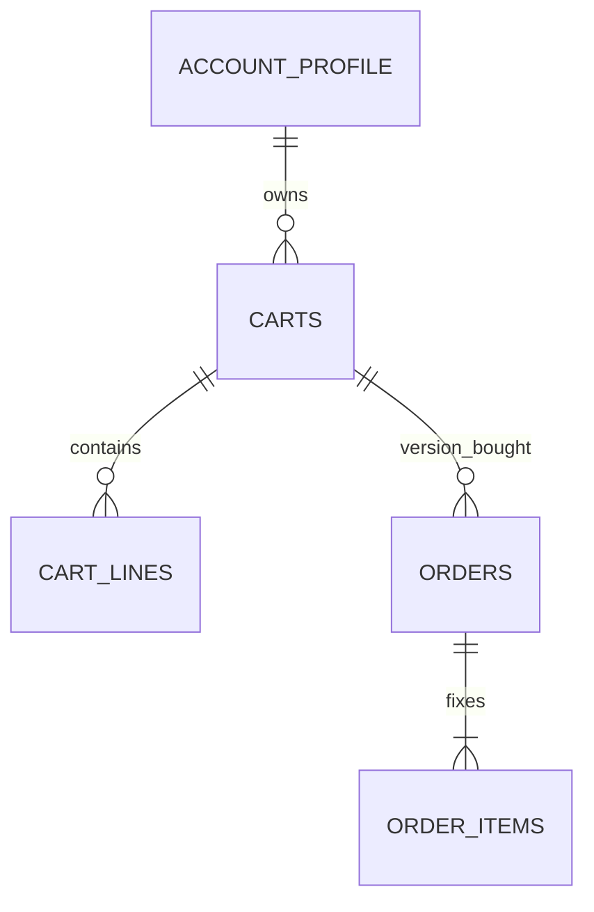

## Context

| Source | Finding |
| --- | --- |
| Durable checkout at `b1564948` | Current payment decision, one intent through terminal replay, recovery-only dispatch, guarded settlement and carrier parity remain required. |
| Backend `bd04abc5` | Cart headers and guarded conversion exist. `cartCheckoutFor` matches variant/quantity; saved open checkout reuse precedes live pricing. It does not compare submitted tender or serialize first creates. |
| Backend cart router | Retirement is deferred best effort after edits. A successful edit is not proof that a provider invoice closed. |
| Backend result mapper | Existing created/refusal/failure/identity outcomes are emitted. Frontend compatible settling/terminal/conflict/recovery branches are not an implemented backend protocol. |
| Existing frontend | Extend the canonical store procedure port, codecs, cart/checkout slices, fixtures and `resolveCheckout`; drawer and order pages retain existing shared blocks and labels. |

## Reviewed Backend Sources

The five cart-header commits at `bd04abc5d91b51e5b99ccd31e21424039ed8f80e` change backend code and architecture documentation, with no frontend or public checkout schema changes. That revision is not an ancestor of the reviewed frontend at `788efad654e14843c6295948afade5b4b064c99f`; task8.2 records the final integrated revision.

| Branch Behavior | Owning Application Source |
| --- | --- |
| One active member cart; tender belongs to its header | `packages/grade10-store/backend/src/db/schema/carts.ts`, `packages/grade10-store/backend/src/services/cart/tender.ts` |
| Actual line, review or tender changes increment version; identical writes preserve it | `packages/grade10-store/backend/src/repositories/carts.ts`, `packages/grade10-store/backend/src/repositories/cartLines.ts` |
| Cart association requires exact variant IDs and quantities | `packages/grade10-store/backend/src/services/cart/cart.ts:cartCheckoutFor` |
| Open cart/version order with saved provider refs and URL is reused; the public mapper omits the service's `reused` flag | `packages/grade10-store/backend/src/services/checkout.ts`, `packages/grade10-store/backend/src/repositories/orders.ts:findOpenCartCheckout` |
| Edits defer retirement; later Pay also supersedes older invoices | `packages/grade10-store/backend/src/trpc/routers/cart.ts`, `packages/grade10-store/backend/src/services/orders/retire.ts` |
| Payment converts only the still-active cart ID/version bought | `packages/grade10-store/backend/src/services/orders/transitions.ts`, `packages/grade10-store/backend/src/repositories/carts.ts:convertCart` |
| Migration 0049 drops existing lines and tender | `apps/backend/grade10/store/src/db/migrations/0049_cart_header.sql`, `apps/backend/zzz/store/src/db/migrations/0049_cart_header.sql` |

The service's sequential reuse behavior does not provide the concurrency, recovery, current-decision or legacy-invoice guarantees required below. The migration's cart reset remains an explicit release prerequisite.

## Goals / Non-Goals

- **Delivery** - Integrate cart-header behavior with every durable checkout guarantee. Backend readiness is a tested dependency, not a fixture assumption.
- **Boundaries** - No code, migrations, deployment or provider changes in planning. No new production dependency or shared status badge.

## Decisions

- **Identity** - The server binds each authenticated request to one persisted intent and canonical reviewed lines/tender. The browser holds only an opaque intent key and submitted context in member/brand-scoped session storage; it never stores invoice authority. Concurrent tabs with different keys converge through a unique cart-version binding.
- **Review** - Keep the drawer's open review. The server prices every Pay, including open-invoice reuse, and compares live facts, submitted acknowledgement and stored order facts before returning a payable URL. Existing reservation/coupon facts are read from the order on reuse rather than reserved again.
- **Concurrency** - Use the existing account/cart row lock, an immutable intent binding and a database dispatch claim. Do not hold a transaction across catalog or provider calls. Recheck the cart version after the external live read and before committing the purchase.
- **Retirement** - An edit commits its cart revision and durable retirement due work together. Retire outside the transaction with retryable persisted work; retain the provider-aware recovery ladder. A dispatched ambiguous purchase blocks replacement until bind/cancel resolves it. A definitive provider refusal may close it without another payable invoice.
- **Frontend** - Pay waits for acknowledged cart/tender writes and ready review/quote. Capture member, cart id/version, intent key, tender and request generation before dispatch. Ignore navigation and cache writes from responses whose context changed; invalidate and re-read authoritative cart/order state instead.
- **Compatibility** - Add a versioned authenticated procedure and context read. Keep legacy procedure names and response union intact; route their member-cart purchases through the same safety engine. Never fall back from an unsupported v2 call to unsafe creation.

## Database Schema

The cart header and order `cart_id`/`cart_version` from the branch remain authoritative. Extend the existing order rather than duplicating its purchase facts.

| Owning Table | Proposed Column | Type / Nullability / Default |
| --- | --- | --- |
| orders | checkout_intent_key | text, nullable, no default; server validates UUID input |
| orders | checkout_fingerprint | text, nullable, no default; SHA-256 of canonical reviewed lines, currency and accepted tender |
| orders | provider_dispatch_state | text, nullable, no default; `ready`, `dispatched`, `bound`, `manual_review`; paired with intent fields for new web rows |
| orders | provider_dispatched_at | timestamptz, nullable, no default |
| orders | provider_recovery_deadline | timestamptz, nullable, no default; clock + existing configured recovery interval |
| orders | checkout_retirement_due_at | timestamptz, nullable, no default; non-null until provider retirement or paid resolution acknowledged |

- **Constraints** - Unique `(user_id, checkout_intent_key)` for non-null member intents across all statuses; unique `(user_id, cart_id, cart_version)` for intent-bearing web orders across all statuses. CHECK paired intent/fingerprint/dispatch fields; valid dispatch values; dispatched/manual-review requires timestamps. Existing provider-reference uniqueness remains.
- **Aliases** - A second caller key for the same cart version receives the canonical key from the context/result; it does not insert another order. No key-alias table is needed. The caller persists the returned canonical key.
- **Due work** - Index retirement due time where non-null and dispatch recovery deadline where dispatched/manual-review. Reuse existing due-order reconcile machinery and guarded order transitions. Retirement and recovery locks use the same account-before-cart-before-order order.
- **Existing rows** - Historical rows retain null intent fields. Reconcile known saved refs and outstanding ambiguous provider attempts before enabling v2; never synthesize a dispatch-safe key for an unknown historical attempt. A legacy pending attempt with uncertain refs remains recovery-only.

## Service Interfaces

| Processor | Fixed Input | Success / Refusal | Boundary |
| --- | --- | --- | --- |
| readCheckoutContext | authenticated member | cart snapshot, version, tender, current intent/order or null, recovery blockade | Reads only; no provider creation |
| decideMemberCheckout | member + intent key + cart precondition + acknowledged items/tender | hosted/settling/terminal/conflict/recovery or existing refusal | Live catalog outside transaction; account/cart lock rechecks revision; order/lines/tender reservations and retirement due commit atomically |
| claimProviderDispatch | order id | claimed immutable request or existing state | Conditional `ready -> dispatched` commit before provider network call |
| recoverProviderDispatch | order id | bound draft, settling, or manual review | Provider read by stored correlation; never create from dispatched state |
| retireCheckout | due order id | retired, paid, retry due, or recovery | Provider-aware discard outside transaction; record facts and reservation release atomically through guarded transitions |
| settleOrder | verified provider facts + existing order | paid once + converted/not-converted cart | Lock current header; convert only matching active id/version; provider event and paid transition commit once |

- **Mutation order** - First decision reads live facts, then locks account/cart, validates revision/tender, resolves current intent, writes order and lines/reservations, stamps prior retirement due, and commits. Minting and provider dispatch follow existing order machinery with persisted retries. A reuse reads order reservations rather than minting again.
- **Dispatch** - Tag Shopify draft creation with Grade10 order/intent correlation and canonical fingerprint. Mark dispatched before sending. Recovery scopes every query to the configured shop, checks the exact order correlation, member/customer ownership where bound, variant/quantity/currency/tender fingerprint and provider payable/paid state, and pages through every candidate. A name, email or newest timestamp alone is not identity. Zero or multiple verified candidates never justify replacement; a unique verified candidate binds references before URL return. Query failure is recoverable failure, never absence. Deadline expiry writes manual review; operator bind/cancel uses existing elevated/environment gates and audited transitions.
- **Example** - Member `m1`, cart `c1` version 7, one variant `v1` quantity 2, points 100, intent `i1` produces order `o1`, fixed order items, fingerprint `f1`, dispatch ready. Two concurrent keys for this same cart version return canonical `i1/o1`. Editing to version 8 leaves `o1` fixed and stamps its retirement due. A paid event for `o1` preserves version 8 and its tender; paying unchanged version 7 converts `c1` and its lines/tender cease to be active.
- **Terminal** - Exact-key replay returns recorded terminal state without requiring the now-converted cart to exist. Reusing that key with changed submitted acknowledgement returns conflict. Open URL reuse additionally requires a current live decision and same active cart/tender. Missing active cart is never permission to recreate a terminal intent.

## API Contracts

These are proposed contracts for implementation, not claims about branch emission. Shared codecs own every shape and fixtures must match them.

| Procedure | Input | Output |
| --- | --- | --- |
| `checkout.context` | no input, authenticated | `{ protocol: 2, cart: { cartId: UUID|null, version: integer, lines: existing cart lines, tender: existing tender }, purchase: { intentKey: UUID, orderId: UUID, state: "open"|"terminal"|"recoveryRequired" }|null }` |
| `checkout.payV2` | `{ intentKey: UUID, cartId: UUID, cartVersion: nonnegative integer, items: existing checkout items, spendPoints: existing points schema, couponCodes?: existing code schema, couponId?: existing id, deviceId?: existing device schema }` | `{ protocol: 2, intentKey: UUID, cartId: UUID, cartVersion: integer, result: PayResult }` |

`PayResult` is the existing checkout-result union plus the following exact alternatives:

- **Settling** - `{ outcome: "settling", orderId: UUID, discountMinor: integer, discountPoints: integer, couponCodes: string[], replacedCouponCodes: string[] }`.
- **Terminal** - `{ outcome: "terminal", orderId: UUID, status: "paid"|"refunded"|"failed"|"canceled"|"expired" }`; paid maps through existing settled treatment. No new order status.
- **Conflict** - `{ outcome: "intentConflict", orderId: UUID|null, reason: "cartChanged"|"tenderChanged"|"intentChanged" }`; no mutation/dispatch. Extend domain mapping to allow no existing order.
- **Recovery** - `{ outcome: "recoveryRequired", orderId: UUID, detail: string }`; detail remains diagnostic; localized existing support copy is user-facing.

- **Created** - Existing created fields and URL shape remain; saved invoice reuse returns created without requiring a new public `reused` badge. `clientSecret` is null for Shopify. Both new and reused handoffs use one resolver path.
- **Preconditions** - Authentication proves member; supplied cart id/version must belong to that member. Duplicate variants, mismatched quantities/tender or stale versions refuse before order/provider writes. Client amounts acknowledge a seen price; the server owns actual money and canonical fingerprint.
- **Lost answer** - Persist the submitted key before the call. Retry that key and immutable context, or read context/order; never rotate on transport/decode error. Canonical returned key replaces an alias only when the submitted context still matches.
- **Older clients** - Legacy member calls derive the current canonical cart intent only after exact authoritative lines/tender comparison and live review; a mismatch returns existing contradicted/rejected vocabulary without unassociated creation. Existing created, failed and identity responses remain decodable. Settling/recovery/terminal adapt to existing created-null-URL or failed-with-known-order vocabulary and prohibit dispatch in the engine. Test old codecs and ZZZ/operator fixtures. Operator baskets not associated with member carts retain existing permissions and their established behavior; they must not bypass a member recovery blockade.
- **Availability** - Backend and codecs land before frontend. If context/v2 is missing or malformed, retain support/retry feedback and disable handoff; do not invoke legacy creation as fallback. Cached older tabs are protected by the legacy adapter, not by browser upgrade timing.

## Risks / Trade-offs

- **Shopify creation is not replayable** - Persist dispatch first and recover by verified correlation; ambiguous results remain blocked with operator action.
- **Edit racing a live read** - Cart lock and expected version reject stale submission; immutable response-generation guards prevent stale redirect.
- **Retirement may lose network responses** - Persist due work with the cart edit; provider read/retry records authoritative terminal facts.
- **Contract drift** - Shared codecs and old/new fixture compatibility tests precede rollout; no frontend fixture clears provider or concurrency readiness.

## Migration Plan

1. Generate migrations through the supported Drizzle workflow for Grade10 and ZZZ; verify fresh install and existing-row upgrade locally. Planning executes none.
2. Land backend engine, correlation/recovery, retirement, guarded conversion and old/new codecs with feature disabled. The cart-header migration resets associations, so enumerate legacy pending web orders and Shopify drafts using shop/order correlation independently of cart ids. Bind unique matches, retire provider-confirmed unpaid drafts, preserve paid orders and quarantine zero/ambiguous/mismatched candidates. Record old-to-new cart associations only when proved; never reinterpret identical variants as ownership. Drain or explicitly block every affected member's unknown pending purchase before enabling either old-client adapter or v2 creation.
3. Obtain explicit staging authorization, apply/deploy there and verify real provider evidence. Ship frontend only after backend readiness. Production enablement remains separately authorized.
4. Roll back frontend to safe support/disabled handoff if needed; retain additive columns, guarded legacy adapter and recovery drains. Never restore unsafe old backend while intents/provider drafts remain active.

## Open Questions

No additional product decision is required by the frozen scope. The proposed API and persistence choices require normal technical review and final plan acceptance. Provider query permissions and evidence are implementation readiness gates, not waivers of recovery behavior.
