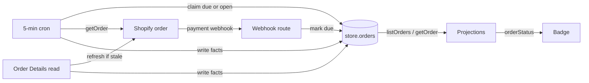

## Context

See [proposal.md](proposal.md) for the product reason. Paths below are the
grade10 application repository's.

- **Rule copies** — the badge is decided in three places that disagree with
  the page and with each other: `customerOrderStatus` in
  `apps/frontend/grade10/src/pages/orders/orderStatus.ts`, the SQL
  `completed()` in `packages/grade10-store/backend/src/repositories/orders.ts`
  that stops the hourly shipment pass, and `statusOf` in the disposable admin
  surface `apps/admin/grade10/src/pages/order-detail-test/order.ts`.
  `ORDER_COMPLETION_CASES` in `@grade10/store-contracts/testing` holds the
  first two to one table.
- **Stored facts** — `store.orders` keeps `status`, the Store's own money
  lifecycle, which folds a void into `canceled` and a partial refund into
  `refunded`, and `fulfillment_status`, Shopify's `displayFulfillmentStatus`
  verbatim. It keeps no financial status, cancel instant, archive instant or
  return status, and the Shopify order query fetches neither `closedAt` nor
  `returnStatus`.
- **One writer** — `pullSettlementSnapshot` in
  `packages/grade10-store/backend/src/services/fulfillment/refresh.ts` is the
  only writer of `fulfillment_status`. It reads the order through the Admin
  GraphQL `getOrder` and writes through `updateSettlementSnapshot`, guarded by
  the `fulfillment_checked_at` claim.
- **Triggers** — the pull runs on an Order Details read (hourly, 90 days, paid
  or refunded orders), on `fulfillments/create` and `fulfillments/update`, on
  an operator sync, and from the 5-minute `fulfillment` cron, which takes 20
  paid web orders not yet fulfilled per tick. A till sale is ingested from the
  `orders/paid` body or the external sweep and is never pulled.
- **Reads** — Your Orders lists stored rows through `checkout.listOrders` and
  never refreshes. Order Details runs `readOrderForBuyer`, which refreshes and
  then reads the same row. Both pages project through
  `packages/grade10-store/frontend/src/features/orders/checkout/presentation/projections.ts`.
- **Two backends** — the `store` schema is shared by the grade10 and zzz store
  workers, so a migration lands in both.

## Goals / Non-Goals

**Goals:**

- One pure implementation of the rule, imported by both pages, the admin
  surface and a later notification centre.
- Every Shopify-held order carries the facts the rule reads, in the row both
  pages read, kept fresh by the existing pull.
- Delete every other copy of the rule, including its SQL mirror.

**Non-Goals:**

- Rendering the note. No surface shows it, and no catalog key is added, until
  Q14 settles; a yes adds a `ui-design.md` and a group, and planning reruns.
- How Your Orders splits Active and Past (Q16) and which orders it lists
  (Q15): both belong to `add-grade10-customer-order-pages`. This change puts
  the facts those answers need on the order.
- A new Shopify webhook topic or access scope, unless the `returnStatus` check
  in the Migration Plan finds one is needed.

## Decisions

The [capability spec](specs/grade10-site/commerce/order-status/spec.md)
governs the vocabulary, the ordered badge rules, the note table and the
one-mapping obligation. These decisions say where each lands.

### One pure rule in the Store contracts package

`orderStatus(facts)` lives in `packages/grade10-store/contracts/src/orderStatus.ts`,
exported as `@grade10/store-contracts/order-status`. It takes only the five
stored columns that carry the four facts, and returns the badge and the note
identifier. Its input type is a `Pick` of `StoreOrder`, so the compiler
refuses a rule that reads origin, the Store status, shipments, money or time.

- **Normalisation inside** — each value is lower-cased, and anything outside
  the accepted set reads as the fact's default, so a caller passes Shopify's
  GraphQL spelling untouched
- **Vocabulary exported** — `ORDER_STATUS_BADGES` (5) and `ORDER_STATUS_NOTES`
  (18) as `as const` tuples; the badge union is assignable to the shared
  `OrderHistoryFulfillmentStatus`, which keeps `pickup`
- **Rejected: the rule in the grade10 app** — the admin surface and a backend
  notification centre cannot import an app module
- **Rejected: the backend computes the badge onto the wire** — the wire would
  carry a derived value beside the facts it came from, and every fixture
  would need both kept in agreement

### Store the facts, derive the badge on every read

The row holds Shopify's facts verbatim; no column holds a badge or a note.

- **Rejected: a badge column** — a second copy of a derivation, rewritten by
  a backfill each time the rule changes
- **Rejected: the Store's `status` as order state** — it reads a void as
  `canceled`, which makes the `payment-voided` note unreachable, and it reads
  a checkout canceled before Shopify held it the same as a Shopify cancel

### The settled-order pull writes the facts, from GraphQL only

`updateSettlementSnapshot` writes the four new fact columns whole, beside
`fulfillment_status`, under the same claim guard. They are current state, so
a read overwrites them rather than filling nulls; a pull that misses writes
nothing and leaves the order due.

- **Rejected: webhook bodies as a source** — the REST bodies speak another
  vocabulary (`partial` for `PARTIALLY_FULFILLED`) and carry no return
  status, so two sources would give one order two answers

### A held order is read until Shopify closes or cancels it

The `fulfillment` cron's due set becomes the orders Shopify still holds open,
judged by order state instead of by the badge. This deletes the SQL mirror of
Completed and `ORDER_COMPLETION_CASES`.

| Arm | Selects | Window |
| --- | --- | --- |
| Due | `payment_ref` and `read_due_at` set, and `fulfillment_checked_at` null, before `read_due_at`, or 5 minutes old or more | None |
| Open | `payment_ref` set, `canceled_at` and `closed_at` null, `fulfillment_checked_at` null or 55 minutes old or more | Placed in the last 90 days |

The claim ranks what the arms select, so neither a retry nor the backfill
holds back a fresh mark or an hourly re-check.

| Rank | Rows | Within the rank |
| --- | --- | --- |
| 1. Unanswered | `read_due_at` later than `fulfillment_checked_at`, or than `created_at` when never asked | Oldest mark first |
| 2. Re-check | The Open arm, and every Due row not in rank 1 or 3 | `fulfillment_checked_at asc nulls first` |
| 3. Backfill | `read_due_at` no later than `created_at`, outside the Open arm | `fulfillment_checked_at asc nulls first` |

- **55 minutes, not 60** — `FULFILLMENT_STALE_MS`, which the Open arm and the
  on-read refresh share, drops from 60 to 55 minutes. At 60 the next 5-minute
  tick can read a change 65 minutes after the last read, past the hour the
  page and the Freshness requirement allow; at 55 that tick comes at most 60
  minutes after it
- **Retry at 5 minutes** — a Due row whose last read missed is asked again
  once that read is 5 minutes old, in rank 2 or 3, so a failing provider is
  asked about each marked order at most once a tick and only with reads the
  first rank leaves
- **Not held** — when the provider answers `notFound` to a claimed pull,
  `clearOrderReadDue` clears the mark under that claim, and the order is
  logged and counted on `commerce.fulfillment_refresh.missed`; a
  `paymentError` or a failed call leaves the mark
- **Till sales join** — the `origin <> 'pos'` and `status = 'paid'` gates go;
  any order with a `payment_ref` is an order Shopify holds, and the page reads
  a till sale through the same rules. An order with none has nothing in
  Shopify to read, whatever Q15 decides
- **On-read refresh** — `refreshFulfillmentIfStale` drops its Store status
  gate and keeps its `payment_ref` gate and its 90-day window, and
  `refreshOnFulfillmentEvent` drops its `open` short-circuit

### A payment webhook marks the order due

After the webhook service answers a verified `PAYMENT_TOPICS` delivery
(`orders/paid`, `orders/cancelled`, `refunds/create`, `orders/edited`),
whatever it answers, `duplicate` included, the route sets the matching
order's `read_due_at` to now in one statement keyed by provider and
`payment_ref`. A mark that fails answers 500, so Shopify sends the delivery
again; the service answers that one `duplicate`, and the route marks again. A
claimed pull that is written, or answered `notFound`, clears the mark only
where `read_due_at` is no later than its claim; any other miss leaves it, so a
later tick asks again, open order or archived. An order paid in full,
refunded or canceled is then read within one cron tick (5 min). A void or an
expiry arrives on no subscribed topic, so it reaches the row through the Open
arm within the hour, as the page says. The row is the work list, so no new
table is needed.

- **Idempotent** — a redelivery, `duplicate` included, moves the mark
  forward. A mark set while a pull is in flight is later than that pull's
  claim, so the write leaves it and the next tick reads the order again
- **Owed apart from asked** — `fulfillment_checked_at` says when the order
  was last asked about and backs a failing provider off; `read_due_at` says a
  read is owed, and only a written read or a `notFound` clears it
- **Rejected: nulling `fulfillment_checked_at` as the mark** — the claim
  stamps it before the provider answers, so a missed read of an archived or
  canceled order clears the mark, and the Open arm never selects it again
- **Rejected: pulling inside the webhook** — a pull that misses after taking
  the claim leaves the order unread for an hour; the mark leaves it due

### Pages take the badge from the rule, never as a parameter

`projectOrderHistory` and `projectOrderDetails` call `orderStatus` themselves.
The `statusFor` parameter is removed, so no caller can pass a rule of its own.
`orderStatus.ts` and its test are deleted from the grade10 app, and the admin
surface's `statusOf` returns `orderStatus(order).badge`.

## Database Schema

`store.orders` gains five nullable columns: four of Shopify's facts, written
only by the settled-order pull, and the mark that a read is owed. The badge
and note are derived and never stored.

| Column | Type | Null | Default | Shopify source |
| --- | --- | --- | --- | --- |
| `financial_status` | `text` | yes | none | `displayFinancialStatus`, verbatim |
| `canceled_at` | `timestamptz` | yes | none | `cancelledAt` |
| `closed_at` | `timestamptz` | yes | none | `closedAt`, set exactly when `closed` is true |
| `return_status` | `text` | yes | none | `returnStatus`, verbatim |
| `read_due_at` | `timestamptz` | yes | none | None: set to now by a payment webhook and to `created_at` by the backfill, cleared by a written read or a `notFound` |

- **One partial index** — on `read_due_at` where it is set, because the Due
  arm has no 90-day window and would otherwise scan every order each tick;
  the Open arm keeps the claim's existing filters
- **No constraint on values** — the rule reads an unknown value as its
  default, so a check would refuse a value Shopify adds tomorrow and stop the
  pull
- **Backfill** — the migration sets `read_due_at = created_at` on every row
  with a `payment_ref`, carrying a `-- lock:` line: row locks on
  `store.orders` for one UPDATE, applied through the Migrate workflow. A mark
  no later than the order's placement is the backfill's alone, since a
  webhook marks at now; the cron reads each order once, whatever its age, in
  rank 2 while the Open arm holds it and in rank 3 after, and an order whose
  read misses stays due
- **Spelling** — store-side names spell `canceled` (Q13); the vendor contract
  `ShopifyOrder.cancelledAt` keeps Shopify's own

## Service Interfaces

| Function | Input | Output | Writes |
| --- | --- | --- | --- |
| `orderStatus` (contracts) | `{ canceledAt, closedAt, financialStatus, fulfillmentStatus, returnStatus }` | `{ badge, note }`, `note` null where no rule matches | Nothing; no clock, no I/O |
| `pullSettlementSnapshot` | Order row, optional `claimedAt` | `written`, `missed` with reason, or `failed` | The snapshot and the four fact columns, one UPDATE |
| `updateSettlementSnapshot` | Adds `financialStatus`, `canceledAt`, `closedAt`, `returnStatus` | `void` | Overwrites the four fact columns where the claim still holds; under a claim, sets `read_due_at` null where it is no later than `claimedAt` |
| `claimOrdersDueForRead` (replaces `claimUndeliveredOrders`) | `now`, `staleBefore`, `retryBefore`, `createdAfter`, `limit` | Claimed rows | Stamps `fulfillment_checked_at`, `FOR UPDATE SKIP LOCKED` |
| `markOrderReadDue` | `provider`, `paymentRef`, `now` | `{ marked: boolean }` | `read_due_at = now` |
| `clearOrderReadDue` | `orderId`, `claimedAt` | `void` | `read_due_at` null where it is no later than `claimedAt` |

**Boundaries** — the webhook route marks; the cron entrypoint
`runStoreFulfillmentRefresh` claims and pulls; the repository owns all SQL;
the provider adapter owns the GraphQL read. Each flow writes one order row.

**Example** — a paid web order archived by the shop after its parcel left:

| Step | `financial_status` | `fulfillment_status` | `closed_at` | `canceled_at` | `return_status` | Badge |
| --- | --- | --- | --- | --- | --- | --- |
| Settled, not yet read | null | null | null | null | null | Processing |
| Cron read, parcel left | `PAID` | `FULFILLED` | null | null | `NO_RETURN` | Shipped |
| Hourly read, shop archived it | `PAID` | `FULFILLED` | `2026-10-05T09:12Z` | null | `NO_RETURN` | Completed |
| `refunds/create`, marked due, read next tick | `PARTIALLY_REFUNDED` | `FULFILLED` | `2026-10-05T09:12Z` | null | `RETURNED` | Refunded |

The last row carries note `items-returned-partial-refund`. Once closed it
leaves the Open arm; the refund webhook's mark brings it back, and stays
until a read is written.

## API Contracts

`checkout.listOrders` and `checkout.getOrder` return four additive fields on
`orderSchema` in `packages/grade10-store/contracts/src/schemas.ts`:
`financialStatus` and `returnStatus` as nullable strings, and `canceledAt` and
`closedAt` as nullable dates. The frontend `Order` model and its mapper carry
them unchanged. No field is removed and no procedure is added.

## Risks / Trade-offs

- **[Risk] Your Orders shows an older badge than Order Details just
  refreshed** → both read one row, so the gap closes on the next list fetch;
  payment webhooks mark the order due, so the cron reads it within 5 minutes,
  and any other change within the hour for an order placed in the last 90
  days; an older order is read again only when a payment webhook marks it due
  or a shipment event reads it (Q23)
- **[Risk] More than 20 orders marked due in one tick** → unanswered marks
  are read first, oldest mark first, so the 5-minute bound holds while marks
  stay within 20 a tick; the due-mark gauge in Observability alarms past 5
  minutes, and the batch is raised
- **[Risk] The provider keeps refusing one order** → its mark stays, and it
  is asked again at most every 5 minutes, ranked behind fresh marks and the
  hourly re-checks, so it costs only a read they leave; counted on
  `commerce.fulfillment_refresh.missed` with its reason. An order the provider
  answers `notFound` for has its mark cleared and is counted the same way
- **[Risk] A shop that never archives keeps every order in the Open arm, past
  the cron's 240 reads an hour** → the claim reads the oldest check first, so
  every order is still reached, later than the hour; the open-order gauge in
  Observability alarms past 60 minutes, and the batch is raised. Migration
  step 3 shows the batch fits before the backfill runs
- **[Risk] An order reopened after Shopify archived it keeps Completed** →
  it leaves the Open arm once closed, and is read again only on a payment
  webhook's mark or a fulfilment event; Q24 decides whether the hour must
  reach it
- **[Risk] `returnStatus` needs an access scope the app lacks, and the whole
  order query fails** → checked against the dev shop before the query ships
  (Migration Plan, step 1); a missing scope joins the ops scope list before
  `pnpm run shopify:webhooks` runs again
- **[Risk] A web checkout Shopify never recorded reads Processing for
  good** → Your Orders lists every web order today
  (`packages/grade10-store/backend/src/repositories/orders.ts:297-300`), and
  one with no `payment_ref` has no facts, so every fact reads its default.
  The interim adapter reads it Canceled (`orderStatus.ts:22`). The frontend
  switch waits on Q15's answer (Migration Plan, step 4)
- **[Risk] The badge reads Processing while the backfill drains** → the
  frontend switch ships only once every order the backfill marked has been
  asked since the migration and no unanswered mark is older than 5 minutes in
  that environment; until then the pages read the interim adapter
- **[Risk] The Open arm's first pass delays the hourly re-check** → the
  widened arm first reads every order placed in the last 90 days that it has
  not read within the hour, till sales and archived web orders included,
  longest unread first, so an undelivered order's re-check waits behind them
  for that pass; shipment events and Order Details reads still refresh it.
  The backfill of older orders takes only reads ranks 1 and 2 leave
- **[Risk] A paid till sale never reaches fulfilled and archived in Shopify,
  so it reads Processing** → checked on the staging shop before the frontend
  switch; if so, it goes back to the product manager, as Q12 says

## Observability

Each `fulfillment` cron tick records two gauges through `ddGauge`, beside the
claimed count per rank already logged, and each has a monitor in the
application's `docs/operations.md` that also alerts on absent data.

| Gauge | Measures | Alarm |
| --- | --- | --- |
| `commerce.fulfillment_refresh.due_age_seconds` | The oldest unanswered mark's age: now less `read_due_at`, over rank 1 | Past 300 (5 minutes) |
| `commerce.fulfillment_refresh.open_age_seconds` | The longest an order the Open arm holds has gone unasked: now less `fulfillment_checked_at`, or `created_at` when never asked | Past 3600 (60 minutes) |

The first holds the 5-minute bound and the second the hour; a read that is
asked and misses is counted on `commerce.fulfillment_refresh.missed`. Either
alarm means the batch of 20 no longer fits, and the batch is raised.

## Migration Plan

1. **Check the read** — run the extended order query against the dev shop:
   it returns `closedAt` and `returnStatus` under the app's current scopes,
   and a counter sale rung through the POS simulator reports
   `FULFILLED` and `closed`
2. **Backend** — migration in both store backends, the wire fields, the
   writer, the cron's due set and the webhook mark, deployed together. The
   badge does not change yet: the pages still use the interim adapter
3. **Backfill** — before it, count the orders with a `payment_ref` placed in
   the last 90 days and the older ones, and record each count over 240 an
   hour as its drain time: the first is the Open arm's first pass, the second
   runs in the reads left over. If the first pass is past 4 hours, raise the
   batch for it. Count also the orders Shopify holds open placed in the last
   90 days, which the Open arm reads once an hour from then on, and record it
   against 240 an hour: past it, raise the batch before the backfill. The
   Migrate workflow then applies the migration; watch the count of orders the
   backfill marked and not yet asked fall to zero
4. **Frontend** — once Q15's answer has landed, the projections switch to
   `orderStatus`, the adapter and the SQL mirror are deleted, and the admin
   surface follows. Under the recommended answer, Your Orders lists only
   orders with a `payment_ref`, the filter `add-grade10-customer-order-pages`
   owns; under the other, the rule reads the pre-Shopify input Q15 adds
5. **Rollback** — revert the frontend to the adapter; the columns are
   additive and stay
