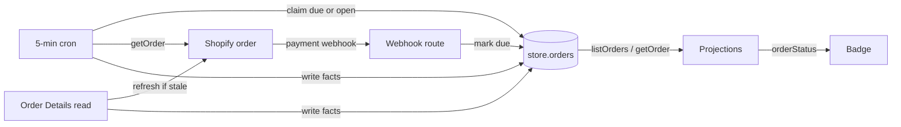

## Context

See [proposal.md](proposal.md) for the product reason. Paths below are the
grade10 application repository's.

- **Rule copies** — the badge is decided in three places that disagree with
  the page and with each other: `customerOrderStatus` in
  `apps/frontend/grade10/src/pages/orders/orderStatus.ts`, the SQL
  `completed()` in `packages/grade10-store/backend/src/repositories/orders.ts`
  that stops the hourly shipment pass, and `statusOf` in the disposable admin
  surface `apps/admin/grade10/src/pages/order-detail-test/order.ts`.
  `ORDER_COMPLETION_CASES` in `@grade10/store-contracts/testing` holds the
  first two to one table.
- **Stored facts** — `store.orders` keeps `status`, the Store's own money
  lifecycle, which folds a void into `canceled` and a partial refund into
  `refunded`, and `fulfillment_status`, Shopify's `displayFulfillmentStatus`
  verbatim. It keeps no financial status, cancel instant, archive instant or
  return status, and the Shopify order query fetches neither `closedAt` nor
  `returnStatus`.
- **One writer** — `pullSettlementSnapshot` in
  `packages/grade10-store/backend/src/services/fulfillment/refresh.ts` is the
  only writer of `fulfillment_status`. It reads the order through the Admin
  GraphQL `getOrder` and writes through `updateSettlementSnapshot`, guarded by
  the `fulfillment_checked_at` claim.
- **Triggers** — the pull runs on an Order Details read (hourly, 90 days, paid
  or refunded orders), on `fulfillments/create` and `fulfillments/update`, on
  an operator sync, and from the 5-minute `fulfillment` cron, which takes 20
  paid web orders not yet fulfilled per tick. A till sale is ingested from the
  `orders/paid` body or the external sweep and is never pulled.
- **Reads** — Your Orders lists stored rows through `checkout.listOrders` and
  never refreshes. Order Details runs `readOrderForBuyer`, which refreshes and
  then reads the same row. Both pages project through
  `packages/grade10-store/frontend/src/features/orders/checkout/presentation/projections.ts`.
- **Two backends** — the `store` schema is shared by the grade10 and zzz store
  workers, so a migration lands in both.

## Goals / Non-Goals

**Goals:**

- One pure implementation of the rule, imported by both pages, the admin
  surface and a later notification centre.
- Every Shopify-held order carries the facts the rule reads, in the row both
  pages read, kept fresh by the existing pull.
- Delete every other copy of the rule, including its SQL mirror.

**Non-Goals:**

- Rendering the note. No surface shows it, and no catalog key is added, until
  Q14 settles; a yes adds a `ui-design.md` and a group, and planning reruns.
- How Your Orders splits Active and Past (Q16) and which orders it lists
  (Q15): both belong to `add-grade10-customer-order-pages`. This change puts
  the facts those answers need on the order.
- A new Shopify webhook topic or access scope, unless the `returnStatus` check
  in the Migration Plan finds one is needed.

## Decisions

The [capability spec](specs/grade10-site/commerce/order-status/spec.md)
governs the vocabulary, the ordered badge rules, the note table and the
one-mapping obligation. These decisions say where each lands.

### One pure rule in the Store contracts package

`orderStatus(facts)` lives in `packages/grade10-store/contracts/src/orderStatus.ts`,
exported as `@grade10/store-contracts/order-status`. It takes only the five
stored columns that carry the four facts, and returns the badge and the note
identifier. Its input type is a `Pick` of `StoreOrder`, so the compiler
refuses a rule that reads origin, the Store status, shipments, money or time.

- **Normalisation inside** — each value is lower-cased, and anything outside
  the accepted set reads as the fact's default, so a caller passes Shopify's
  GraphQL spelling untouched
- **Vocabulary exported** — `ORDER_STATUS_BADGES` (5) and `ORDER_STATUS_NOTES`
  (18) as `as const` tuples; the badge union is assignable to the shared
  `OrderHistoryFulfillmentStatus`, which keeps `pickup`
- **Rejected: the rule in the grade10 app** — the admin surface and a backend
  notification centre cannot import an app module
- **Rejected: the backend computes the badge onto the wire** — the wire would
  carry a derived value beside the facts it came from, and every fixture
  would need both kept in agreement

### Store the facts, derive the badge on every read

The row holds Shopify's facts verbatim; no column holds a badge or a note.

- **Rejected: a badge column** — a second copy of a derivation, rewritten by
  a backfill each time the rule changes
- **Rejected: the Store's `status` as order state** — it reads a void as
  `canceled`, which makes the `payment-voided` note unreachable, and it reads
  a checkout canceled before Shopify held it the same as a Shopify cancel

### The settled-order pull writes the facts, from GraphQL only

`updateSettlementSnapshot` writes the four new columns whole, beside
`fulfillment_status`, under the same claim guard. They are current state, so
a read overwrites them rather than filling nulls; a pull that misses writes
nothing.

- **Rejected: webhook bodies as a source** — the REST bodies speak another
  vocabulary (`partial` for `PARTIALLY_FULFILLED`) and carry no return
  status, so two sources would give one order two answers

### A held order is read until Shopify closes or cancels it

The `fulfillment` cron's due set becomes the orders Shopify still holds open,
judged by order state instead of by the badge. This deletes the SQL mirror of
Completed and `ORDER_COMPLETION_CASES`.

| Arm | Selects | Window |
| --- | --- | --- |
| Due | `payment_ref` set and `fulfillment_checked_at` null | None |
| Open | `payment_ref` set, `canceled_at` and `closed_at` null, checked 55 minutes ago or more | Created in the last 90 days |

- **55 minutes, not 60** — `FULFILLMENT_STALE_MS`, which the Open arm and the
  on-read refresh share, drops from 60 to 55 minutes. At 60 the next 5-minute
  tick can read a change 65 minutes after the last read, past the hour the
  page and the Freshness requirement allow; at 55 that tick comes at most 60
  minutes after it
- **Due first** — the claim orders by `fulfillment_checked_at asc nulls first`,
  as it does now, so a new settlement, a new till sale and the backfill are
  read before the hourly re-checks
- **Till sales join** — the `origin <> 'pos'` and `status = 'paid'` gates go;
  any order with a `payment_ref` is an order Shopify holds, which is the
  answer Q15 recommends
- **On-read refresh** — `refreshFulfillmentIfStale` gates on `payment_ref`
  alone, and `refreshOnFulfillmentEvent` drops its `open` short-circuit

### A payment webhook marks the order due

After a `PAYMENT_TOPICS` delivery is recorded, the route sets the matching
order's `fulfillment_checked_at` to null in one statement keyed by provider and
`payment_ref`, whether or not a transition matched. A refund or cancel is then
read within one cron tick (5 min). The row is the work list, so no new table
is needed.

- **Idempotent** — a redelivery sets null again; a pull in flight loses its
  claim and its stale write is refused
- **Rejected: pulling inside the webhook** — a pull that misses after taking
  the claim leaves the order unread for an hour; the mark leaves it due

### Pages take the badge from the rule, never as a parameter

`projectOrderHistory` and `projectOrderDetails` call `orderStatus` themselves.
The `statusFor` parameter is removed, so no caller can pass a rule of its own.
`orderStatus.ts` and its test are deleted from the grade10 app, and the admin
surface's `statusOf` returns `orderStatus(order).badge`.

## Database Schema

`store.orders` gains four nullable columns. All are Shopify's facts, written
only by the settled-order pull; the badge and note are derived and never
stored.

| Column | Type | Null | Default | Shopify source |
| --- | --- | --- | --- | --- |
| `financial_status` | `text` | yes | none | `displayFinancialStatus`, verbatim |
| `canceled_at` | `timestamptz` | yes | none | `cancelledAt` |
| `closed_at` | `timestamptz` | yes | none | `closedAt`, set exactly when `closed` is true |
| `return_status` | `text` | yes | none | `returnStatus`, verbatim |

- **No index** — the cron's claim already filters on `fulfillment_checked_at`
  and `created_at`; the two new predicates narrow a set of at most 20 rows a
  tick
- **No constraint on values** — the rule reads an unknown value as its
  default, so a check would refuse a value Shopify adds tomorrow and stop the
  pull
- **Backfill** — the migration sets `fulfillment_checked_at = null` on every
  row with a `payment_ref`, carrying a `-- lock:` line: row locks on
  `store.orders` for one UPDATE, applied through the Migrate workflow. The cron
  then reads each order once, 20 a tick
- **Spelling** — store-side names spell `canceled` (Q13); the vendor contract
  `ShopifyOrder.cancelledAt` keeps Shopify's own

## Service Interfaces

| Function | Input | Output | Writes |
| --- | --- | --- | --- |
| `orderStatus` (contracts) | `{ canceledAt, closedAt, financialStatus, fulfillmentStatus, returnStatus }` | `{ badge, note }`, `note` null where no rule matches | Nothing; no clock, no I/O |
| `pullSettlementSnapshot` | Order row, optional `claimedAt` | `written`, `missed` with reason, or `failed` | The snapshot and the four new columns, one UPDATE |
| `updateSettlementSnapshot` | Adds `financialStatus`, `canceledAt`, `closedAt`, `returnStatus` | `void` | Overwrites the four new columns where the claim still holds |
| `claimOrdersDueForRead` (replaces `claimUndeliveredOrders`) | `now`, `staleBefore`, `createdAfter`, `limit` | Claimed rows | Stamps `fulfillment_checked_at`, `FOR UPDATE SKIP LOCKED` |
| `markOrderReadDue` | `provider`, `paymentRef` | `{ marked: boolean }` | `fulfillment_checked_at = null` |

**Boundaries** — the webhook route marks; the cron entrypoint
`runStoreFulfillmentRefresh` claims and pulls; the repository owns all SQL;
the provider adapter owns the GraphQL read. No flow writes more than one row.

**Example** — a paid web order archived by the shop after its parcel left:

| Step | `financial_status` | `fulfillment_status` | `closed_at` | `canceled_at` | `return_status` | Badge |
| --- | --- | --- | --- | --- | --- | --- |
| Settled, not yet read | null | null | null | null | null | Processing |
| Cron read, parcel left | `PAID` | `FULFILLED` | null | null | `NO_RETURN` | Shipped |
| Hourly read, shop archived it | `PAID` | `FULFILLED` | `2026-10-05T09:12Z` | null | `NO_RETURN` | Completed |
| `refunds/create`, marked due, read next tick | `PARTIALLY_REFUNDED` | `FULFILLED` | `2026-10-05T09:12Z` | null | `RETURNED` | Refunded |

The last row carries note `items-returned-partial-refund`. Once closed it
leaves the Open arm; the refund webhook is what brings it back.

## API Contracts

`checkout.listOrders` and `checkout.getOrder` return four additive fields on
`orderSchema` in `packages/grade10-store/contracts/src/schemas.ts`:
`financialStatus` and `returnStatus` as nullable strings, and `canceledAt` and
`closedAt` as nullable dates. The frontend `Order` model and its mapper carry
them unchanged. No field is removed and no procedure is added.

## Risks / Trade-offs

- **[Risk] Your Orders shows an older badge than Order Details just
  refreshed** → both read one row, so the gap closes on the next list fetch;
  payment webhooks mark the order due, so the cron reads it within 5 minutes,
  and a fulfilment, archive or return change within the hour for an order
  created in the last 90 days; an older order is read again only when a
  payment webhook marks it due (Q23)
- **[Risk] A shop that never archives keeps every order in the Open arm, past
  the cron's 240 reads an hour** → the claim reads the oldest check first, so
  every order is still reached; a count of claimed and due rows per tick is
  logged, and the batch is raised if the due arm stops emptying
- **[Risk] An order reopened after Shopify archived it keeps Completed** →
  it leaves the Open arm once closed, and is read again only on a payment
  webhook or a fulfilment event; Q24 decides whether the hour must reach it
- **[Risk] `returnStatus` needs an access scope the app lacks, and the whole
  order query fails** → checked against the dev shop before the query ships
  (Migration Plan, step 1); a missing scope joins the ops scope list before
  `pnpm run shopify:webhooks` runs again
- **[Risk] The badge reads Processing while the backfill drains** → the
  frontend switch ships only after the due arm is empty in that environment
- **[Risk] A paid till sale never reaches fulfilled and archived in Shopify,
  so it reads Processing** → checked on the staging shop before the frontend
  switch; if so, it goes back to the product manager, as Q12 says

## Migration Plan

1. **Check the read** — run the extended order query against the dev shop:
   it returns `closedAt` and `returnStatus` under the app's current scopes,
   and a counter sale rung through the POS simulator reports
   `FULFILLED` and `closed`
2. **Backend** — migration in both store backends, the wire fields, the
   writer, the cron's due set and the webhook mark, deployed together. The
   badge does not change yet: the pages still use the interim adapter
3. **Backfill** — the Migrate workflow applies the migration; watch the due
   count fall to zero
4. **Frontend** — the projections switch to `orderStatus`, the adapter and
   the SQL mirror are deleted, and the admin surface follows
5. **Rollback** — revert the frontend to the adapter; the columns are
   additive and stay

## Open Questions

- **Due-count alarm** — the threshold for a due arm that has not emptied,
  set once staging shows the steady-state volume
