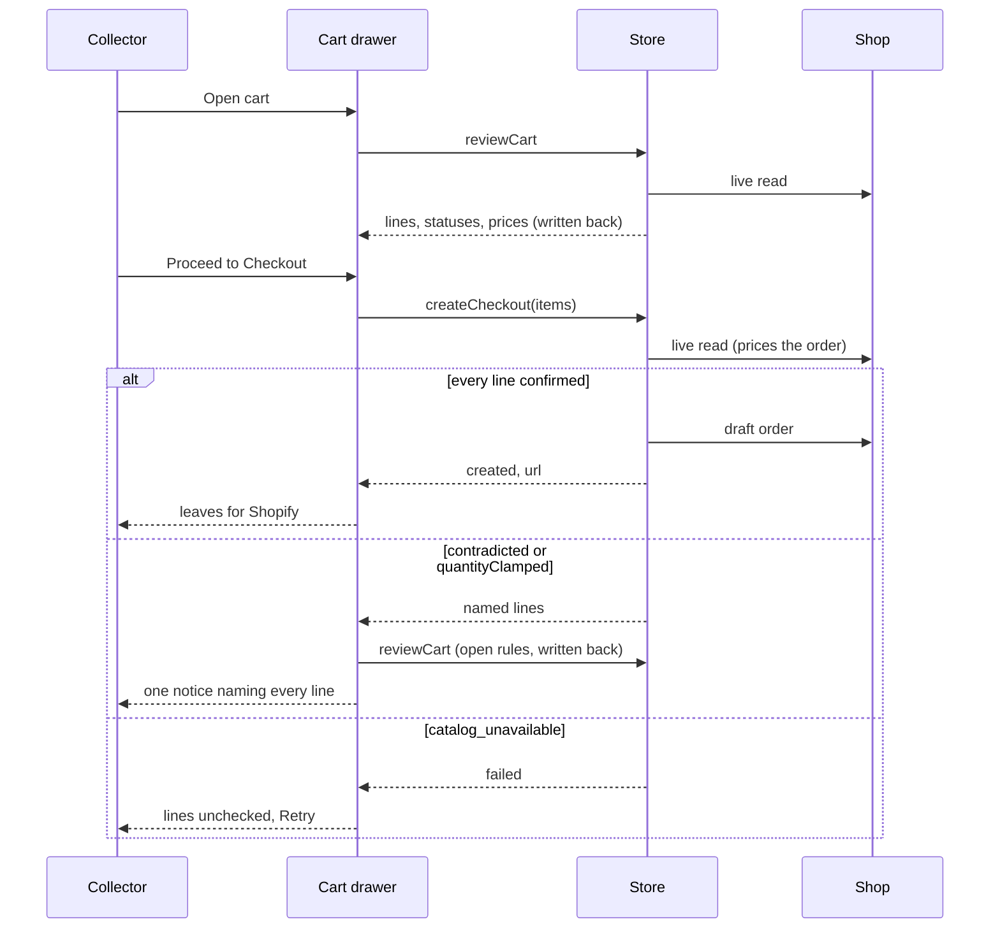

## Context

The [proposal](proposal.md) holds the scope. What grade10 runs today:

- **Product read** - every variant carries `availableForSale`, `price` and a
  nullable `quantityAvailable`
  (`packages/grade10-store/frontend/src/features/products/product/domain/models/Product.ts:17-26`)
- **One item** - `sellableVariant` and `pricedVariant` (`Product.ts:146-155`)
  already pick the first variant for sale, else the first listed. The listing
  tile (`presentation/mappers/productSummary.ts`), the listing add
  (`apps/frontend/grade10/src/pages/store/ProductListingPage.tsx:359`) and the
  page add (`presentation/views/ProductBuyBox.tsx:51`) read them
- **Stock left on the page** - `ProductBuyBox.tsx:108` passes
  `quantityAvailable` to `StoreProductPurchasePanel`, which caps the stepper
  with it. `sellableQuantity`, `scarceQuantity` and `remainingToSay`
  (`Product.ts:184-228`) are exported and read by nothing
- **Sold out where the buying happens** - `StoreProductPurchasePanel`
  disables its stepper and its Sold out button when `availableForSale` is
  false (`packages/ui/src/blocks/store-product/store-product-purchase-panel.tsx:46-70`),
  and `ProductCardImage` draws no cart control on a sold-out tile
  (`packages/ui/src/blocks/store-product-listing/product-card-image.tsx:90`),
  so nothing that adds a sold-out item can be pressed
- **Line classification** - `classifyCartLine`
  (`packages/grade10-store/contracts/src/cartReview.ts:61-104`) is the one
  rule the cart review, the checkout pricing and the fixture client share. A
  reprice rides beside any status, so a line that shrank and was repriced
  carries both
- **Cart-open read** - `reviewCart` (`packages/grade10-store/backend/src/services/cart/cart.ts:121-162`)
  reads the shop live, then writes the reduced quantity and the live price
  back to the member cart rows, so a disclosed price is the line's price
  from then on
- **Checkout read** - `priceCheckoutItems`
  (`packages/grade10-store/backend/src/services/pricing.ts:109-154`) runs the
  same read and prices the order from it. Any moved line returns
  `contradicted`; a shop that sells fewer returns `quantityClamped` with its
  count (`services/checkout.ts:420-428`); a read that fails returns
  `catalog_unavailable`
- **Drawer** - `CartDrawerHost` (`apps/frontend/grade10/src/chrome/CartDrawerHost.tsx`)
  starts checkout; there is no checkout page. A failed cart-open read already
  marks lines unchecked (`:593-614`) and names them in a persistent Retry
  notice (`:265-285`). A checkout answer naming lines shows the review-failure
  title with bare names (`:745-758`); `catalog_unavailable` shows only the
  generic `checkoutFailed`. `checkoutReadiness`
  (`packages/grade10-store/frontend/src/features/orders/cart/domain/models/Cart.ts:186-199`)
  already withholds checkout while a sold-out or withdrawn line stays

## Goals / Non-Goals

**Goals:**

- No browse surface passes a stock count to a shared block
- The drawer tells the collector what the checkout read found the same way
  it tells them what the cart-open read found
- One unchecked state for every failed read, cleared only by a read that
  returns

**Non-Goals:**

- A Store API, backend, database or shared-block contract change
- The admin test harnesses (`apps/admin/grade10/src/pages/product-detail-test`,
  `cart-test`); they are engineering instruments, not surfaces a collector
  browses
- Removing the shared blocks' remaining-count element and stepper ceiling;
  that is decisions Q8, the designer's

## Decisions

[Product Status](../../../openspec/specs/grade10-site/commerce/product-status/spec.md)
governs what availability means and what a browse surface shows;
[Cart Validation](../../../openspec/specs/grade10-site/store/cart-validation/spec.md)
governs the two reads and what each does to a line. This design maps both onto
the code above.

| Choice | Implementation | Rejected |
| --- | --- | --- |
| Browse availability | `productSummary` keeps `soldOut: sellableVariant(product) === null` and the price of `pricedVariant`; every surface drawing a `ProductCard` (listing, front door, related rail) goes through it | A per-surface mapping; a rollup from a count |
| Page sale item | `pricedVariant(product)` is the page's one item: price, availability, SKU and cart add read the same object; no chooser, no variant title on the page | A variant chooser; status for a variant the page cannot add |
| No browse ceiling | `ProductBuyBox` passes `saleItem: { availableForSale }` only. `sellableQuantity`, `scarceQuantity`, `remainingToSay` and their exports are deleted | Keeping the count "advisory" on the stepper |
| Cart line title | `lineTitle` keeps naming the variant on the cart line; the page never does | Hiding the variant in the cart, where the collector tells two lines apart |
| Checkout contradicts the cart | On `amendCart` naming lines, the drawer runs the cart-open read again through `retryReview`, as **Back to the cart** requires. That read applies the open rules to every line: withdrawn leaves and is named in the removal notice, sold out stays marked, a short line is reduced, a repriced line shows its struck price. One persistent notice under `checkout.review.blocked` lists each line of the checkout answer's `lines` with the outcome that answer gives it, never one from the read that follows, which can answer differently: `checkout.review.soldOut` for `soldOut`, `checkout.review.unavailable` for `unavailable`, `checkout.review.reduced` (`{title}`, `{count}` from `quantity`) for `adjusted`, and `checkout.review.repriced` (`{title}`, `{price}`) where `previousUnitPriceMinor` is set, so a line that shrank and was repriced says both (decisions Q12). The lines in the cart then show the read that follows | Folding the checkout's lines into the review cache, which writes nothing back, so the next open reports the same reprice twice; a second notice vocabulary |
| Shop fills short | `quantityClamped` is an `amendCart` answer (`packages/grade10-store/frontend/src/features/orders/checkout/domain/models/CheckoutResolution.ts:92`), so it takes the row above. The refusal itself changes no line; it names its line and count in the one notice through a new `checkout.review.filledShort` message (`{title}`, `{count}`). The cart-open read that follows, under **Back to the cart**, reduces the line under **Reduced** when the shop's live count bounds the request, and the line reads adjusted | The count-free `reason.quantityClamped` |
| Checkout read fails | `catalog_unavailable` sets the same unchecked state a failed cart-open read sets: lines, prices and totals read unchecked, the persistent notice names every line with Retry, Proceed to Checkout stays disabled. The state is one derived flag, `reviewUnchecked = review.state === "failed" \|\| checkoutReadFailed`; Retry clears `checkoutReadFailed` only when its read returns | A second failure path with its own copy; clearing on a timer or on close |
| Cart not loaded | The persistent Retry notice names no line and checkout stays disabled. The drawer stays in its loading treatment, never its empty state, because the host holds `loading` until the basket is read: `cart-drawer-empty-state` task 2.2 makes that fix, for the state `shared/ui/store-cart` owns | Showing the empty cart, which says something the store does not know; fixing the host's `loading` here as well, a second change for one line |
| Data and API | Reuse `CheckoutOutcome`, `CheckoutResolution` and the review procedures as they are | A new endpoint or a stored browse count |

## Risks / Trade-offs

- [The re-read after a refusal answers differently from the checkout read]
  → the notice names the lines the checkout answer named; the lines show the
  newer read, which is the one the next checkout is priced against
- [A query keeps its last data after a failed read] → displayed status,
  price and totals gate on `reviewUnchecked`, never on cached presence
- [The shared blocks keep optional stock props] → the Grade10 compositions
  omit them; `StoreProductHeaderCopy.onlyLeft` stays supplied until Q8,
  because the block's copy type requires it, and renders nothing without
  `availabilityCount`
- [Today a failed review over a basket never read ends `loading`, and the
  drawer shows the empty state] → `cart-drawer-empty-state` task 2.2 holds
  `loading` until the basket is read; group 5's walk of a cart that never
  loaded waits on it (decisions Q9)

## Migration Plan

Frontend only; no data moves. Each group ships behind no flag and rolls back
with its commit.
