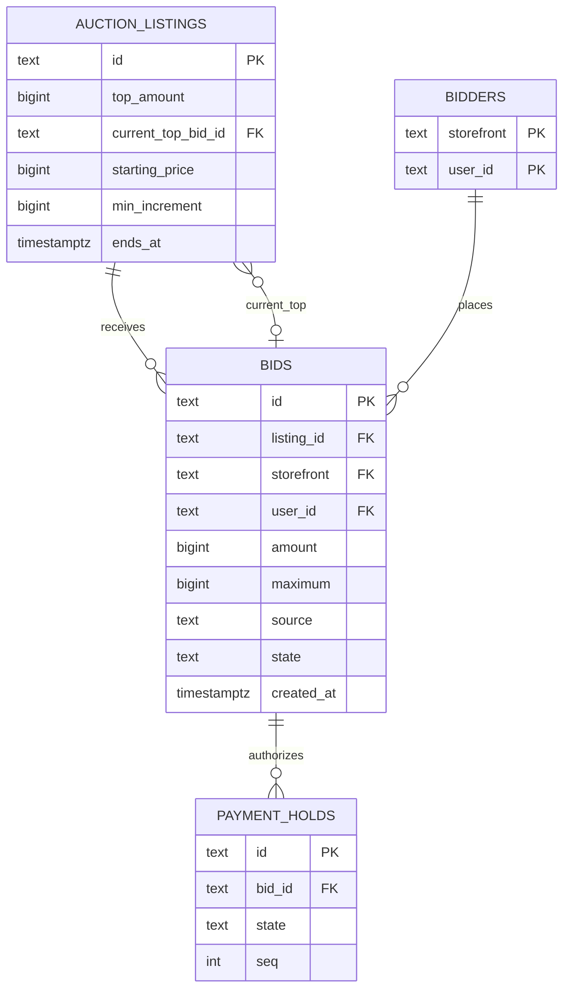

## Context

- See [proposal.md](proposal.md) for the collector problem.
- See
  [`grade10-site/auction/auto-bidding`](specs/grade10-site/auction/auto-bidding/spec.md)
  for the observable contract.
- `add-grade10-auction` already serializes every money transition on
  `SELECT … FOR UPDATE` of `auction_listings`. Bids are evaluated in one
  order; `top_amount` and `current_top_bid_id` are the public price; a Stripe
  hold is created off the lock and promoted through `recordHoldCapturable`.
- `placeBid` today takes `amountMinor`. There is no committed maximum.
  `bids.amount` is the accepted public amount. At most one live hold exists
  per listing — the current top bid's.
- Identity is `(storefront, user_id)`. The named Auction entrypoint pins
  storefront; the storefront backend supplies `userId` from its session.
- Screens and Figma sources belong in [ui-design.md](ui-design.md).

## Goals / Non-Goals

**Goals:**

- Land the two-maximum price inside the existing listing-row lock, not a
  second writer.
- Authorize the committed maximum once, then place auto-bids without a
  further Stripe call.
- Keep one live hold per listing at rest — the leader's — so the existing
  re-auth and 7-day hold sweep still have a single row to watch.
- Keep services as processors with fixed input and success/refusal output.
- Fit the listing page into the existing auction feature, DI, and
  `ListingBidPanel` slot named in [ui-design.md](ui-design.md).

**Non-Goals:**

- A timer, queue, or Durable Object that steps increments.
- A price-banded increment schedule.
- Lowering or withdrawing a maximum.
- Changing post-sale capture, settlement, or fulfilment.
- Implementing watch or auction mail.

## Decisions

### Persist the derived price on the listing

- After each accepted resolution, write the spec's current bid onto
  `auction_listings.top_amount` and the leading bid id onto
  `current_top_bid_id`.
- Authenticated and public reads return those columns. They do not
  re-derive the two-maximum price.
- Alternatives rejected:
  - Recomputing `top_amount` at read time lets two writers disagree about
    which number is true.
  - A second "resolved price" column next to `top_amount` duplicates the
    listing's existing public-price memory.

### A commitment is a new bid row; an auto-bid is too

- Collector commitments and platform-placed bids are both inserts into
  `bids`. `source` distinguishes them (`manual` | `auto`). Accepted At is
  `created_at`.
- `maximum` is the cap for that row. `amount` is the public standing
  amount of that row — what `top_amount` becomes when the row is `top`.
- A pending commitment stores `maximum` as submitted and `amount` as the
  floor at insert (`bidFloor`). Resolution overwrites `amount` with the
  two-maximum price before the row can become `top`.
- Alternatives rejected:
  - One row per bidder per listing, updated in place, loses prior maxima
    and forces Accepted At to move.
  - Stepping intermediate increments on a timer fills the ledger and
    extends the close on every step.
  - Storing the cap only on `bidders` or a new table splits the fact the
    listing lock already serializes.

### The hold amount is `bids.maximum`

- Stripe `createConfirmedHold` receives `maximum` as `amountMinor`.
- `payment_holds` gains no column; it already keys one intent per bid and
  seq.
- At rest, after resolution, at most one hold stays `held` on the listing:
  the leader's latest commitment. An outbid bidder's hold is marked
  `release_due` in the same listing-lock transaction that demotes them.
- A raise inserts a new pending bid and a new `creating` hold for the new
  maximum. Resolution accepts the raise only after that hold is
  capturable, then releases the bidder's previous `held` row.
- An auto-bid insert does not create a hold. Under the listing lock,
  `payment_holds.bid_id` of the leader's live hold is re-pointed at the
  new `top` row so close/capture still finds the hold by bid id.
- Alternatives rejected:
  - Authorize `amount` and re-authorize on each auto-bid row — an auto-bid
    happens without the bidder present, so an issuer decline would drop
    them mid-auction.
  - Top up in bands — same failure mode at every band boundary.
  - Keep every standing maximum's hold live — many holds per listing age
    toward Stripe's ~7-day cap and the re-auth sweep would have to watch
    all of them. The spec already releases an outbid authorization, so
    the second-highest cannot win later without a raise (which
    re-authorizes).

### Resolve once, when a hold becomes capturable

- `placeCommitment` inserts the pending bid and `creating` hold under the
  listing lock. It does not change `top_amount`, does not extend `ends_at`,
  and does not insert a watch.
- Stripe confirm stays off the lock, as today.
- `recordHoldCapturable` remains the only promotion choke point. After
  marking the hold `held`, it calls `resolveStandingMaxima` in the same
  transaction.
- `resolveStandingMaxima` reads every accepted (`top` or `outbid`)
  maximum plus the newly held pending row, computes the two-maximum
  result, writes at most one new public amount, and returns.
- Extension runs only when that write changes `top_amount`, using the
  existing `extendedEndsAt` rule and cap.
- A declined hold never reaches resolution; the previous leader and
  `top_amount` stand.
- Alternatives rejected:
  - Resolving at pending insert extends the close for a card that then
    declines.
  - A cron that re-reads standing maxima would bid on a timer, which the
    spec forbids.
  - A second promotion function beside `recordHoldCapturable` splits the
    choke point webhooks, sync confirm, and reconcile already share.

### Same-bidder demotion does not notify

- When an auto-bid insert takes `top` from the same `(storefront, user_id)`,
  the previous row moves to `outbid` so exactly one `top` remains.
- `movesBid("outbid")` still resets that row's mail ladder. The outbid
  work list skips a row whose listing `current_top_bid_id` belongs to the
  same bidder. That is the control that stops a collector being told they
  outbid themselves.
- Alternatives rejected:
  - A new `superseded` bid state — a migration through every bid reader
    for a case the skip already covers.
  - Updating `amount` in place — the operator history would lose the
    previous public price.

## Database Schema

### Storage rules

- All changes live in the existing `auction` PostgreSQL schema.
- Types follow the listing and bid columns: money is a positive `bigint`
  count of minor units; timestamps are `timestamptz(3)`; identity is
  `(storefront, user_id)`.
- `top_amount` remains the authoritative public price. It is not derived
  at read time.
- `bids.maximum` is authoritative for the cap. The listing does not store
  a second copy.

### Existing tables this change touches

| Table | Role |
| --- | --- |
| `auction_listings` | Row lock; `top_amount`, `current_top_bid_id`, `min_increment`, `starting_price`, `ends_at`. No new columns. |
| `bids` | Gains `maximum` and `source`. Remains the commitment and auto-bid ledger. |
| `payment_holds` | Unchanged shape. Hold amount is the Stripe intent, keyed by `bid_id`. Resolution may re-point `bid_id` of a live hold onto a same-bidder auto-bid row. |
| `bidders` | Unchanged. Registration and saved card still required before a commitment. |
| `watches` | Unchanged. This change does not insert a watch. |

### `auction.bids` — additive columns

| Column | Type | Null | Default | Meaning |
| --- | --- | --- | --- | --- |
| `maximum` | `bigint` | no | none; backfill `amount` | Committed cap in the listing's minor units. |
| `source` | `text` | no | `'manual'` | `manual` for a collector commitment; `auto` for a platform-placed bid. |

`amount` stays the public standing amount of this row. After backfill,
`maximum = amount`. They diverge once a resolution lands below the cap.

Checks:

- `ck_bids_source`: `source IN ('manual', 'auto')`
- `ck_bids_maximum_covers_amount`: `maximum >= amount AND maximum > 0 AND amount > 0`

Index:

- `idx_bids_listing_id_maximum` on `(listing_id, maximum DESC, created_at ASC)`
  so two-maximum derivation does not sort the listing's whole ledger.
  Live derivation still runs under the listing row lock.

Bid states are unchanged: `pending`, `top`, `won`, `lost`, `lost_hold`,
`outbid`, `canceled`. An auto-bid is inserted `top` (or `pending` is not
used for `source = 'auto'`). A `source = 'auto'` row is never inserted
until its amount is the accepted public price.

### Entity relationships



- `current_top_bid_id` points at the public-price row, which may be
  `source = 'auto'`.
- The live hold follows that row after a same-bidder transfer.

## Service Interfaces

### Processing model

- Entrypoints adapt transport and identity. They do not write rows.
- Service processors own the listing-lock transaction, policy, and
  idempotency.
- Repositories own SQL and accept the service's transaction.
- Stripe confirm stays outside the lock, as today.
- Unexpected database or invariant failures throw and roll back.
- Expected refusals return values.

| Processor | Reads | Writes |
| --- | --- | --- |
| `placeCommitment` | `auction_listings` (locked), `bidders`, pending `bids`, live pending max | `bids` (pending), `payment_holds` (`creating`) |
| `recordHoldCapturable` | hold, bid, locked listing | hold → `held`; then `resolveStandingMaxima` |
| `resolveStandingMaxima` | locked listing, accepted + newly held `bids`, their holds | `bids` amount/state, `payment_holds.bid_id` transfer, outbid `release_due`, `auction_listings.top_amount` / `current_top_bid_id` / `ends_at` |
| `readOwnStanding` | listing, viewer's latest accepted bid | none |

```mermaid
flowchart LR
    Browser[Listing bid panel] --> Store[Authenticated Store procedure]
    Store -->|adds session userId email| Entrypoint[Storefront-pinned Auction entrypoint]
    Entrypoint -->|adds storefront| Place[placeCommitment]
    Place --> Repos[Bid / hold repositories]
    Repos --> Database[(Auction PostgreSQL)]
    Place -->|commit| Stripe[executeHoldCreate off lock]
    Stripe --> Promote[recordHoldCapturable]
    Promote -->|listing lock| Resolve[resolveStandingMaxima]
    Resolve --> Repos
```



### Shared processor types

```ts
type BidderRef = {
  storefront: string;
  userId: string;
};

type PlaceCommitmentInput = {
  listingId: string;
  bidder: BidderRef;
  email: string;
  name?: string;
  maximumMinor: number;
  currency: string;
};

type PlaceCommitmentOutput =
  | {
      success: true;
      data: { bidId: string; holdId: string; endsAt: Date; auctionId: string | null };
    }
  | {
      success: false;
      error: string;
      errorCode:
        | "LISTING_NOT_FOUND"
        | "NOT_BIDDABLE"
        | "NOT_REGISTERED"
        | "BANNED"
        | "BIDDER_DELETED"
        | "PENDING_BID_EXISTS"
        | "CURRENCY_MISMATCH"
        | "INVALID_AMOUNT"
        | "AMOUNT_TOO_LOW"
        | "MAXIMUM_NOT_RAISED";
      minimumNextAmount?: number;
    };

type ResolveStandingMaximaInput = {
  listingId: string;
  newlyHeldBidId: string;
};

type ResolveStandingMaximaOutput = {
  leaderBidId: string;
  topAmountMinor: number;
  autoBidId: string | null;
  priceChanged: boolean;
  endsAt: Date;
};
```

- `MAXIMUM_NOT_RAISED` is the refusal when the submitted cap is less than
  or equal to this bidder's already-accepted maximum.
- `AMOUNT_TOO_LOW` remains the refusal when the cap is below the listing's
  minimum next bid; it still returns `minimumNextAmount`.

### `placeCommitment`

```ts
function placeCommitment(
  db: AuctionDb,
  clock: Clock,
  input: PlaceCommitmentInput,
): Promise<PlaceCommitmentOutput>;
```

Mutation steps, one listing-lock transaction:

1. Require `maximumMinor` to be a positive minor-unit integer.
2. `lockListing`. Refuse `NOT_BIDDABLE` when the listing is not published
   or `now` is outside `[starts_at, ends_at)`.
3. Require a bidder with a Stripe customer and saved payment method for
   the listing's mode. Same `NOT_REGISTERED` / `BANNED` / `BIDDER_DELETED`
   as today.
4. Refuse `PENDING_BID_EXISTS` when this bidder already has a `pending`
   row on the listing.
5. Refuse `CURRENCY_MISMATCH` when currencies differ.
6. Compute `bidFloor(listing, livePendingMax)`. Refuse `AMOUNT_TOO_LOW`
   when `maximumMinor` is below that floor.
7. Read this bidder's latest accepted (`top` or `outbid`) `maximum`.
   Refuse `MAXIMUM_NOT_RAISED` when `maximumMinor` is not strictly
   greater. A first commitment has no prior row and skips this check.
8. Insert `bids` with `state = 'pending'`, `source = 'manual'`,
   `maximum = maximumMinor`, `amount = bidFloor` (positive, ≤ maximum),
   existing `pseudonym_seq` rules.
9. Insert `payment_holds` seq 1, purpose `hold`, state `creating`.
10. Do not insert a watch. Do not update `top_amount` or `ends_at`.
11. Return `{ bidId, holdId, endsAt: listing.ends_at, auctionId }`.

The processor never:

- calls Stripe;
- writes `source = 'auto'`;
- opens a second transaction;
- publishes mail or push.

### `resolveStandingMaxima`

```ts
function resolveStandingMaxima(
  tx: AuctionTransaction,
  input: ResolveStandingMaximaInput,
): Promise<ResolveStandingMaximaOutput>;
```

Called only from `recordHoldCapturable` while that function holds the
listing lock and the new hold is already `held`.

Mutation steps:

1. Require the caller's transaction to hold the listing row lock.
2. Load every bid on the listing whose state is `top` or `outbid`, plus
   the newly held pending bid. Each contributing row's cap is
   `maximum`.
3. Pick the leader: highest `maximum`; tie → lowest `created_at`
   (Accepted At). With one contributing maximum, the public price is
   `starting_price`. With two or more, the public price is
   `min(leader.maximum, second.maximum + listing.min_increment)`.
4. Set the newly held pending row's `amount` to that public price when
   this bidder is the leader, or leave it pending-to-outbid when they
   are not.
5. If the leader is this newly held bidder:
   - move previous `top` to `outbid`;
   - if that previous `top` is a different bidder, mark their live hold
     `release_due`;
   - set this row `top`;
   - set `current_top_bid_id` and `top_amount`;
   - if this bidder had an older `held` hold on a previous
     commitment, mark that older hold `release_due`.
6. If the leader is unchanged and the public price rises:
   - insert a `source = 'auto'` bid for the leader at the new price,
     `maximum` copied from the leader's standing cap, `state = 'top'`;
   - move the leader's previous `top` to `outbid` without releasing
     their hold;
   - re-point the leader's live `payment_holds.bid_id` at the auto-bid
     row;
   - mark the newly held challenger `outbid` and their hold
     `release_due`;
   - set `current_top_bid_id` and `top_amount`.
7. If the leader is unchanged and the public price does not rise
   (the leader raised their own cap): transfer `top` to the new row,
   copy `amount` from the previous top, re-point the new hold onto
   that row, release the previous hold, and move the previous top to
   `outbid` with the same-bidder notify skip. `top_amount` stays.
8. If `top_amount` changed, apply `extendedEndsAt` and maybe write
   `ends_at`. If it did not change, leave `ends_at`.
9. Return the leader bid id, public price, optional auto-bid id, and
   whether the price changed.

The processor never:

- calls Stripe;
- inserts a watch;
- opens its own transaction;
- steps intermediate increments;
- writes a second auto-bid in the same call.

### Mutation example: first maximum opens the bidding

Listing `listing_42` before: `top_amount = 0`, `current_top_bid_id` null,
`starting_price = 20000`, `min_increment = 2500`, no bids.

`placeCommitment` input (after Store adds `userId` and the entrypoint
adds `storefront`):

```json
{
  "listingId": "listing_42",
  "bidder": { "storefront": "grade10", "userId": "user_17" },
  "email": "a@example.com",
  "maximumMinor": 50000,
  "currency": "HKD"
}
```

After `placeCommitment` (pending, not yet public):

- `bids.bid_99`: `amount = 20000`, `maximum = 50000`, `source = 'manual'`,
  `state = 'pending'`
- `payment_holds.hold_12`: `bid_id = 'bid_99'`, `state = 'creating'`
- listing `top_amount` still `0`

After Stripe confirms and `resolveStandingMaxima`:

- `bids.bid_99.state = 'top'`, `amount = 20000`
- `hold_12.state = 'held'`
- listing `top_amount = 20000`, `current_top_bid_id = 'bid_99'`
- `ends_at` unchanged (not in the extension window)
- no `source = 'auto'` row

### Mutation example: challenger below the leader

Same listing, A leading at 20000 with maximum 50000. B commits 22500.
After B's hold is capturable:

- `bids.bid_100`: B, `maximum = 22500`, `source = 'manual'`, ends
  `outbid`, hold `release_due`
- `bids.bid_101`: A, `amount = 25000`, `maximum = 50000`, `source = 'auto'`,
  `state = 'top'`
- A's `hold_12.bid_id` re-pointed to `bid_101`, still `held`
- `bid_99` (A's manual) → `outbid`; outbid mail skip because
  `current_top_bid_id` is still A
- listing `top_amount = 25000`, `current_top_bid_id = 'bid_101'`

An identical Stripe/webhook replay of `hold_12` already `held` returns
`already_resolved` and writes nothing.

### Mutation example: challenger takes the lead

B then raises to 60000. After the new hold is capturable:

- B's new row `bid_102`: `amount = 52500`, `maximum = 60000`,
  `source = 'manual'`, `state = 'top'`, hold `held`
- A's `bid_101` → `outbid`; A's hold `release_due`
- listing `top_amount = 52500`, `current_top_bid_id = 'bid_102'`
- `ends_at` moves only if this write happens inside the extension window

### Mutation example: raise authorization fails

A leads with maximum 50000. A submits 80000. `placeCommitment` inserts
`bid_103` pending and `hold_20` creating. Stripe declines.

- `markHoldDeclined` sets `hold_20` failed and `bid_103` `lost_hold`
- `resolveStandingMaxima` is not called
- A's `bid_101` still `top`, maximum 50000, hold still `held`
- listing `top_amount` unchanged

### Mutation example: equal maxima

B leads at maximum 60000. C commits 60000. After C's hold is capturable:

- C's row is accepted (`state = 'outbid'`, not refused)
- `top_amount = 60000` (the tied maximum)
- B still `top` because B's `created_at` is earlier
- C's hold `release_due`

### Storefront RPC data flow

Browser body:

```json
{ "listingId": "listing_42", "maximumMinor": 50000, "currency": "HKD" }
```

Grade10 Store authenticated procedure adds session identity:

```json
{
  "listingId": "listing_42",
  "userId": "user_17",
  "email": "a@example.com",
  "maximumMinor": 50000,
  "currency": "HKD"
}
```

`Grade10AuctionService` adds `storefront = 'grade10'` before
`placeCommitment`. `ZzzAuctionService` pins `zzz`. The browser cannot
override either identity value.

### Wire changes

**BREAKING.** `placeBid` input `amountMinor` becomes `maximumMinor`.
Same integer minor units, same currency check. The RPC method name
stays `placeBid` so the storefront proxy does not grow a second verb.

Authenticated listing facts (not the public listing) gain:

| Field | Type | Null | Meaning |
| --- | --- | --- | --- |
| `ownMaximumMinor` | `int` | yes | Viewer's latest accepted maximum; absent when they have none |
| `leading` | `boolean` | no | Whether that viewer currently leads |

`MyBidStanding` gains required `maximumMinor: int` when the standing
exists. Public `bids[]` and `topAmount` do not gain a maximum.
`publicBidSchema` gains `source: 'manual' | 'auto'`.

Admin listing bid history adds `maximum` and `source` on each row so
an operator can answer a dispute. That is an additive admin read.

## Risks / Trade-offs

- **[Holding the maximum discourages high caps]** → The bid surface
  states that the hold is the maximum. Named in [ui-design.md](ui-design.md).
- **[A card issuer declines a large authorization]** → The pending row
  becomes `lost_hold`; resolution never runs; the previous `top` and
  hold stay.
- **[Two writers derive two leaders]** → Derivation stays inside the
  existing listing-row lock; `top_amount` is written, not recomputed
  at read.
- **[An outbid second-highest cannot be auto-promoted if the leader's
  hold later fails]** → Existing `lost_hold` demotion stands. This
  change does not re-hold an already-released maximum. A collector
  who wants to compete again raises, which authorizes.
- **[Same-bidder `outbid` rows look like a rival overtake in mail]** →
  The outbid work list skips when `current_top_bid_id` is the same
  bidder.
- **[Auto-bid hold re-point breaks capture]** → Capture and close keep
  joining the live `held` row by `current_top_bid_id` after the
  transfer; a scenario test promotes, auto-bids, then closes.

## Migration Plan

1. Additive migration: add `maximum bigint`, backfill
   `maximum = amount`, then `SET NOT NULL`; add
   `source text NOT NULL DEFAULT 'manual'` and the two checks; add
   `idx_bids_listing_id_maximum`.
2. Existing open listings keep their leader and `top_amount`. A bidder
   who bid 30000 behaves as one who committed a maximum of 30000 and is
   at their cap. Existing holds already cover those amounts; do not
   re-authorize.
3. Deploy `@grade10/auction-contracts` and `@grade10/stripe-backend`
   (hold amount = maximum), then the auction worker, then the
   storefront proxies, then the Grade10 listing page and admin history.
4. Rollback keeps the columns. Do not drop `maximum`. Old code that
   writes `amount` without `maximum` cannot be redeployed after
   `maximum` is `NOT NULL`.

## Open Questions

These can be answered after implementation begins without changing the
specs, the approach, or the task breakdown.

- Whether the admin bid history filters to show only bids a bidder
  placed themselves. An operator can already see both.
- Whether the bid surface offers preset maximum amounts alongside free
  entry. Presentation only; the committed value is unaffected.
