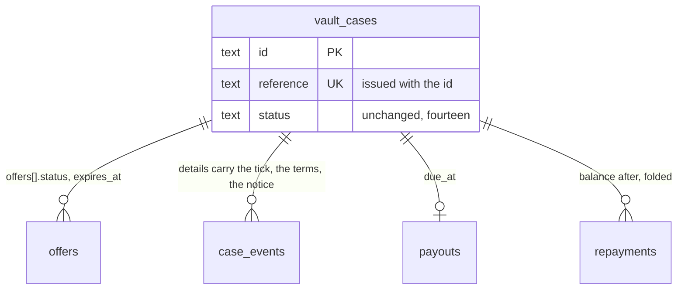

## Context

See [proposal.md](proposal.md#why) for the motivation and [decisions.md](decisions.md)
for what the interview settled; the journeys are beside each capability under
`specs/`. Every path below is the application repository's unless it says
`grade10-spec`.

- **Built today** — one vault worker per brand (`apps/backend/grade10/vault`,
  the code in `packages/vault/backend`), thirty-one migrations,
  `cases/transitions.ts` the only writer of a status; a collector SPA in
  `packages/vault/frontend`, a console in `packages/vault/admin-frontend`;
  `cases.accept`, `cases.decline`, `cases.cancel` and `cases.requestRelease`
  served and unreached by any screen. The vault holds no production case, so a
  contract half ships with its expand half and a wire field is renamed rather
  than aliased
- **The two reads** — `cases.mine` answers `vaultCaseSchema` rows, carrying the
  status and the appointment and no offer, no due date and no events;
  `caseDetailSchema` answers `asOf`, the case, offers, events, packets,
  custody, payout, `repayments`, `due` and `paymentInstructions: string | null`,
  the last off `packages/app-env/src/legalIdentity.ts`, whose seven fields are
  null but the two names and refuse production minting through
  `documents/legalEntity.ts` (`LEGAL_IDENTITY_UNSET`). `caseEventSchema.details`
  is `Unknown` on the wire
- **Mail** — twenty-four `NOTIFY_KINDS` (`notify/vocabulary.ts`), copy as a
  flat `{ subject, heading, body, action }` in `email/messages.ts`, rendered by
  `email/render.tsx` through `@grade10/email/render`'s `ProductEmail`;
  `notifyQuietly` never throws and parks a failed send in
  `notification_retries`, whose facts are `amountMinor`, `notifyAt` and
  `packetId`. `@grade10/email/render` publishes `BaseLayout` and
  `renderProductEmail`, `@grade10/email` publishes `PermanentEmailSendError`,
  which the auction parks on and the vault does not read, and the auction
  renders its letter in the worker (`AuctionLetter.tsx`, inline styles). The
  store's `apps/emails` is a preview site with no vault letters and no tests
- **The calendar file exists** — `buildCalendarFile` in
  `packages/appointment/contracts/src/calendar.ts` writes a `VEVENT` with a
  `UID`, a `SEQUENCE` and `METHOD:CANCEL`, and the diary's
  `calendarAttachment` mints `<bookingId>@grade10-appointments` with the
  booking's own revision. `escapeCalendarText` escapes three of the four marks
  it names: `;` is replaced by itself. The vault's booking mail attaches
  nothing
- **Erasure** — `requestErasure(db, userId, actor)` in
  `packages/grade10-auth/backend/src/erasureRequests.ts` writes
  `auth.deletion_requests` and bans in one transaction, `cancelErasure` lifts
  the ban, both throw `ERASURE_ALREADY_REQUESTED` and `ERASURE_NO_REQUEST` on a
  second call, and `readSession.ts`'s `enforceOpenErasure` re-applies the ban on
  every session read while a request is open. A product reaches auth over
  `AUTH_SERVICE`, whose entrypoint resolves the caller from the request headers
  (`lookupUsers`, `erasureCleared`); the vault's `erasureStatus(db, userId)`
  answers `holds` and `remaining`
- **Audit and bytes** — the elevated ladder writes a chain row for any call
  carrying `auditDetails` and `elevatedRoute` serves grant-gated bytes through
  the same sink, while a collector reading their own document writes
  `recordDocumentRead` (`documents/serve.ts`) and no chain row
- **Storybook** — none here. The store's `apps/preview` is the plain-Vite host
  shape: Storybook 10.5.4 with `addon-a11y`, `addon-docs`, `addon-vitest` and
  `@vitest/browser-playwright`. Both application Vite configs carry
  `reactRouter` and the serving worker's plugins, which no Storybook builder
  loads
- **Tests** — `docs/conventions/backend.md` § Tests prove the service and
  repository seams. Both vault and auth backend suites include
  `test/**/*.test.ts` only, and auth's runs on node. No `/vault/dev/*` route
  exists; auth's `magicLinkOutbox` is a keyed `auth_kv` row with a TTL.
  `scripts/e2e/start-isolated.sh` starts neither the vault nor the diary, and
  e-kyc has no gateway prefix and no health address to probe

## Goals / Non-Goals

**Goals:**

- Every collector-facing fact the pages add is derived at the read by one pure
  function both SPAs call over the scalars every surface already has
- The reference is a stored fact with a database guarantee, and the id stays
  the key and every address
- One predicate decides whether a Legal-owed value may print, and the act
  renders before it commits, so nothing is written that cannot be posted
- Every letter is one exhaustive catalogue keyed by `NotifyKind`, so a kind
  cannot ship without a letter and a letter cannot outlive its kind
- Every bulk read is bounded in bytes, not in ids, and leaves the chain rows
  the single read leaves
- The self-filed erasure request reuses auth's one request table and one
  window, and bans nothing

**Non-Goals:**

- A `derived_status` column, a `standing` field on the wire, or a fifteenth
  status
- A second copy of the how-to-pay values anywhere but `legalIdentity.ts`
- Rendering letters in the store: the worker renders what it sends, the store
  previews
- A Storybook per application; one workspace package hosts every slice's
  stories, and the store's `apps/preview` stays for primitives and blocks

## Decisions

### The case reference is a stored column, issued where the id is

The spec governs the alphabet, the length and the uniqueness; this is where the
fact lives.

- **The column** — `vault_cases.reference text NOT NULL`, `UNIQUE`,
  CHECK-constrained to six characters of `CASE_REFERENCE_ALPHABET`, exported
  once from `@grade10/vault-contracts` and rendered into the migration's regex
  rather than spelled again. The database is one brand's, so a unique index is
  uniqueness per brand
- **Issued on the row's insert** in `cases/intake.ts`, beside the `vc_` id:
  `caseReference(random)` in `cases/reference.ts` draws six characters from
  `crypto.getRandomValues`
- **One attempt per draw**, `mintPosHandle`'s shape — an independent insert
  guarded by `isUniqueViolation` from `@grade10/postgres`, eight attempts, then
  a throw by name. A unique violation aborts the transaction it lands in, so
  the case row is inserted before `openCase`'s transaction and the item joins
  it inside. Never reused is what the index says, and a reference spent on an
  abandoned draft costs nothing out of 31⁶
- **Shown** in the case header, the list card, the sent screen, the signing
  header, the console's case header and every letter's subject line, and
  **searched** by prefix in `repositories/cases.ts` `searchCases`, where a
  case-folded term of two to six characters in the alphabet is
  `termKind: "reference"`. **Never in a URL**: routes, links and `CASE_PATH`
  keep the id
- Alternatives rejected: retrying inside one transaction, which a unique
  violation leaves aborted, so `openCase` rolls back; a reference derived from
  the id, which cannot be reissued on a clash; one issued at submit, leaving
  the column nullable on a draft; a sequence, which leaks volume

### Every collector-facing fact is one pure function over the scalars every surface has

The spec governs what each fact says; this is where it is computed.

- **`caseStanding(input, asOf, timeZone)`** in
  `packages/vault/contracts/src/standing.ts`, over the scalars the list row and
  the detail both carry — `{ status, appointmentAt, declineReason,
  offerExpiresAt, dueAt, endedAs }` — answering `{ chip, stage, lane, fact }`
- **`chip`** is the word the screen prints — `waitingOnYou`, `withUs`, `visit`,
  `due`, `pastDue`, `settled`, `collected` or `closed` — with the date or the
  day count that word carries. `OwnershipChip` renders the answer and derives
  nothing
- **`stage`** is `request`, `valued`, `offer`, `agreed`, `signed`, `vault`,
  `loan` or `home`, and **`lane`** is `financed` or `storage`: the storage lane
  walks the same list without `offer` and `loan`, so no caller keeps a table of
  which six. **`fact`** is `offer_lapsed`, `offer_declined`,
  `offer_superseded`, `visit_missed`, `release_requested` or null
- **One clock** — `timeZone` is the brand's and `asOf` the bundle's instant,
  never `Date.now()`, so the page and `needsStaffReasonsOf` cannot disagree
  across a midnight
- **`caseEnding(detail)`** is the detail-only reader: the reason, the actor
  kind, the clock, the settled figure and the notice dates for the four
  endings, off the detail's typed `ended`, `notice` and `forfeiture` fields.
  Nothing reads `caseEventSchema.details`, which is `Unknown` on the wire
- **One rule for a lapsed offer** — `offerLapsed(expiresAt, status, asOf)` is
  exported beside `caseStanding` and folded by `cases/needsStaff.ts`, and the
  SQL `lapsed(now)` in `repositories/offers.ts` stays a prefilter over it, so
  the page is right between the sweep's passes
- **`identityStanding(state)`** collapses `checkState` and `verified` into the
  six words: no check → None; invited, started, submitted → Out; stalled →
  Stalled; approved and bound → Verified; declined → Refused; expired,
  withdrawn → Lapsed. The console's `IdentityPanel` and the Your data card call
  it
- Alternatives rejected: the detail bundle as the input, which the home card's
  `cases.mine` cannot fill; a `standing` field on the wire, which two detail
  procedures compute twice; a status per fact, the decision's own rejection

### How to pay is two Finance values and one predicate

The spec governs what the block names; this is where the values come from and
what refuses them.

- **The fields** — `LEGAL_IDENTITY_FIELDS` drops `paymentInstructions` and
  gains `fpsId` and `bankAccount`, both `string | null`, neither blocking; the
  payee is `lenderLegalName`, already on file. `check:libs` names both unset on
  every run through `unset()`
- **The wire** — `caseDetailSchema.paymentInstructions` becomes
  `howToPay: NullOr({ payee, fpsId, bankAccount, reference })`, null on every
  case but a live loan; `reference` is the case reference
- **`printedValue(ports, field)`** in
  `packages/app-env/src/printed.ts` is the primitive: production
  and null throws `LEGAL_IDENTITY_UNSET` naming the field, any other
  environment answers a marked `[fpsId]` placeholder
- **`printedEntity` and `printedPayee` compose over it** — every name, the
  licence line, the FPS id and the bank account print through `printedValue`,
  so an unset field prints its placeholder outside production and never a
  trading-name fallback. The lender's `licence` is `licenceWording` then
  `licenceNumber`, and the letter footer prints `entity.licence` rather than
  reading the two again. `assertLoanPrintable` calls both at the offer, so a
  production loan never goes live without a named, licensed lender and a way
  to pay. The complaints contact alone is read raw: a document prints it where
  set, a letter refuses without it
- **The act renders before it commits** — `renderVaultLetter(kind, facts)` is
  pure and calls `printedValue`, so an act that would print an unset value
  refuses by name before its transaction opens. `recordPayout`,
  `recordRepayment`, `sendForfeitureNotice` and the reminder pass render first
  and hand the rendered letter to the send; nothing commits a row a parked
  letter describes
- Alternatives rejected: a `LETTER_PRINTS: Record<NotifyKind, LegalIdentityField[]>`
  map beside the catalogue, twenty-four rows kept in step by hand and free to
  disagree with what a letter prints, whose drift refuses inside
  `notifyQuietly`, which never throws; refusing at the render inside the send,
  which turns the refusal into five rungs and a park; one free-text field,
  which no borrower can copy into a bank form

### Accept, Decline, Cancel and Ask for it back wire the procedures that exist

The spec governs the confirmations; this is what changes.

- **The client** — `packages/vault/frontend/src/core/api/VaultApi.ts` gains
  `accept`, `decline` and `cancel`; `requestRelease` is already there, and the
  fixture transport answers all four from the same fixture cases
- **Accept is a mounted dialog** held on its subject, the offer, per
  `docs/conventions/dialogs.md`: it is about one offer and carries its terms,
  which `Confirmation` has no slot for. The answer sends that offer, so an
  offer replaced under the open dialog is refused and never accepted unseen.
  Decline, Cancel and Ask for it back are words and one effect, so each is a
  `useConfirm` ask
- **Ask for it back is one rule** — the contract's `mayAskForItBack` over
  `RELEASABLE_CASE_STATUSES` (`vaulted`, `repaid`: the statuses a release runs
  from) and `releaseAskStands` over `ANSWERS_RELEASE`; the page, the worker's
  `requestRelease`, the staff queue's `openReleaseRequests` and both fixture
  transports read them, so a loan still running is offered no ask and refused
  one `CASE_CONFLICT`
- **The figure cannot move under an open dialog** — each act carries the
  detail's `asOf` into the mutation, and the worker refuses `QUOTE_STALE` when
  the balance moved, the failure `recordRepayment` already raises
- **Additive on the detail** — `repayments[].balanceAfterMinor` (the fold at
  that value date through `money/computeDue.ts`, the one authority),
  `notice: NullOr({ sentAt, cureBy })` from `custody/forfeit.ts`'s
  `latestForfeitureNotice`, `forfeiture: NullOr({ at, settledMinor })`,
  `ended: NullOr({ kind, at, actorKind, reason })`, and
  `reminders: CaseReminder[]` folded beside `money/computeDue.ts` from the due
  date, the contract's `REMINDER_LADDER` and the notice — one flat list of the
  rungs sent, each with its day, and the ones still ahead. A rung the sweep
  never sent and whose day has passed is neither
- Alternative rejected: a second `cases.repayments` procedure — the bundle
  already carries the rows, and a second read is a second `asOf`

### The review step records the tick on the event that already records the send

- **The input** — `cases.submit` gains
  `collectionStatement: { version }`, the version the review step showed and
  the tick answered; the worker refuses `COLLECTION_STATEMENT_REQUIRED` any
  version but the one in force and writes it as
  `{ collectionStatementVersion }` into the `intake_submitted` event's
  `details`, the stamp that already records the send. A constant
  `acknowledged: true` would answer for whatever the worker stamps, not what
  the collector read
- **The version is the legal-copy table's, not the legal identity's** —
  `cases.collectionStatement` answers `legalCopy(brand, "collectionStatement")`
  off the table below, `{ version, text }`, or `{ version: UNWRITTEN_VERSION,
  text: null }` while Legal has written none; the review step shows the text,
  or "Being prepared", and sends the version it showed. `documents/plan.ts`
  holds no version of its own
- **Production refuses the send while the statement is unwritten** — Q8 as
  changed at landing: `submitIntake` refuses `COLLECTION_STATEMENT_UNWRITTEN`
  in production while the table holds no statement for the brand, before it
  writes, so the request stays a draft, and the review step shows the
  refusal by name; outside production the step reads "Being prepared", the
  send is accepted, and the event records `UNWRITTEN_VERSION` as the version
  shown
- Alternatives rejected: the version as an eighth `LEGAL_IDENTITY` field, which
  is not an identity; `pics_acknowledged_at` on `vault_cases`, a second column
  for a fact one event row already dates; a `written: false` flag beside a
  version constant, which says a text exists that nobody can read back

### Legal copy is one versioned table per brand

Counsel's texts are legal wording a record has to be able to quote back, so
they live where the legal identity does and carry a version the way
`consentCopy` carries a hash.

- `packages/app-env/src/legalCopy.ts`, beside `legalIdentity.ts` and
  `consentCopy.ts`: `LEGAL_COPY: Record<Brand, Partial<Record<LegalCopyKind, { version, text }>>>`
  over the closed set `LEGAL_COPY_KINDS = ["collectionStatement"]`, one
  entry per brand and kind holding the text in force and its version; a
  rewrite is a new version on the same entry in one pull request, as
  Migration Plan step 4 says, and git holds the text a version named
- `legalCopy(brand, kind)` answers the entry, or
  `{ version: UNWRITTEN_VERSION, text: null }` for a brand with none —
  no fallback across brands, as `consentCopy` refuses one, because a
  fallback puts one brand's legal words on another's paper.
  `UNWRITTEN_VERSION` is the module's exported constant, since the
  `cases.submit` input and the event carry a version string
- **A record keeps the version it printed** — the intake event's
  `collectionStatementVersion`, and a sealed document through doc-sign's
  hash of its text
- Alternatives rejected: a `legal_copy` database table with an admin write —
  a text nobody reviews in a pull request, and a deploy is already what Legal's
  other values take; every version kept under its own key — no record reads
  an old text back, and git holds it; the table in `packages/vault/backend` —
  grading's agreement and any later product print the same brand's texts, and
  `consentCopy` already moved out for the same reason; the forfeiture
  notice's sentences and the money letters' footer on the table — they are
  the letters' own catalog copy, and no scenario makes them counsel's

### One stored number for every way it is typed

- `canonicalPhone` in `packages/utils/src/phone.ts` applies
  `normalize("NFKC")`, folding full-width digits, plus, brackets, hyphen and
  full stop to ASCII, before it strips spacing, and, only when the bare digits
  are not themselves a valid local number, reads bare digits that are the
  brand's dial code followed by a number matching its national plan as that
  number with its `+` — `852 9876 5432` stores as `+85298765432`; any other bare number
  still answers `needsCountryCode`, and `E164_PATTERN`, with the store's
  generated `account_profile` CHECK, does not move (Q121)
- **Platform, not vault** — the store's profile and the till's identify read
  the same codec, so a number typed one way is one customer in every product;
  `requireCanonicalPhone` and `searchablePhone` change nothing
- Alternative rejected: folding in the vault's `cases/phone.ts` alone, which
  would find at the counter a number the store's profile had refused

### The calendar file is the booking's own, served and attached

- **The route** — `GET /api/cases/:caseId/visit.ics`
  (`VAULT_PATHS.visitCalendar`) in `routes/visit.ts`, a session route on
  `ownedCase`, the one ownership read `caseOwner` gates the other byte routes
  on, answers `text/calendar` from `buildCalendarFile` over the
  booking `appointments.getBooking(caseId)` answers:
  `uid: <bookingId>@grade10-appointments` and the diary's own revision as
  `sequence`, the two the diary's `calendarAttachment` already mints, so one
  visit has one `UID` and not two. Not `elevatedRoute`: it admits a holder of
  a grant, and the file is the case owner's alone
- **A cancelled visit still answers** — the diary keeps the booking and answers
  it `cancelled` after `cancelVisit` clears the vault's cache, so
  `METHOD:CANCEL` goes out against the `UID` and `DTSTART` the phone holds. The
  Booked screen's add to calendar is this address
- **The letters attach the same file** for `visit_booked`, `visit_rescheduled`
  and `visit_cancelled`. `ProductEmailPort.send` carries attachments;
  `sendBatch` refuses them, and these are sent one at a time
- **`escapeCalendarText` is fixed** — `;` is replaced by itself today, so a
  semicolon in a shop's address emits an unescaped separator; the fix lands
  with a table test pinning all four escapes
- Alternative rejected: a `UID` off the case id — the diary already mints one
  per booking, and a second leaves two events for one visit

### Your data is a vault page over a vault read, and the ask crosses to auth once

The spec governs what the page names and refuses; this is who answers.

- **`cases.yourData`** (authed) answers the retention classes off
  `packages/app-env/src/retention.ts`, `identityStanding` over
  `kyc.latestForUser`, the sealed documents paged by case, the vault's own
  `holds` from `erasure/eraseUser.ts` `erasureStatus`, and the open request
  from `AUTH_SERVICE.ownErasureStatus(headers)` — the holds beside the request,
  so a refused ask reads its reason on the same card
- **`cases.requestErasure`** (authed, mutation) refuses `ERASURE_HELD` with the
  holds in words while any stand, then calls
  `AUTH_SERVICE.requestOwnErasure(headers)`; `cases.cancelErasure` calls
  `cancelOwnErasure(headers)`, which answers a typed outcome — cancelled, or
  refused `ERASURE_WINDOW_PASSED` or `ERASURE_NOT_SELF_FILED` — the vault maps
  to its own codes with no second read. Your data lives at `/profile/data`,
  under the account, behind the vault's gate. All three binding methods are new on
  `packages/grade10-auth/backend/src/entrypoint.ts`, resolve the person from
  the session the headers carry as `lookupUsers` does, and are idempotent: a
  second request answers the open row's `executeAfter` rather than
  `ERASURE_ALREADY_REQUESTED`, and a cancel with no open row is a no-op
- **A self-filed row sets no ban**, and self-ness is `actor.id === userId`, so
  `requestErasure` takes no new parameter. `cancelErasure` lifts the ban only
  where `open.requestedBy !== userId`, so a self-cancel cannot hand back an
  account banned for conduct, and `enforceOpenErasure` gains the same branch —
  without it the next session read signs the collector out of the cancel
- **An operator filing over a self-filed row converts it** — `requested_by`
  becomes the operator and the ban is applied — because the partial unique
  index admits one open request and a refusal would leave the ban unlanded;
  `docs/architecture/account-data.md` moves with it
- **The document download** — `GET /api/cases/documents.zip`
  (`VAULT_PATHS.documentsZip`), under the session tier the worker already
  mounts, owned by the session's user because the address carries no `:caseId`.
  It takes the cursor `cases.yourData` took and zips what that read answers —
  one bound, one ownership rule, one count — each a sealed document of a
  completed packet the caller owns
- **Bounded in bytes** — the route sums the objects' recorded sizes before the
  first read and refuses `TOO_LARGE` by name past the ceiling, because the
  writer lifted from `packages/wallet-pass/src/apple/zip.ts` into
  `packages/utils/src/zip.ts` buffers whole and speaks no ZIP64. The lift adds
  the `@grade10/utils/zip` export and its Handbook card row
- **The chain rows are the single route's** — each document appends
  `recordDocumentRead` through `documents/serve.ts` before its bytes go, and
  the download appends one `vault.documents.setDownloaded` row — who, when, how
  many — through the context's audit sink, as Q24 asks
- Alternatives rejected: a `?caseIds=` parameter, re-establishing a bound over
  a list the server already knows; a session tier on auth's tRPC, a second
  ladder for one procedure; auth judging the vault's holds, which
  `docs/architecture/account-data.md` refuses; a `filed_by_self` column, where
  `requested_by = user_id` is the fact

### The console reads counts and sums from the queries it already runs

- **`admin.queueCounts`** — one `GROUP BY status` folded onto the seven cuts
  and nothing else, under `vault:read`, with one instant and the brand's zone
  passed in rather than read inside. **The Today block is the Today cut**:
  `admin.list` with `filter: "today"` ordered by `appointment_at`, mounted by
  the landing view with its count — no second query and no second instant
- **`admin.arrearsSummary` owns the arrears numbers** — the count and the two
  figures, folding `computeDue` over the arrears rows at one instant, bounded
  by the page size the ledger takes and refusing past it; `overdueLoans` rows
  gain the borrower's contact, the notice date and the last `reminder_sent`
- **`admin.custodyList`** gains
  `totals: { inVault, perShop, withLoan, pickupBooked }` from the same
  predicate the rows use, and **`admin.moneyLedger`** input gains
  `kind: payout | repayment | adjustment`, the wire's own vocabulary.
  `money/position.ts` gains `netOut` — payouts less repayments per currency, a
  correction netting its row once, positive when money is out
- **`GET /api/admin/money-ledger.csv`** (`VAULT_PATHS.moneyLedgerCsv`) on
  `elevatedRoute` under `vault:payout`, the one mechanism the vault already
  uses for grant-gated bytes. The console passes the ledger's own filter,
  cursor and limit as query scalars and gets the page it shows; the chain row
  writes the filter and the row count, the search's mechanism. The filter is
  the contract's `moneyLedgerQuerySchema`, which `admin.moneyLedger` takes as
  its input, and `moneyLedgerSearch` / `moneyLedgerQueryOfSearch` are its one
  URL codec on both ends; the zip's cursor rides `documentsZipSearch` the same
  way
- **`admin.policy`** (`vault:read`) answers `lendingPolicy(brand)`,
  `accrualOf`, the reminder ladder's days and `REQUIRED_FOR_OFFER`'s unset
  fields, so the three dialogs state the rule from the worker's own table
- **`admin.policy.keyTerms`** answers the loan agreement's clause ids and
  headings from `documents/templates/loanAgreement.ts`, one field of the same
  read rather than a second query returning a constant, and
  `recordTermsExplained` takes `terms: string[]`, refusing any set short of the
  plan's
- **The visit checklist and Forfeit's reason are `caseStanding`'s** — the Case
  tab walks `stage` and the events in order, and the Custody tab prints
  `notice.cureBy` and the `FORFEITURE_NOTICE_REQUIRED` refusal
  (`contracts/src/failures.ts`) in words before the button, from the
  contract's `forfeitHold` — the one rule the worker's notice and forfeiture
  refuse by, as `offerGates` is the offer's
- Alternatives rejected: a tRPC `moneyLedgerCsv` query, which cannot answer
  `text/csv` and would be a third download mechanism; an arrears count on
  `queueCounts`, two numbers for one fact at two instants; the console
  importing `@grade10/app-env`, which bundles the worker's decision tables into
  a browser

### Letters are one exhaustive catalogue the worker renders

The spec governs what each message names; this is the shape.

- **The shell** — `email/letters/VaultLetter.tsx` composes `BaseLayout` from
  `@grade10/email/render` rather than standing a third shell beside it, and a
  block generic enough for two products — the facts table, the action button —
  is hoisted there with it. `TermsTable`, `HowToPay`, `ReminderSchedule`,
  `NoticeClause` and `LicenceFooter` stay vault-side, because the licence and
  the notice are this product's legal furniture, and every money value renders
  through `amounts.ts`'s `formatMinorAmount`
- **One file per family** under `letters/` — `offer.tsx`, `money.tsx`,
  `notice.tsx`, `visit.tsx`, `case.tsx` and `identity.tsx`, the last for
  `identity_check_invited`, whose facts carry the collector's own secret link
- **The catalogue** — `letters/index.ts` is
  `LETTERS: Record<NotifyKind, Letter>`, typed exhaustive over `NOTIFY_KINDS`,
  where `Letter<F>` is `(facts: F, copy: LetterCopy) => { subject, element,
  attachments? }` and `LetterFacts` is derived from the map, so an arm is
  written once; `render.tsx` becomes `renderVaultLetter(kind, facts)`
- **The words stay injected** — `messages.ts` keeps one typed `LetterCopy` per
  kind, widened from the four flat fields to the blocks its letter carries, and
  `createEmailTranslator` still reads it, so the recorded path to
  `@grade10/i18n` is unchanged and English is not inlined into twenty-four
  components
- **The facts are built once** — `letterFacts(db, vaultCase, kind, extra)` is
  the one builder; `tellCustomer` calls it and `sweeps/notify.ts`'s resend
  calls it again over the case as it stands. `notification_retries` keeps
  `amountMinor`, `notifyAt` and `packetId` as the pinned figures the builder
  honours over a re-derivation, so a parked money letter names the figure the
  act computed. No facts column, and no second migration
- **A render throw parks once** — `notifyQuietly` classifies
  `PermanentEmailSendError` as the auction's `parkNotifyFailure` does, so a
  permanent refusal parks with its reason instead of burning five rungs
- **Aligned with the store by fixture, not by import** — the fixtures are data
  in the store, `grade10-spec/apps/emails/emails/vault/fixtures.ts`, one
  `LetterFacts` per kind; the preview renders them and the worker's
  `letters/render.test.tsx` reads the same file through `external/grade10-spec`.
  The two shells cannot be shared, Tailwind against inline, so the preview is
  an unchecked copy of the layout and a checked copy of the facts
- **The licence footer reads `printedEntity` and the complaints contact
  `printedValue`**, so a staging letter prints `[licenceWording]` and a
  production act refuses
- Alternative rejected: copy in `@grade10/i18n` inside the four-field shell,
  which cannot hold a table — the decision's rejection

### One Storybook, in its own plain-Vite package

- **`packages/storybook`** (`@grade10/storybook`), the store's `apps/preview`
  shape: plain Vite, Storybook 10.5.4 with `addon-a11y`, `addon-docs` and
  `addon-vitest`, `stories` globbing `packages/*/frontend/src/**/*.stories.tsx`
  and `packages/*/admin-frontend/src/**/*.stories.tsx`
- **One preview, two surfaces** — a `surface` parameter picks the decorator:
  `site` mounts the grade10 site theme root and the design-system Theme
  toolbar, `console` mounts `apps/admin/grade10/src/AppProviders` and the
  Astryx theme and takes no toolbar. `check-astryx-boundary`'s allowlist gains
  that one preview path. Every `site` story fails on a message the catalogue
  does not answer — `use-intl` only logs one — so a bad key reads red in the
  story that renders it, whichever product's it is
- **Named by the screen table** — every story sets `title` to
  `Vault/<Feature>/<View>`, so the ids are the
  `vault-<feature>-<view>--<state>` the `ui-design.md` screen table writes; one
  story per view per distinct layout, args controls for the varied value, and a
  data-backed view storied through its fixture transport module
- **CI** — a `storybook` job in `.github/workflows/test.yml` on every push,
  beside `admin-bundle`: `storybook build`, then the a11y run through
  `@storybook/addon-vitest` in browser mode on the runner's pre-installed
  chromium, failing on an axe violation. Its own job, not a shard of the
  frontend tests
- Alternatives rejected: one `.storybook` per application, whose Vite plugins
  do not survive a Storybook build and which writes the wiring twice, four
  times with zzz; deferring it to its own change, when the stories are the
  frame for every screen nobody has drawn; `tools/storybook`, outside
  `pnpm-workspace.yaml` and the lane resolver

### Tests per seam, and the e2e stack the vault lacks

- **Backend** (`packages/vault/backend/test/`, whose vitest `include` widens to
  `test/**/*.test.ts?(x)` so a render test is collected) —
  `cases/reference.test.ts` (an attempt per draw, the throw by name, the
  alphabet), `packages/app-env/test/printed.test.ts` (production throws, the
  placeholder outside it, per field, `printedEntity`'s fallbacks unchanged),
  `money/netOut.test.ts`, `money/arrearsSummary.test.ts` (the fold and its
  ceiling), and `email/letters/render.test.tsx` as one table over `LETTERS`,
  kind → blocks and attachments, reading the store's fixtures
- **Query shape and repository** — `repositories/cases.search.drizzle.test.ts`
  with a PGlite half for the case-folded prefix; `queueCounts`,
  `moneyLedger.kind` and `custodyList.totals` each with both halves;
  `cases/reference.repo.test.ts` (the unique index, the backfill over seeded
  rows, beside the case module it serves) and
  `repositories/yourData.repo.test.ts`; the portable suite
  gains `suites/account.ts`
- **Routes** (`test/routes/`) — `visit.ics` for the `UID`, the `SEQUENCE` and
  `METHOD:CANCEL` after a cancel; `documents.zip` for `caseOwner` on a
  stranger, the byte ceiling's refusal, the filter, the per-document reads and
  the one chain row
- **Auth** — `test/erasureRequests.self.test.ts`: self files with no ban, self
  cancels without unbanning a conduct ban, an operator filing converts an open
  self-filed row, `enforceOpenErasure` leaves a self-filed session alone. The
  entrypoint's three methods run in `apps/backend/grade10/auth/test/worker/`
  under `vitest-pool-workers`, where a `WorkerEntrypoint` runs
- **Contracts** — `standing.test.ts` as one row per chip, stage, lane and
  fact, with `asOf` on both sides of every deadline; `identityStanding.test.ts`
  as a table; `calendar.test.ts` gains the four escapes
- **SPA and console** (colocated `*.test.tsx`, `getByRole` throughout) — the
  case page per chip and per ending, each confirmation's words, the review
  step's tick, the Booked screen, Your data held and unheld; the console's
  counts, tiles, the dialogs' rule lines and the identity panel's six words
- **E2E** — one walk each in
  `apps/frontend/grade10/e2e/tests/vault/{request,offer,loan,visit,your-data}.spec.ts`,
  over new routes in `packages/vault/backend/src/routes/dev.ts` under
  `app.use("/dev/*", devOnly())` as auth's are: `POST /dev/cases/seed` drives
  `cases/transitions.ts` to the named status — no second writer and no second
  table of what a status implies — and answers `{ caseId, reference }`,
  `POST /dev/sweep` takes `{ lane: "fast" | "slow" }` and runs `runSweepPass`
  now, and `GET /dev/outbox` reads the letters sent with their attachments
- **One outbox shape for both workers** — auth's `magicLinkOutbox`, a keyed row
  with a TTL, lifts into `@grade10/worker` beside `devOnly`, and the vault's
  email channel records into it outside production
- **The stack** — `start-isolated.sh`'s default service list gains
  `vault-service,appointment-service,e-kyc-service`, and `e2e/helpers/env.ts`'s
  `STACK_READY_URLS` gains `/vault/health` and `/appointment/health` only:
  e-kyc is reached over a binding and has no address to probe

## Database Schema

Schema `vault`, migration `0031_case_reference.sql`, the one migration of the
change. Every other fact lands on a row or a stamp that already holds it.

### `vault.vault_cases`

| Change | Definition | Meaning |
| --- | --- | --- |
| `+ reference` | `text NOT NULL` | The six-character reference; authoritative |
| `+ UNIQUE` | `uq_vault_cases_reference (reference)` | Never reused, per brand — the database is the brand's |
| `+ CHECK` | `ck_vault_cases_reference: reference ~ '^[2-9A-HJKMNP-Z]{6}$'` | The alphabet, rendered from `CASE_REFERENCE_ALPHABET` |

The file adds the column nullable, creates the unique index, backfills every
existing row with one deterministic per-row draw over `random()` — no loop and
no second generator, and the index refuses a clash loudly rather than a `DO`
block swallowing it — then adds the check and sets `NOT NULL`.

`-- contract:` on the `SET NOT NULL` block says the migration and the worker
that issues references are applied in one window and the vault holds no
production row; `-- lock:` on the index, the backfill and the check says that
window is what makes the locks free. `check:migrations` refuses the file
without both, and `pnpm db:status` hashes it, so neither line is added later.

### Facts that reuse a stamp

| Fact | Where it already lives |
| --- | --- |
| The collection-statement tick | `case_events` row `intake_submitted`, `details.collectionStatementVersion` |
| The key terms ticked | `case_events` row `terms_explained`, `details.terms` |
| The calendar file's id and sequence | The diary's booking, through `appointments.getBooking` |
| The notice's dates and the settled figure | `forfeiture_notice` and `forfeited` events, read as typed detail fields |
| A self-filed erasure request | `auth.deletion_requests.requested_by = user_id` |
| A letter parked for retry | `notification_retries.amountMinor`, `notifyAt`, `packetId` |
| A bulk download, a CSV, a reference search | `document_reads`, and `audit_logs` rows `vault.documents.setDownloaded`, `vault.money.ledgerExported`, `vault.cases.searched` |

Derived, never stored: the chip, the stage, the lane, the fact, the ending, the
identity's six words, the balance after each repayment, the reminder dates, the
counts, the sums, the net out.

## Service Interfaces

| Function | Input | Answers or refuses | Boundary |
| --- | --- | --- | --- |
| `caseReference(random)` | a byte source | six characters | pure; one insert per draw, guarded by `isUniqueViolation`, eight times, before `openCase`'s transaction |
| `caseStanding(input, asOf, timeZone)` | six scalars both reads carry | `{ chip, stage, lane, fact }` | pure, contracts |
| `offerLapsed(expiresAt, status, asOf)` | one offer | boolean | pure; the SQL `lapsed(now)` prefilters over it |
| `printedValue(ports, field)` | brand, deployEnv, field | the value, a placeholder, or `LEGAL_IDENTITY_UNSET` | pure over `legalIdentity(brand)`; `printedEntity` composes it |
| `renderVaultLetter(kind, facts)` | a `LetterFacts` member | `{ subject, html, text, attachments? }` or `LEGAL_IDENTITY_UNSET` | pure; run at the head of the act, before its transaction |
| `letterFacts(db, vaultCase, kind, extra)` | the case and the send's own figures | one `LetterFacts` member | one builder for the send and the retry |
| `legalCopy(brand, kind)` | brand, kind | `{ version, text }`, or `{ version: UNWRITTEN_VERSION, text: null }` | pure over `LEGAL_COPY`; no default across brands |
| `cases.submit` | `{ caseId, collectionStatement: { version } }` | the case, `COLLECTION_STATEMENT_REQUIRED` for a version not in force, or `COLLECTION_STATEMENT_UNWRITTEN` in production while the table holds no statement | writes the version shown into the event details |
| `cases.yourData` | a cursor | classes, standing, documents, holds, the open request | one binding read; no write |
| `cases.requestErasure` | none | `{ executeAfter }` or `ERASURE_HELD { holds }` | reads holds, then one binding call; no local write |
| `cases.cancelErasure` | none | void | one binding call |
| `AUTH_SERVICE.ownErasureStatus(headers)` | the session's headers | `{ executeAfter } \| null` | read only |
| `AUTH_SERVICE.requestOwnErasure(headers)` | the session's headers | the request row | auth's transaction: request row and audit, no ban; an open row answers itself |
| `AUTH_SERVICE.cancelOwnErasure(headers)` | the session's headers | void | auth's transaction; unban only where an operator filed; no open row is a no-op |
| `admin.queueCounts` | one instant, one zone | seven integers | one read, no lock |
| `admin.arrearsSummary` | one instant, one page | the count and two figures, or a refusal past the ceiling | one bounded fold |
| `GET /api/admin/money-ledger.csv` | the ledger's own filter, cursor and limit | `text/csv` of one page | `elevatedRoute`, `vault:payout`, one chain row |

Example — a self-filed ask on a held case. `cases.requestErasure` reads
`erasureStatus` → `holds: ["a case is in custody"]` → answers `ERASURE_HELD`
with the words; no row on auth. The same call on a released account →
`holds: []` → `requestOwnErasure(headers)` → auth inserts
`deletion_requests { user_id: u1, requested_by: u1, execute_after: the run day's first instant }`,
`users.banned` untouched → `{ executeAfter }`. The next page load reads a
session `enforceOpenErasure` leaves alone, because `requested_by = user_id`. A
second ask inside the window answers the same `executeAfter`; a cancel closes
the row `cancelled` and lifts nothing; a second cancel does nothing. An
operator filing over that open row sets `requested_by` to the operator and
applies the ban.

**The run day** — `executeAfter` is the first instant, on the brand's zone, of
the seventh day after the filing day. A cancel is refused from that instant
(`ERASURE_WINDOW_PASSED`) and the run is refused before it
(`ERASURE_NOT_MATURED`). **Closed once** — the cancel and the run each write
`outcome` only `WHERE id = ? AND outcome IS NULL`; a cancel that changes no row
changes nothing, and the run refuses.

## API Contracts

| Surface | Change | Consumers that adapt |
| --- | --- | --- |
| `caseDetailSchema` | **BREAKING** `paymentInstructions: string \| null` → `howToPay: { payee, fpsId, bankAccount, reference } \| null`; additive `repayments[].balanceAfterMinor`, `notice`, `forfeiture`, `ended`, `reminders` | `packages/vault/frontend/src/features/custody/cases/{domain,data}` — the model, the mapper, the fixture transport |
| `vaultCaseSchema` | additive `reference`, `offerExpiresAt`, `dueAt`, `endedAs` | the `cases.mine` and `admin.list` readers in both SPAs |
| `cases.submit` | input gains `collectionStatement` | the wizard's third step |
| `@grade10/vault-contracts` `collectionStatementSchema` | **BREAKING** `{ version, written: boolean }` → `{ version, text: string \| null }` | the review step's reader and the fixture transport's `collectionStatement` |
| `cases.yourData`, `cases.requestErasure`, `cases.cancelErasure` | new, authed | the Your data page |
| `GET /api/cases/:caseId/visit.ics`, `GET /api/cases/documents.zip`, `GET /api/admin/money-ledger.csv` | new byte routes, all three in `VAULT_PATHS` | the Booked screen, Your data, the ledger view |
| `admin.queueCounts`, `admin.arrearsSummary`, `admin.policy` (with `keyTerms`) | new admin reads | the landing view and the three dialogs |
| `admin.list`, `admin.moneyLedger`, `admin.custodyList`, `admin.overdueLoans`, `admin.recordTermsExplained` | the additive inputs and fields above | `packages/vault/admin-frontend/src/features/custody/compliance` for the terms set |
| `searchCases` | `termKind` gains `reference` | the counter search panel |
| `requestErasure`, `cancelErasure` | the ban conditioned on `actor.id === userId`; no new parameter | auth's admin router call site, `readSession.ts` |
| `AuthServiceBinding` | `ownErasureStatus`, `requestOwnErasure`, `cancelOwnErasure` | the vault's erasure router |
| `@grade10/vault-contracts` | `caseStanding`, `caseEnding`, `offerLapsed`, `identityStanding`, `CASE_REFERENCE_ALPHABET` | both SPAs |
| `@grade10/app-env` `LEGAL_IDENTITY_FIELDS` | **BREAKING** `paymentInstructions` → `fpsId`, `bankAccount` | `packages/vault/backend/src/cases/read.ts`, `documents/legalEntity.ts`, `check:libs` finding keys |
| `@grade10/app-env` | `LEGAL_COPY_KINDS`, `legalCopy`, `UNWRITTEN_VERSION` | `documents/plan.ts`, `cases/intake.ts`, `trpc/routers/cases.ts`; grading's agreement, which keeps its template clauses |
| `@grade10/utils/phone` | `canonicalPhone` folds full-width digits and reads a bare dial code | the store's profile and the till's identify, which accept what they refused and change nothing they accepted |
| `@grade10/email/render` | the generic letter blocks hoisted beside `BaseLayout` | the auction's letter, unchanged in output |
| `@grade10/worker` | the dev outbox beside `devOnly` | auth's `magicLinkOutbox`, moved |
| `@grade10/utils/zip` | new export and its Handbook card line | `packages/wallet-pass`, which loses its copy |
| `email/messages.ts` | `Copy` widens to a `LetterCopy` per kind | `email/render.tsx`, `notify/{channel,tell}.ts`, `testing/suites/*` asserting on subjects, `sweeps/{remind,deliver,expire,booking}.ts` |
| The notifications requirement's closed set | the invitation row joins the table | `grade10-spec` only |

## Risks / Trade-offs

- **[Two requests race for one reference]** → the unique index makes one row;
  each attempt is its own insert, so the loser redraws, and the ninth failure
  throws by name
- **[A staging letter's placeholders reach a real inbox]** → staging sends only
  to the seeded addresses the e2e stack owns, and production refuses at the
  render, before the act's transaction opens
- **[The reminder pass raises on every due row every quarter hour]** → the pass
  renders its letter once at its head, and a `LEGAL_IDENTITY_UNSET` there
  refuses the whole pass by name and counts once
- **[A parked money letter re-derives a different total]** → the retry row
  keeps the amount and the instant the act named, and `letterFacts` honours
  them over the case as it stands
- **[A self-cancel lifts a conduct ban]** → the unban is conditioned on
  `open.requestedBy !== userId`, tested both ways
- **[A self-filed request signs the collector out of the cancel]** →
  `enforceOpenErasure` skips a request the person filed themselves, tested on
  the next session read
- **[A phone opens a stale visit]** → the `UID` and the sequence are the
  diary's own, so one visit has one event and a cancel sends `METHOD:CANCEL`
  from the same address
- **[A zip buffers more than the worker can hold]** → the route sums the
  recorded object sizes before the first read and refuses `TOO_LARGE` by name
- **[A CSV becomes an unbounded export]** → the route takes the ledger's cursor
  and limit, so it can answer no more than one page, and the chain row says the
  filter and how many
- **[A number the store's profile refused is found at the counter]** → one
  codec in `@grade10/utils/phone` for every product; the vault folds nothing of
  its own

## Migration Plan

1. Merge the store's words, the letters' fixtures and the preview pages, then
   bump the submodule in the application pull request that carries the SPA
   work — `check:submodules` guards the pin, and the catalogue's types refuse
   an unanswered key
2. Apply `0031_case_reference.sql` and deploy the worker and both SPAs in one
   window, from one commit; nothing is aliased, because the vault is pre-launch
   and staging's intake pauses for the window
3. The way back is the worker's previous version first, then a forward
   migration dropping the check, the index and the column — a dropped
   migration row leaves `pnpm db:status` diverged
4. One pull request per Legal-owed value, each redeploying every `app-env`
   reader: Finance owns `fpsId` and `bankAccount` in `legalIdentity.ts`, Legal
   owns `licenceWording` and `licenceNumber` there and the text in
   `legalCopy.ts`, each rewrite a new version, and the Owner the
   complaints contact. Until they answer the
   block prints its placeholders outside production and the money acts refuse
   in it; production intake is held until the collection statement is
   written, and outside production the review step shows "Being prepared"
5. Enable the three new services in `start-isolated.sh` with the same commit
