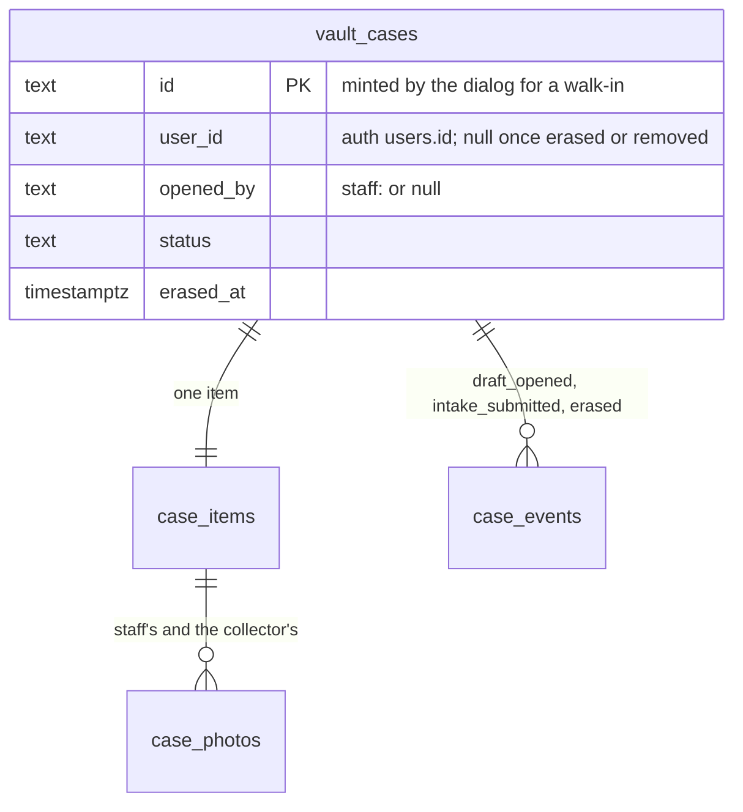

## Context

See [proposal.md](proposal.md#why) for the motivation and
[decisions.md](decisions.md) for what the interview settled. Every path below
is the application repository's unless it says `grade10-spec`.

- **The vault worker** — `packages/vault/backend`, one worker per brand at
  `apps/backend/grade10/vault`, migrations to `0032_case_reference.sql`.
  `cases/intake.ts` `openCase` is the one place a draft is born: it counts
  `openDraftCount` against `MAX_OPEN_DRAFTS = 3`, draws the reference through
  `withCaseReference`, and inserts the case, its item and a `draft_opened`
  event in one transaction, the actor `caseActor("customer", userId)`.
  `submitIntake` refuses `COLLECTION_STATEMENT_REQUIRED` for a version other
  than the one in force and keeps the version on the `intake_submitted`
  event's `details`
- **The statement in production** — `complete-vault-collector-flow` group 26
  is merged: the statement lives in `packages/app-env/src/legalCopy.ts`
  (`legalCopy(brand, "collectionStatement")`, `UNWRITTEN_VERSION`), and
  `submitIntake` gates inline (`cases/intake.ts:248-258`), refusing
  `COLLECTION_STATEMENT_UNWRITTEN` in production while the table holds no
  statement for the brand; outside production the send is accepted and
  records `UNWRITTEN_VERSION`. `pics-v1` is gone. Neither brand has a
  statement yet, so the walk-in is dark in production until Legal's lands
- **Who owns a case** — `vault_cases.user_id` is nullable already: erasure
  nulls it. `erasure/eraseUser.ts` `eraseLocally` is the one purge of a case
  nothing sealed: it deletes `case_photos` rows (the orphan sweep reclaims the
  objects), writes `ERASED_ITEM_TITLE` over the item's title and nulls its
  description, nulls `user_id`, `phone` and `email`, stamps `erased_at` and
  records an `erased` event, all under the case row's lock
- **The endings** — `custody/release.ts` `cancelBeforeCustody` drafts the
  `case_cancelled` letter before it writes, then `cancelCaseBeforeCustody`
  moves the case; `cases.cancel` (the collector) and `admin.cancel`
  (`vault:operate`) both call it. `sweeps/expire.ts` `expireDrafts` drafts
  `case_expired_draft` under the claim, then moves the case through
  `expireDraft`; `DRAFT_TTL_MS` is the **7-day** clock on `updated_at`.
  `notify/vocabulary.ts` `NOTIFY_FOR_EVENT` maps `draft_opened` to `null`
- **Photos** — `routes/uploads.ts` serves `VAULT_PATHS.photoUpload`
  (`PUT /api/cases/:caseId/photos`) to the case's owner only:
  `cases/photos.ts` `attachCasePhoto` → `photoTarget` refuses
  `NOT_CASE_OWNER`, counts the cap under the case lock, strips metadata and
  keys the object by the bytes' SHA-256
- **The console reads** — `admin.list`, `admin.queueCounts`, `admin.search`
  and `admin.detail` in `trpc/routers/admin/queue.ts`, `admin.custodyList` in
  `admin/custody.ts`, all `vault:read`. `cases/wire.ts` `toVaultCase` hands
  no `user_id` to any audience. `packages/vault/contracts/src/permissions.ts`
  `ADMIN_PERMISSIONS` maps each procedure to one grant set, pinned against
  the router both ways, and `ROUTE_PERMISSIONS` does the same for byte
  routes. `elevationRefusal` requires every named permission of one
  principal, so a procedure has one grant set and never answers by grant
- **Auth** — `packages/grade10-auth/backend/src/entrypoint.ts` exposes both
  calls this change needs, unchanged:
  - `createUnverifiedAccount(email)` → `UnverifiedAccountOutcome`:
    `{ outcome: "created" | "unverified", user: { id, email } }`, or
    `{ outcome: "verified" }` with no id. Idempotent: a repeat names the same
    row. It creates the account through better-auth's server `createUser`
    with `name: address.split("@")[0]`, and the store's checkout calls it the
    same way (`services/orders/ownership.ts`)
  - `accountsByUserIds(userIds)` → `AccountIdentity[]`
    (`{ id, email, emailVerified, name }`), absent ids left out, at most
    `ACCOUNTS_LOOKUP_LIMIT = 100` ids a call
  - **Signed in before** is `users.email_verified`: a first magic-link sign-in
    verifies the address, and Google sign-in arrives verified. An account an
    operator made verified without a sign-in also reads as signed in, which
    refuses a walk-in that would have been safe — the safe side
  - The vault binds `AUTH_SERVICE` already (`trpc/context.ts`,
    `authServiceBinding`) and uses it for the erasure port only
- **The console** — `apps/admin/grade10/src/surfaces.ts` holds `SURFACES`;
  `ROUTES` and `SECTION_OF` derive from it, `SECTION_OF` through `isWithin`,
  and a `detail` surface under no section throws at the first import.
  `vault` is `/vault` and `vaultCase` is `/vault/cases/:caseId`, both mounted
  in `src/routes.ts` `routesFor`. The queue's views live in
  `packages/vault/admin-frontend/src/features/custody/cases/presentation/views`:
  `CaseQueuePanel`, `CaseQueueTable`, `CustodyHoldingsPanel`,
  `CaseDetailPanel`
- **The collector SPA** — `packages/vault/frontend/src/features/custody/cases`
  renders the list from `cases.mine` (`repositories/cases.ts`
  `selectOwnCases`) over `vaultCaseSchema`; its words are
  `vault.list.*` in grade10-spec's `packages/i18n/messages/shared/<locale>/vault.json`
- **The roles page** — `packages/grade10-auth/contracts/src/descriptions.ts`
  says `kyc:read` is "Read identity documents held for verification."

## Goals / Non-Goals

**Goals:**

- One function opens every draft, the collector's and the counter's, so the
  cap, the reference and the item facts have one writer
- A draft staff opened is told apart by one stored fact, and every reader that
  treats it differently reads that fact
- The account at a wrong address keeps nothing, through the purge erasure
  already runs rather than a second one
- No collector name is stored in the vault; names are read from auth per page

**Non-Goals:**

- Any change to either auth worker
- A grant that answers differently by role: each read has one grant set
- A collector name on the arrears rows or in the search answer

## Decisions

### The walk-in is `openCase` with a staff actor

[operator-queue](specs/grade10-admin/vault/operator-queue/spec.md) governs what
staff type and what is refused; this is where it lands.

- **One writer** — `openCase` gains `openedBy: { kind: "customer", userId } |
  { kind: "staff", staffId }`. The staff arm writes `opened_by` and the
  `draft_opened` event's actor `caseActor("staff", staffId)`, and keeps the
  statement version in that event's `details` as
  `{ collectionStatementVersion, at: "counter" }`
- **The account** — `admin.openWalkIn` calls `createUnverifiedAccount(email)`
  over a new `accounts` port on the context
  (`{ createUnverifiedAccount, accountsByUserIds }` off `authServiceBinding`),
  before the transaction: an RPC never runs inside one. `verified` refuses
  `ADDRESS_SIGNED_IN` before any vault write; `created` and `unverified`
  name the user id the draft opens under. The case's `email` is the address
  auth answered, folded
- **No name typed** — the account auth creates is named by the address's
  handle already, and an existing account nobody has signed in to is left as
  it is; the vault sends no name
- **Idempotent by the id** — the dialog mints the draft's id, `vc_<uuid>`, when
  it opens, and sends it. `openCase` reads that id first inside its
  transaction: a staff-opened draft with that id by the same operator answers
  itself, any other case under that id refuses `CASE_CONFLICT`, and no row
  inserts. A replay after a lost answer opens no second draft and spends no
  second place under the cap. `createUnverifiedAccount` is idempotent on its
  own side
- **The statement gate** — one function, `requireStatementShown(brand,
  deployEnv, version)`, refuses `COLLECTION_STATEMENT_UNWRITTEN` in
  production while `legalCopy` holds no statement, and
  `COLLECTION_STATEMENT_REQUIRED` for a version not in force; outside
  production an unwritten statement passes as `UNWRITTEN_VERSION`. It is
  extracted from the gate `submitIntake` holds inline today, and both call it;
  the walk-in calls it first, before the account call, so a refused open
  writes nothing anywhere. `admin.collectionStatement` (`vault:operate`)
  answers `legalCopy(brand, "collectionStatement")` so the dialog shows the
  statement before the address field
- **Photos after the open** — the dialog holds the photos staff took, opens
  the draft, then sends each to `PUT /api/admin/cases/:caseId/photos`
  (`VAULT_PATHS.walkInPhotoUpload`, `ROUTE_PERMISSIONS.walkInPhotoUpload =
  ["vault:operate"]`, `elevatedRoute`), and moves to the case once each has
  answered. `attachCasePhoto` takes an uploader instead of a user id; the
  staff arm attaches only to an unsent draft whose `opened_by` is set, and
  staff edit no item and attach to no other case; every other
  rule — the cap of **10**, the types, **20,971,520** bytes, the metadata
  strip, the same bytes attaching once — is the collector's. The body limit of
  a worker rules out sending ten photographs inside the open
- **No number at the counter** — `admin.openWalkIn` takes no `phone` (Q54):
  the customer adds one from their own phone, so a mistyped address exposes
  no contact number
- **A photograph removed** — `DELETE /api/cases/:caseId/photos/:photoId`
  (`VAULT_PATHS.photoRemove`), the case's owner only, on a `draft` only, under
  the case lock: the `case_photos` row is deleted and the orphan sweep
  reclaims the object; a sent case refuses `CASE_CONFLICT` (Q53). The
  wizard's photograph step offers it on every own unsent draft
- Alternatives rejected: a second intake function for the counter, a second
  owner of the cap; a typed name set on the account (Q22); an idempotency
  column, when the id the dialog mints already carries the key

### One column says a draft was opened at the counter

- `vault_cases.opened_by` holds the staff actor id that opened the case, null
  for a collector's own. The `draft_opened` event holds the same actor as
  history; the column is the case's fact every list, sweep and cancel filters
  on, as `submitted_at` sits beside `intake_submitted`
- **Read by** — the list's line (`openedAtCounter` on the customer wire, never
  the staff id), the silent endings, the purge, and the staff photo route
- Alternative rejected: reading the first event's actor at each read, a join
  on every list and on the sweep's claim

### A draft staff opened ends silently, and the account keeps nothing

[case-lifecycle](specs/grade10-site/vault/case-lifecycle/spec.md) and
[collector-notifications](specs/grade10-site/vault/collector-notifications/spec.md)
govern the outcome; this is where it lands.

- **Silence** — one predicate, `staffOpenedDraft(row)`: `opened_by` is set and
  the case is ending from `draft`. A collector's edit touches `updated_at`, so
  it restarts the 7-day clock (Q30). `expireDrafts` drafts no letter for it and
  `cancelBeforeCustody` takes a null letter for it, so `postLetter` posts
  nothing. `NOTIFY_FOR_EVENT` stays per event; the silence is the act naming
  no letter, the way the three expiry sweeps name theirs
- **Removal** — the unsigned purge in `eraseLocally` is lifted into
  `purgeUnsignedCase(tx, vaultCase, at, cause)` in `erasure/`, and both the
  erasure and the walk-in's ending call it. When staff cancel a draft staff
  opened, or `expireDrafts` ends one, the move and the purge commit in one
  transaction under the case lock: photo rows deleted, the item's title
  `ERASED_ITEM_TITLE` and its description null, `user_id`, `phone` and
  `email` null, `erased_at` stamped, an `erased` event with
  `{ retention: "purged", cause: "walk_in" }`. `purgeUnsignedCase` keeps the
  erasure's rewrite of the collector's own actor ids in the case's history and
  photograph-read trail, run before `user_id` is nulled, since a later
  erasure of the account finds a case only through `user_id`. The removal
  runs whoever has signed in to the account since (Q31). Staff's Closed view
  still lists the case under its reference, its item reading as erased and no
  collector named (Q29). Nothing of it is listed,
  served or counted for the account afterwards, because every account read
  keys on `user_id`. The account itself stays in auth, untouched
- **The collector's own cancel** — `cases.cancel` on a draft staff opened ends
  it as `cancelled`, silently, and purges nothing: the collector signed in, so
  the case is theirs and stays on their list
- **A send under the cancel** — `admin.cancel` carries the status the page
  read, as every guarded move refuses a case that moved under its caller, so
  a draft the collector sent meanwhile refuses `CASE_CONFLICT` rather than
  ending as a submitted case
- Alternatives rejected: deleting the case row, which frees its reference for
  a redraw and orphans its chain rows; a filter on every account read that
  hides such a case, which each new read would have to remember; a purge of
  its own, a second destructive path

### Collector names are read from auth per page, under the identity grant

- **Ids on the wire** — the queue and staff audiences of `toVaultCase`, and
  `custodyHoldingSchema`, gain `collectorId: string | null` under
  `vault:read`: an opaque id, null on an erased or removed case. The customer
  audience carries none
- **Names** — `admin.collectorNames` (`kyc:read`) takes `{ caseIds }`, at most
  **200**, the queue's largest page. It reads `user_id` for those cases,
  dedupes, calls `accountsByUserIds` in chunks of `ACCOUNTS_LOOKUP_LIMIT`, and
  answers `{ [caseId]: { collectorId, name } }`; a case whose account auth
  does not answer is absent. By case ids, so the read answers only for people
  the vault holds a case for, never as a directory. Recorded (Q38, Q55): its
  meta declares `auditDetails: (_input, answer) => ({ collectorIds })`, the
  ids alone, never a name
- **The console** — `CaseQueueTable` and `CustodyHoldingsPanel` call it once per
  page when the operator holds `kyc:read`, the gate read from
  `ADMIN_PERMISSIONS`; without it there is no column. A missing name, or a
  failed call, reads the short id — the account id's first **8** characters —
  and "name unavailable", and the rows stand
- **The roles page** — `descriptions.ts` rewords `kyc:read` to "Read identity
  documents and collector names and email addresses."
- Alternatives rejected: a name copied into the vault (Q4); `lookupUsers`, the
  directory's read under `user:list` (Q4); one read whose answer varies by
  grant, which the ladder does not express

### The collector filter is an input on the reads that exist

- `admin.list`, `admin.queueCounts` and `admin.custodyList` take an optional
  `collectorId`, one more `WHERE user_id = $1` beside the filter in force, so
  every cut's count, the Today cut, the held rows and the held figures narrow
  together. `idx_vault_cases_user_id_status` serves it
- **The address** — `?collector=<user id>` on `/vault` and on the Held items
  tab, written by the name's click and cleared by the filter's own control;
  `useVaultAddresses` reads it. Nothing types it
- **Not narrowed** — `admin.search` and the Overdue view, which is the money
  book's; neither names a collector (Q39)
- **Recorded when narrowed** — a narrowed `admin.list`, `admin.queueCounts` or
  `admin.custodyList` writes one chain row naming the collector id, subject
  `vault_collector`; an unnarrowed read writes none. The ladder in
  `packages/worker/src/trpc.ts` records only when a procedure declares
  `auditDetails`, fixed per procedure, so it gains `auditWhen(input)`, read
  before the procedure runs, that decides whether this read writes a row
- **Any string as the id** — `collectorId` and `userId` take any string up to
  **64** characters, so an unknown or malformed id reads as a collector
  holding no case rather than `VALIDATION` (Q40)

### The collector page is a console detail surface under Vault

- **Route** — `vaultCollector: { address: "/vault/collectors/:userId", kind:
  "detail", e2e: { doSmoke: false, reason: "Needs a seeded collector id." } }`
  in `SURFACES`. `isWithin("vaultCollector", "vault")` holds, so
  `SECTION_OF.vaultCollector` is `vault` and the nav marks Vault while it is
  open. `vaultCollectorAddress(userId)` beside `vaultCaseAddress`;
  `route(ROUTES.vaultCollector, "routes/vault-collector.tsx")` mounted above
  `ROUTES.vault` in `routesFor`
- **Composition** — `pages/vault/CollectorPage.tsx` in `apps/admin/grade10`
  holds the header and the vault cases section, each its own hook and its own
  `Status`; the section's table is a view of
  `packages/vault/admin-frontend`, so the items section `add-item-registry`
  adds sits beside it
- **The header** — `admin.collectorAccount` (`kyc:read`) takes `{ userId }`
  and answers `{ userId, holdsCase, account: { name, email } | null }`. It
  first reads whether the vault holds, or held, a case for that id (`EXISTS`
  on `vault_cases.user_id`, removed and erased cases excluded since their
  `user_id` is null); when none, it answers `holdsCase: false` without
  calling auth (Q52). Otherwise `accountsByUserIds([userId])`, and an account
  auth does not answer reads `account: null`, the short id and "name
  unavailable". It never answers `NOT_FOUND`: "nobody answers to that id"
  comes from `collectorCases.found` alone. A failed auth call is the
  procedure's error, which the header shows with a retry (Q51). Its meta
  declares `auditDetails: () => ({})` and the `vault_collector` subject.
  A treasurer's page makes no header call and reads the short id
- **The narrowed queue** — the header links `/vault?collector=<user id>` for
  every reader of the page (Q42)
- **The cases** — `admin.collectorCases` (`vault:read`) takes
  `{ userId, cursor?, limit? }` and answers `listCases` over every status with
  `collectorId`, newest-touched first, **50** a page, plus `found`: true when
  the page holds a row, otherwise `accountsByUserIds([userId])` decides it.
  Its meta declares `auditDetails: () => ({})` and
  `auditSubject: (input) => ({ type: "vault_collector", id: input.userId })`,
  so each read files who read which collector, with no name or address
- **Reached from** — the name's link on a queue or held row, and **The
  collector's cases** in `CaseDetailPanel`'s header, which reads the case's
  `collectorId` under `vault:read` and is absent when it is null
- Alternative rejected: a Collectors section with a finder (Q26)

## Database Schema

Schema `vault`, one migration, the next free number:
`<n>_case_opened_by.sql`. Additive and nullable, so no `-- contract:` block.

### `vault.vault_cases`

| Change | Definition | Meaning |
| --- | --- | --- |
| `+ opened_by` | `text NULL`, no default | The staff actor id, `staff:<id>`, that opened the draft at the counter; null for a collector's own. Authoritative, never rewritten |
| `user_id` | unchanged, `text NULL` | Nulled by the walk-in's purge as by erasure |

### Facts that reuse a row or a stamp

| Fact | Where it lives |
| --- | --- |
| The statement version shown at the counter | `case_events` `draft_opened`, `details.collectionStatementVersion` |
| The statement version the collector ticked | `case_events` `intake_submitted`, `details.collectionStatementVersion` |
| A walk-in's removal | `vault_cases.erased_at`, and `case_events` `erased` with `details.cause = "walk_in"` |
| Who opened, who removed | `case_events.actor` and the audit chain's `admin.openWalkIn` and `admin.cancel` rows |
| Each collector page opening | `audit_logs` rows `admin.collectorCases` and `admin.collectorAccount`, subject `vault_collector` |
| Each page of names, each narrowed list | `audit_logs` rows `admin.collectorNames` (`details.collectorIds`) and the narrowed list's own, subject `vault_collector` |
| The collector's name and email | auth's `users`, read per page; never stored here |



Derived, never stored: `openedAtCounter` (`opened_by IS NOT NULL`), the
collector's name, the short id, `found`.

## Service Interfaces

| Function | Input | Answers or refuses | Boundary |
| --- | --- | --- | --- |
| `admin.collectionStatement` | none | `{ version, text \| null }` | pure over `legalCopy` |
| `admin.openWalkIn` | `{ caseId, email, category, title, description?, currency, financingRequestedMinor?, collectionStatement: { version } }` | `{ vaultCase, account: "created" \| "unverified" }`; `VALIDATION`, `COLLECTION_STATEMENT_UNWRITTEN`, `COLLECTION_STATEMENT_REQUIRED`, `ADDRESS_SIGNED_IN`, `DRAFT_LIMIT_REACHED`, `CASE_CONFLICT` | `vault:operate`, `caseProcedure`; `auditDetails` `{ outcome }`, never the address |
| `PUT /api/admin/cases/:caseId/photos` | raw bytes | the photo; `NOT_FOUND`, `CASE_CONFLICT` off a draft or one staff did not open, the collector's photo refusals | `elevatedRoute`, `vault:operate`, one chain row |
| `DELETE /api/cases/:caseId/photos/:photoId` | none | 204; `NOT_CASE_OWNER`, `CASE_CONFLICT` off a draft, `NOT_FOUND` | the case's owner; under the case lock |
| `admin.cancel` | gains the status the page read | the case; `CASE_CONFLICT` once it moved | on a staff-opened draft: no letter; move and purge in one transaction |
| `cases.cancel` | unchanged | the case | on a staff-opened draft: no letter, no purge |
| `expireDrafts` | unchanged | count | on a staff-opened draft: no letter; move and purge under the claim |
| `admin.collectorNames` | `{ caseIds }`, 1 to 200 | `{ names: Record<caseId, { collectorId, name }> }` | `kyc:read`; one select, then `accountsByUserIds` per 100 ids; one chain row naming the collector ids |
| `admin.list`, `admin.queueCounts`, `admin.custodyList` | gain `collectorId?` | rows gain `collectorId` | `vault:read`; one chain row when narrowed, none otherwise |
| `admin.collectorAccount` | `{ userId }` | `{ userId, holdsCase, account: { name, email } \| null }` | `kyc:read`; one select, then at most one auth call; one chain row |
| `admin.collectorCases` | `{ userId, cursor?, limit? }` | `{ found, asOf, rows, nextCursor, hasMore, total }` | `vault:read`; one chain row a read |

### The walk-in's order and atomic boundary

Browser → console tRPC (`admin.openWalkIn`, the operator's session) → the
elevated ladder (`vault:operate`, second factor) → the procedure → auth over
`AUTH_SERVICE` → `openCase` → Postgres.

1. **Decode** the input; refuse `VALIDATION` for another currency, a title past
   **200** characters, a description past **2,000**, or a number the brand's
   plan cannot read — nothing written
2. **The statement** — `requireStatementShown` — nothing written
3. **The account** — `createUnverifiedAccount(email)`; `verified` →
   `ADDRESS_SIGNED_IN`, nothing written in the vault. An account it created
   stays even if a later step refuses; it is a row nobody has signed in to,
   and the retry names the same one
4. **One transaction** — a case with this id: answer it if it is this
   operator's staff-opened draft, else `CASE_CONFLICT`. Otherwise count drafts
   for the user id (`DRAFT_LIMIT_REACHED` at **3**), draw the reference,
   insert `vault_cases` (`status = draft`, `opened_by`), `case_items`, and
   `case_events` `draft_opened`. Nothing is posted: the open names no letter
5. **The chain row** — the ladder appends `admin.openWalkIn` after the
   procedure, filed under the case id

Example. Operator `u_staff1` opens a walk-in for `mei.chan@example.com`, an
address with no account:

```json
{ "caseId": "vc_6f1c2a0e-7d0b-4c5e-9a43-2f1d9e0b7c11",
  "email": "Mei.Chan@example.com", "category": "trading_card",
  "title": "Charizard, Base Set 1999",
  "currency": "HKD", "financingRequestedMinor": 500000,
  "collectionStatement": { "version": "pics-2026-10" } }
```

| Row | Written |
| --- | --- |
| auth `users` | `{ id: "u_9k2", email: "mei.chan@example.com", name: "mei.chan", email_verified: false }` |
| `vault_cases` | `{ id: "vc_6f1c…", reference: "7KQ2MX", user_id: "u_9k2", opened_by: "staff:u_staff1", status: "draft", email: "mei.chan@example.com", phone: null, currency: "HKD", financing_requested_minor: 500000 }` |
| `case_items` | `{ case_id: "vc_6f1c…", category: "trading_card", title: "Charizard, Base Set 1999" }` |
| `case_events` | `{ kind: "draft_opened", actor: "staff:u_staff1", details: { collectionStatementVersion: "pics-2026-10", at: "counter" } }` |
| `audit_logs` | `{ action: "admin.openWalkIn", subject: vault_case vc_6f1c…, details: { outcome: "created" } }` |

Answer: `{ vaultCase: { id: "vc_6f1c…", reference: "7KQ2MX", status: "draft", collectorId: "u_9k2", … }, account: "created" }`.
The same call again answers the same case and writes nothing. The same
address after Mei signs in once answers `ADDRESS_SIGNED_IN`. In production
with no statement in `legalCopy`, any call answers
`COLLECTION_STATEMENT_UNWRITTEN` and auth is never asked.

### The walk-in's removal

Staff cancel `vc_6f1c…` the day it opened, because the address was mistyped:
`admin.cancel` → `cancelBeforeCustody` with a null letter → one transaction:
`cancelCaseBeforeCustody` moves `draft → cancelled` and appends `cancelled`,
then `purgeUnsignedCase` deletes its `case_photos` rows, writes `erased` over
the title, nulls `user_id`, `phone` and `email`, stamps `erased_at` and
appends `erased { retention: "purged", cause: "walk_in" }`. `cases.mine` for
`u_9k2` no longer answers it, `cases.detail` answers `CASE_NOT_FOUND`, and no
`notification_retries` row exists. The orphan sweep reclaims the objects. The
expiry is the same transaction with `expireDraft` as the move and `sweep` as
the actor.

### The collector page's reads

`/vault/collectors/u_9k2`, opened by staff holding `vault:read` and
`kyc:read`: `admin.collectorAccount({ userId: "u_9k2" })` →
`{ holdsCase: true, account: { name: "mei.chan", email: "mei.chan@example.com" } }` and one
`audit_logs` row `{ action: "admin.collectorAccount", subject: vault_collector u_9k2, details: {} }`;
`admin.collectorCases({ userId: "u_9k2" })` →
`{ found: true, rows: [7KQ2MX …], hasMore: false, total: 1 }`, and one
`audit_logs` row `{ action: "admin.collectorCases", subject: vault_collector u_9k2, details: {} }`.
A treasurer's page makes the second call only. `u_nobody` answers
`{ holdsCase: false, account: null }` to the first, with no auth call, and
`{ found: false, rows: [] }` to the second, so the page says nobody answers
to that id.

## API Contracts

| Surface | Change | Consumers that adapt |
| --- | --- | --- |
| `admin.openWalkIn`, `admin.collectionStatement`, `admin.collectorNames`, `admin.collectorAccount`, `admin.collectorCases` | new admin procedures, each in `ADMIN_PERMISSIONS` | the walk-in dialog, the queue and held views, the collector page |
| `VAULT_PATHS.walkInPhotoUpload` | new byte route, in `ROUTE_PERMISSIONS` | the walk-in dialog through `VaultAdminRouteClient` |
| `VAULT_PATHS.photoRemove` | new route, the case's owner | the wizard's photograph step |
| `packages/worker` tRPC ladder | `auditWhen(input)` beside `auditDetails` | the narrowed vault lists |
| `admin.list`, `admin.queueCounts`, `admin.custodyList` | additive `collectorId?` input | the queue and held views |
| `admin.cancel` | the status the page read, in its input | `CaseDetailPanel`'s cancel |
| `vaultCaseSchema` | additive `collectorId` (queue and staff audiences), `openedAtCounter` (every audience) | both SPAs' mappers and fixture transports |
| `custodyHoldingSchema` | additive `collectorId` | `CustodyHoldingsPanel` |
| `VaultFailureCode` | `ADDRESS_SIGNED_IN` | `TRPC_CODES`, the dialog's refusal line |
| `openCase` | `userId` → `openedBy` | `cases.create`, `devSeed.ts`, the vault test suites |
| `attachCasePhoto` | `userId` → `uploader` | `routes/uploads.ts` |
| `@grade10/auth-contracts` `descriptions.ts` | `kyc:read`'s wording | the roles page |
| `apps/admin/grade10` `surfaces.ts` | `vaultCollector`, `vaultCollectorAddress` | `routes.ts`, the queue's links |

## Risks / Trade-offs

- **[A typed address opens a draft under a stranger's untouched account]** →
  nothing is emailed at the open, the draft's endings are silent, and the
  staff cancel or the clock purges it in the move's own transaction
- **[A customer who signed in once is served without proving it is them]** →
  `createUnverifiedAccount` answers `verified` with no id, so the vault never
  learns the account and refuses before it writes
- **[Two clicks open two drafts]** → the dialog's minted id; `openCase` answers
  a replay with the draft it opened
- **[An account is created and the open is then refused]** → only the cap or
  `CASE_CONFLICT` can refuse after the account call, and both mean the account
  already existed; a statement refusal runs before the call
- **[The purge misreads a live case]** → `staffOpenedDraft` is read under the
  case lock, and the purge runs only in the transaction whose move left
  `draft`
- **[Auth is down while the queue loads]** → names are a second call the rows
  never wait on; a failure reads the short id and "name unavailable"
- **[A name read becomes a directory]** → `admin.collectorNames` resolves case
  ids, never user ids, and `admin.collectorAccount` answers only an id the
  vault holds a case for, on `kyc:read`; every read that names a collector is
  on the chain
- **[A mistyped address shows someone else's walk-in]** → the counter takes no
  contact number, so the item's photographs are what whoever holds the
  mistyped address can see, until staff cancel it, which removes it whoever
  has signed in. Residual: they could send it before staff notice; staff's
  cancel of a sent walk-in keeps it, as on any case

## Migration Plan

1. Merge grade10-spec's words (`vault.list.openedAtCounter`) and bump the
   submodule in the pull request carrying the collector SPA's line
2. Apply `<n>_case_opened_by.sql`, then deploy the vault worker, the console
   and the collector SPA from one commit; the column is nullable, so the old
   worker runs against it
3. Rollback: the previous worker first; the column stays, unread. A walk-in
   opened meanwhile is an ordinary draft to the old worker and sends the
   untouched email at expiry, so roll back only before the first production
   walk-in
4. In production the open refuses until Legal's statement is in `legalCopy`;
   that pull request redeploys the vault worker
