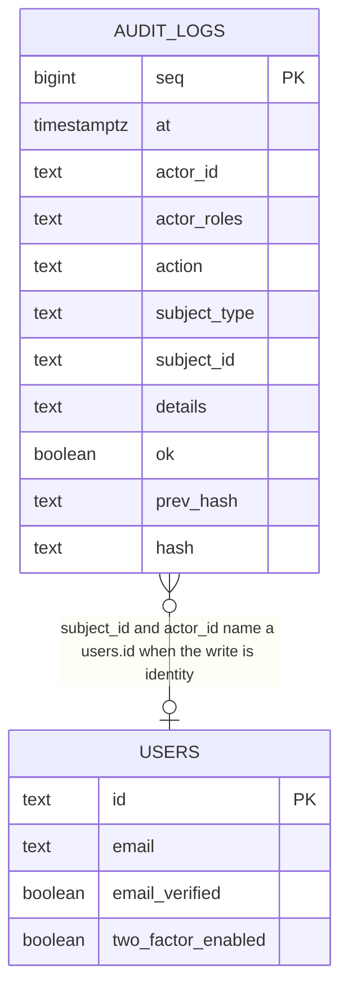

## Context

See [proposal.md](./proposal.md) for why. Requirements live in
[shared/auth/audit](./specs/shared/auth/audit/spec.md) and
[shared/console/audit](./specs/shared/console/audit/spec.md).

Identity trail today: ban / unban / set-role / revoke append **before** the
mutation (`FAIL_CLOSED_PERMISSION` in `createSecurityHooks`). 2FA enable
appends **after** the first verify that flips `twoFactorEnabled`. 2FA disable
appends after the handler. `generate-backup-codes` is step-up gated and not
on the trail. `createUnverifiedAccount` / `ensureVerifiedAccount` call
`auth.api.createUser`, which skips HTTP admin hooks, so checkout-created ids
are silent. `deleteAccount` already appends `auth.account.delete` inside the
same transaction as the tombstone and user delete; the elevated
`users.deleteAccount` after-hook then appends a second row.

List today: `listAuditPage` is `limit` + optional exclusive `before: { at, seq }`,
newest-first, indexed only by `idx_audit_logs_at`. The console merges every
chain the panel names; a silent chain freezes paging. Audit is a surface at
`/audit` with no filter keys in the location. Row: When, Product, Seq,
Actor, Action, Result — no subject, no expand.

Genesis already uses `actorId: "system"`, `actorRoles: ""`.

## Goals / Non-Goals

**Goals:**

- Append identity writes at the functions that mutate (`createUnverifiedAccount`,
  `ensureVerifiedAccount`, regenerate, delete). Fail-closed in the same
  transaction when this repo owns the write. A second factor going live is
  recorded as evidence of the binding, never reversed to satisfy the trail.
- Extend the existing `audit.list` input and `listAuditPage` so every product
  chain filters and sorts the same way. Product filter stays a console choice
  of which chains to call.
- Lift the Audit table into `@grade10/audit-admin-frontend` so both brands
  compose one surface.

**Non-Goals:**

- New columns on `audit_logs`. Email, hashes, or recovery codes on the row or
  the wire.
- A new `@grade10/ui`, design-system, or Astryx export (proposal).
- Mixpanel, Datadog, chain-sweep scheduling, collector sign-in/sign-out
  (proposal non-goals).
- Changing which products the console lists.

## Decisions

### Identity writes land in the account functions, actor `"system"`

[shared/auth/audit](./specs/shared/auth/audit/spec.md) already requires a
trusted-product create/verify on the trail, actor the system, subject the
user id, outcome `created` only when a new `users.id` is minted, and no
append on `already-unverified` / `already-verified`.

- Append inside `createUnverifiedAccount` and `ensureVerifiedAccount`, on the
  auth DB, after the existing find. HTTP admin hooks never see `createUser`.
- Actor `actorId: "system"`, `actorRoles: ""` — the same pair genesis uses.
  Subject `subjectType: "user"`, `subjectId` the new or flipped `users.id`.
  Details for a mint: `{"outcome":"created"}`. No email in details (the
  body-allowlist pattern; these paths pass a closed object, not the request).
- Actions:
  - `auth.account.create-unverified` — `createUnverifiedAccount` mints an id.
  - `auth.account.create-verified` — `ensureVerifiedAccount` mints an id
    (create-then-verify in one request is one row, outcome `created`).
  - `auth.account.verify` — `ensureVerifiedAccount` flips unverified → verified.
- No-op finds return the existing outcome and do not append.
- `signInVerifiedEmail` keeps calling `ensureVerifiedAccount`; the nested
  mint/flip is the only trail row. Session mint stays off the trail.

Rejected:

- Calling-product as actor — the spec names the system; AUTH_SERVICE has no
  operator session.
- Recording the email in details “for the auditor” — `audit:read` must not
  learn an address the directory withholds.
- After-the-fact HTTP hooks around `createUser` — that API does not run them.

### Fail-closed create/verify: one transaction

[shared-auth-audit-SC-27](./specs/shared/auth/audit/spec.md) / `shared-auth-audit-SC-28` require the
account write not to take effect if the trail cannot accept the entry.

Mutation order inside `db.transaction`:

1. Find by canonical email (outside or at the start; unique email is the
   race key).
2. On a miss: `createUser` with the same drizzle handle as the transaction,
   then `appendAuditLog` for the mint.
3. On an unverified row that this call must verify: `UPDATE users SET
   emailVerified = true`, then `appendAuditLog` for `auth.account.verify`.
4. On already-verified / already-unverified with no data change: commit
   nothing, no append.

The pg adapter insert uses that handle (`insert` + `returning`), so an
append throw rolls the mint back with the transaction. Unique-email loser
of a race still reads back the winner and returns the existing outcome
with no append.

Rejected:

- Append-then-mutate (ban style) — there is no `users.id` to name as subject
  until create returns.
- Record a failed create with `ok: false` and leave the user row — that is
  an unrecorded account.
- Compensating `users` delete after `createUser` returns — same crash-unsafe
  reverse as the old enable rollback. If an adapter ever ignores the handle,
  the fail-closed test fails and the fix is the adapter, not a second DELETE.

Worked example — mint (`shared-auth-audit-SC-15`):

| | `users` | `audit_logs` head |
| --- | --- | --- |
| Before | no row for `checkout@example.com` | `seq = 9` |
| Input | `createUnverifiedAccount("Checkout@example.com")` | |
| After (ok) | `{ id: "usr_1", email: "checkout@example.com", emailVerified: false }` | `seq = 10`, `actorId = "system"`, `action = "auth.account.create-unverified"`, `subjectId = "usr_1"`, `details = '{"outcome":"created"}'`, `ok = true` |
| After (append fails) | no new row | still `seq = 9` |

Worked example — verify flip (`shared-auth-audit-SC-19`):

| | `users.emailVerified` | trail |
| --- | --- | --- |
| Before | `usr_1` false | `seq = 10` |
| Input | `ensureVerifiedAccount` for that email | |
| After (ok) | true | `seq = 11`, `action = "auth.account.verify"`, `subjectId = "usr_1"`, `actorId = "system"` |
| After (append fails) | still false | still `seq = 10` |

### Regenerating recovery codes is fail-closed before the handler

[shared-auth-audit-SC-21](./specs/shared/auth/audit/spec.md) / `shared-auth-audit-SC-26` /
`shared-auth-audit-SC-29`. Enrollment start `/two-factor/enable` does not
record enable.

- Add `/two-factor/generate-backup-codes` to the fail-closed-before set.
  Append `auth.two-factor.generate-backup-codes` with actor/subject the
  session user id, then run the handler. Codes are absent from
  `AUDITED_BODY_VALUES`, so they land as withheld names, never values.
- Move `/two-factor/disable` to fail-closed-before, same as ban: an
  unrecorded disable must not remove the factor (`shared-auth-audit-SC-36`).

Rejected:

- After-handler append for regenerate — a thrown append would leave new
  codes live and unrecorded.
- Storing a hash of the codes — the spec forbids keeping them.

### Enable is recorded as evidence of the binding

[shared-auth-audit-SC-22](./specs/shared/auth/audit/spec.md) / `shared-auth-audit-SC-23` /
`shared-auth-audit-SC-35` / `shared-auth-audit-SC-37`. Enable cannot append
before the verify — the flip is inside better-auth, so the after-hook is
the first place that knows the factor is live.

- Append `auth.two-factor.enable` when the account is live and the trail
  has no enable after the last disable (or no enable at all), then stamp
  step-up.
- If that append throws, rethrow; leave `twoFactorEnabled` as the plugin
  committed it (`shared-auth-audit-SC-35`).
- A later successful proof writes the missing row (`shared-auth-audit-SC-37`).

Rejected:

- Compensating reverse of `twoFactorEnabled` when the enable append throws
  — crash-unsafe, incomplete (secrets and stamp stay), and it fights the
  binding the authenticator already holds.

### One deletion row: in-transaction `auth.account.delete`

[shared-auth-audit-SC-25](./specs/shared/auth/audit/spec.md) / `shared-auth-audit-SC-34` are already
met by `deleteAccount`'s transaction. The elevated after-hook then writes
`users.deleteAccount` for the same click.

- Add `skipAudit?: true` on `ProcedureMeta`. `users.deleteAccount` sets it.
  The in-txn `auth.account.delete` stays the fail-closed record.
- Do not remove the elevated ladder; only the duplicate append.

Rejected:

- Keep both rows — one click would show two writes; the auditor cannot tell
  them apart from two deletions.
- Drop the in-txn append and trust the after-hook — a failed after-hook
  would delete the account unrecorded.

### List filters are additive fields on the existing page query

[shared/console/audit](./specs/shared/console/audit/spec.md) requires
combinable filters, time sort, and jump-to-seq. Product is which chain the
console calls, not a column on the row.

Extend `AuditPageQuery` / `auditListInput` / `AuditPagePayload`:

| Field | Meaning |
| --- | --- |
| `limit`, `before` | Unchanged. Exclusive cursor for newest-first paging. |
| `order` | `"newest"` (default) or `"oldest"`. |
| `after` | Exclusive `{ at, seq }` for oldest-first paging. |
| `actorId`, `subjectId`, `action` | Equality. |
| `ok` | Equality on the boolean. |
| `from`, `to` | Inclusive instants. The console converts calendar days with `startOfDay` / `endOfDay` (`@grade10/utils/dates`, UTC). A start day after the end day is not sent. An omitted bound does not constrain. |
| `personId` | `actor_id = X OR subject_id = X`. Not an email. |
| `atSeq` | Inclusive start at that `seq` on this chain (jump). Server reads that row's `(at, seq)` and pages from it. |

Filters AND together. `personId` is the one OR, so one user id matches as
actor or subject in one request.

Rejected:

- Multi-column sort — spec is time only.
- Email as a list parameter — the trail never holds it (`shared-console-audit-SC-06`).
- Client-side filter of a merged unfiltered page — silent other products
  would still freeze paging (`shared-console-audit-SC-09`).

### Console asks only the selected chains; incomplete freeze follows that set

`mergeAuditPages` already freezes when any **requested** chain failed.
Product filter = pass only those chains into `page()`. Unselected chains
are not requested, so they cannot hold paging. With no product filter, every
named chain is requested and today's freeze stays.

Oldest-first: reverse `compareAuditRows` (earlier `at` first; ties chain id
ascending, then `seq` ascending). Per-chain cursors still advance to the
last row of that chain that made the window.

Jump (`shared-console-audit-SC-16`): set product to the broken chain, `atSeq` to
`brokenAtSeq`, `order` newest-first so that row is first. Location holds
those keys.

### Location holds ids, never email

The Audit surface's search string holds: `product`, `action`,
`actor`, `subject`, `ok`, `from`, `to`, `order`, `atSeq`. Default
newest-first omits `order`. There is no email filter and no directory
read from this surface.

Directory link (`shared-console-audit-SC-14`): `/users?user=<id>` (ZZZ: `/?user=<id>`).
Users already searches by id first. Pass `user` into
`UserDirectorySection` as the initial search. Offer `Link` only when the
operator holds `user:list`. Copy uses `IconButton` + clipboard; ids remain
visible without it.

### Readable action names are a closed map in the audit frontend

English, colocated with the trail package (admin is not in `@grade10/i18n`).
Unknown actions render the recorded identity. The recorded `action` stays on
the row (title / expand). No new ui export.

### One shared Audit section in `@grade10/audit-admin-frontend`

Both apps duplicate `AuditSection`. Lift filters, table, expand, copy, and
jump into the package (same shape as `UserDirectorySection`). Each app
passes `canListUsers` and `userHref`. Presentation stays
on `@grade10/frontend-console` (Astryx underneath); no `@grade10/ui` audit
block, and no `@astryxdesign/*` or `@grade10/design-system` import in the
audit admin-frontend.

Rejected:

- Keep two copies — subject column, filters, and jump would drift.
- Reach past the console package to Astryx or the design system — admin
  surfaces compose `@grade10/frontend-console` only (`shared-console-visual-standard-SC-10`).

## Database Schema

No new columns. `audit_logs` already holds actor, subject, action, `ok`,
`at`, `seq`. Spec fields that are another row at query time (directory
email, readable action label) are not stored.

Owning table: `audit_logs` from `createAuditLogsTable` in every product
database that instantiates it (auth, store, vault, loyalty, finance,
auction, appointment, e-kyc — each brand).

Existing: primary key `seq`; `idx_audit_logs_at` on `at`. Append-only
triggers unchanged.

Add (btree, matching existing index naming):

| Name | Columns | Predicate |
| --- | --- | --- |
| `idx_audit_logs_actor_at_seq` | `(actor_id, at, seq)` | — |
| `idx_audit_logs_subject_at_seq` | `(subject_id, at, seq)` | `subject_id IS NOT NULL` |
| `idx_audit_logs_action_at_seq` | `(action, at, seq)` | — |

Date-range-only reads keep using `idx_audit_logs_at`. `personId` is a
bitmap of the actor and subject indexes. Authoritative data remains the
hashed row; indexes are derived access paths.

`-- lock:` on each generated `CREATE INDEX`: a plain build takes a write
lock for the duration; `CONCURRENTLY` cannot run inside the applier
transaction. On a busy chain, build by hand and record the migration
(`neondb/README.md`, “Indexes, once a table is busy”).

`users` lives only on the auth database. Other products' `audit_logs` name
whatever subject that product recorded; this change does not add FKs (the
chain must not join).

## Service Interfaces

### `createUnverifiedAccount` / `ensureVerifiedAccount`

- **Entrypoint:** AUTH_SERVICE (store checkout today). No operator session.
- **Input:** canonical email. **Output:** existing outcome union; errors
  throw.
- **Txn:** one auth-DB transaction covering user insert/update + append.
- **Idempotency:** unique email. Loser of the insert race returns the
  existing outcome, no second append.
- **Faults:** append throw rolls the transaction back and fails the
  request. Directory reads (`accountExists`, `accountByEmail`) stay
  write-free.

### `deleteAccount`

Unchanged processor. Elevated `users.deleteAccount` sets `skipAudit`.

### Regenerating recovery codes

- **Entrypoint:** better-auth `/two-factor/generate-backup-codes` (HTTP).
- **Before:** append, then handler. **Idempotency:** each successful
  regenerate is a new row (codes actually change).
- **Faults:** append throw → handler does not run; codes unchanged.

### `listAuditPage`

- **Entrypoint:** `audit.list` on every worker that already mounts it
  (`audit:read`).
- **Input / output:** extended query above; rows still omit hashes.
- **Reads only.** No lock. Uses the new indexes when the matching filter is
  set.
- **Idempotency:** keyset page; same cursor returns the same window unless
  the chain grew.

Browser → admin SPA → each selected chain's `audit.list` → `listAuditPage`
→ `audit_logs`. Filter people by actor or subject user id on `audit.list`.
The Audit section never calls the directory for an email.

## API contracts

`audit.list` input grows. Additive, optional, authenticated (`audit:read`).
Output row shape unchanged (still no hashes). `audit.verify` unchanged.

`@grade10/audit-contracts` `auditListInput` is the wire schema.
`AuditPagePayload` on `AuditProcedureClient` matches it. Workers pass
`input` through to `listAuditPage`; no per-product list shape.

## Risks / Trade-offs

- **[Risk]** `createUser` commits outside the drizzle transaction → an
  unrecorded account. The pg adapter insert uses the passed handle, so this
  is the fail-closed test failing, not a catch-and-delete. Unique email
  makes a retry land on empty or the winner.
- **[Risk]** Enable append runs after better-auth has already committed
  `twoFactorEnabled`. A worker death between those writes leaves the
  factor live with no enable row until the next successful proof.
  → The after-hook records a missing enable from the trail, not from
  in-memory `wasEnabled`. `audit.append.lost` still fires when the
  append throws. Do not reverse the flag.
- **[Risk]** `CREATE INDEX` locks writes on a live chain. → `-- lock:`
  comment; busy tables built `CONCURRENTLY` by hand.
- **[Risk]** `personId` OR may miss the actor index if the planner only
  uses one side. → Both indexes exist; if a product's chain is small, a
  seq scan on `at` is acceptable. No extra `OR` column.
- **[Trade-off]** Fail-closed-before for disable/regen can record `ok: true`
  if the handler then fails. Prefer a recorded no-op over an unrecorded
  mutation (same as ban).
- **[Trade-off]** Two extra indexes on every product `audit_logs` for a
  filter the auth chain will use most. Shared `createAuditLogsTable` cannot
  special-case auth without a second schema.

## Migration Plan

1. Land indexes (expand). Queries still use `at` + `before` only.
2. Deploy contract + `listAuditPage` filters. Old consoles omit the new
   fields; default newest-first unfiltered page is unchanged.
3. Deploy identity appends and `skipAudit` together on the auth workers
   (both brands). Checkout creates start appearing on the trail the same
   deploy.
4. Deploy the Audit section. Location keys are additive; a bookmark without
   them is newest-first unfiltered, as today.

Rollback: revert the SPA first (filters ignored on the server are
harmless). Revert auth workers to stop new identity appends; existing rows
stay (append-only). Indexes may stay; they do not change hashes. Never
DELETE from `audit_logs`.
