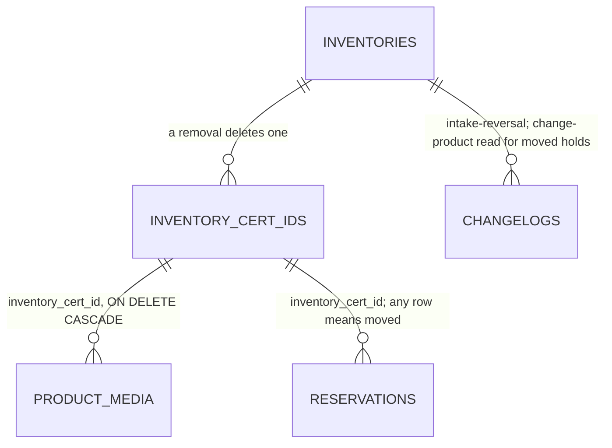

## Context

- **Counters** - `inventory.inventories` stores `stock`, `reserved`, `sold`,
  `withdrawn`, `vaulted` and `unidentified_stock` (regular stock on hand).
  Available and the ledger are derived. Only intake raises the ledger; no path
  lowers it.
- **Cert records** - `inventory.inventory_cert_ids`, one row per record, unique
  on `(inventory_id, cert_id)` across every status. `product_media.inventory_cert_id`
  references the row `ON DELETE CASCADE`, and the `orphanedObjects` sweep
  deletes the stored objects nothing references any more.
- **Remove physical unit** - `removeCertUnit` locks the inventory, then the
  Cert row, refuses a record that is not `available` or has an active hold,
  writes `stock - 1`, `withdrawn + 1`, appends `withdraw` naming the record in
  `before.inventoryCertIds`, and deletes the row. It is offered on every Cert
  record in `CertIdDetailDialog.tsx`, disabled unless Available.
- **Unmoved today** - `correctCertId` and the `unmoved` flag on `products.get`
  read a record as unmoved when it is `available` and no reservation row names
  it (`selectEverHeldInventoryCertIds`).
- **A gap in that test** - `changeReservationProduct` rewrites the reservation
  row's `product_id`, `inventory_id` and `inventory_cert_id` to the new
  product, sets the old record back to `available`, and writes its one
  `change-product` entry under the new inventory. A record whose hold moved to
  another product is then named by no reservation and reads unmoved, though a
  hold named it. The same happens to regular stock: the old product keeps no
  reservation row and no entry of its own.
- **Regular stock moves** - a hold naming no record leaves a reservation row
  (until a product change moves it) and one changelog entry per step of its
  life; a free-pool `sell` or `withdraw` leaves only its changelog entry,
  which names no record.
- **Regular stock history** - the `unit` predicate already reads an entry as
  regular stock when it is an `intake` whose `quantity` exceeds the ids in
  `after.inventoryCertIds`, a `sell` or `withdraw` naming no record, a hold
  action whose reservation names no record, or a `cert-id-change` with no
  `before.certRecord` (an assignment).
- **History** - `ck_changelogs_action` holds twelve actions (migration
  `0006_cert_id_change_action`). The `unit` filter in
  `repositories/changelogs.ts` puts an entry naming no record in the regular
  stock history through its `else` branch.

## Goals / Non-Goals

**Goals:**

- **One unmoved test** - correction, the `unmoved` flag, the reversal and the
  new Remove physical unit guard read the same predicate, so a record never
  reads unmoved to one and moved to another.
- **One reducible count** - `products.get` and the reduction read the same
  function, so the dialog's limit and the server's refusal agree.
- **Counts move once** - each reversal lowers stock and the ledger in the
  transaction that writes its history entry.
- **No state to keep in step** - unmoved is derived from rows that already
  record every move; nothing new is stamped.

**Non-Goals:**

- **No new grant** - both writes sit behind `inventory:write` (Q9).
- **No change to holders** - Auction and Vault calls are unchanged.
- **No second entry for `change-product`** - the old product's history gap is
  a separate fix; this change only reads the entry that exists.

## Decisions

The [catalog delta](specs/grade10-admin/inventory/catalog/spec.md) governs
the reversal, its refusals, its confirmation and its history entry; Q1 to Q19
settle its scope.

### Writes

- **Two procedures, one action** - `inventory.reverseRegularIntake` and
  `inventory.reverseCertIntake` in `trpc/routers/inventory.ts`, each an
  `elevatedProcedure("inventory:write")`, call `reverseRegularIntake` and
  `reverseCertIntake` in `services/inventoryMutations.ts`. Both write
  `intake-reversal` (Q7).
  - Rejected: one procedure keyed on an optional record id. A Cert removal has
    no quantity and a reduction no record, and one schema with optional halves
    accepts a removal carrying a quantity.
  - Rejected: `withdraw` with a flag. The ledger and the withdrawn count would
    disagree with the action's name, and every reader of `withdraw` would need
    the flag (Q1).
  - Rejected: a negative `intake`. History reads it as stock received (Q7).
- **Lock order** - inventory row, then the Cert row on a removal, the order
  `reserve`, `correctCertId` and `removeCertUnit` take. Every guard is read
  after the locks, so a hold committed first is seen and a hold that waits
  follows the reversal.
- **Unmoved Cert record** - one repository function,
  `selectMovedInventoryCertIds(db, inventoryId, ids)`, answers the records
  among `ids` that have moved: any reservation names the id
  (`idx_reservations_inventory_cert_id`), or a `change-product` entry's
  `before.oldInventory.id` is the inventory and its
  `before.reservation.inventoryCertId` is the id. A record is unmoved when it
  is `available` and not in that set. `correctCertId`, `products.get`,
  `reverseCertIntake` and `removeCertUnit` all call it; it replaces
  `selectEverHeldInventoryCertIds`.
  - Rejected: a stored `moved_at` stamp on the Cert row and the inventory. It
    needs a backfill from these same rows, and every future path that holds a
    unit has to remember to set it.
  - Rejected: scanning the record's whole history. The reservation row is the
    first fact of every move; only a product change carries it elsewhere.
- **Reducible regular stock** - `selectRegularStockReducible(db, inventoryId)`
  answers one number, in one statement over the inventory's changelogs (Q2,
  Q12):
  1. **Latest move** - the newest `occurred_at` among the inventory's regular
     stock entries whose action is not `intake`, `cert-id-change` or
     `intake-reversal`; its own `change-product` entries whose
     `after.reservation.inventoryCertId` is null, a hold moved onto its
     regular stock even from a record elsewhere; and `change-product` entries
     written under another inventory whose `before.oldInventory.id` is the
     inventory and `before.reservation.inventoryCertId` is null, a hold of
     its regular stock moved off. Every step of a hold of regular stock
     counts - reserve, adjust, release, sell, vault, product change - and so
     do a free-pool `sell` or `withdraw` naming no record.
  2. **Since then** - over the inventory's regular stock entries after the
     latest move, or all of them where there is none: an `intake` adds
     `quantity − cardinality(after.inventoryCertIds)`, an assignment
     subtracts 1, an `intake-reversal` naming no record subtracts its
     `quantity`. Floored at 0.
  3. **Cap** - the smaller of that sum and available regular stock,
     `unidentified_stock − sumActiveNoCertRemainingByInventoryId`.

  An entry naming a Cert record is never in the regular stock history, so a
  record's moves never touch the count, an assigned record's included (Q13).
  The assignment is subtracted rather than ignored: an assigned unit leaves
  regular stock, and without the subtraction a later reduction could take a
  unit intaken before the move in its place. The first step reads
  `idx_changelogs_inventory_id_occurred_at` and the new partial index; the
  second reads the first index from the latest move on.
  - Rejected: a stored reducible counter on `inventories`. Every path that
    moves regular stock would have to reset it, and a path that forgets
    leaves units reducible that moved.
  - Rejected: judging regular stock as a whole, any move closing reduction
    for good - the first reading of Q2, which Q12 replaced.
  - Rejected: a release or a sale from a hold not counting as a move. It is
    one step more to explain, and "last held" reads plainly as any step of a
    hold; a release after an over-intake closes the reduction, the safe side.
- **Reduce** - writes `stock - n`, `unidentified_stock - n` and `updated_at`.
  `reserved`, `sold`, `withdrawn` and `vaulted` are not written, so the ledger
  falls by `n`. `n` is a whole number from 1 to the reducible count, with no
  500 ceiling (Q8): `isValidQuantity` is not used.
- **Remove a Cert record** - writes `stock - 1` and `updated_at`;
  `unidentified_stock` is untouched. Then the changelog, then
  `deleteInventoryCertId`, whose cascade deletes the tagged media rows in the
  same transaction. Untagged media and other records' media have no reference
  to the row. The Cert ID is free once the row is gone (Q6).
- **Remove physical unit narrows** - `removeCertUnit` refuses an unmoved
  record with `inventory-cert-id-unavailable`, after the locks, using the same
  predicate (Q3).
- **Remarks** - required on both: trimmed, 1 to `MAX_REASON_LENGTH`
  characters, the `reason` schema withdraw uses. The server never defaults
  them; `Entered by mistake` is the dialog's prefill (Q4).
- **History entry** - `changedEntity inventory`, `actorKind operator`,
  `reservationId null`, `reason` the remarks.

  | Reversal | `quantity` | `before` | `after` |
  | --- | --- | --- | --- |
  | Regular stock | `n` | inventory | inventory |
  | Cert record | 1 | inventory, `inventoryCertIds: [id]`, `certRecord` | inventory, `inventoryCertIds: [id]` |

  The Cert removal names the record by id, so the existing `unit` predicate
  keeps it out of the regular stock history; a reduction names none, so its
  `else` branch puts it in.
- **Audit** - a removal's subject is `inventory-cert-unit` with the record id,
  as on Remove physical unit; a reduction's is the product.
- **Refusals** - two new failure codes: `UNIT_MOVED` (`unit-moved`), for a
  removal of a record that has moved, or a reduction within available regular
  stock but above the reducible count, so the dialog says why; and `INVALID_REASON` (`invalid-reason`) for blank remarks, which the
  `reason` input schema already refuses at the procedure and the service
  checks again. Every other refusal reuses a code that exists.

  | Refused when | Code |
  | --- | --- |
  | Remarks blank after trimming | `invalid-reason` |
  | `n` not a whole number from 1 | `invalid-quantity` |
  | Product missing | `unknown-product` |
  | Record missing, or another product's | `unknown-inventory-cert-id`, `inventory-cert-id-product-mismatch` |
  | Record not `available` | `inventory-cert-id-unavailable` |
  | Record has moved | `unit-moved` |
  | `n` above available regular stock | `insufficient-available` |
  | `n` within available regular stock, above the reducible count | `unit-moved` |

### Reads

- **Reducible count** - `products.get`'s `regularStock` gains
  `reducible: number`, from `selectRegularStockReducible`. `certIds[].unmoved`
  keeps its name and reads the widened predicate.
- **Shown to the admin** - the reduction's confirmation states the reducible
  count as the most units that can be reduced. It can sit below the row's
  Available count, and an empty field whose Confirm stays unavailable at an
  unstated limit gives the admin no way to find it. The tooltip stays the same
  on every product (Q14).
- **The read never authorises** - the server re-checks both under the lock.

### Dialog

- **Actions** - with `mayWrite`, in `CertIdDetailDialog.tsx`:

  | Selected row | Offers |
  | --- | --- |
  | Cert record, `unmoved` | Change Cert ID, `Remove` |
  | Cert record, Available, moved | `Remove physical unit` |
  | Cert record, any other status | Nothing |
  | Available `No Cert ID`, `regularStock.reducible` ≥ 1 | Assign Cert ID, `Reduce quantity` |
  | Available `No Cert ID`, `reducible` 0, reading ≥ 1 | Assign Cert ID, and the line that its units were intaken before regular stock last moved |
  | A hold's `No Cert ID` row, or Available 0 | Nothing, and today's line |

- **Tooltip** - `Reduce quantity` and `Remove` each carry a `Tooltip` on
  hover saying it takes out units intaken by mistake as if never received,
  and that withdrawn does not move (Q14). The words are i18n keys in the
  admin's `inventory` namespace.

- **Confirmation** - either action opens a `FormDialog`, `destructive`, with
  `Remarks` prefilled `Entered by mistake`. On a Cert record it names the Cert
  ID and says stock and the ledger fall by 1 and its tagged media are
  deleted. On the `No Cert ID` row it holds `Quantity`, empty when it opens
  (Q15), states `regularStock.reducible` as the most that can be entered, and
  says stock and the ledger fall by the number entered. Confirm is disabled
  while the remarks are blank or the quantity is empty or not a whole number
  from 1 to `regularStock.reducible`. Cancel closes it and sends nothing.
- **The old reason field goes** - Remove physical unit keeps its own
  confirmation, which now holds its reason, instead of a field under the row
  (Q19).
- **After a write** - the product, its changelogs and its media are
  invalidated, so the rows, counts and history read again.
- **Product history** - `changelogActionLabel` renders `intake-reversal` as
  `Intake reversal · No Cert ID`, and `Intake reversal · <Cert ID>` when
  `before.certRecord` is present (Q16).

## Database Schema

No table or column is added.

| Table | Change |
| --- | --- |
| `inventory.changelogs` | `ck_changelogs_action` gains `intake-reversal`; partial expression index `idx_changelogs_change_product_old_inventory` on `((before -> 'oldInventory' ->> 'id'))` `WHERE action = 'change-product'` |
| `inventory.inventories` | `stock` and `unidentified_stock` lowered by a reduction; `stock` by a removal |
| `inventory.inventory_cert_ids` | A removal deletes the row |
| `inventory.product_media` | Rows tagged to a removed record are deleted by the existing cascade |

- **Migration** - one hand-written migration: drop `ck_changelogs_action` and
  add it again `NOT VALID` with thirteen actions; then the partial index,
  `-- lock:` noting that a plain `CREATE INDEX` blocks writes to `changelogs`
  for one scan, built by hand `CONCURRENTLY` on production and recorded, as
  `docs/conventions/backend.md` sets out. Its `meta/` snapshot is carried
  forward.
- **Authoritative** - reservation rows and history entries for whether a unit
  moved; `unidentified_stock` for regular stock on hand. Unmoved is derived on
  read and under the lock, never stored.



## Service Interfaces

**Reduce** - `reverseRegularIntake(db, clock, input)`, one transaction.

| Input | Type |
| --- | --- |
| `productId` | id |
| `quantity` | whole number ≥ 1 |
| `remarks` | string, trimmed, required |
| `actorId` | the staff id from the session |

1. Blank remarks refuse `invalid-reason`; a quantity below 1 or not whole
   refuses `invalid-quantity`.
2. Lock the inventory by product; none refuses `unknown-product`.
3. `unidentified_stock − sumActiveNoCertRemainingByInventoryId < quantity`,
   or available below it, refuses `insufficient-available`.
4. `selectRegularStockReducible < quantity` refuses `unit-moved`.
5. Write `stock − quantity` and `unidentified_stock − quantity`; insert the
   changelog.

Success answers `{ inventory }`. A refusal writes nothing.

Example: product `prd_a` intook 5 units of regular stock and Cert record
`PSA-1`; nothing has moved, so the reducible count is 5.

```json
{ "productId": "prd_a", "quantity": 2, "remarks": "Entered by mistake" }
```

| Row | Before | After |
| --- | --- | --- |
| `inventories` | stock 6, `unidentified_stock` 5, withdrawn 0, ledger 6 | stock 4, `unidentified_stock` 3, withdrawn 0, ledger 4 |
| `changelogs` | - | `intake-reversal`, quantity 2, reason `Entered by mistake`, no `inventoryCertIds` |

**Remove** - `reverseCertIntake(db, clock, input)`, one transaction.

| Input | Type |
| --- | --- |
| `productId`, `inventoryCertId` | id |
| `remarks` | string, trimmed, required |
| `actorId` | the staff id from the session |

1. Blank remarks refuse `invalid-reason`.
2. Lock the inventory by product; none refuses `unknown-product`.
3. Lock the Cert row; none refuses `unknown-inventory-cert-id`; another
   inventory's refuses `inventory-cert-id-product-mismatch`.
4. `status` not `available` refuses `inventory-cert-id-unavailable`; in
   `selectMovedInventoryCertIds` refuses `unit-moved`.
5. Write `stock − 1`; insert the changelog; delete the Cert row, its tagged
   media rows going with it.

Example: record `icert_7` reads `PSA-1234`, is available on `prd_a` with one
image tagged to it, and nothing has named it.

```json
{
  "productId": "prd_a",
  "inventoryCertId": "icert_7",
  "remarks": "Card never arrived"
}
```

| Row | Before | After |
| --- | --- | --- |
| `inventories` | stock 6, withdrawn 0, ledger 6 | stock 5, withdrawn 0, ledger 5 |
| `inventory_cert_ids` `icert_7` | `PSA-1234`, `available` | deleted |
| `product_media` tagged `icert_7` | 1 row | deleted |
| `changelogs` | - | `intake-reversal`, quantity 1, reason `Card never arrived`, `before.certRecord.certId PSA-1234`, `inventoryCertIds [icert_7]` both sides |

A later intake of `PSA-1234` on `prd_a` inserts a new row.

**Remove physical unit** - `removeCertUnit` gains one guard after step 4 of
its own order: a record not in `selectMovedInventoryCertIds` refuses
`inventory-cert-id-unavailable`.

| Boundary | Owns |
| --- | --- |
| tRPC procedure | the grant, the input schema, the session's staff id, the refusal's HTTP code |
| Service | the transaction, the locks, the guards, the mutation order |
| Repository | one statement each: the two moved predicates, the counter update, the row delete |

## API Contracts

| Surface | Change |
| --- | --- |
| `inventory.reverseRegularIntake` | New mutation; `inventory:write`; input `{ productId, quantity, remarks }`; refusals from Reduce, `unit-moved` when `quantity` is above the reducible count |
| `inventory.reverseCertIntake` | New mutation; `inventory:write`; input `{ productId, inventoryCertId, remarks }`; refusals from Remove |
| `inventory.removeCertUnit` | Refuses an unmoved record; **breaking** for a caller that removed one |
| `products.get` | `regularStock` gains `reducible`; `certIds[].unmoved` reads the widened test |
| `CHANGELOG_ACTIONS` | Gains `intake-reversal` |
| `INVENTORY_FAILURE_CODES` | Gains `UNIT_MOVED` and `INVALID_REASON` |

## Risks / Trade-offs

- [A hold is taken while the admin confirms] → both writes lock the inventory
  row before reading the guard, the lock `reserve` takes first; whichever
  commits second reads the other's result. `concurrent.test.ts` runs a reserve
  against a removal and against a reduction.
- [Two reductions take the last units] → the guard reads
  `unidentified_stock` under the lock, so the second sees what the first left.
- [A hold moved to another product before this ships] → the moved predicate
  and the reducible count read the `change-product` entries already stored, so a record or regular
  stock moved that way reads moved from the first deploy.
- [An old `withdraw` from Remove physical unit with no `inventoryCertIds`]
  → it reads as a regular stock withdrawal and starts the reducible count
  again from 0, the safe side.
- [A release or a sale from a hold lands after an over-intake] → it is a move,
  so the over-intake can no longer be reduced; the admin withdraws the units
  with remarks, as today.
- [A long history] → the count reads the inventory's entries from the latest
  move on through `idx_changelogs_inventory_id_occurred_at`; a product that
  never moved reads its whole history, which only intakes and assignments
  make long.
- [A record whose status was set without a hold, by an import or a fixture]
  → `status` must be `available` too; a dev fixture reset that deletes
  reservations reads a record unmoved again, in local and staging data only.
- [A worker writes `intake-reversal` before the migration] → the check refuses
  the insert, the transaction rolls back and the procedure fails loudly; the
  migration ships first.
- [Removed media objects] → the row cascade removes the reference in the
  transaction; the `orphanedObjects` sweep deletes the stored object, as on
  Remove physical unit.

## Migration Plan

1. Apply the migration to every environment: the widened check, and the
   partial index built `CONCURRENTLY` by hand on production.
2. Deploy Inventory with the two procedures, the narrowed `removeCertUnit`,
   the widened unmoved test and the contract.
3. Deploy the admin app.

Rollback: step 1 widens a check and adds an index the previous code ignores.
Rolling back step 2 restores Remove physical unit on unmoved records; the
admin app reads `regularStock.reducible` as absent and offers no reduction, so
steps 2 and 3 roll back independently.
