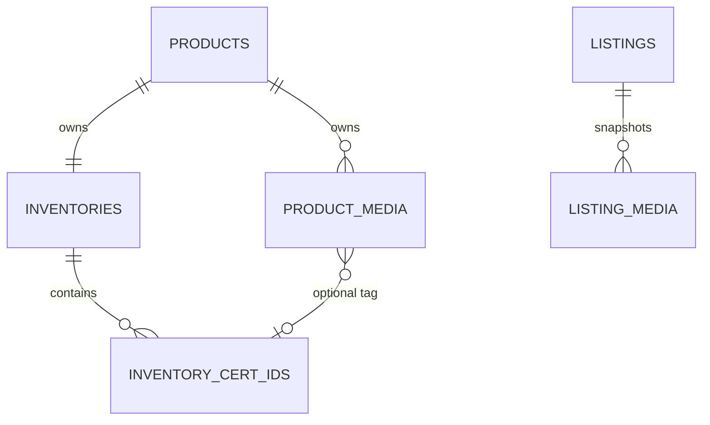

## Context

- **Inventory source** - `inventory.inventory_cert_ids.id` is the opaque, immutable unit record id. `cert_id` is nullable display data. A Cert record reaches its product through `inventory_id` and `inventory.inventories.product_id`.
- **Media source** - Inventory owns `inventory.product_media`, with one row per product media item, product-scoped order, metadata, and an object-store key. The implementation reference is [PR #587](https://github.com/9gag/grade10/pull/587).
- **Listing snapshot** - Auction owns `auction.auction_listing_media`. Its rows and object-store area are separate from Inventory source media. `auction.auction_listings.inventory_cert_id` already stores the selected unit record id; null is the explicit No Cert ID path.
- **Pending requirements** - The change records `awaiting: specs` for QA's inventory and listing readings. This design follows the settled decisions and journeys; tasks wait for those requirement scenarios.
- **Implementation owner and consumers** - The `grade10` application repository owns implementation. Consumers are the Grade10 Admin Inventory media editor and Auction listing editor. No site or ZZZ app changes are expected.

## Goals / Non-Goals

**Goals:**

- **Persist one source classification** - Store zero or one Inventory Cert record id on each Inventory source-media row, with the same-product rule enforced by Inventory.
- **Keep source selection authoritative** - Inventory returns default and other-Cert groups for the selected listing unit and validates the same classification again when Auction copies selected bytes.
- **Keep listing history local** - Reuse Auction's listing-owned gallery rows and object store for selected source bytes and copied alt text.

**Non-Goals:**

- **No live media link** - Listings do not retain a source-media foreign key or resolve current Inventory bytes after selection.
- **Guard unit removal** - Cert selection, holds, sale, direct uploads, gallery cap, and ordering rules remain on their current paths. The new physical-unit removal path uses the existing withdrawn accounting and refuses active reservations.
- **No shared UI contract** - The Inventory controls and Other Cert drawer remain application-owned composition.

## Decisions

The [Inventory catalog spec](../../specs/grade10-admin/inventory/catalog/spec.md) owns product and Cert-record identity, and the [Auction listing spec](../../specs/grade10-admin/auction/listing/spec.md) owns the listing's explicit inventory-unit choice and listing gallery. The pending deltas add the media behavior to those capabilities; this design places its enforcement in the services that own each side of the boundary.

- **Tag on the existing media row** - Add nullable `inventory_cert_id` to `inventory.product_media`. The stored value is `inventory_cert_ids.id`, never the printed `cert_id`. A single nullable column represents product-level media and the zero-or-one Cert assignment without a join table.
- **Validate ownership in Inventory** - For a non-null tag, Inventory resolves the target Cert record through `inventory.inventories` and requires its `product_id` to equal the media row's `product_id`. It locks the media row and target Cert record in one transaction. An untagged source item may be tagged to the target; the same assignment is idempotent. Changing an existing Cert tag first clears it and leaves the item untagged; a later explicit tag write may assign it to another record. Missing records, product mismatch, and missing media return a refusal without a write.
- **Withdraw then cascade source rows** - Add a guarded Cert-unit removal operation owned by Inventory. In one transaction, lock the owning inventory and Cert row, require `available` status with no active reservation, decrement stock, increment withdrawn, preserve the inventory ledger, append the removal history, and delete the Cert row. A database `ON DELETE CASCADE` deletes only source-media rows tagged to that Cert. Untagged product media, other Certs, and already-materialized Auction listing snapshots remain unchanged.
- **Keep printed Cert ID derived** - Do not copy printed `cert_id` into media. Inventory joins the Cert record for the Other Cert group label and returns both the record id and nullable printed id, so identity does not depend on display data.
- **Filter in Inventory, not the browser** - Extend the existing Auction inventory boundary's product-media listing call with `selectedInventoryCertId: string | null`. Inventory validates a non-null selection belongs to the product, then returns `defaultAssets` for null-tagged rows plus the selected Cert's rows, and `otherCertGroups` for every other tagged record. Null selection returns only null-tagged rows in `defaultAssets`. The metadata response omits object keys and bytes.
- **Make Other Cert selection explicit end to end** - Extend the mixed gallery order item for a product source with optional `otherCertRecordId`. Omission means the default-source path. Presence means an explicit drawer selection and must match the source row's current Cert record id; it must differ from the listing's selected record id. Inventory rechecks this against current database state before returning bytes. The request and response use opaque record ids for identity; the printed Cert ID is display context only.
- **Reuse snapshot materialization** - Auction's existing `snapshotListingMedia` flow asks Inventory for the selected source bytes, current alt, content type, dimensions, and tag metadata. It writes each selected byte stream into Auction's existing listing-media object-store area and replaces listing rows in the requested order in one Auction transaction. The persisted rows contain listing-owned keys and copied alt text only; later source edits, tag changes, deletion, or reordering cannot affect them. Existing direct listing uploads still produce ordinary listing rows.
- **Reject a live source association** - A listing-to-product-media reference would allow source deletion, retagging, alt edits, or byte replacement to change an existing listing. A second media-tag table would allow multiple Cert assignments and add lifecycle coordination. Both alternatives conflict with the decided snapshot and one-Cert model.
- **Reuse current authority and audit paths** - Inventory tag writes use the existing `inventory:write` elevated route and audit middleware. Auction picker reads and listing saves use the existing listing-edit authority on the authenticated Auction boundary; Auction calls Inventory through its existing service binding. Audit details include product id, source-media id, and old/new record ids, never bytes or object-store keys. No permission is added.
- **Keep work in the application repository** - Change Inventory schema, migration, repositories, services, service contracts, and Admin editor in `grade10`; extend Auction's Inventory proxy, listing snapshot service/API, and editor there. `grade10-spec` owns only this design and its linked durable deltas.

## Database Schema

| Table | Change | PostgreSQL shape | Rules |
| --- | --- | --- | --- |
| `inventory.product_media` | Add `inventory_cert_id` | `text NULL`, no default | Omitted or null means product-level media. Non-null stores `inventory.inventory_cert_ids.id`. |
| `inventory.product_media` | Add foreign key | `FOREIGN KEY (inventory_cert_id) REFERENCES inventory.inventory_cert_ids(id) ON DELETE CASCADE` | Physical Cert-unit removal deletes only source-media rows currently tagged to that record. |
| `inventory.product_media` | Add index | B-tree on `inventory_cert_id` | Supports Cert-group lookups and scoped-media deletion. Existing unique `(product_id, position)` remains the product listing/order index; each product's source gallery is already bounded. |

No Cert id, selected unit id, or source-media id is added to `auction.auction_listing_media`. Its existing object key, bytes, alt, dimensions, and position remain the snapshot. Printed `cert_id` stays authoritative on `inventory_cert_ids` and is joined only for operator display.

`PRODUCT_MEDIA.product_id` and the tagged Cert's resolved product must match. That cross-table rule is checked in the Inventory service transaction; the normalized Cert table has no duplicated `product_id` column.

## Service Interfaces

- **Inventory tag write** - `setProductMediaCert({ productId, mediaId, inventoryCertId: string | null })` returns `{ success: true, data: { id, productId, inventoryCertId, updatedAt } }` or `{ success: false, errorCode }`. The router owns actor authentication, `inventory:write` authorization, input validation, and audit. The service owns one transaction. For a non-null target it verifies and locks the Cert row through its Inventory row before updating media. Assigning the same current record is idempotent. A different current tag is cleared as a separate operation; the returned media is untagged, and another explicit write is required to assign the new record. Failure codes distinguish missing product/media, missing Cert, product mismatch, and non-editable product. No object-store call occurs.
- **Cert-unit removal** - Add `removeCertUnit({ productId, inventoryCertId })` behind existing `inventory:write` authorization and audit middleware. The service locks the inventory and Cert record, checks `available` status and absence of active reservations in that transaction, applies stock `-1` and withdrawn `+1`, writes the existing append-only history, then deletes the Cert row. The FK cascades the tagged `product_media` rows atomically. A failed guard leaves counters, history, the Cert row, and media unchanged. Repeating removal follows the existing not-found behavior.
- **Auction source metadata** - `listAuctionProductMedia({ productId, selectedInventoryCertId })` returns `{ success: true, data: { defaultAssets, otherCertGroups } }` or a fixed refusal for unknown product or wrong-product selected Cert. Each asset contains id, position, content type, current alt, dimensions, and nullable `inventoryCertId`; a Cert group contains its opaque record id, nullable printed `certId`, and assets. Inventory reads media by product in position order and joins only tagged Cert rows for the groups. It returns no object key or bytes.
- **Auction source bytes** - `readAuctionProductMedia({ productId, selectedInventoryCertId, selections })` returns `{ success: true, data: { assets } }` or `{ success: false, errorCode }`. Each selection is `{ mediaId, otherCertRecordId? }`. Inventory requires distinct ids, scopes every row to the supplied product, and rechecks the current tag. Without `otherCertRecordId`, only product-level or selected-Cert rows pass. With it, the value must be the row's current tag and a different record from the listing's selected Cert. Missing, moved, or cross-product media uses the source-media refusal shape rather than returning partial bytes. The result preserves request order and includes the current alt and bytes for the snapshot.
- **Auction gallery save** - The authenticated Auction save entrypoint passes the persisted listing's current product and `inventoryCertId` plus its complete ordered media selection to `snapshotListingMedia`. The service locks the listing, checks editability and the existing one-to-eight cap, validates listing-owned ids, and fetches every product source through Inventory before replacing gallery rows. It copies source bytes to Auction storage using the existing content-addressed key path, then deletes and inserts the complete row order in one Auction database transaction. If a source is invalid, existing gallery rows are untouched. If object storage succeeds and the row transaction fails, the normal unreferenced-object sweep reclaims the orphaned content-addressed object.
- **Transaction boundary** - Inventory tag assignment and Cert-unit removal are atomic within Inventory. Listing gallery row replacement is atomic within Auction. Deleting source-media rows does not synchronously delete content-addressed objects: another row may still reference the same key. Add Inventory's `productAssets` orphan sweep, which checks all remaining `product_media` references and deletes only aged unreferenced objects. Auction object-store writes remain outside PostgreSQL atomicity and use its existing orphan sweep. Do not pass a source key to Auction as a substitute for copying bytes.

## API Contracts

- **Inventory Admin media mutation** - Add the Cert-record tag field to the existing Inventory product-media management contract, with null accepted to untag and an opaque Inventory Cert record id accepted to tag or retag.
- **Auction inventory media query** - Extend the existing `listProductMedia` input with the listing's selected `inventoryCertId`, including explicit null for No Cert ID, and return separate `defaultAssets` and `otherCertGroups` metadata.
- **Auction listing save** - Extend the product-source item in the existing mixed media-order input with `otherCertRecordId` for an explicit Other Cert drawer choice. Existing listing-media ids, direct uploads, order, and gallery size remain compatible. The Auction-to-Inventory contract adds selected-unit-aware listing and byte reads; it does not expose Inventory storage credentials or keys to the browser.

## Risks / Trade-offs

- **A forged client can request another Cert's media** -> Inventory revalidates the source tag and the explicit source record id at byte-read time; the picker display alone is not authorization.
- **A tag can race Cert-unit removal** -> Tag writes lock the target Cert row; removal takes the same row lock and deletes the Cert plus tagged rows inside one transaction, with the foreign key enforcing cleanup.
- **A Cert has no printed id** -> Group identity always uses the opaque record id and the response preserves nullable printed id; the editor must not merge two records just because their display values are both absent.
- **Source changes during selection** -> The save-time Inventory read resolves current metadata and bytes and rejects stale tag selections. The listing stores the returned version as its snapshot.
- **Deploy skew can expose tagged media in an old selector** -> Deploy the Auction filtering and save validation before enabling Inventory tag writes; do not roll back to a selector that lists all source rows while tags exist.
- **Object writes cannot roll back with rows** -> Keep content-addressed writes and the existing Auction orphan sweep. Inventory's product-media object cleanup must use reference checks and its age threshold; never delete an object inline with a media-row cascade because other media rows may share the same content key.
- **An alternative index adds write cost** -> The single tag index serves FK cleanup and Cert-group reads; the existing per-product gallery cap and position index keep the default source query bounded.

## Migration Plan

1. Add the nullable `inventory_cert_id` column, foreign key, and index with the Inventory migration. Existing rows remain null and therefore keep product-level meaning.
2. Deploy Inventory contract and service support. Keep tag writes unavailable to operators until Auction's selector and save path enforce the new source rules.
3. Deploy Auction's unit-aware metadata query, explicit Other Cert selection, and save-time source validation and snapshot copy.
4. Enable Inventory tag and untag controls. No automatic backfill is safe: existing source media has no authoritative Cert assignment, so only an operator action can classify it.
5. Verify through the change's eventual Inventory and Auction requirement suites. Keep the additive column and server-side filtering on rollback; do not run an old all-media selector after any source rows are tagged.

## Open Questions

None for this design. The `.openspec.yaml` `awaiting: specs` entry remains the gate for the task breakdown, which must be drawn from QA's requirement scenarios.
