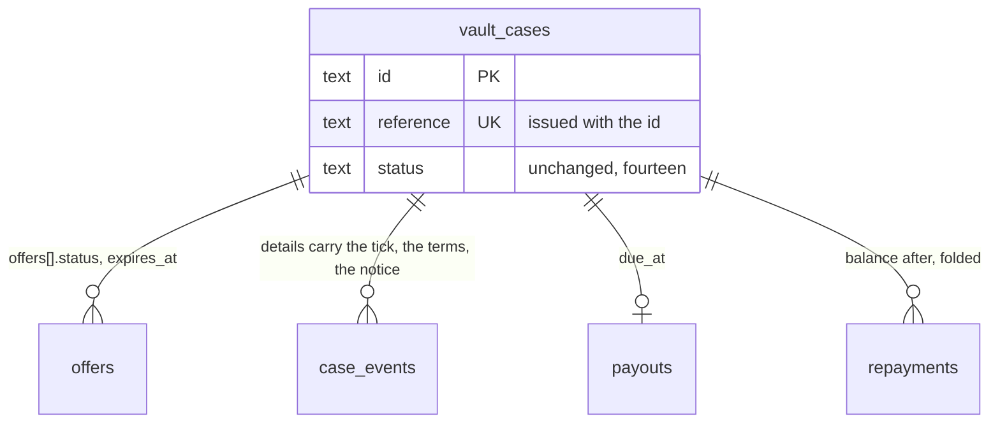

## Context

See [proposal.md](proposal.md#why) for the motivation and [decisions.md](decisions.md)
for what the interview settled; the journeys are beside each capability under
`specs/`. Every path below is the application repository's unless it says
`grade10-spec`.

- **Built today** — one vault worker per brand (`apps/backend/grade10/vault`,
  the code in `packages/vault/backend`), its own Neon project, thirty-one
  migrations, `cases/transitions.ts` the only writer of a status; a
  collector SPA in `packages/vault/frontend` mounted by
  `apps/frontend/grade10/src/pages/vault/*`; a console in
  `packages/vault/admin-frontend` mounted by `apps/admin/grade10/src/pages/vault/*`;
  `cases.accept`, `cases.decline`, `cases.cancel` and `cases.requestRelease`
  already served to the collector and unreached by any screen
- **The two reads** — `cases.mine` answers `vaultCaseSchema` rows, which carry
  the status and the appointment and no offer, no due date and no events;
  `caseDetailSchema` answers `asOf`, the case, offers, events, packets,
  custody, payout, `repayments`, `due` and `paymentInstructions: string | null`,
  the last read off `packages/app-env/src/legalIdentity.ts`, whose seven fields
  are null but the two names and refuse production minting through
  `documents/legalEntity.ts` (`LEGAL_IDENTITY_UNSET`). `caseEventSchema.details`
  is `Unknown` on the wire
- **Mail** — twenty-four `NOTIFY_KINDS` (`notify/vocabulary.ts`), copy as a
  flat `{ subject, heading, body, action }` in `email/messages.ts`, rendered
  by `email/render.tsx` through `@grade10/email/render`'s `ProductEmail`;
  `notifyQuietly` never throws and parks a failed send in
  `notification_retries`, whose columns are `kind`, `amountMinor`, `notifyAt`
  and `packetId`. `@grade10/email/render` publishes `BaseLayout`,
  `renderProductEmail` and `createEmailTranslator`; `@grade10/email` publishes
  `PermanentEmailSendError`, which the auction's `sweeps/claim.ts` parks on
  and the vault does not read. The auction renders a React Email letter in the
  worker (`packages/grade10-auction/backend/src/email/AuctionLetter.tsx`,
  inline styles); the store's `apps/emails` is a preview site with no vault
  letters and no test script
- **The calendar file exists** — `buildCalendarFile` in
  `packages/appointment/contracts/src/calendar.ts` writes a `VEVENT` with a
  `UID`, a `SEQUENCE` and `METHOD:CANCEL` on a cancelled status; the
  appointment worker's `calendarAttachment` mints
  `<bookingId>@grade10-appointments` and counts the booking's own revision.
  `escapeCalendarText` escapes three of the four marks it names: `;` is
  replaced by itself. The vault's booking mail attaches nothing
- **Erasure** — `auth.deletion_requests` is written by
  `requestErasure(db, userId, actor)` in `packages/grade10-auth/backend/src/erasureRequests.ts`,
  which bans in the same transaction, and `cancelErasure` lifts the ban; both
  throw `ERASURE_ALREADY_REQUESTED` and `ERASURE_NO_REQUEST` on a second call.
  `readSession.ts`'s `enforceOpenErasure` re-applies the ban on every session
  read while any request is open. Both mutations are behind
  `elevatedProcedure("user:delete")`. A product reaches auth over
  `AUTH_SERVICE`, whose entrypoint resolves the caller from the request headers
  (`lookupUsers(headers, …)`, `erasureCleared(brand, userId)`). The vault's
  `erasureStatus(db, userId)` already answers `holds` and `remaining`
- **Audit** — the elevated ladder writes a chain row for any call carrying
  `auditDetails`; `elevatedRoute` serves grant-gated bytes through the same
  sink; the counter search records who, when, the term's kind and the hit
  count, never the term (`cases/browse.ts`). A collector reading their own
  document writes `recordDocumentRead` (`documents/serve.ts`) and no chain row
- **Storybook** — none in this repository. The store's `apps/preview` is the
  plain-Vite host shape: Storybook 10.5.4, `addon-a11y`, `addon-docs`,
  `addon-vitest` and `@vitest/browser-playwright`. Both application Vite
  configs carry `reactRouter` and the serving worker's plugins, which a
  Storybook builder cannot load
- **Tests** — `docs/conventions/backend.md` § Tests prove the service and
  repository seams: a service test with a narrow fake, a `*.drizzle.test.ts`
  through `emittedSql()`, a `*.repo.test.ts` on PGlite over the committed
  migrations. Both vault and auth backend suites include `test/**/*.test.ts`
  only, and auth's runs on node. No `/vault/dev/*` seed route exists; auth's
  `magicLinkOutbox` is a keyed `auth_kv` row with a five-minute TTL.
  `scripts/e2e/start-isolated.sh` starts neither the vault nor the diary, and
  e-kyc has no gateway prefix and no health address
- **Pre-launch** — the vault holds no production case, so a contract half
  ships with its expand half and a wire field is renamed rather than
  aliased, as `add-multi-store-appointments` did

## Goals / Non-Goals

**Goals:**

- Every collector-facing fact the pages add is derived at the read by one
  pure function both SPAs call over the scalars every surface already has
- The reference is a stored fact with a database guarantee, and the id stays
  the key and every address
- One predicate decides whether a Legal-owed value may print, and the act
  renders before it commits, so nothing is written that cannot be posted
- Every letter is one exhaustive catalogue keyed by `NotifyKind`, so a kind
  cannot ship without a letter and a letter cannot outlive its kind
- Every bulk read is bounded in bytes, not in ids, and leaves the chain rows
  the single read leaves
- The self-filed erasure request reuses auth's one request table and one
  window, and bans nothing

**Non-Goals:**

- A `derived_status` column, a `standing` field on the wire, or a fifteenth
  status
- A second copy of the how-to-pay values anywhere but `legalIdentity.ts`
- Rendering letters in the store: the worker renders what it sends, the store
  previews
- A Storybook per application; one workspace package hosts every slice's
  stories, and the store's `apps/preview` stays for primitives and blocks

## Decisions

### The case reference is a stored column, issued where the id is

The spec governs the alphabet, the length and the uniqueness; this is where
the fact lives.

- `vault_cases.reference text NOT NULL`, `UNIQUE`, CHECK-constrained to six
  characters of `CASE_REFERENCE_ALPHABET` — the thirty-one characters the
  decision names, exported once from `@grade10/vault-contracts` and rendered
  into the migration's regex rather than spelled a second time. The vault
  database is one brand's, so a unique index is uniqueness per brand
- **Issued on the row's insert** in `cases/intake.ts`, beside the `vc_` id:
  `caseReference(random)` in `cases/reference.ts` draws six characters from
  `crypto.getRandomValues`. The insert takes `mintPosHandle`'s shape — one
  independent attempt per draw, guarded by `isUniqueViolation` from
  `@grade10/postgres`, eight attempts, then a throw by name. A unique
  violation aborts the transaction it happens in, so the case row is inserted
  before `openCase`'s transaction opens, and the item joins it inside
- A draft that never sends in keeps its reference; never reused is what the
  unique index says, and a reference spent on an abandoned draft costs nothing
  out of 31⁶
- **Shown** in the case header, the list card, the sent screen, the signing
  header, the console's case header and every letter's subject line.
  **Searched** by prefix in `repositories/cases.ts` `searchCases`: a term of
  two to six characters in the alphabet, case-folded, is `termKind: "reference"`;
  a phone term is longer and unchanged. **Never in a URL**: routes, links and
  `CASE_PATH` keep the id
- Alternatives rejected:
  - Derived from the id — cannot be reissued on a clash, and a hash of a uuid
    truncated to six characters clashes silently
  - Issued at submit — the column would be nullable on a draft and the sent
    screen would read it off a second write
  - Retrying inside one transaction — a unique violation leaves the
    transaction aborted, so the retry cannot run and `openCase` rolls back
  - A sequence — leaks volume at the counter and reads out as a number a
    borrower will type wrong

### Every collector-facing fact is one pure function over the scalars every surface has

The spec governs what each fact says; this is where it is computed.

- `packages/vault/contracts/src/standing.ts` exports
  `caseStanding(input, asOf, timeZone)` over the scalars the list row and the
  detail both carry — `{ status, appointmentAt, declineReason, offerExpiresAt,
  dueAt, endedAs }` — answering `{ chip, stage, lane, fact }`
- **`chip` is the word the screen prints**, one of `waitingOnYou`, `withUs`,
  `visit`, `due`, `pastDue`, `settled`, `collected`, `closed`, with the date or
  the day count the word needs. `OwnershipChip` renders the answer and derives
  nothing
- **`stage`** is one of `request`, `valued`, `offer`, `agreed`, `signed`,
  `vault`, `loan`, `home`, and **`lane`** is `financed` or `storage` — the
  storage lane walks the same list without `offer` and `loan`, so no caller
  keeps a table of which six
- **`fact`** is one of `offer_lapsed`, `offer_declined`, `offer_superseded`,
  `visit_missed`, `release_requested` or null
- `timeZone` is the brand's, and `asOf` is the bundle's instant, never
  `Date.now()`: the same two the worker's own folds take, so the page and
  `needsStaffReasonsOf` cannot disagree across a midnight
- **The ending's prose is a detail-only reader.** `caseEnding(detail)` beside
  it answers the reason, the actor kind, the clock, the settled figure and the
  notice dates for `declined`, `cancelled`, `expired` and `forfeited`, off the
  detail's own typed `ended`, `notice` and `forfeiture` fields. Nothing reads
  `caseEventSchema.details`, which is `Unknown` on the wire
- **One rule for a lapsed offer.** `offerLapsed(expiresAt, status, asOf)` is
  exported beside `caseStanding` and folded by `cases/needsStaff.ts`; the SQL
  `lapsed(now)` in `repositories/offers.ts` stays a prefilter over the same
  rule, so the page is right between the sweep's passes
- `identityStanding(state)` collapses `checkState` and `verified` into the six
  words: no check → None; invited, started, submitted → Out; stalled →
  Stalled; approved and bound → Verified; declined → Refused; expired,
  withdrawn → Lapsed. The console's `IdentityPanel` and the Your data card
  call the same function
- **Tested as a table**: `standing.test.ts` is one row per chip, stage, lane
  and fact, with `asOf` on both sides of every deadline
- Alternatives rejected:
  - A `standing` field the worker puts on the wire — two detail procedures
    means two places to compute it or one place the console cannot reach
  - The detail bundle as the input — the home card reads `cases.mine`, which
    carries none of it, so `OwnershipChip` would derive the word a second time
  - A status per fact — the decision's own rejection; `expireOffers` would
    then move the case, and a declined offer would need a status to walk back
    from

### How to pay is two Finance values and one predicate

The spec governs what the block names; this is where the values come from and
what refuses them.

- `LEGAL_IDENTITY_FIELDS` drops `paymentInstructions` and gains `fpsId` and
  `bankAccount`, both null, neither blocking; the payee is `lenderLegalName`,
  already on file, and the currency is the case's. `check:libs` names the new
  fields unset on every run through `unset()`
- `caseDetailSchema.paymentInstructions` becomes
  `howToPay: NullOr({ payee, fpsId, bankAccount })`, null on every case but a
  live loan; the transfer reference is `case.reference`, already on the payload
- **`printedValue(ports, field)`** in `packages/vault/backend/src/legal/printed.ts`
  is the primitive: production and null throws `LEGAL_IDENTITY_UNSET` naming
  the field; any other environment answers a marked `[fpsId]`-style
  placeholder. `printedEntity` stays the composition over it and keeps every
  behaviour it has — `legalName` and `lenderLegalName` still fall back to the
  trading name outside production, the licence line is still composed from
  `licenceWording` and `licenceNumber`, and `assertLenderNamed` is still a call
  to it. Only `fpsId` and `bankAccount` take the placeholder
- **The act renders before it commits.** `renderVaultLetter(kind, facts)` is
  pure and calls `printedValue`, so an act that will print an unset value
  refuses by name before its transaction opens. `recordPayout`,
  `recordRepayment`, `sendForfeitureNotice` and the reminder pass render
  first and hand the rendered letter to the send; nothing commits a row a
  parked letter describes
- Alternatives rejected:
  - Keeping one free-text field and rendering it — nothing a borrower can
    copy into a bank form, the decision's own rejection
  - A `LETTER_PRINTS: Record<NotifyKind, LegalIdentityField[]>` map beside the
    catalogue — twenty-four rows kept in step with the letters by hand, free to
    disagree with what a letter prints, and a drift refuses inside
    `notifyQuietly`, which never throws
  - Refusing at the render alone, inside the send — `notifyQuietly` would
    swallow the refusal into five retries and an operator would read a parked
    message, not a refused act

### Accept, Decline, Cancel and Ask for it back wire the procedures that exist

The spec governs the confirmations; this is what changes.

- `packages/vault/frontend/src/core/api/VaultApi.ts` gains `accept`,
  `decline` and `cancel` over `cases.accept`, `cases.decline` and
  `cases.cancel`; `requestRelease` is already there. The fixture transport
  answers all four from the same fixture cases
- **Accept is a mounted dialog** held on a boolean, per
  `docs/conventions/dialogs.md`: it carries the terms, which `Confirmation`
  has no slot for. Decline, Cancel and Ask for it back are words and one
  effect, so each is a `useConfirm` ask
- **The figure cannot move under an open dialog.** Each act carries the
  detail's `asOf` into the mutation, and the worker refuses `QUOTE_STALE` when
  the balance moved — the failure `recordRepayment` already raises
- **Additive on the detail**: `repayments[].balanceAfterMinor` (the fold at
  that value date through `money/computeDue.ts`, the one authority),
  `notice: NullOr({ sentAt, cureBy })` from `custody/forfeit.ts`'s
  `latestForfeitureNotice`, `forfeiture: NullOr({ at, settledMinor })`,
  `ended: NullOr({ kind, at, actorKind, reason })`, and
  `reminders: { next, ladder }` folded beside `money/computeDue.ts` from the
  due date, the offsets in `sweeps/remind.ts` and the notice — read off the
  `reminder_sent` events for what went, and showing only what is ahead
- Alternative rejected: a second `cases.repayments` procedure — the bundle
  already carries the rows, and a second read is a second `asOf`

### The review step records the tick on the event that already records the send

- `cases.submit` input gains `collectionStatement: { acknowledged: true }`;
  the worker refuses without it and writes
  `{ collectionStatementVersion }` into the `intake_submitted` event's
  `details`, the stamp that already records the send
- **The version is the documents' own decision, not the legal identity's.**
  `documents/plan.ts` holds `COLLECTION_STATEMENT_VERSION`, owned by Legal,
  and the review step shows the statement, or "Being prepared" until Legal
  writes it, and records the version it showed. The tick refuses nothing in
  production: Q8 decided the step ships ahead of the wording, and Q17's
  production refusal covers the letters and documents that print Legal's own
  wording
- Alternatives rejected:
  - `pics_acknowledged_at` on `vault_cases` — a second column for a fact one
    event row already dates
  - The version as an eighth `LEGAL_IDENTITY` field — it is not an identity,
    and a production refusal on it would close intake until Legal answers

### The calendar file is the booking's own, served and attached

- `GET /api/cases/:caseId/visit.ics` (`VAULT_PATHS.visitCalendar`) in
  `routes/visit.ts`, a session route on `caseOwner`, answers `text/calendar`
  from `buildCalendarFile` over the booking `appointments.getBooking(caseId)`
  answers — `uid: <bookingId>@grade10-appointments` and the diary's own
  revision as `sequence`, exactly as the diary's `calendarAttachment` mints
  them, so one visit has one `UID` and not two
- **A cancelled visit still answers.** The diary keeps the booking and answers
  it with `status: "cancelled"` after `cancelVisit` clears the vault's cache,
  so `METHOD:CANCEL` goes out against the same `UID` and `DTSTART` the phone
  holds. The Booked screen's add to calendar is this address
- The `visit_booked`, `visit_rescheduled` and `visit_cancelled` letters
  attach the same file. `ProductEmailPort.send` carries attachments;
  `sendBatch` refuses them, and these are sent one at a time already
- **`escapeCalendarText` is fixed** — `;` is replaced by itself today, so a
  semicolon in a shop's address emits an unescaped separator. The fix lands
  with a table test pinning all four escapes
- Alternative rejected: a `UID` off the case id — the diary already mints one
  per booking, and a second would leave two events for one visit

### Your data is a vault page over a vault read, and the ask crosses to auth once

The spec governs what the page names and refuses; this is who answers.

- `cases.yourData` (authed) answers the retention classes off
  `packages/app-env/src/retention.ts`, `identityStanding` over
  `kyc.latestForUser`, the collector's sealed documents paged by case, the
  vault's own `holds` from `erasure/eraseUser.ts` `erasureStatus`, and the
  open request from `AUTH_SERVICE.ownErasureStatus(headers)`. The holds are
  answered beside the request, so a person whose ask is refused reads why on
  the same card
- `cases.requestErasure` (authed, mutation) refuses `ERASURE_HELD` with the
  holds in words while any stand, then calls `AUTH_SERVICE.requestOwnErasure(headers)`;
  `cases.cancelErasure` calls `cancelOwnErasure(headers)`. All three are new
  methods on `packages/grade10-auth/backend/src/entrypoint.ts`, resolving the
  person from the session the headers carry, as `lookupUsers` does — the
  caller cannot name another user
- **All three are idempotent.** A second request answers the open row's
  `executeAfter` rather than `ERASURE_ALREADY_REQUESTED`; a cancel with no
  open row is a no-op rather than `ERASURE_NO_REQUEST`. A retry after a
  dropped connection is the reachable case, not the rare one
- **A self-filed row sets no ban**, and self-ness is `actor.id === userId` —
  `requested_by` already says it, so `requestErasure` takes no new parameter.
  `cancelErasure` lifts the ban only where `open.requestedBy !== userId`, so a
  self-cancel cannot hand back an account banned for conduct
- **`enforceOpenErasure` gains the same branch.** It re-bans on every session
  read while a request is open; without the branch the next request signs the
  collector out and they cannot reach the cancel. A request whose
  `requested_by = user_id` leaves the session alone
- **An operator filing over a self-filed row converts it** — `requested_by`
  becomes the operator and the ban is applied — because the partial unique
  index admits one open request and a refusal would leave the ban unlanded.
  `docs/architecture/account-data.md` moves with it
- **The bounded document download**: `GET /api/cases/documents.zip`
  (`VAULT_PATHS.documentsZip`), under the session tier the worker already
  mounts, owned by the session's user rather than a `:caseId` the address does
  not carry. It takes the cursor `cases.yourData` took and zips what that read
  answers — one bound, one ownership rule, one count — each a sealed document
  of a completed packet the caller owns
- **Bounded in bytes.** The route sums the objects' recorded sizes before the
  first read and refuses `TOO_LARGE` by name past the ceiling, because the
  writer lifted from `packages/wallet-pass/src/apple/zip.ts` into
  `packages/utils/src/zip.ts` buffers whole and speaks no ZIP64. The lift
  rewrites the comment off its pkpass reasons, carries the pkpass fixture, and
  adds the `@grade10/utils/zip` export and its Handbook card line
- **The chain rows are the single route's.** Each document appends
  `recordDocumentRead` through `documents/serve.ts` before its bytes go, and
  the download appends one `vault.documents.setDownloaded` row — who, when,
  how many — through the context's audit sink, as Q24 asks
- Alternatives rejected:
  - A `?caseIds=` parameter — the client's list re-establishes every bound the
    page already had, and the server knows the caller's packets
  - A session tier on auth's tRPC — a second ladder for one procedure; the
    binding already resolves a session for the address book
  - Auth judging the vault's holds — auth binds no products, by
    `docs/architecture/account-data.md`; the vault refuses for its own classes
    and files nothing it would refuse
  - A `filed_by_self` column — `requested_by = user_id` is the fact

### The console reads counts and sums from the queries it already runs

- `admin.queueCounts` — one `GROUP BY status` folded onto the seven cuts, and
  nothing else, under `vault:read`. One instant and the brand's zone are
  passed in, never read inside
- **The Today block is the Today cut**: `admin.list` with `filter: "today"`
  orders by `appointment_at` ascending; the landing view mounts that query
  with its count. No second query and no second instant
- `admin.arrearsSummary` owns the arrears numbers — the count and the two
  figures — folding `computeDue` over the arrears rows at one instant. It is
  bounded by the same page size the ledger takes and refuses past it, so one
  shop's dozens are a page and a backlog is not an unbounded fold;
  `overdueLoans` rows gain the borrower's contact, the notice date and the
  last `reminder_sent`
- `admin.custodyList` gains `totals: { inVault, perShop, withLoan, pickupBooked }`
  from the same predicate the rows use
- `admin.moneyLedger` input gains `kind: payout | repayment | adjustment` —
  the wire's own vocabulary; the rows already carry the takes-back reference.
  `money/position.ts` gains `netOut` — payouts less repayments per currency, a
  correction netting its row once, positive when money is out
- **`GET /api/admin/money-ledger.csv`** (`VAULT_PATHS.moneyLedgerCsv`) on
  `elevatedRoute` under `vault:payout`, the one mechanism the vault already
  uses for grant-gated bytes. The console passes the ledger's filter, cursor,
  limit and `asOf` as query scalars and gets the page it shows; the chain row
  carries the filter, the instant, the cursor and the row count through the
  context sink
- `admin.policy` (`vault:read`) answers `lendingPolicy(brand)`, `accrualOf`,
  the reminder ladder's days and `REQUIRED_FOR_OFFER`'s unset fields, so the
  three dialogs state the rule from the worker's own table. Each is a
  `FormDialog`; the rule lines sit above the fields
- `admin.keyTerms` answers the loan agreement's clause ids and headings from
  `documents/templates/loanAgreement.ts`, and `recordTermsExplained` takes
  `terms: string[]`, refusing any set short of the plan's; the
  `terms_explained` event's details carry the set and the optional reference
- **The visit checklist and Forfeit's reason are `caseStanding`'s**: the
  Case tab walks `stage` and the events in order; the Custody tab prints
  `notice.cureBy` and the `FORFEITURE_NOTICE_REQUIRED` refusal
  (`contracts/src/failures.ts`) in words before the button
- Alternatives rejected:
  - A tRPC `moneyLedgerCsv` query — a tRPC read cannot answer `text/csv`, and
    it would be a third download mechanism beside the two byte routes
  - An arrears count on `queueCounts` — two numbers for one fact at two
    instants
  - The console importing `@grade10/app-env` for the policy — bundles the
    worker's decision tables into a browser and reads a value the worker may
    have refused
  - A five-item terms list in the console — a second list kept in step by
    hand, the decision's rejection

### Letters are one exhaustive catalogue the worker renders

The spec governs what each message names; this is the shape.

- `packages/vault/backend/src/email/letters/VaultLetter.tsx` composes
  `BaseLayout` from `@grade10/email/render` rather than standing a third shell
  beside it; a block generic enough for two products — the facts table, the
  action button — is hoisted into `@grade10/email/render` with it.
  `TermsTable`, `HowToPay`, `ReminderSchedule`, `NoticeClause` and
  `LicenceFooter` stay vault-side, because the licence and the notice are this
  product's legal furniture. Every money value in every block renders through
  `amounts.ts`'s `formatMinorAmount`
- One file per family under `letters/`: `offer.tsx`, `money.tsx`, `notice.tsx`,
  `visit.tsx`, `case.tsx` and `identity.tsx` — the last for
  `identity_check_invited`, whose facts carry the collector's own secret link
- `letters/index.ts` is `LETTERS: Record<NotifyKind, Letter<never>>`, typed
  exhaustive over `NOTIFY_KINDS`; `Letter<F>` is
  `(facts: F, copy: LetterCopy) => { subject, element, attachments? }` and
  `LetterFacts` is derived from the map, so an arm is written once.
  `render.tsx` becomes `renderVaultLetter(kind, facts)` over
  `renderProductEmail`
- **The words stay injected.** `messages.ts` keeps one typed `LetterCopy` per
  kind, widened from the four flat fields to the blocks its letter carries,
  and `createEmailTranslator` still reads it; the recorded path to
  `@grade10/i18n` is unchanged, and English is not inlined into twenty-four
  components
- **The facts are built once, for the send and for the retry.**
  `letterFacts(db, vaultCase, kind, extra)` is the one builder; `tellCustomer`
  calls it, and `sweeps/notify.ts`'s resend calls it again over the case as it
  stands. `notification_retries` keeps `amountMinor`, `notifyAt` and
  `packetId` as the pinned figures the builder honours over a re-derivation, so
  a parked money letter names the figure the act computed. No facts column,
  and no second migration
- **A render throw parks once.** `notifyQuietly` classifies
  `PermanentEmailSendError` as the auction's `parkNotifyFailure` does: a
  permanent refusal parks with its reason instead of burning five rungs
- **Aligned with the store by fixture, not by import**: the fixtures are data
  in the store, `grade10-spec/apps/emails/emails/vault/fixtures.ts`, one
  `LetterFacts` per kind. The preview renders them, and the worker's
  `letters/render.test.tsx` reads the same file through
  `external/grade10-spec`. The store's shell is Tailwind and the worker's is
  inline, so the two cannot share a component: the preview is an unchecked
  copy of the layout and a checked copy of the facts
- The licence footer and the complaints contact read `printedValue`, so a
  staging letter prints `[licenceWording]` and a production act refuses
- Alternative rejected: copy in `@grade10/i18n` inside the four-field shell —
  cannot hold a table, the decision's rejection; the collector's screen words
  still land there, letters do not

### One Storybook, in its own plain-Vite package

- `packages/storybook` (`@grade10/storybook`), the store's `apps/preview`
  shape: plain Vite, Storybook 10.5.4 with `addon-a11y`, `addon-docs` and
  `addon-vitest`, `stories` globbing `packages/*/frontend/src/**/*.stories.tsx`
  and `packages/*/admin-frontend/src/**/*.stories.tsx`. A Storybook inside an
  application would load that application's Vite config, and neither
  `reactRouter` nor the serving worker's plugins survive a Storybook build
- **One preview, two surfaces.** A `surface` parameter picks the decorator:
  `site` mounts the grade10 site theme root and the design-system Theme
  toolbar; `console` mounts `apps/admin/grade10/src/AppProviders` and the
  Astryx theme, and takes no Theme toolbar. `check-astryx-boundary`'s allowlist
  gains that one preview path
- **Named by the screen table.** Every story sets `title` to
  `Vault/<Feature>/<View>`, so the ids are the `vault-<feature>-<view>--<state>`
  the `ui-design.md` screen table already writes. One story per view per
  distinct layout, with args controls for the varied value; a data-backed view
  is storied through its fixture transport module
- CI: a `storybook` job in `.github/workflows/test.yml`, on every push, beside
  `admin-bundle` — `storybook build`, then the a11y run through
  `@storybook/addon-vitest` in browser mode on the runner's pre-installed
  chromium, failing on an axe violation. Its own job, not a shard of the
  frontend tests
- Alternatives rejected:
  - One `.storybook` per application — the applications' Vite plugins do not
    survive the build, and the toolbar, addons and theme wiring would be
    written twice, four times with zzz
  - Its own change — the stories are the frame for every screen nobody has
    drawn yet, so they land with the screens
  - A workspace-level `tools/storybook` — `tools/` is outside
    `pnpm-workspace.yaml` and the lane resolver

### Tests per seam, and the e2e stack the vault lacks

- **Backend** (`packages/vault/backend/test/`, whose vitest `include` widens
  to `test/**/*.test.ts?(x)` so a `.tsx` render test is collected): service
  tests `cases/reference.test.ts` (attempt per draw, throw by name, alphabet),
  `legal/printed.test.ts` (production throws, placeholder outside it, per
  field, and `printedEntity`'s fallbacks unchanged), `money/netOut.test.ts`,
  `money/arrearsSummary.test.ts` (the fold and its ceiling),
  `email/letters/render.test.tsx` — one table over `LETTERS`, kind → blocks and
  attachments, over the store's fixtures
- **Query shape and repository**: `repositories/cases.search.drizzle.test.ts`
  and a PGlite half for the case-folded prefix; `queueCounts`,
  `moneyLedger.kind` and `custodyList.totals` each with both halves;
  `repositories/reference.repo.test.ts` (unique index, migration backfill on
  seeded rows), `repositories/yourData.repo.test.ts`
- **Routes** (`test/routes/`): `visit.ics` — the `UID`, the `SEQUENCE` and
  `METHOD:CANCEL` after a cancel — and `documents.zip` — `caseOwner` on a
  stranger, the byte ceiling's refusal, the filter, the per-document reads and
  the one chain row
- **Auth**: `packages/grade10-auth/backend/test/erasureRequests.self.test.ts`
  — self files with no ban, self cancels without unbanning a conduct ban, an
  operator filing converts an open self-filed row, `enforceOpenErasure` leaves
  a self-filed session alone; the entrypoint's three methods are tested in
  `apps/backend/grade10/auth/test/worker/`, under `vitest-pool-workers`, where
  a `WorkerEntrypoint` runs
- **Contracts**: `standing.test.ts` and `identityStanding.test.ts` as tables,
  and `calendar.test.ts` gains the four escapes
- **SPA and console** (colocated `*.test.tsx`, `getByRole` throughout): the
  case page per chip and per ending, each confirmation's words, the review
  step's tick, the Booked screen, Your data with a held and an unheld account;
  the console's counts, tiles, the three dialogs' rule lines, the key-terms
  dialog, the identity panel's six words
- **E2E** — `apps/frontend/grade10/e2e/tests/vault/{request,offer,loan,visit,your-data}.spec.ts`,
  one walk each, over new seed routes in `packages/vault/backend/src/routes/dev.ts`
  under `app.use("/dev/*", devOnly())` as auth's are:
  `POST /dev/cases/seed` drives `cases/transitions.ts` to the named status —
  no second writer and no second table of what a status implies — and answers
  `{ caseId, reference }`; `POST /dev/sweep` takes `{ lane: "fast" | "slow" }`
  and runs `runSweepPass` now; `GET /dev/outbox` reads the sent letters with
  their attachments' names
- **The outbox is one shape for both workers.** Auth's `magicLinkOutbox` — a
  keyed row with a TTL — lifts into `@grade10/worker` beside `devOnly`, and
  the vault's email channel records into it outside production
- `scripts/e2e/start-isolated.sh`'s default service list gains
  `vault-service,appointment-service,e-kyc-service`, and
  `e2e/helpers/env.ts`'s `STACK_READY_URLS` gains `/vault/health` and
  `/appointment/health` only: e-kyc has no gateway prefix and is reached over
  a binding, so it has no address to probe

## Database Schema

Schema `vault`, migration `0031_case_reference.sql`, the one migration of the
change. Every other fact lands on a row or a stamp that already holds it.

### `vault.vault_cases`

| Change | Definition | Meaning |
| --- | --- | --- |
| `+ reference` | `text NOT NULL` | The six-character reference; authoritative |
| `+ UNIQUE` | `uq_vault_cases_reference (reference)` | Never reused, per brand — the database is the brand's |
| `+ CHECK` | `ck_vault_cases_reference: reference ~ '^[2-9A-HJKMNP-Z]{6}$'` | The alphabet, rendered from `CASE_REFERENCE_ALPHABET` |

The file adds the column nullable, creates the unique index, backfills every
existing row with one deterministic per-row draw over `random()` — no loop and
no second generator, and the index refuses a clash loudly rather than a `DO`
block swallowing it — then adds the check and sets `NOT NULL`.

`-- contract:` on the `SET NOT NULL` block says the migration and the worker
that issues references are applied in one window, and the vault holds no
production row; `-- lock:` on the index, the backfill and the check says the
same window is what makes the locks free. `pnpm run check:migrations` refuses
the file without both, and `pnpm db:status` hashes it, so neither line is
added afterwards.

### Facts that reuse a stamp

| Fact | Where it already lives |
| --- | --- |
| The collection-statement tick | `case_events` row `intake_submitted`, `details.collectionStatementVersion` |
| The key terms ticked | `case_events` row `terms_explained`, `details.terms` |
| The calendar file's id and sequence | The diary's booking, through `appointments.getBooking` |
| The notice's dates and the settled figure | `forfeiture_notice` and `forfeited` events, read as typed detail fields |
| A self-filed erasure request | `auth.deletion_requests.requested_by = user_id` |
| A letter parked for retry | `notification_retries.amountMinor`, `notifyAt`, `packetId` |
| A bulk download, a CSV, a reference search | `document_reads`, and `audit_logs` rows `vault.documents.setDownloaded`, `vault.money.ledgerExported`, `vault.cases.searched` |

Derived, never stored: the chip, the stage, the lane, the fact, the ending,
the identity's six words, the balance after each repayment, the reminder
dates, the counts, the sums, the net out.

## Service Interfaces

| Function | Input | Answers or refuses | Boundary |
| --- | --- | --- | --- |
| `caseReference(random)` | a byte source | six characters | pure; the insert is one attempt per draw, guarded by `isUniqueViolation`, eight times, before `openCase`'s transaction |
| `caseStanding(input, asOf, timeZone)` | six scalars both reads carry | `{ chip, stage, lane, fact }` | pure, contracts |
| `offerLapsed(expiresAt, status, asOf)` | one offer | boolean | pure; the SQL `lapsed(now)` prefilters over it |
| `printedValue(ports, field)` | brand, deployEnv, field | the value, a placeholder, or `LEGAL_IDENTITY_UNSET` | pure over `legalIdentity(brand)`; `printedEntity` composes it |
| `renderVaultLetter(kind, facts)` | a `LetterFacts` member | `{ subject, html, text, attachments? }` or `LEGAL_IDENTITY_UNSET` | pure; run at the head of the act, before its transaction |
| `letterFacts(db, vaultCase, kind, extra)` | the case and the send's own figures | one `LetterFacts` member | one builder for the send and the retry |
| `cases.submit` | `{ caseId, collectionStatement: { acknowledged: true } }` | the case | writes the version shown into the event details |
| `cases.yourData` | a cursor | classes, standing, documents, holds, the open request | one binding read; no write |
| `cases.requestErasure` | none | `{ executeAfter }` or `ERASURE_HELD { holds }` | reads holds, then one binding call; no local write |
| `cases.cancelErasure` | none | void | one binding call |
| `AUTH_SERVICE.ownErasureStatus(headers)` | the session's headers | `{ executeAfter } \| null` | read only |
| `AUTH_SERVICE.requestOwnErasure(headers)` | the session's headers | the request row | auth's transaction: request row and audit, no ban; an open row answers itself |
| `AUTH_SERVICE.cancelOwnErasure(headers)` | the session's headers | void | auth's transaction; unban only where an operator filed; no open row is a no-op |
| `admin.queueCounts` | one instant, one zone | seven integers | one read, no lock |
| `admin.arrearsSummary` | one instant, one page | the count and two figures, or a refusal past the ceiling | one bounded fold |
| `GET /api/admin/money-ledger.csv` | the ledger's filter, cursor, limit, `asOf` | `text/csv` of one page | `elevatedRoute`, `vault:payout`, one chain row |

Example — a self-filed ask on a held case. `cases.requestErasure` reads
`erasureStatus` → `holds: ["a case is in custody"]` → answers
`ERASURE_HELD` with the words; no row on auth. The same call on a released
account → `holds: []` → `requestOwnErasure(headers)` → auth inserts
`deletion_requests { user_id: u1, requested_by: u1, execute_after: now + 7 d }`,
`users.banned` untouched → `{ executeAfter }`. The collector's next page load
reads a session `enforceOpenErasure` leaves alone, because `requested_by =
user_id`. A second ask inside the window answers the same `executeAfter`; a
cancel closes the row `cancelled` and lifts nothing; a second cancel does
nothing. An operator filing over that open row sets `requested_by` to the
operator and applies the ban.

## API Contracts

| Surface | Change | Consumers that adapt |
| --- | --- | --- |
| `caseDetailSchema` | **BREAKING** `paymentInstructions: string \| null` → `howToPay: { payee, fpsId, bankAccount } \| null`; additive `repayments[].balanceAfterMinor`, `notice`, `forfeiture`, `ended`, `reminders` | `packages/vault/frontend/src/features/custody/cases/{domain,data}` — the model, the mapper, the fixture transport |
| `vaultCaseSchema` | additive `reference`, `offerExpiresAt`, `dueAt`, `endedAs` | `cases.mine` and `admin.list` readers in both SPAs |
| `cases.submit` | input gains `collectionStatement` | the wizard's third step |
| `cases.yourData`, `cases.requestErasure`, `cases.cancelErasure` | new, authed | the Your data page |
| `GET /api/cases/:caseId/visit.ics`, `GET /api/cases/documents.zip`, `GET /api/admin/money-ledger.csv` | new byte routes, all three in `VAULT_PATHS` | the Booked screen, Your data, the ledger view |
| `admin.queueCounts`, `admin.arrearsSummary`, `admin.policy`, `admin.keyTerms` | new admin reads | the landing view and the three dialogs |
| `admin.list`, `admin.moneyLedger`, `admin.custodyList`, `admin.overdueLoans`, `admin.recordTermsExplained` | additive inputs and fields above | `packages/vault/admin-frontend/src/features/custody/compliance` for the terms set |
| `searchCases` | `termKind` gains `reference` | the counter search panel |
| `requestErasure`, `cancelErasure` | ban conditioned on `actor.id === userId`; no new parameter | `packages/grade10-auth/backend`'s admin router call site, `readSession.ts` |
| `AuthServiceBinding` | `ownErasureStatus`, `requestOwnErasure`, `cancelOwnErasure` | the vault's erasure router |
| `@grade10/vault-contracts` | `caseStanding`, `caseEnding`, `offerLapsed`, `identityStanding`, `CASE_REFERENCE_ALPHABET` | both SPAs |
| `@grade10/app-env` `LEGAL_IDENTITY_FIELDS` | **BREAKING** `paymentInstructions` → `fpsId`, `bankAccount` | `packages/vault/backend/src/cases/read.ts`, `documents/legalEntity.ts`, `check:libs` finding keys |
| `@grade10/email/render` | the generic letter blocks hoisted beside `BaseLayout` | the auction's letter, unchanged in output |
| `@grade10/worker` | the dev outbox beside `devOnly` | auth's `magicLinkOutbox`, moved |
| `@grade10/utils/zip` | new export and its Handbook card line | `packages/wallet-pass`, which loses its copy |
| `email/messages.ts` | `Copy` widens to `LetterCopy` per kind | `email/render.tsx`, `notify/channel.ts`, `notify/tell.ts`, `testing/suites/*` asserting on subjects, `sweeps/{remind,deliver,expire,booking}.ts` |
| The notifications requirement's closed set | the invitation row joins the table | `grade10-spec` only |

## Risks / Trade-offs

- **[Two requests race for one reference]** → the unique index makes one row;
  each attempt is its own insert, so the loser redraws, and the ninth failure
  throws by name
- **[A staging letter's placeholders reach a real inbox]** → staging sends
  only to the seeded addresses the e2e stack owns; production refuses at the
  render, before the act's transaction opens, so no row is committed that an
  unsendable letter describes
- **[The reminder pass raises on every due row for a quarter of an hour]** →
  the pass renders its letter once at its head; a `LEGAL_IDENTITY_UNSET` there
  refuses the whole pass by name and counts once, rather than per row
- **[A parked money letter re-derives a different total]** → the retry row
  keeps the amount and the instant the act named, and `letterFacts` honours
  them over the case as it stands
- **[A self-cancel lifts a conduct ban]** → the unban is conditioned on
  `open.requestedBy !== userId`, tested both ways
- **[A self-filed request signs the collector out of the cancel]** →
  `enforceOpenErasure` skips a request the person filed themselves, tested on
  the next session read
- **[A phone opens a stale visit]** → the `UID` and the sequence are the
  diary's own, so one visit has one event and a client keeps the newest; a
  cancel sends `METHOD:CANCEL` from the same address
- **[A zip buffers more than the worker can hold]** → the route sums the
  recorded object sizes before the first read and refuses `TOO_LARGE` by name
- **[A CSV becomes an unbounded export]** → the route takes the ledger's
  cursor and limit, so it can answer no more than one page; the chain row says
  the filter, the instant and how many
- **[The Storybook build slows the test lane]** → its own job, sharded
  nowhere, and `check:admin-bundle` already pays a comparable build once

## Migration Plan

0. Merge the store's words, letters' fixtures and preview pages, then bump the
   submodule in the application pull request that carries the SPA work —
   `check:submodules` guards the pin, and the catalogue's types refuse an
   unanswered key
1. Apply `0031_case_reference.sql` and deploy the worker and both SPAs in one
   window, from one commit; nothing is aliased, because the vault is
   pre-launch and staging's intake pauses for the window
2. The way back is the worker's previous version first, then a forward
   migration dropping the check, the index and the column — a dropped
   migration row leaves `pnpm db:status` diverged
3. One pull request per Legal-owed value, each redeploying every `app-env`
   reader: Finance owns `fpsId` and `bankAccount` in `legalIdentity.ts`, and
   Legal owns `licenceWording`, `licenceNumber` and the complaints contact
   there and `COLLECTION_STATEMENT_VERSION` in `documents/plan.ts`. Until
   Finance answers, the how-to-pay block prints its placeholders outside
   production and the money acts refuse in it; intake is not held, because the
   review step shows "Being prepared" and records the version it showed
4. Enable the three new services in `start-isolated.sh` with the same commit
