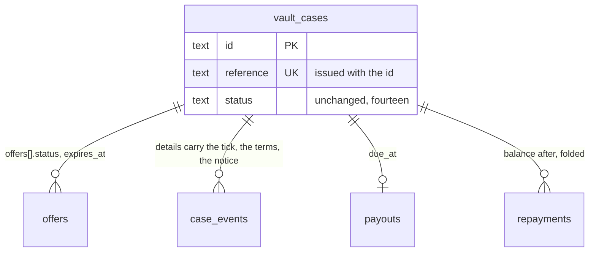

## Context

See [proposal.md](proposal.md#why) for the motivation and [decisions.md](decisions.md)
for what the interview settled; the journeys are beside each capability under
`specs/`. Every path below is the application repository's unless it says
`grade10-spec`.

- **Built today** — one vault worker per brand (`apps/backend/grade10/vault`,
  the code in `packages/vault/backend`), its own Neon project, thirty-one
  migrations, `cases/transitions.ts` the only writer of a status; a
  collector SPA in `packages/vault/frontend` mounted by
  `apps/frontend/grade10/src/pages/vault/*`; a console in
  `packages/vault/admin-frontend` mounted by `apps/admin/grade10/src/pages/vault/*`;
  `cases.accept`, `cases.decline`, `cases.cancel` and `cases.requestRelease`
  already served to the collector and unreached by any screen
- **The detail read** — `caseDetailSchema` in `packages/vault/contracts/src/schemas.ts`
  answers `asOf`, the case, offers, events, packets, custody, payout,
  `repayments`, `due` and `paymentInstructions: string | null`, the last read
  off `packages/app-env/src/legalIdentity.ts`, whose seven fields are null but
  the two names and refuse production minting through
  `documents/legalEntity.ts` (`LEGAL_IDENTITY_UNSET`)
- **Mail** — twenty-four `NOTIFY_KINDS` (`notify/vocabulary.ts`), copy as a
  flat `{ subject, heading, body, action }` in `email/messages.ts`, rendered
  by `email/render.tsx` through `@grade10/email/render`'s `ProductEmail`;
  `notifyQuietly` never throws and parks a failed send in
  `notification_retries`. The auction renders a React Email letter in the
  worker (`packages/grade10-auction/backend/src/email/AuctionLetter.tsx`,
  inline styles); the store's `apps/emails` is a preview site with no vault
  letters
- **The calendar file exists** — `buildCalendarFile` in
  `packages/appointment/contracts/src/calendar.ts` writes a `VEVENT` with a
  stable `UID`, a `SEQUENCE` and `METHOD:CANCEL` on a cancelled status; the
  appointment worker attaches it to its own guest mail. The vault's booking
  mail attaches nothing
- **Erasure** — `auth.deletion_requests` is written by
  `requestErasure(db, userId, actor)` in `packages/grade10-auth/backend/src/erasureRequests.ts`,
  which bans in the same transaction, and `cancelErasure` lifts the ban.
  Both are behind `elevatedProcedure("user:delete")`; auth's tRPC has no
  session tier. A product reaches auth over `AUTH_SERVICE`, whose entrypoint
  resolves the caller from the request headers (`lookupUsers(headers, …)`,
  `erasureCleared(brand, userId)`). The vault's `erasureStatus(db, userId)`
  already answers `holds` and `remaining`
- **Audit** — the elevated ladder writes a chain row for any call carrying
  `auditDetails`; the counter search records who, when, the term's kind and
  the hit count, never the term (`cases/browse.ts`). Byte routes append
  through the same context sink (`trpc/context.ts`, `createWorkerContext(c, auditLogs)`)
- **Storybook** — none in this repository. `pnpm run storybook:spec` serves
  the store's design-system Storybook on 6007; the store pins Storybook 10.5.4
  with `addon-a11y`, `addon-docs` and `addon-vitest`. The `frontend-structure`
  skill says the app Storybook returns with the first storefront UI, stories
  colocated, wrapped in the feature's root element, with a Theme toolbar
- **Tests** — `docs/conventions/backend.md` § Tests prove the service and
  repository seams: a service test with a narrow fake, a `*.drizzle.test.ts`
  through `emittedSql()`, a `*.repo.test.ts` on PGlite over the committed
  migrations. The vault's behaviour suite is portable
  (`packages/vault/backend/src/testing/`). No `/vault/dev/*` seed route
  exists, and `scripts/e2e/start-isolated.sh` does not start the vault
- **Pre-launch** — the vault holds no production case, so a contract half
  ships with its expand half and a wire field is renamed rather than
  aliased, as `add-multi-store-appointments` did

## Goals / Non-Goals

**Goals:**

- Every collector-facing fact the pages add is derived at the read by one
  pure function both SPAs call; the machine gains no status and the row no
  cached word
- The reference is a stored fact with a database guarantee, and the id stays
  the key and every address
- One predicate decides whether a Legal-owed value may print, at the act and
  at the render, for documents and letters alike
- Every letter is one exhaustive catalogue keyed by `NotifyKind`, so a kind
  cannot ship without a letter and a letter cannot outlive its kind
- Every bulk read is bounded to what its list pages and leaves one chain row
- The self-filed erasure request reuses auth's one request table and one
  window, and bans nothing

**Non-Goals:**

- A `derived_status` column, a `standing` field on the wire, or a fifteenth
  status
- A second copy of the how-to-pay values anywhere but `legalIdentity.ts`
- Rendering letters in the store: the worker renders what it sends, the store
  previews
- A Storybook in the store for application slices; the store's stays for
  primitives and blocks
- Online payment, SMS, a locker registry, a forfeiture stepper: the proposal's
  non-goals

## Decisions

### The case reference is a stored column, issued where the id is

The spec governs the alphabet, the length and the uniqueness; this is where
the fact lives.

- `vault_cases.reference text NOT NULL`, `UNIQUE`, CHECK-constrained to six
  characters of `[2-9A-HJKMNP-Z]` — the thirty-one characters the decision
  names. The vault database is one brand's, so a unique index on the table is
  uniqueness per brand
- **Issued on the row's insert** in `cases/intake.ts`, beside the `vc_` id:
  `caseReference(random)` in `cases/reference.ts` draws six characters from
  `crypto.getRandomValues`, and the insert retries on `23505` up to eight
  times inside the same transaction before failing loudly. A draft that never
  sends in keeps its reference; never reused is what the unique index says,
  and a reference spent on an abandoned draft costs nothing out of 31⁶
- **Shown** in the case header, the list card, the sent screen, the signing
  header, the console's case header and every letter's subject line.
  **Searched** by prefix in `repositories/cases.ts` `searchCases`: a term of
  two to six characters in the alphabet, case-folded, is `termKind: "reference"`;
  a phone term is longer and unchanged. **Never in a URL**: routes, links and
  `caseUrl` keep the id
- Alternatives rejected:
  - Derived from the id — cannot be reissued on a clash, and a hash of a uuid
    truncated to six characters clashes silently
  - Issued at submit — the column would be nullable on a draft and the sent
    screen would read it off a second write; the row exists from the first
    photograph, so the reference does too
  - A sequence — leaks volume at the counter and reads out as a number a
    borrower will type wrong

### Every collector-facing fact is one pure function in the contracts package

The spec governs what each fact says; this is where it is computed.

- `packages/vault/contracts/src/standing.ts` exports
  `caseStanding(input, asOf)` over `{ status, offers, events, due, custody, appointmentAt }`
  — the fields both detail bundles already carry — answering
  `{ fact, stage, holder, ending }`: `fact` one of `offer_lapsed`,
  `offer_declined`, `offer_superseded`, `visit_missed`, `release_requested`
  or null; `stage` one to eight; `holder` `collector`, `shop` or `nobody`;
  `ending` one of `declined`, `cancelled`, `expired`, `forfeited` with what
  it names — the reason, the actor kind, the clock, the settled figure and the
  notice dates — read off `declineReason`, the `cancelled`, `expired`,
  `forfeited` and `forfeiture_notice` events and their `details`
- The lapsed offer reads off `offers[].status = 'expired'` or
  `expiresAt < asOf` on an open one, so the page is right between the sweep's
  passes, as `docs/architecture/vault.md` § deadlines requires
- `identityStanding(state)` beside it collapses `checkState` and `verified`
  into the six words: no check → None; invited, started, submitted → Out;
  stalled → Stalled; approved and bound → Verified; declined → Refused;
  expired, withdrawn → Lapsed. The console's `IdentityPanel` and the Your data
  card call the same function
- **Tested as a table**: `standing.test.ts` is one row per fact, ending, stage
  and holder, with `asOf` on both sides of every deadline
- Alternatives rejected:
  - A `standing` field the worker puts on the wire — two detail procedures
    (`cases.detail`, `admin.detail`) means two places to compute it or one
    place the console cannot reach; the function over the bundle is one place
  - A status per fact — the decision's own rejection; `expireOffers` would
    then move the case, and a declined offer would need a status to walk back
    from

### How to pay is three legal-identity values and one predicate

The spec governs what the block names; this is where the values come from and
what refuses them.

- `LEGAL_IDENTITY_FIELDS` drops `paymentInstructions` and gains `fpsId`,
  `bankAccount` and `collectionStatementVersion`, all null, none blocking;
  the payee is `lenderLegalName`, already on file. `check:libs` names the new
  fields unset on every run through `unset()`; nothing else changes there
- `caseDetailSchema.paymentInstructions` becomes
  `howToPay: NullOr({ payee, fpsId, bankAccount, reference })`, null on every
  case but a live loan; `reference` is the case reference
- `documents/legalEntity.ts`'s `printedEntity` generalises to
  `printedValue(ports, field)` in `packages/vault/backend/src/legal/printed.ts`:
  production and null throws `LEGAL_IDENTITY_UNSET` naming the field; any
  other environment answers `[fpsId]`-style brackets. `assertLenderNamed`
  stays as a call to it
- **The act refuses before the render.** `LETTER_PRINTS: Record<NotifyKind, LegalIdentityField[]>`
  in `email/letters/index.ts` names what each letter prints, and
  `assertPrintable(brand, deployEnv, kind)` runs at the start of the act that
  sends it — `recordPayout`, `recordRepayment`, `sendForfeitureNotice`, the
  reminder sweep's claim — so a production act cannot commit and then park a
  letter nobody can send. The wizard's submit calls it for the collection
  statement. The render calls `printedValue` again, so the letter and the
  document agree by construction
- Alternatives rejected:
  - Keeping one free-text field and rendering it — nothing a borrower can
    copy into a bank form, the decision's own rejection
  - Refusing at the render alone — `notifyQuietly` would swallow the refusal
    into five retries and an operator would read a parked message, not a
    refused act

### Accept, Decline, Cancel and Ask for it back wire the procedures that exist

The spec governs the confirmations; this is what changes.

- `packages/vault/frontend/src/core/api/VaultApi.ts` gains `accept`,
  `decline` and `cancel` over `cases.accept`, `cases.decline` and
  `cases.cancel`; `requestRelease` is already there. The fixture transport
  answers all four from the same fixture cases
- Each confirmation is words and one effect, so `useConfirm` per
  `docs/conventions/dialogs.md`, fed by `caseStanding` and `due`: the total,
  the late-day figure, what will be signed
- **Additive on the detail**: `repayments[].balanceAfterMinor` (the fold at
  that value date through `money/computeDue.ts`, the one authority),
  `notice: NullOr({ sentAt, cureBy })` from `custody/forfeit.ts`'s existing
  `forfeitureNoticeOf`, `forfeiture: NullOr({ at, settledMinor })` from the
  `forfeited` event's details, and `reminders: { dueSoonAt, dayBeforeAt, weeklyFrom }`
  from `payout.dueAt` and the ladder in `sweeps/remind.ts`
- Alternative rejected: a second `cases.repayments` procedure — the bundle
  already carries the rows, and a second read is a second `asOf`

### The review step records the tick on the event that already records the send

- `cases.submit` input gains `collectionStatement: { acknowledged: true }`;
  the worker refuses without it and writes
  `{ collectionStatementVersion }` into the `intake_submitted` event's
  `details`, the stamp that already records the send. Production refuses the
  submit while `collectionStatementVersion` is null, through `printedValue`;
  outside production the tick records `[collectionStatementVersion]`
- Alternative rejected: `pics_acknowledged_at` on `vault_cases` — a second
  column for a fact one event row already dates

### The calendar file is the appointment contracts' builder, served and attached

- `GET /api/cases/:caseId/visit.ics` in `routes/visit.ts`, a session route on
  `caseOwner`, answers `text/calendar` from `buildCalendarFile` with
  `uid: <bookingRef>@vault.<brand>`, `sequence` the count of `booking_booked`
  and `booking_rescheduled` events on the case, `status: cancelled` and so
  `METHOD:CANCEL` once the case holds no booking. The Booked screen's add to
  calendar is this address
- The `visit_booked`, `visit_rescheduled` and `visit_cancelled` letters
  attach the same file, so a phone that opens the mail holds the same event
  the screen offers. `ProductEmailPort.send` carries attachments;
  `sendBatch` refuses them, and these are sent one at a time already
- Alternative rejected: a calendar-provider link — picks a provider for the
  collector; a fresh `UID` per booking — the decision's own rejection

### Your data is a vault page over a vault read, and the ask crosses to auth once

The spec governs what the page names and refuses; this is who answers.

- `cases.yourData` (authed) answers the retention classes off
  `packages/app-env/src/retention.ts`, `identityStanding` over
  `kyc.latestForUser`, the collector's sealed documents paged by case, the
  open request or null, and the vault's own `holds` from
  `erasure/eraseUser.ts` `erasureStatus`
- `cases.requestErasure` (authed, mutation) refuses `ERASURE_HELD` with the
  holds in words while any stand, then calls `AUTH_SERVICE.requestOwnErasure(headers)`;
  `cases.cancelErasure` calls `cancelOwnErasure(headers)`. Both are new
  methods on `packages/grade10-auth/backend/src/entrypoint.ts`, resolving the
  person from the session the headers carry, as `lookupUsers` does — the
  caller cannot name another user
- `requestErasure(db, userId, actor)` gains `actor.kind: "self" | "operator"`;
  a self-filed row writes `requested_by = user_id` and sets no ban.
  `cancelErasure` lifts the ban only where `requested_by <> user_id`, so a
  self-cancel cannot hand back an account banned for conduct. One table, one
  window, one partial unique index, unchanged
- **The bounded document download**: `GET /api/account/documents.zip?caseIds=…`
  in `routes/documents.ts`, at most the page size of case ids the page lists,
  each a sealed document of a completed packet the caller owns, zipped
  store-only by the writer lifted from `packages/wallet-pass/src/apple/zip.ts`
  into `packages/utils/src/zip.ts`, and one chain row
  `vault.documents.setDownloaded` — who, when, how many — through the
  context's audit sink
- Alternatives rejected:
  - A session tier on auth's tRPC — a second ladder for one procedure; the
    binding already resolves a session for the address book
  - Auth judging the vault's holds — auth binds no products, by
    `docs/architecture/account-data.md`; the vault refuses for its own classes
    and files nothing it would refuse
  - A `filed_by_self` column — `requested_by = user_id` is the fact

### The console reads counts and sums from the queries it already runs

- `admin.queueCounts` — one `GROUP BY status` folded onto the seven cuts,
  plus the today range's count and the arrears prefilter's count
  (`status = 'active' AND due_at < now`, which is exact: an active loan past
  due owes), under `vault:read`
- **The Today block is the Today cut**: `admin.list` with `filter: "today"`
  orders by `appointment_at` ascending; the landing view mounts that query
  with its count. No second query
- `admin.arrearsSummary` folds `computeDue` over every arrears row — bounded
  by live loans, a shop's dozens — answering outstanding per currency and how
  many carry no `forfeiture_notice` event; `overdueLoans` rows gain the
  borrower's contact, the notice date and the last `reminder_sent`
- `admin.custodyList` gains `totals: { inVault, perShop, withLoan, pickupBooked }`
  from the same predicate the rows use
- `admin.moneyLedger` input gains `kind: payout | repayment | correction`;
  the rows already carry the takes-back reference. `money/position.ts` gains
  `netOut` — payouts less repayments per currency, a correction netting its
  row once, positive when money is out — as one fold beside the position
- `admin.moneyLedgerCsv` (`vault:payout`) takes the ledger's own input,
  cursor and limit included, answers the page as CSV, and carries an
  `auditDetails` selector writing the filter and the row count — the
  search's mechanism. The console offers the page it shows
- `admin.policy` (`vault:read`) answers `lendingPolicy(brand)`, `accrualOf`,
  the reminder ladder's days and `REQUIRED_FOR_OFFER`'s unset fields, so the
  three dialogs state the rule from the worker's own table
- `admin.keyTerms` answers the loan agreement's clause ids and headings from
  `documents/plan.ts`, and `recordTermsExplained` takes `terms: string[]`,
  refusing any set short of the plan's; the `terms_explained` event's details
  carry the set and the optional reference
- **The visit checklist and Forfeit's reason are `caseStanding`'s**: the
  Case tab walks `stage` and the events in order; the Custody tab prints
  `notice.cureBy` and the `forfeitEarliest` refusal
  (`contracts/src/failures.ts`) in words before the button
- Alternatives rejected:
  - The console importing `@grade10/app-env` for the policy — bundles the
    worker's decision tables into a browser and reads a value the worker may
    have refused
  - A five-item terms list in the console — a second list kept in step by
    hand, the decision's rejection

### Letters are one exhaustive catalogue the worker renders

The spec governs what each message names; this is the shape.

- `packages/vault/backend/src/email/letters/VaultLetter.tsx` is the shell —
  the auction's port with inline styles — with the blocks beside it:
  `TermsTable`, `HowToPay`, `ReminderSchedule`, `NoticeClause`,
  `LicenceFooter`. One file per family under `letters/`: `offer.tsx`,
  `money.tsx`, `notice.tsx`, `visit.tsx`, `case.tsx`, each exporting the
  kinds it renders as `(facts) => { subject, element, attachments? }`
- `letters/index.ts` is `LETTERS: Record<NotifyKind, Letter>`, typed
  exhaustive over `NOTIFY_KINDS`, beside `LETTER_PRINTS`. `render.tsx`
  becomes `renderVaultLetter(kind, facts)` over `renderProductEmail`;
  `LetterFacts` is a discriminated union per kind — the offer's terms, the
  due fold, `howToPay`, the reminders, the notice — carried through
  `tellCustomer`'s `extra`. `messages.ts`, the `Copy` type and
  `createEmailTranslator` go; `brandEmail` and `canUnsubscribe` move to
  `letters/index.ts`
- **Aligned with the store by fixture, not by import**:
  `letters/fixtures.ts` holds one `LetterFacts` per kind, and
  `grade10-spec/apps/emails/emails/vault/<kind>.tsx` renders the same blocks
  from a copy of it. The store's shell is Tailwind and the worker's is inline,
  so the two cannot share a file; a `letters/render.test.tsx` snapshot per
  kind is what a preview change is checked against
- The licence footer and the complaints contact read `printedValue`, so a
  staging letter prints `[licenceWording]` and a production act refuses
- Alternative rejected: copy in `@grade10/i18n` inside the four-field shell —
  cannot hold a table, the decision's rejection; the collector's screen words
  still land there, letters do not

### One Storybook per app, globbing the slices it mounts

- `apps/frontend/grade10/.storybook` and `apps/admin/grade10/.storybook`,
  Storybook 10.5.4 with the store's three addons, `stories` globbing the
  app's `src/**/*.stories.tsx` and `../../../packages/*/frontend/src/**`
  (site) or `../../../packages/*/admin-frontend/src/**` (console) — so
  `packages/grading` joins by name the day it has a story. Each `preview.tsx`
  imports the app's own `src/index.css` and adds a Theme toolbar switching
  the design-system baseline and the product theme's root class, per the
  `frontend-structure` skill
- Stories colocate as `<Component>.stories.tsx` beside the view, wrapped in
  the feature's root element with stand-in data inline; a data-backed view is
  storied through its fixture transport module
- CI: a `storybook` job in `.github/workflows/test.yml` beside
  `admin-bundle` runs `build-storybook` for both apps, then
  `storybook test` with `addon-a11y`'s axe checks failing on a violation
- Alternatives rejected:
  - A workspace-level `tools/storybook` — `tools/` is outside
    `pnpm-workspace.yaml` and the lane resolver, and one config would carry
    both apps' theme adapters and aliases, a third place they are wired
  - The store's Storybook — a slice is application work the store never
    knows; `storybook:spec` stays for primitives and blocks

### Tests per seam, and the e2e stack the vault lacks

- **Backend** (`packages/vault/backend/test/`): service tests
  `cases/reference.test.ts` (retry on clash, alphabet), `legal/printed.test.ts`
  (production throws, staging brackets, per field), `money/netOut.test.ts`,
  `email/letters/render.test.tsx` (every kind, attachments on the visit
  kinds); query-shape tests `repositories/cases.search.drizzle.test.ts`
  (reference prefix, term kind), `repositories/queueCounts.drizzle.test.ts`,
  `repositories/moneyLedger.kind.drizzle.test.ts`; repository tests
  `repositories/reference.repo.test.ts` (unique index, migration backfill on
  seeded rows), `repositories/yourData.repo.test.ts`. The portable suite
  gains `suites/standing.ts` and `suites/account.ts`
- **Auth** (`packages/grade10-auth/backend/test/`): `erasureRequests.self.test.ts`
  — self files with no ban, self cancels without unbanning a conduct ban,
  operator path unchanged; `entrypoint.ownErasure.test.ts`
- **Contracts**: `standing.test.ts` and `identityStanding.test.ts` as tables
- **SPA and console** (colocated `*.test.tsx`, `getByRole` throughout): the
  case page per standing and per ending, each confirmation's words, the
  review step's tick, the Booked screen, Your data with a held and an unheld
  account; the console's counts, tiles, the three dialogs' rule lines, the
  key-terms dialog, the identity panel's six words
- **E2E** — `apps/frontend/grade10/e2e/tests/vault/{request,offer,loan,visit,your-data}.spec.ts`
  over new seed routes in `packages/vault/backend/src/routes/dev.ts`, all
  under `app.use("/dev/*", devOnly())` as auth's are:
  `POST /dev/cases/seed` (a case at a named status with its offer, payout,
  repayments and notice, answering `{ caseId, reference }`),
  `POST /dev/sweep` (one named work list, now), `GET /dev/outbox` (the letters
  sent, with attachments' names). `scripts/e2e/start-isolated.sh` gains
  `vault-service,appointment-service,e-kyc-service` and their health probes,
  and `e2e/helpers/env.ts` `STACK_READY_URLS` the same

## Database Schema

Schema `vault`, migration `0031_case_reference.sql`, the one migration of the
change. Every other fact lands on a row or a stamp that already holds it.

### `vault.vault_cases`

| Change | Definition | Meaning |
| --- | --- | --- |
| `+ reference` | `text NOT NULL` | The six-character reference; authoritative |
| `+ UNIQUE` | `uq_vault_cases_reference (reference)` | Never reused, per brand — the database is the brand's |
| `+ CHECK` | `ck_vault_cases_reference: reference ~ '^[2-9A-HJKMNP-Z]{6}$'` | The alphabet, pinned |

The migration adds the column nullable, backfills every existing row in one
`DO` block drawing from the same alphabet with `random()` and retrying a
clash, then adds the constraint and the index and sets `NOT NULL` — one file,
because the vault is pre-launch and holds no row a contract step would wait
on.

### Facts that reuse a stamp

| Fact | Where it already lives |
| --- | --- |
| The collection-statement tick | `case_events` row `intake_submitted`, `details.collectionStatementVersion` |
| The key terms ticked | `case_events` row `terms_explained`, `details.terms` |
| The calendar file's sequence | Count of `booking_booked` and `booking_rescheduled` events |
| The notice's dates and the settled figure | `forfeiture_notice` and `forfeited` events' `details` |
| A self-filed erasure request | `auth.deletion_requests.requested_by = user_id` |
| A bulk download, a CSV, a reference search | `audit_logs` rows, actions `vault.documents.setDownloaded`, `vault.money.ledgerExported`, `vault.cases.searched` |

Derived, never stored: the standing, the stage, the holder, the ending, the
identity's six words, the balance after each repayment, the reminder dates,
the counts, the sums, the net out.

## Service Interfaces

| Function | Input | Answers or refuses | Boundary |
| --- | --- | --- | --- |
| `caseReference(random)` | a byte source | six characters | pure; the insert in `intake.ts` retries `23505` inside its transaction, eight times, then throws |
| `caseStanding(input, asOf)` | the bundle's six fields | `{ fact, stage, holder, ending }` | pure, contracts |
| `printedValue(ports, field)` | brand, deployEnv, field | the value, brackets, or `LEGAL_IDENTITY_UNSET` | pure over `legalIdentity(brand)` |
| `assertPrintable(brand, deployEnv, kind)` | a `NotifyKind` | void or `LEGAL_IDENTITY_UNSET` | first line of the act; before the transaction opens |
| `cases.submit` | `{ caseId, collectionStatement: { acknowledged: true } }` | the case, or `LEGAL_IDENTITY_UNSET` in production | writes the event details in the submit transaction |
| `cases.requestErasure` | none | `{ executeAfter }` or `ERASURE_HELD { holds }` | reads holds, then one binding call; no local write |
| `cases.cancelErasure` | none | void | one binding call |
| `AUTH_SERVICE.requestOwnErasure(headers)` | the session's headers | the request row | auth's transaction: request row and audit, no ban |
| `AUTH_SERVICE.cancelOwnErasure(headers)` | the session's headers | void | auth's transaction; unban only where an operator filed |
| `admin.queueCounts` | none | seven integers | three reads, no lock |
| `admin.moneyLedgerCsv` | the ledger's input | `text/csv` of one page | `auditDetails` row on the ladder |
| `renderVaultLetter(kind, facts)` | a `LetterFacts` member | `{ subject, html, text, attachments? }` | pure; `printedValue` inside |

Example — a self-filed ask on a held case. `cases.requestErasure` reads
`erasureStatus` → `holds: ["a case is in custody"]` → answers
`ERASURE_HELD` with the words; no row on auth. The same call on a released
account → `holds: []` → `requestOwnErasure(headers)` → auth inserts
`deletion_requests { user_id: u1, requested_by: u1, execute_after: now + 7 d }`,
`users.banned` untouched → `{ executeAfter }`. A cancel inside the window
closes the row `cancelled` and lifts nothing.

## API Contracts

| Surface | Change |
| --- | --- |
| `caseDetailSchema` | **BREAKING** `paymentInstructions: string \| null` → `howToPay: { payee, fpsId, bankAccount, reference } \| null`; `case.reference`; additive `repayments[].balanceAfterMinor`, `notice`, `forfeiture`, `reminders` |
| `cases.submit` | input gains `collectionStatement` |
| `cases.yourData`, `cases.requestErasure`, `cases.cancelErasure` | new, authed |
| `GET /api/cases/:caseId/visit.ics`, `GET /api/account/documents.zip` | new session routes on `caseOwner` |
| `admin.queueCounts`, `admin.arrearsSummary`, `admin.policy`, `admin.keyTerms`, `admin.moneyLedgerCsv` | new admin reads |
| `admin.list`, `admin.moneyLedger`, `admin.custodyList`, `admin.overdueLoans`, `admin.recordTermsExplained` | additive inputs and fields above |
| `searchCases` | `termKind` gains `reference` |
| `AuthServiceBinding` | `requestOwnErasure`, `cancelOwnErasure` |
| `@grade10/vault-contracts` | `caseStanding`, `identityStanding`, `CASE_REFERENCE_ALPHABET` |
| `@grade10/app-env` `LEGAL_IDENTITY_FIELDS` | **BREAKING** `paymentInstructions` → `fpsId`, `bankAccount`, `collectionStatementVersion` |

## Compatibility

| Broken | Consumers that adapt |
| --- | --- |
| `paymentInstructions` on the detail | `packages/vault/frontend/src/features/custody/cases/{domain,data}` — the model, the mapper, the fixture transport |
| `paymentInstructions` in `LEGAL_IDENTITY` | `packages/vault/backend/src/cases/read.ts`, `documents/legalEntity.ts`, `check:libs` finding keys |
| `email/messages.ts` retired | `email/render.tsx`, `notify/channel.ts`, `notify/tell.ts`, `testing/suites/*` asserting on subjects, `sweeps/{remind,deliver,expire,booking}.ts` handing `extra` |
| `recordTermsExplained` input | `packages/vault/admin-frontend/src/features/custody/compliance` |
| The notifications requirement's name and closed set | `grade10-spec` only: the spec's table gains the invitation row |

Nothing is aliased: the vault is pre-launch, and the SPA and the worker deploy
from one commit.

## Risks / Trade-offs

- **[Two requests race for one reference]** → the unique index makes one
  row; the loser retries inside its own transaction and the ninth failure
  throws by name
- **[A staging letter's brackets reach a real inbox]** → staging sends only
  to the seeded addresses the e2e stack owns; production refuses at the act,
  before the transaction opens, so no row is committed that a parked letter
  describes
- **[A self-cancel lifts a conduct ban]** → the unban is conditioned on
  `requested_by <> user_id`, tested both ways
- **[A phone opens a stale visit]** → the `UID` is the booking's and the
  `SEQUENCE` counts every move, so a client keeps the newest; a cancel sends
  `METHOD:CANCEL` from the same address
- **[`caseStanding` and the worker's `needsStaffReasonsOf` disagree on a
  lapsed offer]** → both judge `expiresAt` against the read's instant; the
  table test carries the same rows for both
- **[A CSV becomes an unbounded export]** → the procedure takes the ledger's
  cursor and limit, so it can answer no more than one page; the chain row
  says how many
- **[The Storybook build slows the test lane]** → its own job, sharded
  nowhere, and `check:admin-bundle` already pays the same build once

## Migration Plan

1. `pnpm run submodules:update external/grade10-spec` for the store's words
   and the preview letters
2. `0031_case_reference.sql` applied deliberately on staging, then
   production; rollback is dropping the column, the index and the check
3. Deploy the worker and both SPAs from one commit; `check:libs` names
   `fpsId`, `bankAccount`, `collectionStatementVersion` unset until Finance
   and Legal set them, and production refuses the acts that would print them
4. Enable the e2e stack's three new services in `start-isolated.sh` with the
   same commit

## Open Questions

- ❓ **The shape `bankAccount` takes** — bank, account number and branch as
  one printed line, or three fields — Finance; either lands in
  `legalIdentity.ts` without touching the block or the predicate
- ❓ **Whether the Storybook a11y pass runs on `addon-vitest` or the test
  runner** — whichever the store's pins settle on; the job's step changes,
  nothing else
