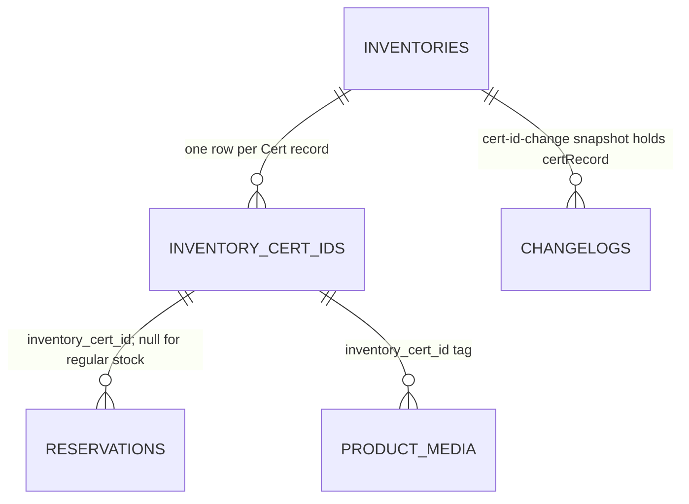

## Context

- **Cert records** - `inventory.inventory_cert_ids` holds one row per Cert
  record: `id` (`icert_<uuid>`), `inventory_id`, `cert_id`, the copy facts and
  `status` (`available` | `reserved` | `sold` | `withdrawn` | `vaulted`). A
  unique partial index on `(inventory_id, cert_id)` covers every status, and a
  check refuses a row with no `cert_id`.
- **Regular stock** - `inventories.unidentified_stock` counts the units on hand
  with no Cert record. Available regular stock is that count minus the
  remaining of active holds with no `inventory_cert_id`
  (`sumActiveNoCertRemainingByInventoryId`). Neither number reaches the admin
  app: `toSnapshot` and the changelog snapshot leave `unidentified_stock` out.
- **Locks** - `lockInventoryByProductId` takes the inventory row, then
  `lockInventoryCertIdById` the Cert row. `reserve`, `intakeStock`,
  `removeCertUnit`, `sellFromPool` and `withdrawFromPool` all lock in that
  order, and every one re-reads its guard after the lock.
- **History** - `inventory.changelogs.action` is held by `ck_changelogs_action`
  to eleven actions. Snapshots carry `inventoryCertIds` (record ids) on intake
  and removal, and `reservation.inventoryCertId` on hold entries; nothing
  stores a Cert ID's text.
- **Dialog** - `CertIdDetailDialog.tsx` lists only records with a Cert ID.
  `certHistory` filters the first 100 product entries on the client and adds a
  made-up `intake` row at the record's `createdAt`, so an older entry drops out
  unseen on a busy product.
- **Auction** - `auction_listings.inventory_cert_id` stores the record id, and
  every listing, draft included, takes an Inventory hold naming it. A record
  that was ever listed therefore has a reservation row, and Q6 leaves its Cert
  ID fixed, so no listing shows a changed Cert ID.
- **Reservations stay** - no path deletes a reservation row except the dev
  fixture reset; `idx_reservations_inventory_cert_id` indexes the record id.
- **Overlap** - `cert-scoped-inventory-auction-media` modifies the Cert
  record requirement, `Inventory may own optional Cert ID records and copy facts`;
  this change adds its rules beside it and leaves it untouched.

## Goals / Non-Goals

**Goals:**

- **One record per unit** - a correction keeps the record id, so its media
  tags and earlier history stay with the unit.
- **Fixed once moved** - a record that any hold has ever named keeps its Cert
  ID, decided by one indexed lookup under the lock (Q6).
- **Counts move once** - an assignment moves one unit from regular stock to a
  Cert record in the transaction that writes its history entry.
- **Paged unit history** - the server filters a unit's history, so nothing
  older than one page is lost.

**Non-Goals:**

- **No per-unit regular stock** - regular stock stays a count (Q2).
- **No change to holders** - Auction and Vault calls are unchanged.
- **No new grant** - both writes sit behind `inventory:write` (Q11).

## Decisions

The [catalog delta](specs/grade10-admin/inventory/catalog/spec.md) governs the
rows, the two writes, their refusals and the history entry; Q1 to Q17 settle
its scope, Q10 retired.

### Writes

- **Two procedures, one action** - `inventory.correctCertId` and
  `inventory.assignCertId` in `trpc/routers/inventory.ts`, each an
  `elevatedProcedure("inventory:write")`, call `correctCertId` and
  `assignCertId` in `services/inventoryMutations.ts`. Both write
  `cert-id-change` (Q8).
  - Rejected: one `setCertId` procedure keyed on an optional record id. The
    two inputs differ (assignment carries the copy facts), and one schema with
    optional halves would accept a correction carrying a Grade Issuer.
- **Lock order** - inventory row, then the Cert row on a correction, the same
  order `reserve` takes, so a hold and a change on one product queue behind
  each other and cannot deadlock. Every guard is read after both locks.
- **Unmoved test** - a correction requires the locked Cert row's `status` to
  be `available` and no `inventory.reservations` row, of any status, to carry
  its `inventory_cert_id` (`EXISTS` on `idx_reservations_inventory_cert_id`).
  Every way a record moves - reserve, an Auction listing's hold, sale and
  vault from a hold - starts with a reservation naming it; a pool sale or
  withdraw never names a record, and Remove physical unit deletes the row. The
  test is deterministic and needs no history scan. It runs after the inventory
  lock, which `reserve` also takes first, so a hold racing the correction
  either commits first and is seen or waits and follows it.
  - Rejected: scanning `changelogs` for any action other than `intake` and
    `cert-id-change`. It reads JSON snapshots to find the record, and a missed
    snapshot shape would unlock a moved record.
- **Cert ID check** - trim, then compare exactly, case-sensitive (Q13), as the
  unique index on `(inventory_id, cert_id)` already does. `No Cert ID`
  compared case-blind after trimming refuses `invalid-cert-id` (Q15). The
  lookup runs under the inventory lock across every record of the inventory,
  whatever its status, the record being corrected included (Q16). The refusal
  `cert-id-taken` carries the holding record's `{ inventoryCertId, certId,
status }` in the error's data, so the dialog names the unit and its status.
  The unique index stays the backstop: a `23505` on it maps to
  `cert-id-taken`, never to a 500.
- **Correction writes one column** - `cert_id` only. `status`, the copy facts,
  `created_at` and `product_media.inventory_cert_id` are untouched, and no
  inventory counter moves, so the inventory row is locked but not written.
- **Assignment** - inserts a Cert row with `status available` and
  `created_at` at the change, and writes `unidentified_stock - 1` and
  `updated_at` on the inventory row. `stock`, `reserved`, `sold`, `withdrawn`
  and `vaulted` are not written (Q9).
- **Copy facts as at intake** - the trimming, `-`-as-absent and issuer
  canonicalisation inside `intakeStock` move to one `normalizeUnitFacts` in
  `services/unitFacts.ts`; intake and assignment both call it, so the two
  cannot drift. Grade Issuer `RAW` or blank refuses `invalid-grade-issuer`.
- **History entry** - `changedEntity inventory`, `actorKind operator`,
  `quantity 1`, `reservationId null`, `reason` the trimmed remarks or null.
  `before` and `after` gain `certRecord`, the record's wire shape on that side:
  absent from `before` on an assignment, which reads as `No Cert ID`. Both
  sides also carry `inventoryCertIds: [record id]` where the record exists, so
  every reader that already matches a record by id matches this entry.
  - Rejected: new `cert_id_before` and `cert_id_after` columns. The snapshot
    is the store's place for before and after, and the record's other facts
    would still be missing.
- **Audit** - a correction's audit subject is `inventory-cert-unit` with the
  record id, as removal's is; an assignment's is the product.

### Reads

- **Available regular stock** - `products.get` gains
  `regularStock: { available, hasHistory }`. `available` is
  `unidentified_stock − sumActiveNoCertRemainingByInventoryId`; `hasHistory`
  is one `EXISTS` over the regular-stock membership predicate below. Both are
  derived, never stored. The holds come from the `reservations` the answer
  already carries.
- **Unmoved flag** - each record in `products.get`'s `certIds` gains
  `unmoved: boolean`, the same test the correction runs, so the dialog offers
  the action only where the server would accept it. The server re-checks
  under the lock; the flag never authorises.
- **Unit history on the server** - `changelogs.list` gains optional
  `unit: { kind: "cert", inventoryCertId } | { kind: "regular" }`.
  `listChangelogsByInventoryId` adds one predicate to its keyset query, so the
  dialog pages a unit's history with the cursor it already has. Membership is
  the spec's table:

  | Unit          | An entry belongs when                                                                                                                                                                                       |
  | ------------- | ----------------------------------------------------------------------------------------------------------------------------------------------------------------------------------------------------------- |
  | Cert record   | `before` or `after` names the id in `inventoryCertIds`, in `reservation.inventoryCertId` or in `certRecord.id`                                                                                              |
  | Regular stock | `intake` whose `quantity` exceeds the ids in `after.inventoryCertIds`; `sell` or `withdraw` naming no record; a hold action whose reservation names no record; `cert-id-change` with no `before.certRecord` |
  - Rejected: keeping the client filter over the first 100 entries. It drops
    older entries silently on a busy product.

- **No made-up intake row** - the record's own `intake` or assignment entry
  opens its history; `certHistory`'s synthetic row is deleted.

### Dialog

- **Rows** - Cert records in Cert ID order, then the available `No Cert ID`
  row when `regularStock.hasHistory`, reading `regularStock.available`, 0
  included (Q14), then one `No Cert ID` row per active hold with no record, in
  the order the product page lists holds. Columns are Cert ID, Status, Holder
  and Quantity, with no copy facts (Q17); today's Added column goes. With no
  row, one line says no unit is on hand.
- **Actions** - with `mayWrite`, a selected record with `unmoved` offers
  Change Cert ID, and the available `No Cert ID` row reading at least 1 offers
  Assign Cert ID, each a `FormDialog` that sends its procedure and shows a
  refusal inline, naming the holding unit and its status on `cert-id-taken`.
  Any other row, or a reader without the grant, sees the reason in place of
  the action (Q6).
- **After a write** - the product, its changelogs and its media are
  invalidated, so the rows, counts and history read again.
- **Product history** - `ChangeHistoryDialog.tsx` renders a `cert-id-change`
  Action as `Cert ID change · <before> → <after>`, `No Cert ID` when there is
  no `before.certRecord`.

## Database Schema

No table or column is added.

| Table                          | Change                                                              |
| ------------------------------ | ------------------------------------------------------------------- |
| `inventory.changelogs`         | `ck_changelogs_action` gains `cert-id-change`                       |
| `inventory.inventory_cert_ids` | Rows inserted by an assignment; `cert_id` rewritten by a correction |
| `inventory.inventories`        | `unidentified_stock` decremented by an assignment                   |

- **Migration** - drop `ck_changelogs_action` and add it again with the twelve
  actions, `NOT VALID`, so the add scans nothing; every stored row already
  passes. Hand-written, with its `meta/` snapshot carried forward.
- **Authoritative** - the Cert row for a unit's Cert ID; `unidentified_stock`
  for regular stock on hand; available regular stock is derived on read.



## Service Interfaces

**Correct** - `correctCertId(db, clock, input)`, one transaction.

| Input                          | Type                                    |
| ------------------------------ | --------------------------------------- |
| `productId`, `inventoryCertId` | id                                      |
| `certId`                       | string, trimmed                         |
| `remarks`                      | optional string, trimmed; empty is null |
| `actorId`                      | the staff id from the session           |

1. Trim `certId`; empty, over 200 characters or `No Cert ID` in any case
   refuses `invalid-cert-id`.
2. Lock the inventory by product; none refuses `unknown-product`.
3. Lock the Cert row; none refuses `unknown-inventory-cert-id`; another
   inventory's refuses `inventory-cert-id-product-mismatch`.
4. `status` not `available`, or any reservation ever naming the record,
   refuses `inventory-cert-id-unavailable`.
5. Any record of the inventory holding the trimmed Cert ID exactly, this one
   included, refuses `cert-id-taken` with that record's id, Cert ID and
   status.
6. Update `cert_id`; insert the changelog.

Success answers `{ certRecord, inventory }`. A refusal writes nothing.

Example: record `icert_7` reads `PSA-1234`, is available on product `prd_a`,
and no reservation has ever named it.

```json
{
  "productId": "prd_a",
  "inventoryCertId": "icert_7",
  "certId": " PSA-1243 ",
  "remarks": "Typo at intake"
}
```

| Row                            | Before                          | After                                                                                                                          |
| ------------------------------ | ------------------------------- | ------------------------------------------------------------------------------------------------------------------------------ |
| `inventory_cert_ids` `icert_7` | `cert_id PSA-1234`, `available` | `cert_id PSA-1243`, `available`                                                                                                |
| `inventories`                  | unchanged                       | unchanged                                                                                                                      |
| `changelogs`                   | -                               | `cert-id-change`, quantity 1, reason `Typo at intake`, `before.certRecord.certId PSA-1234`, `after.certRecord.certId PSA-1243` |

**Assign** - `assignCertId(db, clock, input)`, one transaction.

| Input                               | Type                                    |
| ----------------------------------- | --------------------------------------- |
| `productId`                         | id                                      |
| `certId`, `gradeIssuer`             | string, trimmed, required               |
| `grade`, `autographGrade`, `serial` | optional string; blank or `-` is absent |
| `remarks`                           | optional string, trimmed; empty is null |
| `actorId`                           | the staff id from the session           |

1. `normalizeUnitFacts`; an empty Cert ID or `No Cert ID` in any case refuses
   `invalid-cert-id`; a blank
   or `RAW` Grade Issuer refuses `invalid-grade-issuer`.
2. Lock the inventory by product; none refuses `unknown-product`.
3. `unidentified_stock − sumActiveNoCertRemainingByInventoryId < 1`, or
   available below 1, refuses `insufficient-available`.
4. Any record of the inventory holding the Cert ID exactly refuses
   `cert-id-taken` with that record's id, Cert ID and status.
5. Insert the Cert row; write `unidentified_stock − 1`; insert the changelog.

Example: product `prd_a` has stock 5, `unidentified_stock` 3 and an active
admin hold of 1 with no record, so 2 units of regular stock are available.

```json
{
  "productId": "prd_a",
  "certId": "BGS-88",
  "gradeIssuer": "bgs",
  "grade": "9.5",
  "autographGrade": "-",
  "serial": ""
}
```

| Row                  | Before                                      | After                                                                                            |
| -------------------- | ------------------------------------------- | ------------------------------------------------------------------------------------------------ |
| `inventory_cert_ids` | -                                           | new `icert_9`, `cert_id BGS-88`, issuer `BGS`, grade `9.5`, `available`                          |
| `inventories`        | stock 5, reserved 1, `unidentified_stock` 3 | stock 5, reserved 1, `unidentified_stock` 2                                                      |
| `changelogs`         | -                                           | `cert-id-change`, quantity 1, reason null, no `before.certRecord`, `after.certRecord.id icert_9` |

The dialog's `No Cert ID` available row then reads 1, and the hold's row 1.

**Unit history** - `listChangelogsByInventoryId(db, { inventoryId, cursor,
limit, unit? })`: the keyset query unchanged, plus the membership predicate on
`before` and `after` when `unit` is given.

| Boundary       | Owns                                                                         |
| -------------- | ---------------------------------------------------------------------------- |
| tRPC procedure | the grant, the input schema, the session's staff id, the refusal's HTTP code |
| Service        | the transaction, the locks, the guards, the mutation order                   |
| Repository     | one statement each, including the new Cert row insert and `cert_id` update   |

## API Contracts

| Surface                   | Change                                                                                      |
| ------------------------- | ------------------------------------------------------------------------------------------- |
| `inventory.correctCertId` | New mutation; `inventory:write`; refusals from Correct                                      |
| `inventory.assignCertId`  | New mutation; `inventory:write`; refusals from Assign                                       |
| `changelogs.list`         | Optional `unit` input; additive                                                             |
| `products.get`            | Answer gains `regularStock: { available, hasHistory }`; each `certIds` item gains `unmoved` |
| `CHANGELOG_ACTIONS`       | Gains `cert-id-change`                                                                      |
| `changelogSnapshotSchema` | Gains optional `certRecord: InventoryCertId`                                                |
| `InventoryFailureCode`    | Gains `cert-id-taken`, carrying the holding record, and `invalid-grade-issuer`              |

## Risks / Trade-offs

- [A hold is taken while the admin edits] → both writes lock the inventory row
  before reading the guard; whichever commits second reads the other's result
  and refuses or proceeds on it. `concurrent.test.ts` runs a reserve against a
  correction and an assignment.
- [Two admins assign the same Cert ID] → the inventory lock serialises them,
  and the unique index refuses a second row any path writes.
- [Two assignments take the last unit of regular stock] → the guard reads
  `unidentified_stock` under the lock, so the second sees 0 and refuses.
- [A worker writes `cert-id-change` before the migration] → the check refuses
  the insert, the transaction rolls back and the procedure fails loudly; the
  migration ships before the procedures.
- [A record whose only hold was a dev fixture reset] → the fixture deletes its
  reservations, so the record reads unmoved again; it exists only in local and
  staging data.
- [A JSON predicate on a large history] → it runs inside the
  `(inventory_id, occurred_at)` index range of one product.

## Migration Plan

1. Apply the `ck_changelogs_action` migration to every environment.
2. Deploy Inventory with the two procedures, the read additions and the
   contract.
3. Deploy the admin app.

Rollback: step 1 widens a check, and the previous code never writes the new
action. The admin app reads `regularStock` and `unit` only where it sends
them, so steps 2 and 3 roll back independently.
