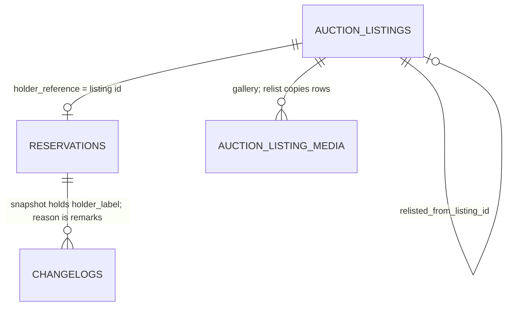

## Context

- **Close** - `sweeps/close.ts` `closeOne` closes a listing under its row lock
  in one Auction transaction. A top bid becomes `won` and issues the winner's
  order; otherwise the listing moves to `closed` with no winner. Today nothing
  touches the inventory hold on that path.
- **Unsold** - the admin outcome `unsold` is derived, never stored:
  `listingOutcomeExpression` in `repositories/settlementOutcomes.ts` reads a
  `closed` listing with no settlement row as `unsold`.
- **Reserve** - no listing carries a reserve price in grade10 or in the
  durable specs; every top bid wins at the close. `grade10-admin-auction-listing-SC-131`
  cannot arise, and waits on the PM in `.openspec.yaml`.
- **Hold** - Auction reaches Inventory through the `AUCTION_INVENTORY_SERVICE`
  binding. `releaseListingInventoryHold` in `services/inventory.ts` releases a
  listing's active hold for call-off and the order cancel paths.
  `ReleaseInput` is `{ reservationId, quantity }`; the changelog's `reason`
  column exists and is null on every release.
- **Product page** - `ReservationGroup.tsx` shows a hold's `holderReference`,
  the listing id. `ChangeHistoryDialog.tsx` shows When, Action, Quantity and
  Actor, and no holder or remarks.
- **Gallery** - `auction_listing_media.object_key` is content-addressed and
  shared between listings. The orphan sweep deletes an object only when no row
  references it.
- **Draft save** - `saveListing` in `services/listings/draft.ts` inserts or
  updates the draft, mints the slug and listing code, and reserves through
  `syncInventoryOnSave`.

## Goals / Non-Goals

**Goals:**

- **Close never waits on Inventory** - the release is a due row committed with
  the close, drained by a sweep.
- **Release only what nobody won** - the close marks the release, and the
  sweep checks again before it calls Inventory.
- **One release per hold** - a retried release closes the reservation once.
- **Relist in one move** - one press on the Listings row opens the editor
  filled in; Save stores the draft and its hold together.

**Non-Goals:**

- **No new service edge** - Inventory never calls Auction; the listing's
  label rides each Auction write.
- **No reserve price** - out of scope; see Context.
- **No relist in a campaign** - hidden and refused for now.

## Decisions

The [listing delta](specs/grade10-admin/auction/listing/spec.md) and the
[catalog delta](specs/grade10-admin/inventory/catalog/spec.md) govern this
change. The decisions below that move Relist, the release remarks and the
history columns are on both manual pages as 🚧 lines. Their deltas wait on
the PM (`awaiting: specs`).

### Release

- **Unsold means closed with no winner** - a listing is Unsold for the
  release when it is `closed`, holds no bid in `won`, and has no
  `current_top_bid_id`. It is the close's own rule, so the release never
  disagrees with the close's outcome. A listing whose top bid was demoted
  before the close, with earlier `outbid` bids left, has no winner and is
  released. Every check below uses this one predicate, `isUnsoldForRelease`,
  beside `listingOutcomeExpression`.
  - Rejected: no accepted bid (no bid in `top`, `outbid` or `won`). It keeps
    the stock of a listing whose top bid was demoted, and of a reserve miss
    should reserves ever exist - the stuck stock this change removes.
- **Due state on the listing row** - `closeOne`'s no-winner branch sets
  `stock_release_state = 'due'` and `stock_release_reason = 'unsold close'` in
  the close transaction, for a listing with a product. The listing row is
  already the fact and holds the lock, so no second table is needed.
  - Rejected: calling Inventory inside `closeOne`. A failed call would roll
    back the close, or leave it waiting under the listing lock - Q12.
  - Rejected: `waitUntil` after the commit. At most once; a lost release
    leaves stock stuck with nothing to retry it (`docs/conventions/backend.md`).
- **The sweep checks before it releases** - `sweeps/stockRelease.ts` claims a
  due listing, locks it, and re-reads `status` and its bids. A listing that is
  not `closed`, holds a `won` bid or points at a top bid moves to `refused`, logged at error
  level through `rowError`, and Inventory is never called. That state is a
  defect in the close or the clean-up, never a retry.
- **Idempotent without a key** - with the check passed, the sweep reads the
  hold before it writes. An active hold is released whole. With no active
  hold, a reservation of this listing closed at or after `listings.closed_at`
  with `released > 0` is the release whose answer was lost, and its
  `closedAt` is stamped. Nothing else is `nothing_held`. Only Auction
  releases an Auction hold, and a closed listing has no editor path, so a
  post-close release is this sweep's.
  - Rejected: an idempotency key on `release`. It would change every
    holder's contract to serve one caller that can read state instead.
- **No attempt cap** - Q12 retries until success. Each failure logs through
  `rowError` and backs off on `@grade10/postgres/ladder`. An oldest-due age
  alarm stands in for the cap, as the Mixpanel outbox does.
- **The pass order** - the stock release runs after the close list, so a
  listing closed in a pass is released in the same pass.

### Remarks and Holder

- **Remarks are the changelog's `reason`** - the spec's `Reason` field is the
  remarks column. `ReleaseInput` gains optional `remarks`; Auction sends
  `Released by unsold listing` from the close, and `Released by unsold listing
  (clean-up)` from the clean-up. Call-off sends none, so its remarks stay null.
- **Holder label on the reservation** - `inventory.reservations` gains
  `holder_label`, `<listing code> · <title>` with either part omitted when
  null. `ReserveInput`, `AdjustReservationInput`,
  `ChangeReservationProductInput` and `ReleaseInput` gain optional
  `holderLabel`; Inventory overwrites the column whenever one is given. Auction
  sends it on every write from the listing's current code and title, so the
  label follows a renamed draft and is frozen by the close.
  - Rejected: Inventory reading Auction for labels. A reverse binding makes a
    cycle and a deploy-order coupling (`docs/architecture/cross-service.md`).
  - Rejected: the admin app joining Auction reads into the product page. The
    inventory admin in `grade10-admin-inventory-catalog-SC-139` may not hold
    `auction:read`.
  - Rejected: writing the label to `remarks` on the reservation. That is the
    operator's text on an admin hold.
- **History columns** - `ChangeHistoryDialog.tsx` shows When (date and time),
  Action, Quantity, Actor, Holder and Remarks. Holder reads the entry's
  `after.reservation`, else `before.reservation`: its `holderLabel`, else its
  `holderReference`, prefixed by the holder kind; `—` for an entry with no
  reservation. Remarks reads `reason`, else `—`. Both are read from the
  snapshot already stored, so no changelog column is added.
- **Product page** - the reservations table's Reference cell shows
  `holderLabel` when set, else `holderReference`.

### Clean-up

- **A data migration** - one `UPDATE` on `auction_listings` sets `due` and
  `unsold clean-up` on every listing that `isUnsoldForRelease` accepts, has a
  product and has `stock_release_state IS NULL`. The sweep drains it, with the
  same check before each release. Running it again matches nothing.
  - It lands in its own PR after the close change deploys everywhere:
    migrations apply before a deploy, so one shipped with the close would miss
    listings the old code closes in between.
  - Rejected: a permanent sweep predicate over closed listings with no state.
    It would hide a close that forgot to write its state.

### Relist

- **The row opens the editor; Save stores** - the Listings table row shows
  Relist when the listing's outcome is `unsold`, `campaignId` is null,
  `stockReleaseState` is `released`, `relistedListingId` is null, and the
  operator holds `auction:operate`. It opens the new listing editor with
  `relistOf=<id>`. Nothing is stored and no stock is held until the operator
  presses Save - Q11. Leaving the editor stores nothing; a second Relist opens
  another unsaved editor.
  - Rejected: a `relist` mutation that stores the draft on the press. It
    leaves half-made drafts and a hold nobody asked for.
- **What the editor fills** - it reads `listings.get(relistOf)` and fills the
  product, Cert ID choice, quantity, title, copy, starting price, currency,
  listing attributes, categories and gallery. Start, close, publish, slug and
  listing code start empty, as on any new draft; campaign, listing label,
  sort index, extension and sandbox start at a new draft's defaults. The
  gallery shows the source's items by reference until Save.
- **Save** - `listings.save` gains optional `relistOf`, accepted only when no
  `listingId` is given. The service loads the source and refuses in this
  order, storing nothing:

  | Refusal | When |
  | --- | --- |
  | `LISTING_NOT_FOUND` | No such listing |
  | `RELIST_NOT_UNSOLD` | `isUnsoldForRelease` refuses it |
  | `RELIST_IN_CAMPAIGN` | `campaign_id` is set |
  | `RELIST_STOCK_NOT_RELEASED` | `stock_release_state` is not `released` |
  | `RELIST_ALREADY_RELISTED` | A listing already names it in `relisted_from_listing_id` |
  | `INSUFFICIENT_STOCK` and the other save refusals | From `saveListing` |

  Then it is an ordinary draft save: `saveListing` inserts the draft with
  `relisted_from_listing_id`, mints the slug and listing code as the first
  save of any draft does, and reserves through `syncInventoryOnSave`.
- **Media in the same transaction** - the relist save inserts the new
  listing's media rows in the transaction that inserts the draft: new rows
  under the new listing with the source rows' `object_key`, `content_type`,
  `alt`, width and height, in the order the editor sends as
  `{ source: "listing", id }` items. No bytes move and no other service is
  called, so it needs no second step. Rows are per listing and keys are
  immutable, so edits to either gallery stay apart.
  - Rejected: the ordinary save's separate `snapshotListingMedia` step after
    the insert. A failure between the two would leave a draft holding stock
    with no gallery.
  - Rejected: copying the bytes; the keys are content-addressed.
- **The source is read, never written** - the save writes no column of the
  source listing, its bids, its media rows or its reservation. The link lives
  on the new row (`relisted_from_listing_id`); the source's
  `relistedListingId` is read through it. Its slug and code stay reserved, its
  closed reservation keeps its history and frozen `holder_label`, and an
  object its gallery shares with the new one survives the orphan sweep while
  either row references it. The save test asserts the source row, its media
  rows and its reservation are unchanged.
- **Once per source** - `relisted_from_listing_id` is unique, so of two
  editors opened by Relist only the first Save stores a draft; the second
  answers `RELIST_ALREADY_RELISTED`, and its reservation is never taken.

### Released Note

- **On the listing page** - the admin listing answer gains `stockReleasedAt`.
  The page shows the note on an `unsold` listing when it is set.

## Database Schema

| Table | Column | Type | Rules |
| --- | --- | --- | --- |
| `auction.auction_listings` | `stock_release_state` | `text NULL` | `due` \| `released` \| `nothing_held` \| `refused`; null on every listing the rule never reached |
| `auction.auction_listings` | `stock_release_reason` | `text NULL` | `unsold close` \| `unsold clean-up`; null exactly when the state is null |
| `auction.auction_listings` | `stock_released_at` | `msTimestamp() NULL` | The reservation's `closedAt`; set with `released` only |
| `auction.auction_listings` | `stock_release_attempts` | `integer NOT NULL DEFAULT 0` | Failed attempts |
| `auction.auction_listings` | `stock_release_next_attempt_at` | `msTimestamp() NULL` | Next claim; set with `due` |
| `auction.auction_listings` | `relisted_from_listing_id` | `text NULL`, FK `auction_listings.id` | Unique where not null; set on a relist only |
| `inventory.reservations` | `holder_label` | `text NULL` | Written by the holder on each write that sends one |

- **Indexes** - partial on `stock_release_next_attempt_at` `WHERE stock_release_state = 'due'`, the claim's predicate; unique partial on `relisted_from_listing_id` `WHERE relisted_from_listing_id IS NOT NULL`.
- **Checks** - the state and reason sets, and reason null exactly when state is null. Follow the migration refusal rule in `docs/conventions/backend.md` for the validating scan.
- **Authoritative** - Inventory's reservation for the hold; the listing's state records only that Auction's release has run. `stock_release_reason` is the code; the remarks text is written from it at the call.



## Service Interfaces

**Close** - `closeOne(tx, listing, now, outbox)`, unchanged signature. On the
no-winner branch with `product_id` set, in the close transaction:

| Column | Before | After |
| --- | --- | --- |
| `status` | `published` | `closed` |
| `stock_release_state` | null | `due` |
| `stock_release_reason` | null | `unsold close` |
| `stock_release_next_attempt_at` | null | `now` |

**Stock release** - `releaseDueStock(db, inventory, clock, limit)`, one row per
claim.

1. Claim a `due` row past `stock_release_next_attempt_at`, `FOR UPDATE SKIP LOCKED`.
2. Re-check `isUnsoldForRelease`; on a refusal, write `refused` and stop.
3. `getActiveReservation({ holderReference: listing.id })`.
4. Active: `release({ reservationId, quantity: remaining, remarks, holderLabel })`.
5. None: `listOwnReservations({ productId })`, matched as in Decisions.
6. Write the outcome in the claim's transaction.

| Outcome | State | `stock_released_at` | Attempts |
| --- | --- | --- | --- |
| Released, or a lost answer found | `released` | reservation `closedAt` | unchanged |
| No hold and no post-close release | `nothing_held` | null | unchanged |
| Not closed, or a winner | `refused` | null | unchanged |
| Inventory refused or threw | `due` | null | +1, next from the ladder |

Example: listing `lst_a`, code `7KQ2P`, title `Charizard PSA 10`, no bids,
hold `res_1` of 3 active.

```json
{ "reservationId": "res_1", "quantity": 3,
  "remarks": "Released by unsold listing",
  "holderLabel": "7KQ2P · Charizard PSA 10" }
```

Inventory writes, in one transaction: `reservations` `remaining 3 → 0`,
`released 0 → 3`, `status closed`, `holder_label` set; `inventories`
`reserved − 3`; one `changelogs` row, `action release`, `quantity 3`,
`reason Released by unsold listing`. Auction then sets `lst_a` to
`released`, stamped with `res_1.closedAt`.

**Relist save** - `saveListing` with `relistOf` and no `listingId`.

Example: source `lst_a`, closed Unsold with its stock released, no campaign,
quantity 3, two gallery items. The operator presses Relist, sets a start of
`2026-10-02 20:00 HKT` and a close of `2026-10-04 20:00 HKT`, and presses
Save.

| Field | New draft |
| --- | --- |
| `status` | `draft` |
| `relisted_from_listing_id` | `lst_a` |
| `starts_at`, `scheduled_ends_at` | what the operator set |
| `slug`, `listing_code` | minted by this first save |
| Media | two new rows, same `object_key`s, same transaction as the insert |
| Inventory | one active hold of 3, `holder_label` from the new code and title |
| `lst_a` | unchanged |

## API Contracts

| Surface | Change |
| --- | --- |
| `AuctionInventoryServiceApi` | `ReleaseInput` gains optional `remarks`; `ReserveInput`, `AdjustReservationInput`, `ChangeReservationProductInput` and `ReleaseInput` gain optional `holderLabel`; additive |
| `Reservation` | gains `holderLabel: string \| null`, carried in the changelog's snapshot |
| `listings.get`, `listings.list` | `adminListingFields` gains `stockReleaseState`, `stockReleasedAt: Date \| null`, `relistedListingId: string \| null` |
| `listings.save` | input gains optional `relistOf: id`; `mediaOrder` listing items may name the source's media; refusals from the Relist table |

## Risks / Trade-offs

- [Inventory down for hours] → the close stands and the row stays `due`; the
  age alarm pages before the note's absence is noticed.
- [Release commits, answer lost] → the post-close read finds the closed
  reservation and stamps it; no second release.
- [A bid lands on a listing after it is marked due] → the listing lock and
  the close's status move make that impossible; the sweep's re-check turns any
  such row `refused` and alarms rather than releasing.
- [Clean-up predicate disagrees with the admin's Unsold] → the migration's
  test seeds a winner, a live, a called-off and a settled listing beside two
  Unsold ones - one with no bids, one with only `outbid` bids after its top
  was demoted - and asserts only the Unsold two turn `due`.
- [A listing closed by old code before the clean-up] → the clean-up ships
  after the close deploys everywhere, so each such listing is caught once.
- [Two editors opened by Relist are both saved] → the unique index stores
  one draft; the other answers `RELIST_ALREADY_RELISTED` before it reserves.

## Migration Plan

1. Inventory: add `holder_label`; deploy the new inputs.
2. Auction: add the listing columns, the close's due write, the sweep and the
   relist save; deploy.
3. Once step 2 runs in every environment, apply the clean-up data migration
   in its own PR; the next pass drains it.

Rollback: steps 1 and 2 are additive columns and optional inputs; the
previous code ignores them. Step 3 cannot be undone, and needs no undo: a
released hold is what the spec asks for.
